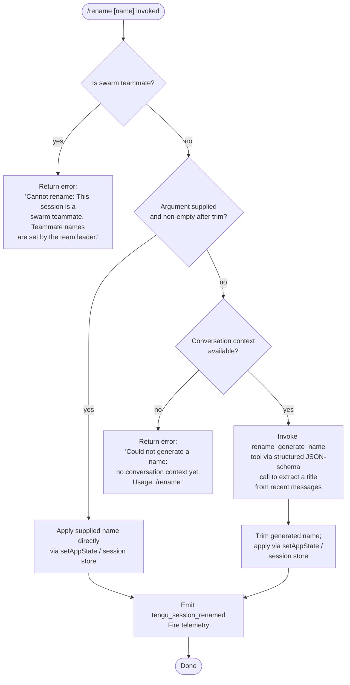

# `/rename`

> Analysis basis: CC v2.1.143 bundle.js (AST extraction + Claude interpretation)
> Minimum version: v2.1.143

---

## Overview

The `/rename` command sets a human-readable title for the current Claude Code conversation session. When called with an explicit name argument it applies that name immediately; when called without an argument it invokes an AI-powered auto-titling routine that reads recent conversation context and generates a suitable name via a structured JSON-schema tool call (`rename_generate_name`). The command is blocked entirely when the current session is running as a swarm teammate, because teammate names are controlled exclusively by the swarm team leader.

---

## Registration

| Field | Value |
|---|---|
| type | `local-jsx` |
| name | `rename` |
| description | `Rename the current conversation` |
| argumentHint | `[name]` |
| immediate | `true` |
| aliases | `["name"]` |
| module_id | `NYq` |
| load_inline | `true` |
| loc_byte | `11059658` |
| loc_byte_end | `11059857` |
| loc_line | `6629` |
| arbor_handler.name | `uG7` |
| arbor_handler.kind | `AsyncFunction` |
| arbor_handler.fqn | `claude-2.1.143::uG7` |
| arbor_handler.resolution_path | `module_id` |
| arbor_handler.n_hits | `0` |

Analysis basis: CC v2.1.143 bundle.js:+11059658

---

## Input Branching

Four distinct code paths exist depending on (a) whether the session is a swarm teammate, (b) whether an explicit name argument was supplied, and (c) whether conversation context is available for auto-generation. A Mermaid flowchart is therefore used.



Analysis basis: CC v2.1.143 bundle.js:+11058681 (handler entry), +11058799 (swarm guard), +11058819 (swarm error literal), +11059020 (no-context error literal), +11059159 (setAppState call)

---

## Behavioral Spec

### Top-level handler (`uG7`)

The Arbor-resolved handler is an `AsyncFunction` reached via the `module_id` resolution path (module `NYq`). It delegates immediately to two collaborating functions: a session-context reader (`rJ8` / `NW`) and the main command body (`oJ8`).

```
async function handleRenameCommand(args, context):
    sessionContext = readSessionContext(context)      // rJ8 → NW
    return executeRename(args, sessionContext)        // oJ8
```

Analysis basis: CC v2.1.143 bundle.js:+11059349 (`uG7 → oJ8`), +11059407 (`uG7 → rJ8`)

---

### Swarm-teammate guard (`oJ8` entry)

Immediately after entry, the handler checks whether the session is operating as a swarm teammate. If so it returns the hard-coded error string and exits without modifying any state.

```
function checkSwarmGuard(sessionContext):
    if sessionContext.isSwarmTeammate:
        return errorMessage(
            "Cannot rename: This session is a swarm teammate. " +
            "Teammate names are set by the team leader."
        )
    return null
```

Error string confirmed at: CC v2.1.143 bundle.js:+11058819

---

### Argument parsing and trim

When the swarm guard passes, the raw argument string is trimmed of surrounding whitespace. An empty result triggers the auto-generation branch; a non-empty result goes directly to the apply branch.

```
function parseNameArgument(rawArg):
    trimmed = rawArg.trim()          // H.trim call at +11058924
    if trimmed == "":
        return null                  // triggers auto-generation
    return trimmed
```

Analysis basis: CC v2.1.143 bundle.js:+11058924

---

### Context availability check (auto-generation path)

When no explicit name is given, the handler inspects the current conversation message list via `OaH` → `nJ8`. The filter considers messages whose role is `"user"` or `"assistant"` and whose `origin` is `"human"`, excluding meta messages (`isMeta`). If no qualifying messages are found the handler returns the no-context error.

```
function hasConversationContext(messages):
    qualifying = messages.filter(m =>
        (m.role == "user" OR m.role == "assistant") AND
        m.origin == "human" AND
        NOT m.isMeta
    )
    if qualifying.length == 0:
        return false
    return true
```

Error string confirmed at: CC v2.1.143 bundle.js:+11059020  
Relevant literals: `"user"` (+11055146), `"assistant"` (+11055163), `"isMeta"` (+11055187), `"origin"` (+11055222), `"human"` (+11055262)

---

### AI-powered auto-name generation

When context is available and no explicit name was supplied, `OaH` calls the title-generation helper (`aN`) which constructs a structured API request using the `rename_generate_name` tool schema (JSON Schema format). The tool schema uses a `"name"` property of type string. The helper reads recent message content, passes it to the model, and extracts the generated title from the structured tool result.

```
async function autoGenerateName(messages, apiContext):
    toolSchema = buildJsonSchema({
        toolName: "rename_generate_name",    // literal at +11058219
        properties: { name: { type: "string" } }  // "name" at +11058155
    })
    result = await callApi(
        messages = truncateForContext(messages),
        tools    = [toolSchema],
        schema   = "json_schema"             // "json_schema" at +11058075
    )
    return result.name.trim()
```

Analysis basis: CC v2.1.143 bundle.js:+11057555 (`nJ8`), +11057596 (`aN`), +11058075, +11058155, +11058219

---

### Name application and session persistence

Whether the name came from an explicit argument or from auto-generation, it is applied through `_.setAppState` and persisted via the session store function chain (`AvH` → `Ub` → `bKH`). The `bKH` path writes the new title, marks the session with the appropriate title-source tag (`"custom-title"` for user-supplied, `"ai-title"` for generated), emits a `WQ_.emit` event, and fires the `tengu_session_renamed` telemetry event.

```
function applySessionName(name, source, appState, sessionStore):
    appState.setAppState({ sessionTitle: name })      // +11059159
    sessionStore.writeTitle(name, source)             // bKH path
    if source == "user":
        tag = "custom-title"                          // +12141026
    else:
        tag = "ai-title"                              // +12141191
    sessionStore.tag(tag)
    events.emit("tengu_session_renamed")              // +12141118
```

Analysis basis: CC v2.1.143 bundle.js:+11059159, +12141026, +12141191, +12141118

---

### Session logging / debug sink (`AvH` path)

The `AvH` function family also handles session log file writes. Title changes are appended to the session log using `H4H` (which calls `appendFileSync` at +12140073). Log line buffer sizes of `384` bytes (+12140100) and `448` bytes (+12140144) appear in this path.

Analysis basis: CC v2.1.143 bundle.js:+12140073, +12140100, +12140144

---

### Agent-name propagation for sub-agents (`bKH`)

When the session is running as a named agent (e.g., inside a swarm as a team-leader role), `bKH` additionally sets the `"agent-name"` attribute (+12144049) and fires the `tengu_agent_name_set` telemetry event (+12144147).

```
function propagateAgentName(name, isAgent):
    if isAgent:
        session.setAttribute("agent-name", name)    // +12144049
        telemetry.fire("tengu_agent_name_set")       // +12144147
```

Analysis basis: CC v2.1.143 bundle.js:+12144049, +12144147

---

## State & Side Effects

| Item | Detail |
|---|---|
| Telemetry — `tengu_session_renamed` | Fired every time a rename succeeds (both user-supplied and AI-generated paths). CC v2.1.143 bundle.js:+12141118 |
| Telemetry — `tengu_agent_name_set` | Fired when the renamed session is operating in agent mode. CC v2.1.143 bundle.js:+12144147 |
| `appState` changes | `_.setAppState` is called with the new session title. CC v2.1.143 bundle.js:+11059159 |
| Session store write | Session title written to disk via `bKH` → `gq6` (uses `VN.writeFile`). CC v2.1.143 bundle.js:+12144028 |
| Session log append | Title change appended to session log file via `H4H` / `appendFileSync`. CC v2.1.143 bundle.js:+12140073 |
| Event emission | `WQ_.emit` fires a session-update event visible to UI subscribers. CC v2.1.143 bundle.js:+12144134 |
| Title-source tag | Session is tagged `"custom-title"` or `"ai-title"` to distinguish origin. CC v2.1.143 bundle.js:+12141026, +12141191 |
| Hook registration | `h9` → `at_.register` hook registration observed in the `Z5K` sub-path. CC v2.1.143 bundle.js:+56977 |
| Sound | None observed in depth-2 traversal. |

---

## Version History

| Version | Change |
|---|---|
| v2.1.143 | Initial analysis |

---

## Common Mistakes

1. **Invoking `/rename` without an argument in a fresh session** — if no `"human"`-origin messages exist yet, the command returns the error `"Could not generate a name: no conversation context yet. Usage: /rename <name>"`. Supply an explicit name argument instead.
2. **Attempting to rename a swarm teammate session** — the command is entirely blocked and returns a hard-coded error. Only the swarm team leader may assign teammate names; there is no workaround within the teammate session itself.
3. **Expecting the alias `/name` to behave differently** — `/name` is a registered alias for `/rename` and executes the identical code path.
4. **Assuming the title persists only in memory** — the name is written to the session store on disk via `VN.writeFile`, so it survives session restarts. Any tooling that reads the raw session file will also see the updated title.
5. **Conflating `"custom-title"` and `"ai-title"` tags** — downstream tooling (e.g., session-list displays) may filter or style sessions differently based on this tag; explicitly providing a name always produces `"custom-title"`.

---

## Appendix — Identifier Mapping

> For bundle debugging only. Identifiers change across versions.

| Identifier | Role |
|---|---|
| `uG7` | Top-level async handler for `/rename` (Arbor-resolved entry point) |
| `oJ8` | Main rename command body: swarm guard, arg parse, dispatch |
| `rJ8` | Session context reader (feeds context into handler) |
| `NW` | Context store accessor called by session context reader |
| `q5` | Store lookup helper |
| `p2` | Store retrieval; calls `ti8.getStore` |
| `OaH` | Core rename orchestrator: context check, name resolution, apply |
| `nJ8` | Conversation message filter / context availability checker |
| `aN` | API call orchestrator for auto-name generation |
| `HK` | Utility called by both `OaH` and `Jhq` |
| `VY8` | Session persistence / conversation-file write helper |
| `ZY8` | Sub-utility used by `VY8` and `aS_` |
| `i0` | Message normalization / context assembly for API call |
| `Z47` | Message mapping helper inside `VY8` |
| `S6` | Utility called by `VY8` |
| `hH` | JSON serialization utility (`JSON.stringify` wrapper) |
| `R6` | JSON deserialization utility (`JSON.parse` wrapper) |
| `X6q` | Session index builder |
| `L8` | Low-level I/O utility |
| `xH` | String coercion utility |
| `L` | Promise-chaining / lock utility |
| `w8` | UUID generation helper |
| `j` | Process/worker accessor |
| `J` | Active-process map accessor |
| `BNH` | Top-level query executor (wraps `aS_` + `Jhq`) |
| `aS_` | Pre-query setup: loads conversation, calls `VY8` |
| `Jhq` | Main agent query loop (streaming API call handler) |
| `XP` | API client factory / auth handler |
| `DA` | API endpoint resolver |
| `bf` | Request-body builder |
| `R1` | Request retry coordinator |
| `yxH` | Request middleware / header injector |
| `y0` | Post-query cleanup |
| `DK` | Message history filter |
| `_u` | String trim utility (wraps `H.trim`) |
| `v` | Output formatter / display emitter |
| `G5K` | Terminal renderer |
| `tt_` | Terminal locale helpers (`TLK`, `ELK`) |
| `P7` | Path/text redaction helper |
| `h6A` | Word-map formatter |
| `cSH` | Terminal write wrapper |
| `X6A` | Low-level terminal write |
| `Z5K` | Session file write orchestrator (append → rotate → persist) |
| `PSH` | Output buffer/flush scheduler |
| `i8H` | Path-join + display helper |
| `x6` | File existence check utility |
| `gv8` | File size / buffer utility (calls `L8`) |
| `U6A` | Path construction helper |
| `p6A` | File rotation helper (`lv.stat`, `lv.rename`, `lv.unlink`) |
| `E5K` | Append-file worker (`lv.appendFile`) |
| `h9` | Hook registration (`at_.register`) |
| `XH` | String coercion / stringify |
| `V6` | Process/env accessor |
| `GV` | Environment variable reader |
| `AvH` | Session logging dispatcher: routes to `Ub`, `QHH`, etc. |
| `Ip` | Logger identity / label resolver |
| `g5` | Log-path builder |
| `CU` | Config-dir helper |
| `__` | Home-dir / base-path helper |
| `Ub` | Session-log writer for normal entries |
| `QZ` | Log-entry formatter |
| `H4H` | File append with `appendFileSync`; sizes 384/448 bytes |
| `KL` | Log-rotation coordinator (calls `h9`) |
| `d` | Error/diagnostic sink |
| `QHH` | Session-log writer for alternate entry type |
| `uZ` | Session log flush utility |
| `Qi` | Session state accessor |
| `M` | MCP client manager |
| `SvH` | MCP server connection orchestrator |
| `KHH` | MCP transport handler |
| `rI` | MCP result router |
| `K` | Active-connection collection |
| `H_` | Generic utility / identity |
| `f26` | MCP connection filter |
| `_57` | Timestamp / date helper |
| `v78` | MCP tool key mapper |
| `I78` | MCP debug key resolver |
| `A8` | MCP debug logger |
| `Yh_` | MCP OAuth start helper |
| `Dh_` | MCP OAuth complete helper |
| `x8q` | MCP connection retry scheduler |
| `Oh_` | MCP error handler |
| `NG_` | MCP capability include-list checker |
| `y` | Write stream wrapper |
| `_7` | MCP error logger |
| `S8q` | MCP status reporter |
| `M26` | MCP int parser |
| `xh_` | MCP int parser (alternate) |
| `THK` | MCP update applier (`applyMcpUpdate`) |
| `eY8` | MCP update serializer |
| `wv` | MCP client cleanup coordinator |
| `$` | Session snapshot utility |
| `JZq` | Session snapshot writer |
| `B95` | MCP remote-server monitor |
| `k78` | MCP permission set checker |
| `r8` | Timeout/abort controller |
| `drH` | MCP serializer |
| `pHH` | Logger pass-through |
| `bKH` | Session-title write + tag + event emit path |
| `lB` | Config file read/write utility (calls `gq6`) |
| `gq6` | Config file I/O (readFile / writeFile via `VN`) |
| `Z$` | JSX/React component boundary helper |
| `BjH` | JSX renderer |
| `gD8` | App-state key enumerator |
| `M3H` | Jobs / task-runner context builder |
| `IK` | Task path resolver |
| `b0` | Task path join |
| `x0` | Task basename resolver |
| `s1` | Task stat / cache reader |
| `$8` | Generic error wrapper (calls `L8`) |
| `o2` | Task cache delete |
| `Bf` | Atomic file write (via `eO`) |
| `eO` | Atomic file write using random-bytes temp file + rename |
| `NH` | Error reporting / telemetry logger |
| `v_` | Error string coercer |
| `zq` | Error queue flusher |
| `A$A` | Error serializer |
| `kNK` | Error ring-buffer manager |

---

Note: index built via Arbor fallback; some signals (telemetry, literals) may be missing — see arbor-fallback.js.