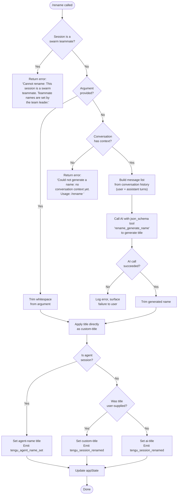

# `/rename`

> Analysis basis: CC v2.1.143 bundle.js (AST extraction + Claude interpretation)
> Minimum version: v2.1.143

---

## Overview

The `/rename` command sets the display title of the current Claude Code conversation. When called with an explicit name argument it applies that title immediately; when called without an argument it uses an AI-driven structured-output call (tool name `rename_generate_name`) to derive a title from the existing conversation context. The command is blocked for swarm teammate sessions, where naming authority belongs exclusively to the team leader.

---

## Registration

| Field | Value |
|---|---|
| type | `local-jsx` |
| name | `rename` |
| description | Rename the current conversation |
| argumentHint | `[name]` |
| immediate | `true` |
| aliases | `name` |
| module_id | `NYq` |

Analysis basis: CC v2.1.143 bundle.js:+11059658

---

## Input Branching



Analysis basis: CC v2.1.143 bundle.js:+11058681, +11058799, +11058819, +11058924, +11059020, +11059127, +11059145, +11059159

---

## Behavioral Spec

### Entry Point — Command Dispatch

```
function renameCommandHandler(args, context):
    isSwarmTeammate = checkSwarmTeammateStatus(context)   // calls sessionStore
    if isSwarmTeammate:
        return errorResult(
            "Cannot rename: This session is a swarm teammate. " +
            "Teammate names are set by the team leader."
        )

    rawArgument = getArgumentString(args)
    trimmedArgument = rawArgument.trim()

    if trimmedArgument is non-empty:
        applyTitle(context, trimmedArgument, source="custom")
    else:
        generateAndApplyTitle(context)
```

Analysis basis: CC v2.1.143 bundle.js:+11058681, +11058799, +11058819, +11058924

---

### Swarm Teammate Guard

```
function checkSwarmTeammateStatus(context):
    store = sessionStore.getStore()       // reads from global async store
    return store contains swarm-teammate flag
```

The guard runs before any title logic. If the session is identified as a swarm teammate, the error string is returned verbatim and no further processing occurs.

Analysis basis: CC v2.1.143 bundle.js:+11058799, +2167959, +2166818

---

### Explicit-Name Path

```
function applyTitle(context, name, source):
    isAgentSession = detectAgentSession(context)

    if isAgentSession:
        titleRecord = buildTitleRecord(kind="agent-name", value=name)
        persistTitle(titleRecord)
        emitTelemetry("tengu_agent_name_set")
    else:
        kind = if source == "custom" then "custom-title" else "ai-title"
        titleRecord = buildTitleRecord(kind=kind, value=name)
        persistTitle(titleRecord)
        emitTelemetry("tengu_session_renamed")

    setAppState(title=name)
```

Analysis basis: CC v2.1.143 bundle.js:+11059127, +11059145, +11059159, +12141026, +12141191, +12144049, +12141118, +12144147

---

### AI-Generation Path

```
function generateAndApplyTitle(context):
    history = buildMessageList(context.conversationHistory)

    if history is empty:
        return errorResult(
            "Could not generate a name: no conversation context yet. " +
            "Usage: /rename <name>"
        )

    toolSpec = {
        type: "json_schema",
        name: "rename_generate_name",
        schema: { name: <string field> }
    }

    result = callAI(
        messages  = history,
        tool      = toolSpec,
        toolChoice = "auto"
    )

    if result is error:
        logError(result)
        return errorResult(result)

    generatedName = result.name.trim()
    applyTitle(context, generatedName, source="ai")
```

Analysis basis: CC v2.1.143 bundle.js:+11058958, +11059020, +11058075, +11058155, +11058219, +11059145

---

### Message-List Builder

```
function buildMessageList(history):
    messages = []
    for each entry in history:
        role = entry.role          // "user" | "assistant"
        origin = entry.origin      // "human" | "system" etc.

        if entry.isMeta is true:
            skip

        if role in ["user", "assistant"] and origin == "human":
            segment = extractTextSegments(entry.content)
            // only content blocks with type == "text" are included
            messages.push({ role: role, content: segment })

    return messages
```

Array operations use `push`, `join`, `slice`, and `Array.isArray` checks internally.

Analysis basis: CC v2.1.143 bundle.js:+11055326, +11055344, +11055442, +11055474, +11055146, +11055163, +11055187, +11055222, +11055262, +11055380, +11055401

---

### Title Persistence and appState Update

```
function persistTitle(titleRecord):
    // Writes to the conversation state store
    // titleRecord.kind is one of:
    //   "custom-title"  — user-supplied name (non-agent session)
    //   "ai-title"      — AI-generated name  (non-agent session)
    //   "agent-name"    — any name in an agent/swarm-leader session
    stateStore.set(titleRecord)

function setAppState(title):
    // Calls _.setAppState with updated title field
    appState.conversationTitle = title
```

Analysis basis: CC v2.1.143 bundle.js:+12141026, +12141191, +12144049, +11059159

---

### Conversation-File Layer (reached via `M3H`)

The title-persistence layer interacts with the conversation file system. Relevant operations observed at depth 2 include:

```
function conversationFileOps():
    // Path construction
    dirPath  = pathModule.join(...)
    baseName = pathModule.basename(...)

    // Cache operations (LRU or map-based)
    cache.get(key)
    cache.set(key, value)
    cache.delete(key)
    cache.clear()          // triggered after 1000 entries (cache limit)

    // Disk I/O
    fs.stat(path)
    fs.readFile(path, encoding="utf-8")

    // Ordering metadata fields: "order", "stateOrder"
    // File-not-found errors identified by code "ENOENT"
```

Cache size limit: 1000 entries.
Analysis basis: CC v2.1.143 bundle.js:+4022065, +4022087, +4022100, +4022506, +4022695, +4022736, +4022763, +4022784, +4022821, +4022834, +4023116, +4023141, +4023220, +4023234, +4023325, +4023341, +4023486, +4023541, +4023598, +4023698, +4023703, +4024655, +4024662, +4024667, +4024672, +4024694, +4024759, +4024868, +4024958, +4024964, +171894, +171902

---

### Error Logging

```
function logAndSurfaceError(errorValue):
    // Serialises the error via String(errorValue)
    // Level: "error"
    // Propagates to UI layer for display
    logger.log(level="error", message=String(errorValue))
    Wc.logError(errorValue)
```

Analysis basis: CC v2.1.143 bundle.js:+11058509, +960555, +171669

---

## State & Side Effects

| Item | Detail |
|---|---|
| Telemetry — session renamed | `tengu_session_renamed` emitted on successful rename of a non-agent session (bundle.js:+12141118) |
| Telemetry — agent name set | `tengu_agent_name_set` emitted on successful rename of an agent session (bundle.js:+12144147) |
| appState changes | `_.setAppState` called with updated conversation title field (bundle.js:+11059159) |
| Title kind stored | One of `"custom-title"`, `"ai-title"`, or `"agent-name"` written to conversation state (bundle.js:+12141026, +12141191, +12144049) |
| Conversation file cache | Read/write/delete operations on LRU file cache; cache cleared when size exceeds 1000 entries (bundle.js:+4023698, +4023703) |
| Event bus — session renamed | `lG6.emit` called after title is written for non-agent sessions (bundle.js:+12141105, +12141264) |
| Event bus — agent name set | `WQ_.emit` called after title is written for agent sessions (bundle.js:+12144134) |
| Timestamp | `Date.now()` recorded alongside title persistence (bundle.js:+2171272) |
| Error logging | Errors routed through `Wc.logError` (bundle.js:+960555) |
| Sound | <!-- TODO: not found in depth-2 traversal; needs --depth 4 --> |

---

## Version History

| Version | Change |
|---|---|
| v2.1.143 | Initial analysis |

---

## Common Mistakes

1. **Calling `/rename` without arguments before any messages exist.** The AI-generation path requires at least one non-meta `user` or `assistant` turn in history. If the conversation is brand-new the command returns: `"Could not generate a name: no conversation context yet. Usage: /rename <name>"` (bundle.js:+11059020). Always supply an explicit name at session start.

2. **Attempting to rename a swarm teammate session.** Teammate sessions reject the command unconditionally with `"Cannot rename: This session is a swarm teammate. Teammate names are set by the team leader."` (bundle.js:+11058819). Use the team-leader session to set teammate names.

3. **Using the alias `/name` and expecting different behaviour.** `/name` is a registered alias for `/rename` and executes identical logic (registration alias array, bundle.js:+11059658).

4. **Expecting the title kind to be uniform.** The stored kind differs depending on whether the name was user-supplied (`"custom-title"`), AI-generated (`"ai-title"`), or set inside an agent/swarm-leader session (`"agent-name"`). Tooling that reads conversation metadata must handle all three variants.

5. **Assuming rename is always async.** The command registration sets `immediate: true` (bundle.js:+11059658), meaning the handler is invoked synchronously in the command-dispatch path before the next render cycle; side-effects such as telemetry and file writes may still be asynchronous internally.

---

## Appendix — Identifier Mapping

> For bundle debugging only. Identifiers change across versions.

| Identifier | Role |
|---|---|
| `rJ8` | Swarm-teammate status checker (calls `NW`) |
| `NW` | Low-level swarm session flag reader |
| `oJ8` | Core rename command implementation function |
| `q5` | Session store accessor (wraps `p2`) |
| `p2` | Async store `.getStore()` caller |
| `H` | Argument/input string variable; also used as message-list variable in inner scope |
| `OaH` | AI-generation orchestrator (builds messages, calls AI, returns name) |
| `nJ8` | Message-list builder from conversation history |
| `aN` | AI structured-output call helper |
| `HK` | Tool/schema construction helper |
| `DK` | History filter helper (uses `H.filter`) |
| `_u` | String trimming utility (wraps `H.trim`) |
| `v` | Log/debug utility (multi-level logger) |
| `XH` | String coercion helper (wraps `String()`) |
| `V6` | Path/config value accessor |
| `GV` | Configuration reader used by `V6` |
| `AvH` | Title application orchestrator (dispatches to `Ub`, `QHH`, `bKH`) |
| `Ip` | Session-type detector (agent vs. normal) |
| `g5` | Configuration/model resolver |
| `Ub` | Custom-title writer; emits `tengu_session_renamed` via `lG6.emit` |
| `QHH` | AI-title writer; emits `tengu_session_renamed` via `lG6.emit` |
| `uZ` | Conversation-state read helper |
| `Qi` | Promise utility |
| `M` | Model/capability resolver used during AI call |
| `pHH` | Pre-apply validation or preparation step |
| `bKH` | Agent-name writer; emits `tengu_agent_name_set` via `WQ_.emit` |
| `Z$` | Supplementary state writer (calls `BjH`) |
| `lB` | Timestamp recorder (uses `Date.now`) |
| `_` | appState proxy object (exposes `_.setAppState`) |
| `gD8` | Object-key enumeration helper (wraps `Object.keys`) |
| `M3H` | Conversation file-system manager |
| `IK` | Directory path builder (uses `SP.join`) |
| `x0` | Base-name extractor (uses `SP.basename`) |
| `s1` | File read/write/cache manager |
| `o2` | Cache delete helper |
| `Bf` | Cache invalidation / file-delete helper |
| `$8` | ENOENT / file-error handler |
| `NH` | Error logger and propagator (calls `Wc.logError`) |
| `uG7` | Top-level command render/export wrapper |