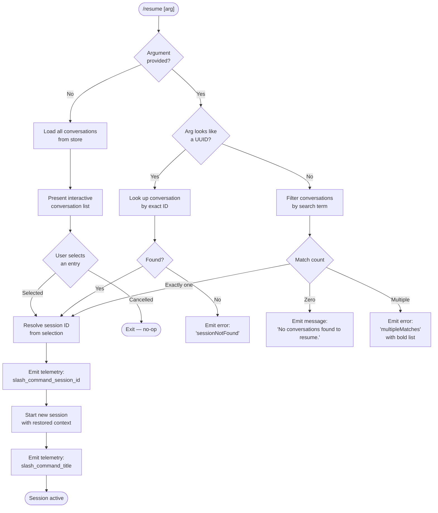

# `/resume`

> Analysis basis: CC v2.1.143 bundle.js (AST extraction + Claude interpretation)
> Minimum version: v2.1.143

---

## Overview

The `/resume` command (aliased as `/continue`) allows users to re-enter a previous Claude Code conversation by specifying either a conversation ID or a free-text search term. When invoked, it searches the local conversation store, resolves the best match, and restores the conversation context into the active session. If no argument is given, the command presents an interactive list of recent conversations for the user to select from.

---

## Registration

| Field | Value |
|---|---|
| type | `local-jsx` |
| name | `resume` |
| description | `Resume a previous conversation` |
| argumentHint | `[conversation id or search term]` |
| aliases | `["continue"]` |
| module_id | `xJq` |

Analysis basis: CC v2.1.143 bundle.js:+11220750

---

## Input Branching

The command entry point (`commandHandler`) first examines the raw argument string, then branches across three main paths: an exact UUID match, a fuzzy title/search-term match, and the no-argument interactive picker.



Analysis basis: CC v2.1.143 bundle.js:+11219420, +11219793, +11216987, +11217058, +11220054, +11220278

---

## Behavioral Spec

### Conversation List Loading

The list loader function collects all locally persisted conversations, then filters and sorts them for display. It reads conversation metadata (timestamps, titles, last-prompt excerpts) via the conversation store accessor, and performs Unicode NFC normalization on path strings when checking git worktree associations.

```
function loadConversationList():
    allConversations = conversationStore.getAll()
    worktreeInfo = gitWorktreeDetect()       # runs: git worktree list --porcelain
    for each conversation in allConversations:
        normalize path with NFC
        annotate with worktree membership if applicable
    sorted = sort allConversations by timestamp descending
    return sorted
```

Analysis basis: CC v2.1.143 bundle.js:+11216299, +11216354, +11216361, +11216524, +11216606

---

### Search / Filter Logic

When the user supplies an argument that is not a UUID, `conversationSearchFilter` is called. It performs a case-insensitive substring match against conversation titles and last-prompt text.

```
function conversationSearchFilter(conversations, searchTerm):
    normalized = searchTerm.toLowerCase()
    matched = conversations.filter(c =>
        c.title.toLowerCase().includes(normalized) OR
        c.lastPrompt.toLowerCase().includes(normalized)
    )
    if matched.length == 0:
        display "No conversations found to resume."
        return null
    if matched.length == 1:
        return matched[0]
    # multiple matches
    display bold-formatted list of matching titles
    emit error code "multipleMatches"
    return null
```

Analysis basis: CC v2.1.143 bundle.js:+11219420, +11219450, +11219793, +11217022, +11217058

---

### Exact-ID Resolution

When the argument matches the UUID pattern, the command delegates directly to the conversation store's exact-lookup path.

```
function resolveByExactId(conversationId):
    entry = conversationStore.getById(conversationId)
    if entry is null:
        emit error code "sessionNotFound"
        return null
    return entry
```

Analysis basis: CC v2.1.143 bundle.js:+11216987

---

### Session Resumption

Once a target conversation is resolved (by any path), `resumeSession` constructs a new session context object using `Date.now()` as the creation timestamp, attaches the restored message chain, then hands it off to the application state layer.

```
function resumeSession(resolvedConversation):
    newSessionContext = {
        sessionId: resolvedConversation.id,
        restoredAt: Date.now(),
        messages: loadMessageChain(resolvedConversation)
    }
    emitTelemetry("slash_command_session_id", { id: resolvedConversation.id })
    appState.setActiveSession(newSessionContext)
    emitTelemetry("slash_command_title", { title: resolvedConversation.title })
    renderConversationUI(newSessionContext)
```

Analysis basis: CC v2.1.143 bundle.js:+11219670, +11220054, +11220278, +11219644

---

### Message Chain Loading (`loadMessageChain`)

The message chain loader reconstructs the full conversation transcript from the JSONL-format transcript files. It handles parent-UUID linkage, detects and recovers from phantom parent references, and resolves parallel-thread conflicts. UUID fields are 36 characters wide.

```
function loadMessageChain(conversation):
    rawEntries = transcriptStore.readAll(conversation.path)
    chain = []
    seen = Set()
    for each entry in rawEntries:
        if entry.parentUuid not in seen AND entry.parentUuid is not null:
            emitTelemetry("tengu_transcript_phantom_parent")
        if cycleDetected(entry, chain):
            emitTelemetry("tengu_transcript_parent_cycle")
            break
        chain.push(entry)
        seen.add(entry.uuid)
    return chain
```

Analysis basis: CC v2.1.143 bundle.js:+12151969, +12155529, +12149593

---

### Git Worktree Detection

During list loading, the worktree detector runs `git worktree list --porcelain`, parses each `worktree ` prefix (9 characters), and annotates conversations whose project paths reside within a known worktree.

```
function gitWorktreeDetect(projectPath):
    output = exec("git", ["worktree", "list", "--porcelain"])
    lines = output.split("\n")
    worktrees = lines
        .filter(l => l.startsWith("worktree "))  # prefix length: 9
        .map(l => l.slice(9).normalize("NFC"))
    match = worktrees.find(wt => projectPath.startsWith(wt))
    emitTelemetry("tengu_worktree_detection", { found: match != null })
    return match ?? null
```

Analysis basis: CC v2.1.143 bundle.js:+11216354, +11216361, +11216549, +11216562, +11216585, +11216593, +11216606, +11216443

---

### Interactive Picker (no-argument path)

When invoked without arguments, the command renders a JSX component (registered type `local-jsx`) that presents a scrollable list of conversations. Each row shows the AI-generated title (metadata key `ai-title`) or custom title (`custom-title`), the last-prompt excerpt (metadata key `last-prompt`), and a relative timestamp. Selection emits `slash_command_session_id` and proceeds to session resumption.

```
function renderConversationPicker(conversations):
    rows = conversations.map(c => ({
        label: c.metadata["custom-title"] ?? c.metadata["ai-title"] ?? c.id,
        sublabel: c.metadata["last-prompt"] ?? "No prompt",
        time: formatRelative(c.timestamp)
    }))
    selectedIndex = await interactiveList(rows)
    if selectedIndex is null:
        return   # user cancelled
    return conversations[selectedIndex]
```

Analysis basis: CC v2.1.143 bundle.js:+12153289, +12153367, +12153193, +11220099, +11219644

---

## State & Side Effects

| Item | Detail |
|---|---|
| Telemetry — `tengu_worktree_detection` | Fired during conversation list load when checking git worktree membership (bundle.js:+11216443) |
| Telemetry — `tengu_transcript_phantom_parent` | Fired when a message's `parentUuid` cannot be resolved in the loaded chain (bundle.js:+12151969) |
| Telemetry — `tengu_transcript_parent_cycle` | Fired when a cycle is detected in the parent-UUID linkage chain (bundle.js:+12155529) |
| Telemetry — `tengu_chain_parent_cycle` | Fired at the chain-building layer when a parent cycle is encountered (bundle.js:+12134044) |
| Telemetry — `tengu_chain_timestamp_fallback` | Fired when a message timestamp is missing and a fallback is used during chain sort (bundle.js:+12134193) |
| Telemetry — `tengu_chain_parallel_tr_recovered` | Fired when a parallel-thread conflict in the transcript is auto-resolved (bundle.js:+12136059) |
| Telemetry — `tengu_relink_walk_broken` | Fired if the relink walk encounters a broken parent reference (bundle.js:+12133554) |
| Hook registration | The `local-jsx` render component created via `OD.createElement` at bundle.js:+11219644 |
| appState changes | Active session context is replaced with the restored session; session ID and title are written to app state |
| Session metadata written | Keys accessed/written include: `ai-title`, `custom-title`, `last-prompt`, `summary`, `tag`, `agent-name`, `mode`, `permission-mode`, `worktree-state` (bundle.js:+12153126–12153949) |
| Sound | <!-- TODO: not found in depth-2 traversal; needs --depth 4 --> |
| Slash-command telemetry fields | `slash_command_session_id` (bundle.js:+11220054), `slash_command_title` (bundle.js:+11220278) |

---

## Version History

| Version | Change |
|---|---|
| v2.1.143 | Initial analysis |

---

## Common Mistakes

1. **Passing a partial UUID as a search term**: If the argument does not match the full UUID regex, the command treats it as a free-text search term rather than an exact-ID lookup. A search for a partial UUID may return zero or multiple matches instead of the intended conversation.

2. **Expecting `/resume` to work across machines**: The command reads from the local conversation store only. Conversations created in a different working directory or on a different machine are not visible.

3. **Ambiguous search terms causing `multipleMatches` errors**: If the search term matches more than one conversation title or last-prompt, the command prints the matching list and exits without resuming. Provide a more specific term or use the full conversation ID.

4. **Confusing `/resume` with `/continue` behavior**: Both names are registered aliases and are functionally identical. There is no behavioral difference between `/resume` and `/continue`.

5. **Worktree path normalization surprises on macOS**: Paths are NFC-normalized before comparison (bundle.js:+11216606). Conversations stored with a non-NFC-normalized path on a case-insensitive filesystem may not match the detected worktree root and will appear as non-worktree sessions.

---

## Appendix — Identifier Mapping

> For bundle debugging only. Identifiers change across versions.

| Identifier | Role |
|---|---|
| `bJq` | Command entry-point / top-level handler for `/resume` |
| `iZ7` | Main resume command implementation function (JSX render + logic) |
| `uNH` | Git worktree detection and conversation path annotation |
| `nQ` | Conversation search/filter dispatcher (delegates to `Dyq`, `tNH`, `uNH`) |
| `JJ6` | Conversation store accessor / session-state reader |
| `tqH` | Session state map reader (retrieves all metadata keys from session store) |
| `XHH` | Session state map writer (writes metadata keys to session store) |
| `sqH` | Message chain builder (parent-UUID linkage resolution) |
| `Rm7` | Message chain parallel-thread conflict resolver |
| `ym7` | Message chain timestamp-sort helper |
| `Myq` | Message chain deduplication helper |
| `hm7` | Message chain NaN-timestamp guard |
| `Qm7` | Low-level JSONL transcript file reader (binary buffer parsing) |
| `gm7` | JSONL entry parser (buffer-to-record decoder) |
| `dm7` | Synchronous transcript file open/read helper |
| `ckq` | Conversation index cache manager |
| `km7` | Conversation index walk / relink helper |
| `cm7` | Conversation directory scanner (for interactive picker) |
| `Yyq` | Interactive conversation picker initializer |
| `RJq` | Bold-text formatter used for `multipleMatches` output |
| `P28` | Timestamp parser utility (`Date.parse` wrapper) |
| `kLH` | Conversation list sort/slice helper (used after filtering) |
| `nn` | UUID regex test helper |
| `vi` | Conversation list rendering component |
| `NH` | Process-spawn / sub-process manager (used for git commands) |
| `iM` | Message display / output renderer |
| `__` | Path utility (cross-platform path resolver) |
| `bj8` | Session context assembler (attaches restored messages to new context) |
| `rG6` | Conversation metadata loader (reads header fields from transcript) |
| `tNH` | Transcript binary-header reader (Buffer.alloc-based) |
| `Dyq` | Filesystem-level conversation scanner (readdir + realpath) |
| `VJH` | Conversation directory entry processor |
| `KQ_` | Recursive conversation directory walker |
| `BG6` | Conversation index get/set helper |
| `P06` | Message content text extractor |
| `wQ_` | Compact-summary boundary detector |
| `jQ_` | Message content type validator |
| `AQ_` | Combined message-at / search dispatcher |
| `plH` | Message list mapper |
| `_SK` | Session ID string coercer |
| `H_` | History state accessor |
| `YXH` | BOM / encoding-prefix stripper for transcript files |
| `pSK` | BOM detection helper |
| `USK` | UTF-8 BOM remover |
| `FSK` | JSON-line frame extractor |
| `BSK` | JSONL boundary scanner |
| `GV` | Global path resolver |
| `CU` | Path join utility wrapper |
| `mG` | Directory entry lister with recursion guard |
| `X28` | Session-map entry getter with push fallback |
| `W28` | Session-map full-values enumerator |
| `C9` | Permission/access error classifier |
| `Oc_` | Allow-list checker for tool permissions |