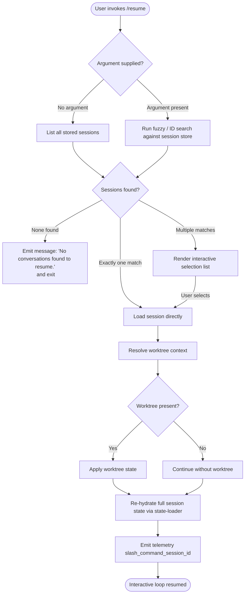

# `/resume`

> Analysis basis: CC v2.1.143 bundle.js (AST extraction + Claude interpretation)
> Minimum version: v2.1.143

---

## Overview

The `/resume` command (aliased as `/continue`) allows the user to re-enter a previously saved Claude Code conversation by supplying either an exact session ID or a free-text search term. It searches the local conversation store, presents matched sessions, and then re-hydrates the full conversation state — including worktree context, session metadata, and message chain — before handing control back to the normal interactive loop.

---

## Registration

| Field | Value |
|---|---|
| type | `local-jsx` |
| name | `resume` |
| description | Resume a previous conversation |
| argumentHint | `[conversation id or search term]` |
| aliases | `continue` |
| module_id | `xJq` |

Analysis basis: CC v2.1.143 bundle.js:+11220750

---

## Input Branching

The command follows three high-level paths based on what the user provides and what the search yields.



Analysis basis: CC v2.1.143 bundle.js:+11219420, +11219793, +11219561, +11220054

---

## Behavioral Spec

### Session Discovery and Filtering

```
function discoverSessions(rawArg):
    allSessions = loadAllStoredSessions()          // calls session store
    filtered = allSessions.filter(isValidSession)  // bJq → H.filter

    if rawArg is empty:
        return filtered

    normalizedArg = rawArg.toLowerCase()           // locale-aware, NFC normalize

    // Exact ID match first
    exactMatch = filtered.find(s => s.id == normalizedArg)
    if exactMatch:
        return [exactMatch]

    // Prefix match: strip "worktree " prefix (length 9) from display name
    // then run localeCompare-based sort
    candidates = filtered.filter(s =>
        s.displayName.toLowerCase().startsWith(normalizedArg) OR
        s.id.startsWith(normalizedArg)
    )
    candidates.sort((a, b) => a.displayName.localeCompare(b.displayName))

    return candidates
```

Analysis basis: CC v2.1.143 bundle.js:+11219420, +11219450, +11216524, +11216549, +11216585, +11216701, +11216720, +11216747, +11216780

String normalization uses Unicode NFC form.
Analysis basis: CC v2.1.143 bundle.js:+11216606

The prefix `"worktree "` (9 characters) is stripped before display-name comparison.
Analysis basis: CC v2.1.143 bundle.js:+11216562, +11216593

---

### Worktree Context Resolution

```
function resolveWorktree(session):
    result = runGit(["worktree", "list", "--porcelain"])  // literals: "worktree","list","--porcelain"
    emit telemetry("tengu_worktree_detection", {sessionId: session.id})

    worktrees = parsePortcelainOutput(result)
    match = worktrees.find(wt => wt.path == session.worktreePath)

    if match:
        return {state: "active", worktree: match}
    else:
        return {state: "none"}
```

Analysis basis: CC v2.1.143 bundle.js:+11216343, +11216354, +11216361, +11216443

---

### Empty-Result Guard

When the filtered session list is empty, the command renders the literal message and terminates without loading any state.

- Message text: `"No conversations found to resume."` (bundle.js:+11219793)
- The guard fires before any session-state I/O is attempted.

Analysis basis: CC v2.1.143 bundle.js:+11219793

---

### Ambiguous-Match Interaction

```
function handleAmbiguousMatch(matches):
    // "sessionNotFound" and "multipleMatches" are the two result-status tokens
    if matches.length == 0:
        return status("sessionNotFound")   // literal bundle.js:+11216987
    if matches.length == 1:
        return status("ok", matches[0])

    // Render bold-formatted list (RJq → M6.bold)
    renderedList = matches.map(m => bold(formatSessionLine(m)))
    presentInteractiveList(renderedList)
    selected = awaitUserSelection()
    return status("ok", selected)
```

Analysis basis: CC v2.1.143 bundle.js:+11216987, +11217058, +11220328

---

### Session State Re-hydration

The session loader (`tqH` → `XHH`) rebuilds an extensive in-memory state map from the persisted session record. The metadata keys written/read during re-hydration include:

| Key | Purpose |
|---|---|
| `summary` | Conversation summary text |
| `last-prompt` | Most recent user prompt |
| `custom-title` | User-assigned title |
| `ai-title` | Model-generated title |
| `tag` | Session tag |
| `agent-name` | Agent identifier |
| `agent-color` | Agent color label |
| `agent-setting` | Agent configuration blob |
| `mode` | Interaction mode |
| `permission-mode` | Tool-permission policy |
| `isolation-latch` | Isolation flag |
| `worktree-state` | Worktree attachment info |
| `pr-link` | Associated pull-request URL |
| `bridge-session` | MCP bridge session token |
| `file-history-snapshot` | File history state |
| `attribution-snapshot` | Attribution metadata |
| `content-replacement` | Content-replacement map |
| `fork-context-ref` | Fork context reference |
| `marble-origami-commit` | Marble/Origami commit hash |
| `marble-origami-snapshot` | Marble/Origami snapshot ID |

Analysis basis: CC v2.1.143 bundle.js:+12153126 through +12154730

Message chain reconstruction reads `user` and `assistant` role entries from storage, reverses and re-sorts by timestamp, and detects parent-cycle anomalies.

Analysis basis: CC v2.1.143 bundle.js:+12155597, +12155614, +12155529, +12134044, +12134193

---

### Session ID Telemetry Emission

```
function emitSessionTelemetry(session):
    track("slash_command_session_id", {id: session.id})   // literal bundle.js:+11220054
    track("slash_command_title",      {title: session.title}) // literal bundle.js:+11220278
```

Analysis basis: CC v2.1.143 bundle.js:+11220054, +11220278

---

### Conversation List Sort Order

```
function sortSessionsForDisplay(sessions):
    // Sorted using localeCompare for display name, then sliced to a
    // reasonable page size for the interactive list.
    sessions.sort((a, b) => a.displayName.localeCompare(b.displayName))
    return sessions.slice(0, pageSize)   // slice used; exact page limit
                                         // not exposed at depth-2
```

Analysis basis: CC v2.1.143 bundle.js:+11216780, +11216747

<!-- TODO: exact page-size limit not found in depth-2 traversal; needs --depth 4 -->

---

### "Skip" Handling

The string literal `"skip"` appears in the filter path, indicating that sessions marked with a `skip` disposition are excluded from the result list before display.

Analysis basis: CC v2.1.143 bundle.js:+11219561

---

## State & Side Effects

| Item | Detail |
|---|---|
| Telemetry — worktree detection | `tengu_worktree_detection` emitted after git-worktree probe (bundle.js:+11216443) |
| Telemetry — transcript cycle guard | `tengu_transcript_parent_cycle` emitted on detected message-chain cycle (bundle.js:+12155529) |
| Telemetry — chain cycle guard | `tengu_chain_parent_cycle` emitted on chain-level cycle (bundle.js:+12134044) |
| Telemetry — timestamp fallback | `tengu_chain_timestamp_fallback` when message timestamp is missing (bundle.js:+12134193) |
| Telemetry — daemon control | `tengu_daemon_control` (bundle.js:+14538273) |
| Telemetry — daemon config reload | `tengu_daemon_config_reload` (bundle.js:+14517117) |
| Telemetry — background spare enable | `tengu_bg_spare_enable` (bundle.js:+14502634) |
| Telemetry — background spare spawn | `tengu_bg_spare_spawn` (bundle.js:+14502994) |
| Telemetry — SIGKILL escalation | `tengu_bg_dispatch_sigkill_escalate` (bundle.js:+14503217) |
| Telemetry — low memory dispatch | `tengu_bg_dispatch_low_mem` (bundle.js:+14503796) |
| Telemetry — spare session claim | `tengu_bg_spare_claim` (bundle.js:+14504532) |
| Telemetry — spare claim failure | `tengu_bg_spare_claim_fail` (bundle.js:+14504795) |
| Session ID tracking | `slash_command_session_id` emitted with resolved session ID (bundle.js:+11220054) |
| Session title tracking | `slash_command_title` emitted with resolved session title (bundle.js:+11220278) |
| appState changes | Full session metadata map populated; worktree state, permission mode, agent config, and message chain all restored into live app state via state-loader (bundle.js:+12152848–+12156405) |
| File I/O | Reads session files via `xL.readFile`; probes file stats via `xL.stat`; reads conversation directory via `xL.readdir`; resolves real paths via `xL.realpath` (bundle.js:+12155048, +12154840, +12160477, +12161192) |
| Git subprocess | Spawns `git worktree list --porcelain` to detect active worktrees (bundle.js:+11216343) |
| Hook registration | <!-- TODO: not found in depth-2 traversal; needs --depth 4 --> |
| Sound | <!-- TODO: not found in depth-2 traversal; needs --depth 4 --> |

---

## Version History

| Version | Change |
|---|---|
| v2.1.143 | Initial analysis |

---

## Common Mistakes

1. **Using `/resume` with a partial title that matches multiple sessions** — When multiple sessions match the search term, an interactive list is shown. Supplying a more specific term or the full session ID avoids the extra selection step.

2. **Expecting cross-directory resume without worktree alignment** — Worktree context is probed via `git worktree list --porcelain`. If the shell's current working directory does not contain or reference the original worktree, the worktree state will not be re-attached, and tools that depend on worktree paths may behave differently than in the original session.

3. **Confusing `/resume` with simply re-running Claude Code** — `/resume` fully re-hydrates session metadata (title, permission mode, agent config, fork context, etc.). Starting a new session in the same directory does **not** restore these settings.

4. **Assuming all past sessions are listed** — Sessions marked with the `skip` disposition (bundle.js:+11219561) are silently excluded from the search results. A session may exist on disk but never appear in `/resume` output.

5. **Using the alias `/continue` and expecting different behavior** — `/continue` is a registered alias and is functionally identical to `/resume` (bundle.js:+11220750).

---

## Appendix — Identifier Mapping

> For bundle debugging only. Identifiers change across versions.

| Identifier | Role |
|---|---|
| `bJq` | Command entry-point / session-list filter function |
| `iZ7` | Main resume command handler (renders UI, orchestrates flow) |
| `NH` | Session record loader / network-layer helper |
| `v_` | Error constructor wrapper |
| `xH` | String conversion utility |
| `zq` | Traffic-policy checker ("essential-traffic") |
| `kNK` | LRU-style queue manager (shift/push) |
| `XH` | String-to-identifier normalizer |
| `uNH` | Worktree detection and session search driver |
| `$_` | High-level session orchestrator (calls worktree, daemon, NH) |
| `d` | Shared utility / dependency injector |
| `A` | Lowercase-normalizing string wrapper |
| `$` | Session-prefix / startsWith helper |
| `L` | Async task queue (add/delete/finally) |
| `__` | UI component factory (used with GV) |
| `GV` | Base UI primitive |
| `bj8` | Conversation-summary formatter entry point |
| `rG6` | Summary text builder (joins, formats, iterates messages) |
| `nn` | Regex test helper (Oz4.test) |
| `f` | Session file-handle manager (open/close/filter) |
| `q` | File unlink / low-level I/O helper |
| `vi` | Interactive list renderer |
| `tqH` | Full session state loader / re-hydration engine |
| `XHH` | Metadata map writer (sets all session key-value pairs) |
| `P28` | Date parsing helper |
| `S` | Focus/blur state manager with rate-limit check |
| `sqH` | Message chain builder (detects cycles, reverses, sorts) |
| `plH` | Message array mapper |
| `wQ_` | Prompt text truncator (max 200 chars, "No prompt" fallback) |
| `jQ_` | Message-type classifier (attachment / system / progress) |
| `K` | Column formatter (padEnd 40) |
| `M` | Multi-source metadata aggregator |
| `O` | N8-backed metadata accessor |
| `j` | w-backed session accessor |
| `P` | Buffer/stream reader (ETOOLARGE / EUNKNOWN guard) |
| `X` | SDK connection manager (connected / failed states) |
| `G` | Session-group registry (f26 / iT8) |
| `z` | Daemon-stop controller (SH / mH / xN / Ox) |
| `Y` | Supervisor lifecycle manager (start/stop/updateConfig) |
| `D` | Memory-aware background session manager |
| `w` | Background process dispatcher (SIGKILL, spawn, low-mem) |
| `J` | Active-process kill manager |
| `X28` | Session-cache getter/setter |
| `W28` | Session-map enumerator (Array.from + values) |
| `Z` | Filtered session list holder |
| `V` | Session value accessor |
| `JJ6` | Full state snapshot assembler (collects all sub-state maps) |
| `Yyq` | State initializer / Object.assign merger |
| `_` | Lodash-style utility (keys / values / replaceAll) |
| `N` | Away-summary generator with rate-limit and staleness guards |
| `AQ_` | Conversation accessor (at / wQ_ / plH / jQ_) |
| `T` | Remote-control / keyboard-event interceptor |
| `kLH` | Post-load hook dispatcher |
| `nQ` | Search-result renderer and slice manager |
| `Dyq` | Directory-based conversation scanner (readdir / realpath) |
| `tNH` | Binary transcript serializer (Buffer.alloc) |
| `RJq` | Bold-text label renderer (M6.bold) |
| `iM` | Shared imperative helper (called at filter and render sites) |