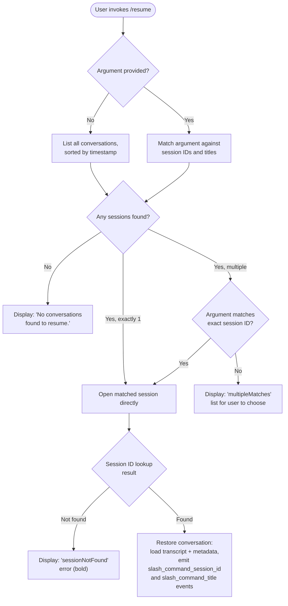

# `/resume`

> Analysis basis: CC v2.1.143 bundle.js (AST extraction + Claude interpretation)
> Minimum version: v2.1.143

---

## Overview

`/resume` (alias: `/continue`) lets the user reload a previous Claude Code conversation by providing a conversation ID or a free-text search term. The command queries the on-disk conversation store, presents a filtered and sorted list of matching sessions, then re-opens the selected conversation in the current working context, restoring its message history and metadata.

---

## Registration

| Field | Value |
|---|---|
| type | `local-jsx` |
| name | `resume` |
| description | `Resume a previous conversation` |
| argumentHint | `[conversation id or search term]` |
| aliases | `["continue"]` |
| module_id | `xJq` |
| load_inline | `true` |
| loc_byte | `11220750` |
| loc_byte_end | `11220947` |
| loc_line | `6668` |
| arbor_handler.name | `iZ7` |
| arbor_handler.fqn | `claude-2.1.143::iZ7` |
| arbor_handler.kind | `AsyncFunction` |
| arbor_handler.resolution_path | `module_id` |
| arbor_handler.n_hits | `0` |

Analysis basis: CC v2.1.143 bundle.js:+11220750

---

## Input Branching

The command has 4+ distinct branches depending on argument presence, match count, and session state.



Analysis basis: CC v2.1.143 bundle.js:+11219543

---

## Behavioral Spec

### 1. Handler Entry Point (`iZ7` — `resumeCommandHandler`)

The Arbor-resolved handler is the async function `iZ7`. It is reached via `module_id → xJq` (resolution_path: `module_id`).

```
async function resumeCommandHandler(context):
    sessionList = listSessions(context)           // calls conversationLister (uNH)
    filteredList = filterSessions(sessionList)    // calls filter on session array
    jsxElement = createElement(...)              // builds UI component
    timestamp = Date.now()

    if filteredList is empty:
        display "No conversations found to resume."
        return

    matchedSession = resolveSession(filteredList, context.argument)

    if matchedSession is "sessionNotFound":
        display bold("sessionNotFound") error
        return

    if matchedSession is "multipleMatches":
        display match-list UI
        return

    emitTelemetryLiteral("slash_command_session_id", matchedSession.id)
    emitTelemetryLiteral("slash_command_title", matchedSession.title)

    openSession(matchedSession)
```

Analysis basis: CC v2.1.143 bundle.js:+11219543

---

### 2. Session Listing (`uNH` — `conversationLister`)

```
async function conversationLister(context):
    timestamp = Date.now()
    runGit(["worktree", "list", "--porcelain"])   // worktree detection
    emit telemetry: "tengu_worktree_detection"

    rawLines = splitOutput(gitOutput)
    worktreePaths = parseWorktreeLines(rawLines)  // strips "worktree " prefix (9 chars)

    // Normalize Unicode: NFC form applied to paths
    sessions = []
    for each conversationFile on disk:
        session = loadSessionMetadata(file)
        sessions.push(session)

    // Filter: exclude sessions that do not match argument (if provided)
    if argument given:
        matched = sessions.find(s => s.id.startsWith(argument)
                                  || s.title includes argument)
        filtered = sessions.filter(matchPredicate)
    else:
        filtered = sessions

    // Sort by last-modified timestamp, locale-aware
    filtered.sort((a, b) => a.title.localeCompare(b.title, "NFC"))

    return filtered.slice(0, MAX_RESULTS)
```

Key literals observed:
- Git subcommand: `"worktree"`, `"list"`, `"--porcelain"` (bundle.js:+11216343, +11216354, +11216361)
- Prefix strip length: `9` characters (`"worktree "`) (bundle.js:+11216593)
- Unicode normalization form: `"NFC"` (bundle.js:+11216606)
- Telemetry event `tengu_worktree_detection` (bundle.js:+11216443)

Analysis basis: CC v2.1.143 bundle.js:+11216299

---

### 3. Conversation File Reading (`tqH` / `XHH` — `sessionStoreReader`)

The session store subsystem (reached via `iZ7 → tqH → XHH`) reads JSONL transcript files and populates per-session metadata maps. Known metadata keys stored per session:

| Key | Meaning |
|---|---|
| `"summary"` | AI-generated conversation summary |
| `"last-prompt"` | Last user prompt text |
| `"custom-title"` | User-set title |
| `"ai-title"` | Model-generated title |
| `"tag"` | User-applied tag |
| `"agent-name"` | Sub-agent identifier |
| `"agent-color"` | Agent color label |
| `"agent-setting"` | Agent configuration |
| `"mode"` | Conversation mode |
| `"permission-mode"` | Permission configuration |
| `"isolation-latch"` | Isolation flag |
| `"worktree-state"` | Worktree association |
| `"pr-link"` | Associated pull-request URL |
| `"bridge-session"` | Bridge session identifier |
| `"file-history-snapshot"` | File history snapshot ref |
| `"attribution-snapshot"` | Attribution snapshot ref |
| `"content-replacement"` | Content replacement record |
| `"fork-context-ref"` | Fork context reference |
| `"marble-origami-commit"` | Internal commit hash label |
| `"marble-origami-snapshot"` | Internal snapshot label |

Message types recognized during parsing: `"user"`, `"assistant"`, `"attachment"`, `"system"`, `"compact_boundary"`, `"progress"`.

Analysis basis: CC v2.1.143 bundle.js:+12145546

---

### 4. Session Resolution (`nQ` — `sessionResolver`)

```
function sessionResolver(sessions, argument):
    if argument is undefined or empty:
        return sessions  // show full list

    lowArg = argument.toLowerCase()

    // Exact UUID match
    exactId = sessions.find(s => s.id === argument)
    if exactId found:
        return exactId

    // Prefix match on ID
    prefixMatches = sessions.filter(s => s.id.startsWith(lowArg))

    // Content search: titles, summaries
    contentMatches = sessions.filter(s =>
        s.title.toLowerCase().includes(lowArg)
        || s.summary?.toLowerCase().includes(lowArg)
    )

    allMatches = dedupe(prefixMatches + contentMatches)

    if allMatches.length == 0:
        return { error: "sessionNotFound" }
    if allMatches.length == 1:
        return allMatches[0]
    return { error: "multipleMatches", matches: allMatches }
```

Error token literals:
- `"sessionNotFound"` (bundle.js:+11216987)
- `"multipleMatches"` (bundle.js:+11217058)

"multipleMatches" UI renders session titles in **bold** via the `M6.bold` call. Analysis basis: CC v2.1.143 bundle.js:+11217022

---

### 5. Conversation Open / Restore (`JJ6` — `sessionOpener`)

```
async function sessionOpener(sessionId, context):
    // Resolve full transcript chain
    chain = resolveChain(sessionId)   // sqH — chainResolver

    // Reconstruct message list from JSONL shards
    messages = reconstructMessages(chain)  // tNH — transcriptReconstructor

    // Re-build context object for the session
    sessionCtx = buildSessionContext(messages, metadata)

    // Signal to host that /resume opened this session
    context.stateUpdate("slash_command_session_id", sessionId)
    context.stateUpdate("slash_command_title",  sessionCtx.title)

    return sessionCtx
```

Literal: `"slash_command_session_id"` (bundle.js:+11220054)
Literal: `"slash_command_title"` (bundle.js:+11220278)

If no sessions exist at all, the literal message `"No conversations found to resume."` is displayed (bundle.js:+11219793).

Analysis basis: CC v2.1.143 bundle.js:+11220099

---

### 6. Chain & Transcript Reconstruction (`sqH`, `tNH` — `chainResolver`, `transcriptReconstructor`)

```
function chainResolver(sessionId, store):
    visited = new Set()
    chain = []
    current = sessionId

    while current is not null:
        if visited.has(current):
            emit telemetry: "tengu_chain_parent_cycle"
            break
        visited.add(current)
        node = store.get(current)
        if node.timestamp missing:
            emit telemetry: "tengu_chain_timestamp_fallback"
        chain.push(node)
        current = node.parentUuid

    if parallel tool-result inconsistency detected:
        emit telemetry: "tengu_chain_parallel_tr_recovered"

    return chain.reverse()   // chronological order
```

```
function transcriptReconstructor(chain):
    // Reads JSONL shards from disk using sync file I/O
    buffer = Buffer.alloc(...)
    records = []
    for each shard in chain:
        rawBytes = readSync(shard.path, buffer)
        parsed = parseJSONLRecords(rawBytes)
        records.push(...parsed)

    if phantom parent detected:
        emit telemetry: "tengu_transcript_phantom_parent"
    if parent cycle detected:
        emit telemetry: "tengu_transcript_parent_cycle"

    return records
```

Analysis basis: CC v2.1.143 bundle.js:+12134042, +12134193, +12136059, +12151969, +12155529

---

## State & Side Effects

| Item | Detail |
|---|---|
| Telemetry — worktree | `tengu_worktree_detection` (bundle.js:+11216443) — fired when enumerating git worktrees |
| Telemetry — transcript | `tengu_transcript_phantom_parent` (bundle.js:+12151969) — missing parent UUID detected |
| Telemetry — transcript | `tengu_transcript_parent_cycle` (bundle.js:+12155529) — cycle in parent-UUID chain |
| Telemetry — chain | `tengu_chain_parent_cycle` (bundle.js:+12134044) — cycle during chain walk |
| Telemetry — chain | `tengu_chain_timestamp_fallback` (bundle.js:+12134193) — message timestamp missing, using fallback |
| Telemetry — chain | `tengu_chain_parallel_tr_recovered` (bundle.js:+12136059) — parallel tool-result inconsistency recovered |
| Telemetry — relink | `tengu_relink_walk_broken` (bundle.js:+12133554) — broken walk during re-link |
| appState changes | `slash_command_session_id` written to app state on successful resume |
| appState changes | `slash_command_title` written to app state on successful resume |
| Hook registration | None detected in depth-2 traversal |
| Sound | None detected in depth-2 traversal |
| Filesystem reads | JSONL transcript shards read via synchronous `fs.readSync`; directory listed via `fs.readdir` |
| Git subprocess | `git worktree list --porcelain` executed to enumerate worktrees |

---

## Version History

| Version | Change |
|---|---|
| v2.1.143 | Initial analysis |

---

## Common Mistakes

1. **Providing a partial ID that matches multiple sessions** — The command returns a `multipleMatches` list rather than opening any session. Supply enough characters to uniquely identify the target session (a UUID prefix of ≥7 characters is typically sufficient).
2. **Searching for a session in a different worktree** — Session listing is scoped by worktree detection (`git worktree list --porcelain`). Sessions created in another worktree may not appear in the current invocation's list.
3. **Using `/resume` with no argument expecting an interactive picker** — When no sessions exist at all, the command immediately displays `"No conversations found to resume."` and exits; there is no further prompt.
4. **Expecting instant load of very long transcripts** — The transcript reconstructor reads JSONL shards synchronously from disk. Long conversation histories with many shards may have noticeable latency before the session becomes interactive.
5. **Confusing the alias `/continue`** — `/continue` is fully equivalent to `/resume` (registered alias). Both invoke the same handler (`iZ7`).

---

## Appendix — Identifier Mapping

> For bundle debugging only. Identifiers change across versions.

| Identifier | Role |
|---|---|
| `iZ7` | Main handler (`resumeCommandHandler`) — async entry point for `/resume` |
| `bJq` | Pre-filter function applied to the raw session list before handler |
| `iM` | Session item mapper / normalizer (called twice: in `bJq` and `iZ7`) |
| `NH` | Logger / error reporting utility (shared across subsystems) |
| `v_` | Error construction helper |
| `xH` | String coercion / path helper |
| `zq` | Secondary filter / query helper |
| `A$A` | Path helper used by `zq` |
| `kNK` | LRU-style cache queue manager (shift/push on `Ch6`) |
| `XH` | String coercion used during session open |
| `uNH` | Conversation lister — queries git worktrees and returns session list |
| `$_` | Session store bootstrap / spawn helper |
| `KXH` | Subprocess / child-process launcher |
| `YzA` | Subprocess argument builder |
| `qu8` | Subprocess stdin helper |
| `Ku8` | Subprocess stream setup |
| `fu8` | Subprocess option builder |
| `GOA` | Numeric argument validator |
| `hA6` | Subprocess lifecycle manager |
| `Au8` | Reflect-based property installer |
| `oOA` | Event emitter registration helper |
| `WOA` | Timeout/race helper for subprocess |
| `TOA` | Kill/cleanup helper |
| `POA` | Spawn bind helper |
| `XOA` | Kill bind helper |
| `iOA` | Parallel promise runner for subprocesses |
| `xA6` | Output stream helper |
| `lOA` | Pipe setup helper |
| `nOA` | Add-stream helper |
| `IOA` | Output bind helper |
| `D` | Session spawn / daemon interaction orchestrator |
| `G6` | Daemon client |
| `$` | Disposable resource manager |
| `IG6` | Platform-aware daemon initializer |
| `$o_` | Background PTY host spawner |
| `_SK` | String-based key serializer |
| `__` | i18n / translation helper |
| `GV` | Translation lookup table |
| `bj8` | Conversation browser / search driver |
| `rG6` | Conversation directory reader |
| `v` | Conversation file parser |
| `G5K` | Terminal/UI formatting helper |
| `hH` | JSON serializer for debug output |
| `P7` | Path redaction helper (replaces with `"[REDACTED]"`) |
| `cSH` | Path sanitizer |
| `Z5K` | Conversation file loader (reads bytes, calls buffer helpers) |
| `Dyq` | Conversation index builder (reads directory, maps metadata) |
| `VF` | Projects path resolver |
| `W` | Event-batching / debounce helper |
| `K` | Column formatter (padEnd) |
| `j9` | Async helper |
| `VJH` | Conversation chunk processor |
| `KQ_` | Recursive directory scanner for conversation files |
| `BG6` | Metadata map builder |
| `YO` | Path normalizer |
| `T` | Input event handler (remote control) |
| `Y` | Supervisor session manager |
| `Z` | MCP / external connection manager |
| `J` | Process registry |
| `P` | Buffer / stream accumulator |
| `X` | MCP tool invocation handler |
| `j` | Nested worker reference |
| `G` | MCP tool group handler |
| `tNH` | Transcript reconstructor (reads JSONL shards synchronously) |
| `tm7` | JSONL shard parser |
| `nn` | UUID/regex validator |
| `vi` | Session validity checker |
| `tqH` | Session store reader (populates metadata maps) |
| `XHH` | Session store main initializer / metadata map setter |
| `Pm7` | Session store map pre-population |
| `p` | Write stream with timeout |
| `Ap` | Session store accessor helper |
| `V6A` | Metadata value normalizer |
| `T6A` | Metadata type checker |
| `E6A` | Metadata string replacer |
| `UP` | Session store update helper |
| `M` | MCP session manager |
| `SvH` | MCP server configuration parser |
| `THK` | MCP server lifecycle updater |
| `B95` | MCP server connection orchestrator |
| `O` | Background session map |
| `N8` | Background session entry |
| `z` | Daemon control map |
| `SH` | Telemetry helper (`tengu_feature_ok`) |
| `mH` | Telemetry helper (`tengu_feature_bad`) |
| `xN` | Daemon control dispatcher |
| `Ox` | Process exit orchestrator |
| `w` | Background session dispatcher |
| `C` | Background session writer |
| `x` | Background session timeout/retry handler |
| `Oo_` | Unix-socket connection helper |
| `jo_` | Background session lifecycle runner |
| `L8` | Logging helper |
| `h` | Session handle |
| `V` | Pending session handle |
| `Q` | File read/write queue |
| `LW6` | File read helper |
| `B7q` | File unlink helper |
| `N` | Away-summary generator |
| `KM8` | State accessor for away-summary |
| `Te7` | Rate-limit checker for away-summary |
| `jlq` | Away-summary storage helper |
| `W18` | Away-summary API caller |
| `K1q` | UUID generator |
| `g` | Signal/event emitter |
| `S` | Session-focus handler (blurred/focused) |
| `NF` | Session-focus state |
| `Qm7` | JSONL file reader (low-level, buffer-based) |
| `e` | Ref-based render timeout helper |
| `zyq` | Buffer-at accessor |
| `zH` | Stream chunk enqueuer |
| `R6` | JSON.parse wrapper |
| `R` | Record-set accumulator |
| `y` | Write-stream handle |
| `Fm7` | Buffer comparator |
| `c` | Tool-result filter |
| `HH` | Ref-based render timeout (variant) |
| `AH` | Ref-based render timeout (variant 2) |
| `s` | Seen-set for dedup |
| `DH` | Dual-stream handler |
| `o` | Voice session orchestrator |
| `dm7` | Disk-read helper (open/read/close sync) |
| `ckq` | Session cache manager |
| `km7` | Session cache walker |
| `H_` | Passthrough identity helper |
| `gm7` | JSONL message-block reader |
| `YXH` | Framing / BOM detector |
| `pSK` | BOM pre-scan helper |
| `USK` | BOM-stripped frame helper |
| `FSK` | Frame parser |
| `BSK` | Frame push helper |
| `C9` | Logging level helper |
| `F` | MCP tool filter |
| `c6` | Key-event router |
| `P6` | Orphaned-permission tracker |
| `l` | Permission-allow set |
| `Oc_` | Permission allow-entry builder |
| `r` | Permission deny set |
| `P28` | Date.parse wrapper for chain timestamps |
| `sqH` | Chain resolver (walks parentUuid links) |
| `hm7` | Chain validity checker |
| `Rm7` | Chain parallel-tool-result reconciler |
| `ym7` | Chain segment sorter |
| `Myq` | Chain metadata value mapper |
| `plH` | Flat message-list mapper |
| `wQ_` | Compact-summary post-processor |
| `P06` | Message content normalizer |
| `vq` | Text content extractor |
| `jQ_` | Attachment content classifier |
| `Cm7` | Attachment type checker |
| `bm7` | Attachment array validator |
| `X28` | Session-map get/set helper |
| `W28` | Session-map values lister |
| `JJ6` | Session opener (reads maps, calls chain resolver) |
| `Yyq` | Session context assembler |
| `cm7` | Conversation path builder (joins project dir) |
| `CU` | Translation helper (calls `GV`) |
| `mG` | Project directory scanner |
| `AQ_` | Conversation search orchestrator |
| `kLH` | Session UI keyboard handler |
| `nQ` | Session resolver (matches argument to session list) |
| `RJq` | Bold error renderer for `sessionNotFound` / `multipleMatches` |

---

Note: index built via Arbor fallback; some signals (telemetry, literals) may be missing — see arbor-fallback.js.