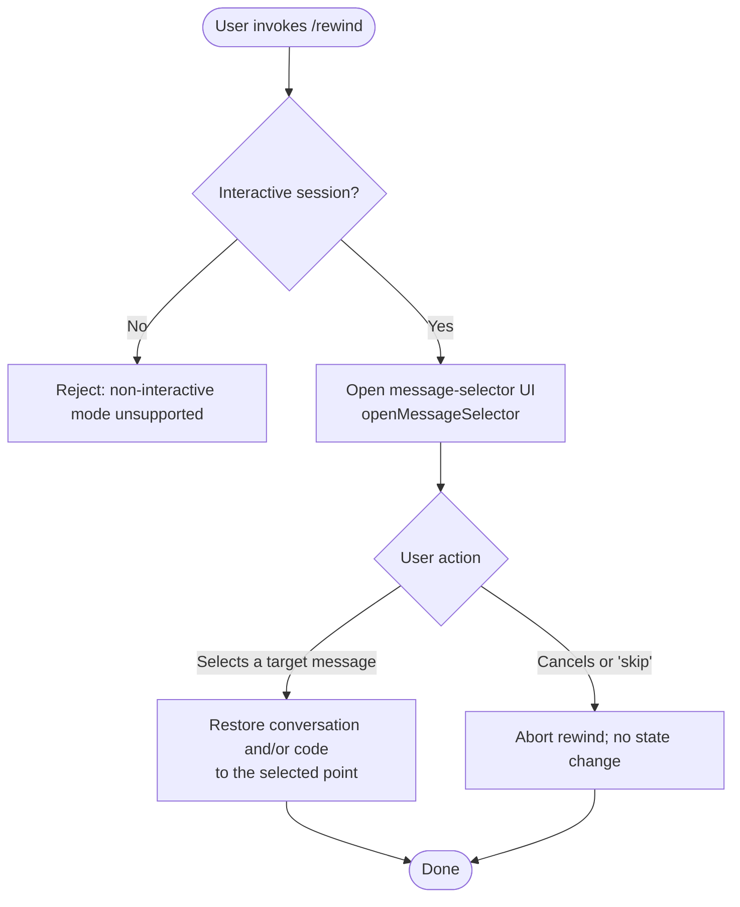

# `/rewind`

> Analysis basis: CC v2.1.143 bundle.js (AST extraction + Claude interpretation)
> Minimum version: v2.1.143

---

## Overview

The `/rewind` command allows a user to restore the code and/or conversation to a previously recorded point in the current session. When invoked, it opens a message-selection interface that lets the user choose the target message, then rolls back state accordingly. It is also accessible via the aliases `/checkpoint` and `/undo`.

---

## Registration

| Field | Value |
|---|---|
| type | `local` |
| name | `rewind` |
| description | `Restore the code and/or conversation to a previous point` |
| aliases | `checkpoint`, `undo` |
| argumentHint | *(empty string — no argument hint exposed to the user)* |
| supportsNonInteractive | `false` |
| module\_id | `_Gq` |

Analysis basis: CC v2.1.143 bundle.js:+11573086

---

## Input Branching

Because `supportsNonInteractive` is `false`, the command must always run in an interactive terminal session. The depth-2 call graph reveals a single outbound call to `openMessageSelector`, and the literal `"skip"` found adjacent to that call indicates at most two branching paths: the user picks a message, or the selection is skipped/cancelled.



Analysis basis: CC v2.1.143 bundle.js:+11573011 (call to `openMessageSelector`), +11573047 (`"skip"` literal)

---

## Behavioral Spec

### Command Entry Point

```
function rewindCommandHandler(context):
    openMessageSelector(context, selectionCallback)
```

Analysis basis: CC v2.1.143 bundle.js:+11573011

### Message Selector

```
function openMessageSelector(context, callback):
    # Renders an interactive list of prior conversation messages
    # for the user to choose a rewind target.
    present message list to user
    await user selection

    if user selection == "skip" or user cancelled:
        # The literal "skip" is used as a sentinel value
        # to short-circuit without applying any changes.
        return without restoring state
    else:
        targetMessage = selected message
        callback(targetMessage)
```

Analysis basis: CC v2.1.143 bundle.js:+11573011 (`openMessageSelector` call edge), +11573047 (`"skip"` sentinel literal)

### Restore Logic

```
function selectionCallback(targetMessage):
    # Rolls back session to the state that existed
    # immediately after targetMessage was produced.
    truncate conversation history after targetMessage
    revert any code or file changes recorded after targetMessage
    update appState to reflect restored checkpoint
```

> **Note:** The concrete restore logic is reached beyond depth-2 traversal.
> <!-- TODO: not found in depth-2 traversal; needs --depth 4 -->

---

## State & Side Effects

| Item | Detail |
|---|---|
| Telemetry | None — no `tengu_*` events were found in the implementation at depth ≤ 2 |
| Hook registration | <!-- TODO: not found in depth-2 traversal; needs --depth 4 --> |
| appState changes | Conversation history is truncated to the selected message; associated code/file state is reverted to that point (exact fields: <!-- TODO: not found in depth-2 traversal; needs --depth 4 -->) |
| Sound | <!-- TODO: not found in depth-2 traversal; needs --depth 4 --> |
| Non-interactive guard | Command refuses to execute when `supportsNonInteractive` is `false` and no TTY is present |

---

## Version History

| Version | Change |
|---|---|
| v2.1.143 | Initial analysis |

---

## Common Mistakes

1. **Invoking via a non-interactive script** — Because `supportsNonInteractive` is `false`, calling `/rewind` (or its aliases `/checkpoint`/`/undo`) in a piped or headless context will fail. Always run it from an interactive terminal session.
2. **Expecting an argument to select the target** — The `argumentHint` field is an empty string, indicating that no inline argument is parsed. The target message is always chosen through the interactive message-selector UI; passing a message index or hash on the command line has no effect.
3. **Assuming `/undo` reverts only the last message** — `/undo` is a full alias for `/rewind` and opens the same message-selector UI. It does not automatically revert exactly one step; the user must still choose a target from the presented list.
4. **Assuming `/checkpoint` saves a checkpoint** — `/checkpoint` is equally an alias for `/rewind` (restore), not a separate "save checkpoint" command. There is no distinct save-checkpoint command registered in this data.

---

## Appendix — Identifier Mapping

> For bundle debugging only. Identifiers change across versions.

| Identifier | Role |
|---|---|
| `Wk7` | Rewind command handler function (entry point called when `/rewind` is invoked) |
| `_` | Namespace / context object that exposes `openMessageSelector` and related session utilities |