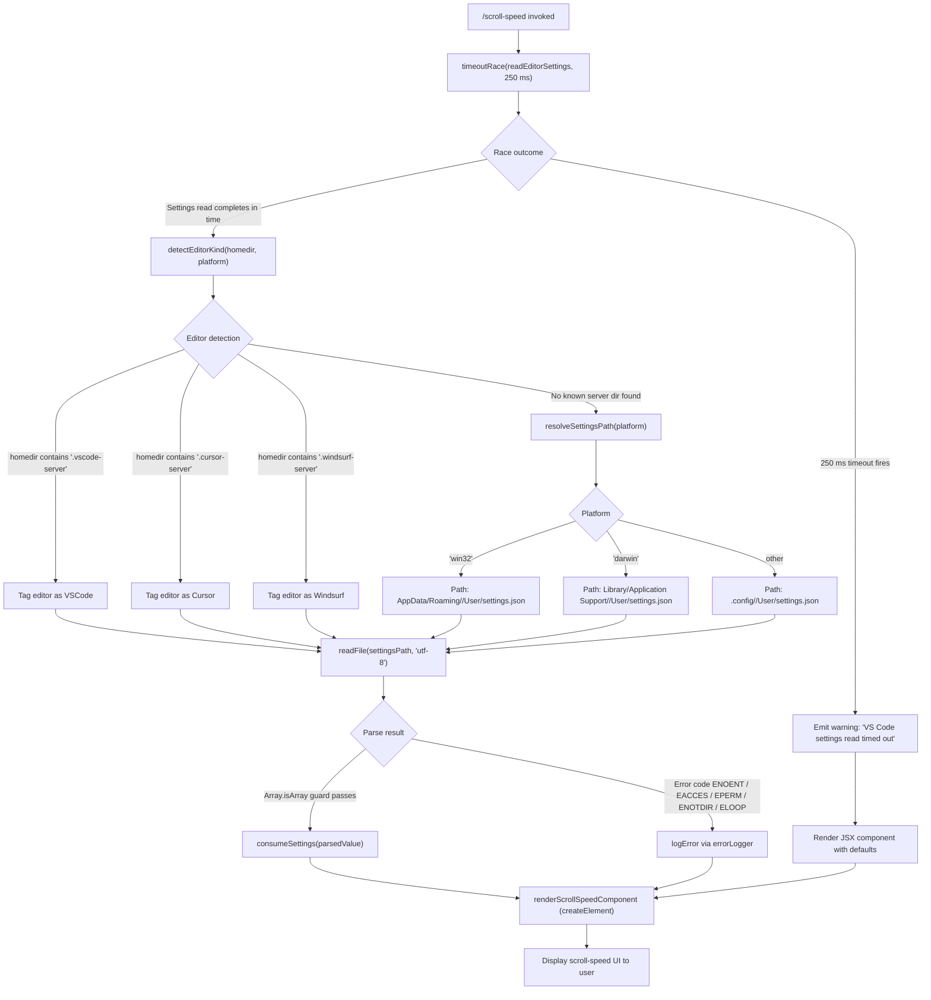

# `/scroll-speed`

> Analysis basis: CC v2.1.143 bundle.js (AST extraction + Claude interpretation)
> Minimum version: v2.1.143

---

## Overview

The `/scroll-speed` command adjusts the mouse wheel scroll speed within Claude Code's terminal UI. Its core mechanism reads the host editor's `settings.json` file (supporting VSCode, Cursor, and Windsurf) with a 250 ms timeout guard, then renders a JSX-based control component that lets the user tune scroll behaviour without leaving the CLI session.

---

## Registration

| Field | Value |
|---|---|
| type | `local-jsx` |
| name | `scroll-speed` |
| description | `Adjust mouse wheel scroll speed` |
| module\_id | `xjq` |
| loc\_line | 6785 |

Analysis basis: CC v2.1.143 bundle.js:+11272832

---

## Input Branching

The command entry point (`commandHandler`) calls two helpers in sequence: a timeout-wrapped async utility (`timeoutRace`) and a settings-reader (`readEditorSettings`). The flowchart below captures all branching paths discovered at call-graph depth ≤ 2.



Analysis basis: CC v2.1.143 bundle.js:+11272595, +11272598, +11272604, +11272608, +11272666

---

## Behavioral Spec

### Timeout-Guarded Async Execution

The command wraps the settings-read operation in a race between the actual async work and a fixed-duration timer, ensuring the UI is never blocked indefinitely.

```
async function timeoutRace(asyncOperation, limitMs):
    timer  = new Promise(resolve => setTimeout(resolve, limitMs))
    result = await Promise.race([asyncOperation(), timer])
    clearTimeout(timer)          // cancel timer if operation won first
    return result                // may be undefined if timer won
```

- Timeout value: **250 ms** (bundle.js:+11272604)
- Timeout message emitted on expiry: `"VS Code settings read timed out"` (bundle.js:+11272608)
- Timer is cleaned up unconditionally via `clearTimeout` to prevent leaks (bundle.js:+2204882)

Analysis basis: CC v2.1.143 bundle.js:+2204772, +2204835, +2204882

---

### Editor Kind Detection

Before resolving the settings file path, the implementation inspects the user's home directory string for well-known remote-server subdirectory markers. This handles the common case where Claude Code runs inside a remote SSH session attached to a GUI editor.

```
function detectEditorKind(homedirString, platformString):
    if homedirString includes ".vscode-server":
        return { displayName: "VSCode", dirName: "Code" }
    if homedirString includes ".cursor-server":
        return { displayName: "Cursor", dirName: "cursor" }
    if homedirString includes ".windsurf-server":
        return { displayName: "Windsurf", dirName: "windsurf" }
    return resolveSettingsPath(platformString)
```

Known server-directory markers (bundle.js:+3901722, +3901814):

| Marker string | Editor display name | Canonical dir name |
|---|---|---|
| `.vscode-server` | `VSCode` | `Code` |
| `.cursor-server` | `Cursor` | `cursor` |
| `.windsurf-server` | `Windsurf` | `windsurf` |

Analysis basis: CC v2.1.143 bundle.js:+3901733, +3901763, +3901793, +3906002, +3906030, +3906060

---

### Platform-Specific Settings Path Resolution

When no remote-server marker is found, the settings path is derived from the OS platform and the user's home directory.

```
function resolveSettingsPath(platformString):
    home = qt.homedir()
    editorDirName = "Code"            // default: VSCode
    if platformString == "win32":
        return DS.join(home, "AppData", "Roaming", editorDirName, "User", "settings.json")
    if platformString == "darwin":
        return DS.join(home, "Library", "Application Support", editorDirName, "User", "settings.json")
    // Linux / other POSIX
    return DS.join(home, ".config", editorDirName, "User", "settings.json")
```

Platform constants observed (bundle.js:+3906180, +3906242):

| Platform value | Root segment(s) |
|---|---|
| `win32` | `AppData` → `Roaming` |
| `darwin` | `Library` → `Application Support` |
| *(other)* | `.config` |

File always targeted: `settings.json` (bundle.js:+3905696), read as `utf-8` (bundle.js:+3905723).

Analysis basis: CC v2.1.143 bundle.js:+3905669, +3905681, +3905689, +3906143, +3906151, +3906164, +3906180, +3906196, +3906206, +3906218, +3906242, +3906259, +3906269, +3906309

---

### Settings File Read and Error Handling

```
async function readEditorSettings(settingsPath):
    try:
        raw = await C0.readFile(settingsPath, "utf-8")
        parsed = parseJSON(raw)          // internal JSON parser via SR6/yR6 path
        if Array.isArray(parsed):
            // Unexpected array root — treat as empty
            return {}
        return parsed
    catch err:
        if isFilesystemError(err):       // ENOENT, EACCES, EPERM, ENOTDIR, ELOOP
            logError(err)
            return {}
        raise err

function isFilesystemError(err):
    return err.code in {"ENOENT", "EACCES", "EPERM", "ENOTDIR", "ELOOP"}
```

Handled filesystem error codes (bundle.js:+172343, +172357, +172371, +172384, +172399):

| Error code | Meaning |
|---|---|
| `ENOENT` | File or directory not found |
| `EACCES` | Permission denied |
| `EPERM` | Operation not permitted |
| `ENOTDIR` | Path component is not a directory |
| `ELOOP` | Symbolic link loop |

JSON parse errors use an internal stringify helper that coerces to `String` and records `"error"` as the level marker (bundle.js:+1081923, +1081942).

Analysis basis: CC v2.1.143 bundle.js:+3905669, +3905723, +3905735, +3905769, +3905885, +3905891, +172326, +172343

---

### JSX Component Rendering

After settings resolution (or on timeout), the command renders a JSX element via the framework's `createElement` call. The rendered component exposes the scroll-speed control UI to the terminal user.

```
function renderScrollSpeedCommand(resolvedSettings):
    element = _U_.createElement(ScrollSpeedComponent, { settings: resolvedSettings })
    return element
```

Analysis basis: CC v2.1.143 bundle.js:+11272666

---

## State & Side Effects

| Item | Detail |
|---|---|
| Telemetry | None — no `tengu_*` events found in this command's implementation |
| Hook registration | <!-- TODO: not found in depth-2 traversal; needs --depth 4 --> |
| appState changes | <!-- TODO: not found in depth-2 traversal; needs --depth 4 --> |
| Sound | <!-- TODO: not found in depth-2 traversal; needs --depth 4 --> |
| File system reads | Reads `settings.json` from the detected editor config directory (read-only; no writes) |
| Timer lifecycle | A 250 ms `setTimeout` is created on every invocation; always cleaned up via `clearTimeout` |
| Error logging | Filesystem errors (ENOENT etc.) are forwarded to the internal error logger (`Wc.logError`) |

Analysis basis: CC v2.1.143 bundle.js:+11272604, +2204882, +960555

---

## Version History

| Version | Change |
|---|---|
| v2.1.143 | Initial analysis — command registered as `local-jsx`; supports VSCode, Cursor, and Windsurf; 250 ms settings-read timeout |

---

## Common Mistakes

1. **Assuming the command writes to `settings.json`** — it is strictly a read-only consumer of the file. Scroll-speed state is managed entirely within Claude Code's own UI layer.
2. **Expecting telemetry events** — this command emits no `tengu_*` telemetry events as of v2.1.143. Absence of events is intentional, not an instrumentation gap.
3. **Ignoring the 250 ms timeout** — if the editor settings file lives on a slow or network-mounted filesystem, the timeout will fire and the command will silently fall back to defaults. Users may see unexpected default scroll behaviour in such environments.
4. **Assuming only VSCode is supported** — the detector also handles Cursor (`.cursor-server`) and Windsurf (`.windsurf-server`) remote server directories, each with their own directory naming conventions.
5. **Treating an array-rooted `settings.json` as valid** — the implementation explicitly guards against this with `Array.isArray` and treats such a file as equivalent to an empty settings object.

---

## Appendix — Identifier Mapping

> For bundle debugging only. Identifiers change across versions.

| Identifier | Role |
|---|---|
| `oV7` | Command handler / entry-point function for `/scroll-speed` |
| `jf` | Timeout-race utility (wraps async work with `setTimeout` / `Promise.race` / `clearTimeout`) |
| `p4_` | Editor settings reader (orchestrates detection, path resolution, and file read) |
| `wnL` | Inner helper called early within the settings reader (role: <!-- TODO: not found in depth-2 traversal; needs --depth 4 -->) |
| `C4_` | Editor kind detector (checks homedir string against known server-directory markers) |
| `U4_` | Platform-specific settings path resolver (uses `qt.homedir` and `qt.platform`) |
| `SR6` | JSON parse / stringify helper (coerces to `String`, marks level as `"error"`) |
| `C9` | Filesystem error classifier (matches against ENOENT, EACCES, EPERM, ENOTDIR, ELOOP) |
| `NH` | Settings consumer / state integrator (calls push on result list, logs errors via `Wc.logError`) |