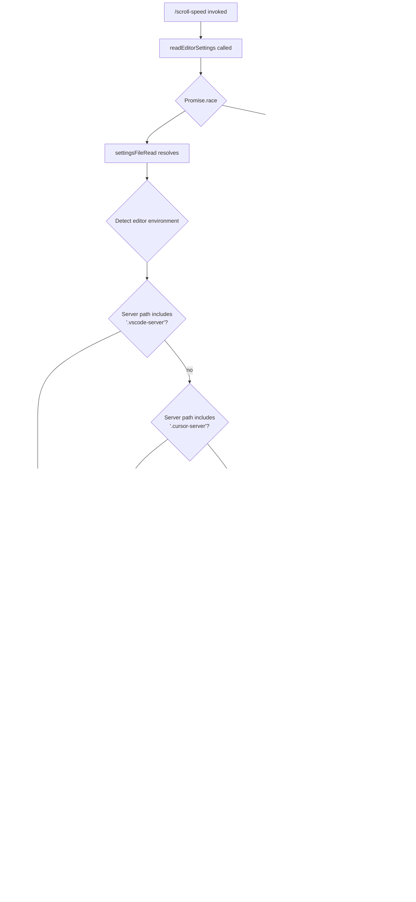

# `/scroll-speed`

> Analysis basis: CC v2.1.143 bundle.js (AST extraction + Claude interpretation)
> Minimum version: v2.1.143

---

## Overview

The `/scroll-speed` command adjusts the mouse wheel scroll speed within Claude Code's terminal UI. Its core mechanism reads the active editor's `settings.json` file (VS Code, Cursor, or Windsurf) to detect and apply scroll preferences, rendering a JSX component that presents the current setting and any available controls. The command operates locally without emitting telemetry events.

---

## Registration

| Field | Value |
|---|---|
| type | `local-jsx` |
| name | `scroll-speed` |
| description | `Adjust mouse wheel scroll speed` |
| module\_id | `xjq` |

Analysis basis: CC v2.1.143 bundle.js:+11272832

---

## Input Branching

The command's entry point (`commandHandler`) dispatches into two parallel sub-operations: a timeout-guarded settings read and a JSX render. The settings read resolves or times out before the UI is shown.



Analysis basis: CC v2.1.143 bundle.js:+11272595, +11272604, +11272608, +3905622, +3901722, +3901763, +3901793, +3905669, +3905769, +11272666

---

## Behavioral Spec

### 1. Timeout-Guarded Async Wrapper

The command wraps its settings-read operation in a race between the actual async work and a fixed timeout.

```
function timeoutRace(asyncOperation, limitMs):
    timeoutHandle = null
    timeoutPromise = new Promise(resolve =>
        timeoutHandle = setTimeout(() => resolve(TIMEOUT_SENTINEL), limitMs)
    )
    result = await Promise.race([asyncOperation, timeoutPromise])
    clearTimeout(timeoutHandle)
    return result
```

- Timeout value: **250 ms** (Analysis basis: CC v2.1.143 bundle.js:+11272604)
- Sentinel value on timeout: `"VS Code settings read timed out"` (Analysis basis: CC v2.1.143 bundle.js:+11272608)
- `clearTimeout` is always called after resolution to prevent timer leaks. (Analysis basis: CC v2.1.143 bundle.js:+2204882)

### 2. Editor Environment Detection

The environment classifier inspects path strings to identify which IDE is hosting the remote server.

```
function detectEditorEnvironment(serverPaths):
    if serverPaths.includes(".vscode-server"):
        return { label: "VSCode", configKey: "vscode" }
    if serverPaths.includes(".cursor-server"):
        return { label: "Cursor", configKey: "cursor" }
    if serverPaths.includes(".windsurf-server"):
        return { label: "Windsurf", configKey: "windsurf" }
    return { label: null, configKey: null }
```

- Detection is performed via `Array/String.includes` on collected server path tokens. (Analysis basis: CC v2.1.143 bundle.js:+3901722, +3901814)
- Recognised display labels: `"VSCode"`, `"Cursor"`, `"Windsurf"`. (Analysis basis: CC v2.1.143 bundle.js:+3906002, +3906030, +3906060)
- Recognised internal keys: `"vscode"`, `"cursor"`, `"windsurf"`. (Analysis basis: CC v2.1.143 bundle.js:+3905987, +3906015, +3906043)

### 3. Platform-Specific Settings Path Resolution

Given the detected editor and the host OS, the resolver constructs the expected path to `settings.json`.

```
function resolveSettingsPath(editorKey, platform, homeDir):
    if platform == "win32":
        return path.join(homeDir, "AppData", "Roaming", editorKey, "User", "settings.json")
    if platform == "darwin":
        return path.join(homeDir, "Library", "Application Support", editorKey, "User", "settings.json")
    // linux / other
    return path.join(homeDir, ".config", editorKey, "User", "settings.json")
```

- Filename always resolved to: `"settings.json"` (Analysis basis: CC v2.1.143 bundle.js:+3905696)
- Encoding for file read: `"utf-8"` (Analysis basis: CC v2.1.143 bundle.js:+3905723)
- Platform values checked: `"win32"`, `"darwin"` (Analysis basis: CC v2.1.143 bundle.js:+3906180, +3906242)
- `qt.homedir()` supplies the home directory; `qt.platform()` supplies the OS string. (Analysis basis: CC v2.1.143 bundle.js:+3906151, +3906164)
- Windows path segments: `"AppData"`, `"Roaming"`, `"User"` (Analysis basis: CC v2.1.143 bundle.js:+3906196, +3906206, +3906218)
- macOS path segments: `"Library"`, `"Application Support"`, `"User"` (Analysis basis: CC v2.1.143 bundle.js:+3906259, +3906269)
- Linux fallback segment: `".config"` (Analysis basis: CC v2.1.143 bundle.js:+3906309)
- VS Code's base folder name on all platforms is `"Code"`. (Analysis basis: CC v2.1.143 bundle.js:+3906127)

### 4. Settings File Read and Error Handling

After path resolution, the command reads and parses the file, handling common filesystem errors gracefully.

```
function readAndParseSettings(resolvedPath):
    try:
        raw = await filesystem.readFile(resolvedPath, "utf-8")
        parsed = parseJSON(raw)
        if Array.isArray(parsed):
            return processSettingsArray(parsed)
        return processSettingsObject(parsed)
    catch error:
        code = error.code
        if code in ["ENOENT", "EACCES", "EPERM", "ENOTDIR", "ELOOP"]:
            return gracefulEmpty()   // file absent or inaccessible — non-fatal
        logError(error)
        return errorResult(error)
```

- Filesystem error codes handled non-fatally: `"ENOENT"`, `"EACCES"`, `"EPERM"`, `"ENOTDIR"`, `"ELOOP"`. (Analysis basis: CC v2.1.143 bundle.js:+172343, +172357, +172371, +172384, +172399)
- Errors that do not match the above are forwarded to the shared error logger (`Wc.logError`). (Analysis basis: CC v2.1.143 bundle.js:+960555)

### 5. Network / API Call Layer (SR6 path)

The call graph reveals a subordinate API-call path reachable from the settings pipeline. This layer handles request serialisation and response processing.

```
function makeApiCall(requestData):
    sanitised = redactSensitiveFields(requestData)   // replaces secrets with "[REDACTED]"
    if requestData.startsWith("debug"):
        applyDebugMode()
    response = await dispatchRequest(sanitised)
    return normaliseResponse(response)
```

- Sensitive field placeholder literal: `"[REDACTED]"` (Analysis basis: CC v2.1.143 bundle.js:+193318)
- Debug mode string: `"debug"` (Analysis basis: CC v2.1.143 bundle.js:+201193)
- Response normalisation trims whitespace and upper-cases certain fields. (Analysis basis: CC v2.1.143 bundle.js:+201342, +201319)

### 6. Telemetry Mode Gate

The network layer checks the user's telemetry preference before dispatching any data. Three recognised modes exist.

```
function resolveTelemetryMode(modeString):
    if modeString == "essential-traffic":
        return MODE_ESSENTIAL
    if modeString == "no-telemetry":
        return MODE_SILENT
    return MODE_DEFAULT   // literal "default"
```

- Mode literals: `"essential-traffic"`, `"no-telemetry"`, `"default"`. (Analysis basis: CC v2.1.143 bundle.js:+959080, +959139, +959213)

### 7. Truthy String Normalisation

Several boolean-like configuration values are normalised from strings.

```
function isTruthyString(value):
    return value == "yes" or value == "on"
```

- Recognised truthy strings: `"yes"`, `"on"`. (Analysis basis: CC v2.1.143 bundle.js:+26422, +26428)

### 8. Random-Jitter Delay

A sub-utility referenced in the call graph introduces a small random delay, likely for request de-correlation.

```
function randomJitterDelay():
    jitter = Math.random() * 2   // multiplier: 2
    await sleep(1 + jitter)      // base offset: 1
```

- Multiplier constant: `2` (Analysis basis: CC v2.1.143 bundle.js:+12638154)
- Base constant: `1` (Analysis basis: CC v2.1.143 bundle.js:+12638170)

### 9. JSX Component Render

After all async resolution, the command renders a React/JSX component tree directly into the CLI viewport.

```
function renderScrollSpeedComponent(settingsResult):
    element = createElement(ScrollSpeedView, { settings: settingsResult })
    return element
```

- Uses `_U_.createElement` — the local alias for the JSX factory. (Analysis basis: CC v2.1.143 bundle.js:+11272666)
- No telemetry events are emitted during or after render (telemetry array is empty).

---

## State & Side Effects

| Item | Detail |
|---|---|
| Telemetry | None — telemetry array is empty for this command |
| Hook registration | `local-jsx` type; registered under module `xjq` |
| appState changes | <!-- TODO: not found in depth-2 traversal; needs --depth 4 --> |
| Sound | <!-- TODO: not found in depth-2 traversal; needs --depth 4 --> |
| Filesystem reads | Reads `settings.json` from the detected IDE config directory (utf-8) |
| Timers | One `setTimeout` (250 ms) created per invocation; always cleared via `clearTimeout` |
| Error logging | Unexpected filesystem errors are forwarded to the shared error logger |
| Queue mutation | Internal request queue uses shift/push operations (bounded ring-buffer pattern) |

---

## Version History

| Version | Change |
|---|---|
| v2.1.143 | Initial analysis |

---

## Common Mistakes

1. **Assuming the command only affects VS Code.** The environment detector also recognises Cursor (`.cursor-server`) and Windsurf (`.windsurf-server`); each resolves a distinct config path. Passing a path for the wrong editor will silently read the wrong `settings.json`.

2. **Ignoring the 250 ms timeout.** If the IDE config directory is on a slow or network-mounted filesystem, the settings read will be abandoned after 250 ms and the sentinel string `"VS Code settings read timed out"` will be returned. The command does not retry.

3. **Expecting telemetry events.** This command emits **no** `tengu_*` telemetry events. Any instrumentation relying on telemetry hooks will receive nothing from `/scroll-speed`.

4. **Treating non-fatal filesystem errors as bugs.** `ENOENT`, `EACCES`, `EPERM`, `ENOTDIR`, and `ELOOP` are all handled gracefully and result in an empty-settings return, not an exception. Only unexpected error codes propagate to the error logger.

5. **Assuming a JSON array in `settings.json` is invalid.** The file parser explicitly branches on `Array.isArray`; an array-shaped settings file is a handled case, not a parse error.

6. **Overlooking the `"Code"` folder name for VS Code on all platforms.** VS Code uses `"Code"` as its config folder base name (not `"vscode"`), while the internal detection key `"vscode"` is used only for path matching.

---

## Appendix — Identifier Mapping

> For bundle debugging only. Identifiers change across versions.

| Identifier | Role |
|---|---|
| `oV7` | Command handler / entry point for `/scroll-speed` |
| `jf` | Timeout-race async wrapper (Promise.race + setTimeout + clearTimeout) |
| `p4_` | Editor settings read orchestrator |
| `wnL` | Settings pre-processor / validator called by orchestrator |
| `C4_` | Editor environment classifier (checks server path strings) |
| `H` | String or array operand subject (context-dependent); also random-jitter delay utility |
| `_` | Secondary operand / utility reference (includes, toUpperCase) |
| `U4_` | Platform-specific settings path resolver |
| `SR6` | API call layer entry point |
| `jR` | String prefix inspector (startsWith / slice) |
| `v` | Request dispatch and normalisation coordinator |
| `G5K` | Response processing sub-routine |
| `hH` | JSON serialiser wrapper (JSON.stringify) |
| `P7` | Field redaction and replacement utility |
| `cSH` | Secondary content sanitiser |
| `Z5K` | File content pipeline (read → parse → encode → deliver) |
| `C9` | Filesystem error code classifier |
| `L8` | Error code lookup table / mapping |
| `NH` | Network request queue manager |
| `v_` | Error normaliser (Error / String coercion) |
| `xH` | String coercion utility (String constructor wrapper) |
| `zq` | Queue dispatch helper |
| `A$A` | Queue entry formatter |
| `kNK` | Ring-buffer queue mutation (shift/push) |