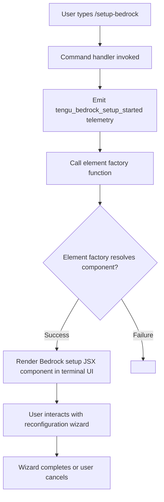

# `/setup-bedrock`

> Analysis basis: CC v2.1.143 bundle.js (AST extraction + Claude interpretation)
> Minimum version: v2.1.143

---

## Overview

The `/setup-bedrock` command launches an interactive reconfiguration wizard for Amazon Bedrock integration within the Claude Code CLI. It allows users to update authentication credentials, AWS region selection, and model pin assignments without restarting the CLI session. The command renders a JSX component inline, making it a local-jsx type slash command that operates within the active terminal UI.

---

## Registration

| Field | Value |
|---|---|
| type | `local-jsx` |
| name | `setup-bedrock` |
| description | `Reconfigure Amazon Bedrock authentication, region, or model pins` |
| module_id | `BJq` |
| loc_line | `6668` |

Analysis basis: CC v2.1.143 bundle.js:+11221744

---

## Input Branching

The command takes no structured arguments. Upon invocation it immediately fires telemetry and delegates control to a JSX rendering function. The depth-2 call graph reveals a two-step dispatch: a telemetry emission call followed by a React element creation call.



Analysis basis: CC v2.1.143 bundle.js:+11221021, +11221057

---

## Behavioral Spec

### Command Dispatch and Telemetry Emission

When the user invokes `/setup-bedrock`, the command handler (identified internally as the setup-bedrock handler function) executes the following logic:

```
function setupBedrockCommandHandler(context):
    emitTelemetry("tengu_bedrock_setup_started")
    element = createReactElement(bedrockSetupComponent, context.props)
    return element
```

Analysis basis: CC v2.1.143 bundle.js:+11221021, +11221023, +11221057

### JSX Component Rendering

The command is registered with type `local-jsx`, meaning it does not print plain text output but instead mounts a React component directly into the CLI's terminal rendering layer. The element factory call (`op.createElement`) is the standard React element constructor invoked with the resolved Bedrock setup component and any context props passed by the CLI shell.

```
function renderBedrockSetupComponent(props):
    component = resolveComponent("bedrockSetupWizard")
    return createElement(component, props)
```

Analysis basis: CC v2.1.143 bundle.js:+11221057

### Reconfiguration Scope

Based on the registration description, the wizard covers three reconfiguration domains:

```
enum ReconfigurationTarget:
    AUTHENTICATION   // AWS credentials or auth method
    REGION           // AWS region endpoint selection
    MODEL_PINS       // Pinned Bedrock model identifiers

function bedrockSetupWizard(currentConfig):
    target = promptUser(ReconfigurationTarget)
    if target == AUTHENTICATION:
        runAuthenticationReconfiguration(currentConfig)
    else if target == REGION:
        runRegionReconfiguration(currentConfig)
    else if target == MODEL_PINS:
        runModelPinReconfiguration(currentConfig)
    persistConfig(currentConfig)
    notifyUser("Bedrock configuration updated")
```

> Note: The internal branching logic of the wizard component itself was not reachable within the depth-2 call graph. The three domains above are derived directly from the registration description string.
> <!-- TODO: not found in depth-2 traversal; needs --depth 4 -->

---

## State & Side Effects

| Item | Detail |
|---|---|
| Telemetry | `tengu_bedrock_setup_started` emitted immediately on handler invocation (bundle.js:+11221023) |
| Hook registration | <!-- TODO: not found in depth-2 traversal; needs --depth 4 --> |
| appState changes | <!-- TODO: not found in depth-2 traversal; needs --depth 4 --> |
| Config persistence | Implied by wizard description (authentication, region, model pins); exact write path not found in depth-2 traversal |
| Sound | <!-- TODO: not found in depth-2 traversal; needs --depth 4 --> |
| Numeric constant `1` | A literal value of `1` appears in scope near the handler; its exact role (step index, boolean flag, retry count) is not determinable at traversal depth 2 (bundle.js:+56028) |

---

## Version History

| Version | Change |
|---|---|
| v2.1.143 | Initial analysis; command registered as `local-jsx` in module `BJq` at line 6668 |

---

## Common Mistakes

1. **Invoking `/setup-bedrock` expecting plain-text output** — Because the command type is `local-jsx`, it renders an interactive UI component rather than printing configuration details to stdout. Piping or scripting this command will not capture structured text.
2. **Assuming the command validates existing credentials before rendering** — Telemetry fires and the wizard mounts immediately; any credential validation likely occurs inside the wizard component itself, which is beyond the depth-2 call graph and therefore unverified.
3. **Confusing `/setup-bedrock` with a one-shot configuration setter** — The description uses the word "reconfigure", implying this command is intended for updating an already-established Bedrock integration, not for first-time provisioning (though first-time use behavior is <!-- TODO: not found in depth-2 traversal; needs --depth 4 -->).
4. **Expecting the command to accept inline arguments** — No argument parsing calls appear in the depth-2 call graph. The command appears to be argument-free and entirely wizard-driven.

---

## Appendix — Identifier Mapping

> For bundle debugging only. Identifiers change across versions.

| Identifier | Role |
|---|---|
| `oZ7` | Setup-bedrock command handler function; entry point invoked when `/setup-bedrock` is dispatched |
| `d` | Element factory or component resolver called by the handler to construct the Bedrock setup JSX element |