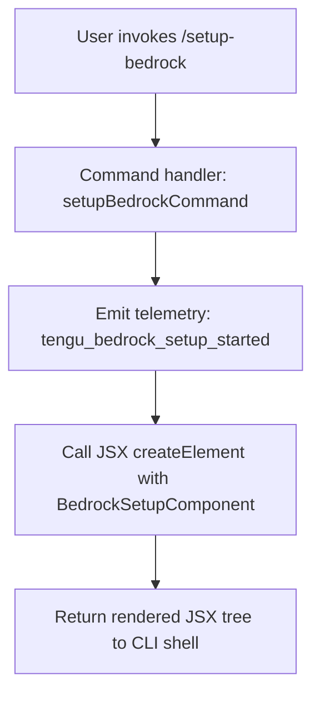

# `/setup-bedrock`

> Analysis basis: CC v2.1.143 bundle.js (AST extraction + Claude interpretation)
> Minimum version: v2.1.143

---

## Overview

The `/setup-bedrock` command launches an interactive reconfiguration flow for Amazon Bedrock integration within Claude Code. It allows users to update authentication credentials, AWS region selection, and model pin settings without restarting the CLI. The command renders a JSX-based UI component and emits a telemetry event at invocation time to track setup initiation.

---

## Registration

| Field | Value |
|---|---|
| type | `local-jsx` |
| name | `setup-bedrock` |
| description | `Reconfigure Amazon Bedrock authentication, region, or model pins` |
| module_id | `BJq` |
| loc_line | `6668` |

Analysis basis: CC v2.1.143 bundle.js:+11221744

---

## Input Branching

The depth-2 call graph for this command is narrow: the command handler calls a telemetry helper and then delegates entirely to a JSX component renderer. No multi-branch conditional logic was observed at this traversal depth.



> Note: Internal branching within the rendered JSX component (e.g., auth method selection, region picker, model pin configuration) operates below depth-2 and is not captured in the extracted call graph.
> <!-- TODO: not found in depth-2 traversal; needs --depth 4 -->

---

## Behavioral Spec

### Command Handler Invocation

When the user types `/setup-bedrock` in the CLI shell, the registered `local-jsx` handler is dispatched. The handler performs two sequential operations before yielding control to the React rendering layer.

```
function setupBedrockCommand(context):
    emitTelemetry("tengu_bedrock_setup_started")
    component = createElement(BedrockSetupComponent, context.props)
    return component
```

Analysis basis: CC v2.1.143 bundle.js:+11221021, +11221057

### Telemetry Emission

The telemetry event is fired unconditionally at the start of the handler, before any UI is rendered. This ensures setup attempts are tracked even if the user abandons the flow.

```
function emitSetupTelemetry():
    fire("tengu_bedrock_setup_started")
    // No conditional guard; fires on every invocation
```

Analysis basis: CC v2.1.143 bundle.js:+11221023

### JSX Component Rendering

The command type is `local-jsx`, meaning the return value of the handler is a React element tree that the CLI shell mounts into its terminal UI layer. The `createElement` call at the top of the handler constructs this tree.

```
function renderBedrockSetupUI(props):
    element = op.createElement(BedrockSetupComponent, props)
    return element
    // Shell is responsible for mounting and unmounting the component
```

Analysis basis: CC v2.1.143 bundle.js:+11221057

### Numeric Constant

A numeric literal with value `1` is present in the broader bundle context reachable from this command's module.

Numeric constant: `1` (bundle.js:+56028)

> Note: The precise role of this constant within the `/setup-bedrock` flow could not be determined at depth-2 traversal. It may relate to a step index, retry limit, or version flag within the Bedrock setup wizard.
> <!-- TODO: not found in depth-2 traversal; needs --depth 4 -->

---

## State & Side Effects

| Item | Detail |
|---|---|
| Telemetry | `tengu_bedrock_setup_started` — fired unconditionally on every invocation (bundle.js:+11221023) |
| Hook registration | <!-- TODO: not found in depth-2 traversal; needs --depth 4 --> |
| appState changes | <!-- TODO: not found in depth-2 traversal; needs --depth 4 --> |
| Sound | <!-- TODO: not found in depth-2 traversal; needs --depth 4 --> |
| Config persistence | Expected (region, auth, model pins) but not confirmed at depth-2 traversal <!-- TODO: needs --depth 4 --> |

---

## Version History

| Version | Change |
|---|---|
| v2.1.143 | Initial analysis — `local-jsx` command registered in module `BJq`; telemetry event `tengu_bedrock_setup_started` confirmed |

---

## Common Mistakes

1. **Running `/setup-bedrock` expecting a non-interactive output**: Because this command is of type `local-jsx`, it always renders an interactive terminal UI component. It does not accept inline arguments to silently update settings in a single command invocation.

2. **Assuming the telemetry event indicates completion**: The `tengu_bedrock_setup_started` event fires at the moment of invocation, not upon successful configuration. Abandoning the wizard mid-flow still results in the event being recorded.

3. **Expecting the command to validate existing credentials on its own**: The depth-2 call graph shows no validation call at the handler entry point. Credential validation, if any, is handled inside the rendered JSX component and is not part of the initial dispatch path.

4. **Confusing `/setup-bedrock` with a one-time setup path**: The description explicitly states "Reconfigure", meaning this command is intended for use both during initial setup and for subsequent changes to region, authentication, or model pin settings. It is safe to invoke on an already-configured environment.

---

## Appendix — Identifier Mapping

> For bundle debugging only. Identifiers change across versions.

| Identifier | Role |
|---|---|
| `oZ7` | Command handler function for `/setup-bedrock`; entry point that fires telemetry and calls createElement |
| `d` | Telemetry or utility helper called at the start of the command handler; receives the setup-started event |