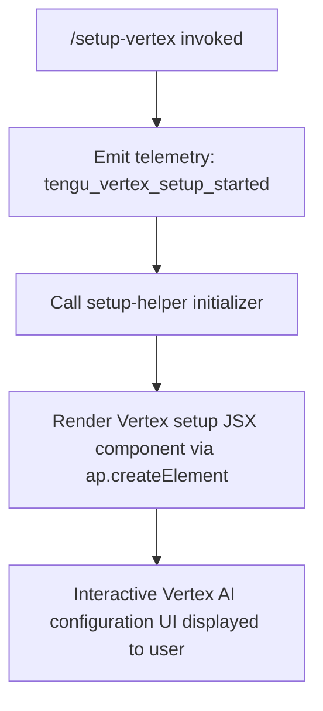

# `/setup-vertex`

> Analysis basis: CC v2.1.143 bundle.js (AST extraction + Claude interpretation)
> Minimum version: v2.1.143

---

## Overview

The `/setup-vertex` command launches an interactive reconfiguration flow for Google Vertex AI integration, allowing users to update authentication credentials, project identifiers, region selection, or model pins without restarting the Claude Code CLI session. The command is implemented as a local JSX component, meaning it renders an interactive UI element inline within the terminal rather than executing a purely imperative script. Upon invocation, it immediately emits a telemetry event to signal that the setup flow has been initiated, then delegates rendering to a dedicated setup component.

---

## Registration

| Field | Value |
|---|---|
| type | `local-jsx` |
| name | `setup-vertex` |
| description | `Reconfigure Google Vertex AI authentication, project, region, or model pins` |
| module_id | `cJq` |

Analysis basis: CC v2.1.143 bundle.js:+11222763

---

## Input Branching

The depth-2 call graph reveals a minimal branching structure: the command handler fires telemetry and then immediately delegates to a JSX rendering call. No argument-based branching was observed at this traversal depth.



Analysis basis: CC v2.1.143 bundle.js:+11222042, +11222044, +11222077

> **Note:** Internal branching within the rendered JSX component (e.g., auth-method selection, project/region input flows) was not captured at traversal depth ≤ 2.
> <!-- TODO: not found in depth-2 traversal; needs --depth 4 -->

---

## Behavioral Spec

### Command Entry and Telemetry Dispatch

When the user invokes `/setup-vertex`, the command handler function (see Appendix) runs synchronously before any UI is shown. Its first action is to dispatch the `tengu_vertex_setup_started` telemetry event. This event carries no user-supplied payload — it is a presence signal only, confirming that the setup flow was entered.

```
function vertexSetupCommandHandler(context):
    dispatchTelemetry("tengu_vertex_setup_started")
    setupHelperResult = invokeSetupHelper(context)
    return renderJSXComponent(setupHelperResult)
```

Analysis basis: CC v2.1.143 bundle.js:+11222042, +11222044

### JSX Component Rendering

After telemetry dispatch, the handler calls a setup-helper initializer (see Appendix — `d`) and passes its result to `ap.createElement`, which is the React/JSX element factory used throughout the CC bundle. The resulting element is returned to the CC shell, which mounts it into the terminal UI.

```
function renderVertexSetupUI(setupHelperResult):
    element = createElement(VertexSetupComponent, setupHelperResult)
    return element
```

Analysis basis: CC v2.1.143 bundle.js:+11222077

### Numeric Constant

A numeric literal with value `1` appears in the implementation context reachable from this command.

Analysis basis: CC v2.1.143 bundle.js:+56028

> Its precise role (e.g., step index, retry count, enum value) could not be determined at traversal depth ≤ 2.
> <!-- TODO: not found in depth-2 traversal; needs --depth 4 -->

---

## State & Side Effects

| Item | Detail |
|---|---|
| Telemetry | `tengu_vertex_setup_started` — emitted immediately on command invocation (bundle.js:+11222044) |
| Hook registration | <!-- TODO: not found in depth-2 traversal; needs --depth 4 --> |
| appState changes | <!-- TODO: not found in depth-2 traversal; needs --depth 4 --> |
| Persistent config writes | Expected (project ID, region, model pins, auth method) but not confirmed at depth ≤ 2 <!-- TODO: not found in depth-2 traversal; needs --depth 4 --> |
| Sound | <!-- TODO: not found in depth-2 traversal; needs --depth 4 --> |
| Environment variables affected | Expected (`ANTHROPIC_VERTEX_PROJECT_ID`, `CLOUD_ML_REGION`, or equivalent) but not confirmed at depth ≤ 2 <!-- TODO: not found in depth-2 traversal; needs --depth 4 --> |

---

## Version History

| Version | Change |
|---|---|
| v2.1.143 | Initial analysis — registration, telemetry event, and top-level call graph documented |

---

## Common Mistakes

1. **Assuming `/setup-vertex` applies to standard Anthropic API keys.** This command is specific to Google Vertex AI integration. Running it on a non-Vertex workspace will either show irrelevant options or fail silently depending on the current auth context.
2. **Expecting immediate model availability after reconfiguration.** The command reconfigures credentials and pins but does not validate them against live Google Cloud endpoints within the setup flow itself (confirmation pending deeper traversal).
3. **Confusing `/setup-vertex` with a one-time initialization command.** The description explicitly uses the word "Reconfigure," indicating it is safe and intended for repeated invocation to update existing Vertex settings.
4. **Overlooking that telemetry fires before any user interaction.** The `tengu_vertex_setup_started` event is emitted at the moment of invocation, not upon completion. Analytics consumers should not treat this event as a signal that setup was successfully completed.
5. **Expecting command-line arguments to control sub-flow.** No argument parsing was detected at traversal depth ≤ 2; the interactive UI component appears to handle all sub-selections internally.

---

## Appendix — Identifier Mapping

> For bundle debugging only. Identifiers change across versions.

| Identifier | Role |
|---|---|
| `sZ7` | Vertex setup command handler function — top-level entry point for `/setup-vertex` |
| `d` | Setup-helper initializer — called by the command handler before JSX rendering; likely prepares props or context for the setup component |