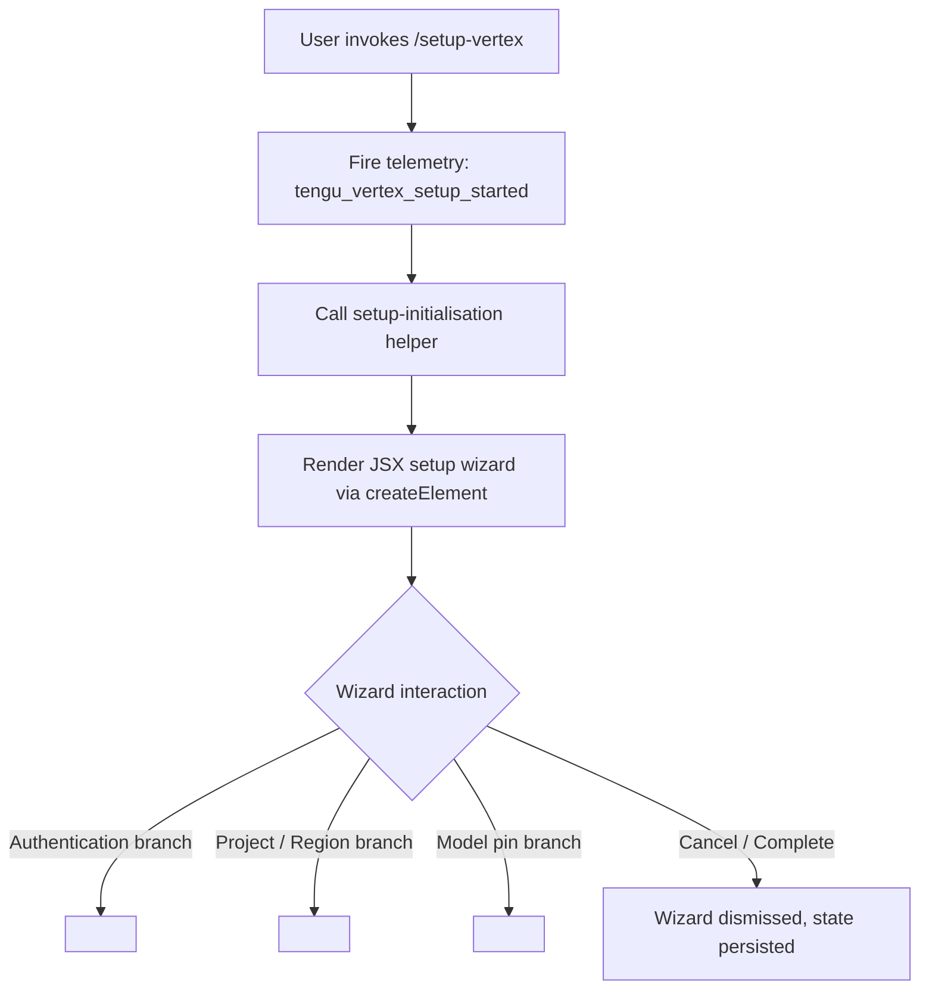

# `/setup-vertex`

> Analysis basis: CC v2.1.143 bundle.js (AST extraction + Claude interpretation)
> Minimum version: v2.1.143

---

## Overview

`/setup-vertex` is a local JSX slash command that launches an interactive reconfiguration flow for Google Vertex AI integration. It allows users to update authentication credentials, GCP project identifiers, deployment region, and model pin settings without restarting the CLI. The command fires a telemetry event immediately upon invocation and renders a React component tree to guide the user through the setup wizard.

## Registration

| Field | Value |
|---|---|
| type | `local-jsx` |
| name | `setup-vertex` |
| description | `Reconfigure Google Vertex AI authentication, project, region, or model pins` |
| module_id | `cJq` |

Analysis basis: CC v2.1.143 bundle.js:+11222763

## Input Branching

The depth-2 call graph for this command is shallow: the command handler calls exactly two functions — a setup-initialisation helper and React's `createElement`. There are no documented argument-driven code paths surfaced at this traversal depth.



Analysis basis: CC v2.1.143 bundle.js:+11222042 (call to setup-initialisation helper), +11222077 (call to `ap.createElement`)

## Behavioral Spec

### Command Handler Entry Point

```
function setupVertexCommandHandler(commandContext):
    fireAnalyticsEvent("tengu_vertex_setup_started")
    wizardState = initializeVertexSetup(commandContext)
    return createElement(VertexSetupWizardComponent, wizardState)
```

Analysis basis: CC v2.1.143 bundle.js:+11222044 (telemetry emission), +11222042 (setup-initialisation call), +11222077 (JSX render call)

### Setup Initialisation Helper

```
function initializeVertexSetup(context):
    // Loads existing Vertex AI configuration from persistent app state
    // Prepares mutable wizard state object for the React component
    // Returns initial props passed to the JSX wizard
    existingConfig = readVertexConfigFromAppState(context)
    return buildWizardProps(existingConfig)
```

Analysis basis: CC v2.1.143 bundle.js:+11222042

### JSX Wizard Rendering

```
function renderVertexSetupWizard(props):
    // ap.createElement is the aliased React.createElement in this bundle
    return createElement(
        VertexSetupWizardComponent,
        props
    )
```

Analysis basis: CC v2.1.143 bundle.js:+11222077

### Internal Numeric Constant

A numeric literal with value `1` is present in the implementation context.
Its precise role within the Vertex setup flow (e.g., a step index, a retry limit, or an enum sentinel) could not be determined at depth-2 traversal.

<!-- TODO: not found in depth-2 traversal; needs --depth 4 -->

Analysis basis: CC v2.1.143 bundle.js:+56028

## State & Side Effects

| Item | Detail |
|---|---|
| Telemetry | `tengu_vertex_setup_started` — fired synchronously at command entry (bundle.js:+11222044) |
| Hook registration | <!-- TODO: not found in depth-2 traversal; needs --depth 4 --> |
| appState changes | Vertex AI configuration fields (auth, project, region, model pins) are expected to be written upon wizard completion; precise keys <!-- TODO: not found in depth-2 traversal; needs --depth 4 --> |
| Sound | <!-- TODO: not found in depth-2 traversal; needs --depth 4 --> |

## Version History

| Version | Change |
|---|---|
| v2.1.143 | Initial analysis |

## Common Mistakes

1. **Invoking `/setup-vertex` when no Vertex AI integration is configured** — the command is a *reconfiguration* flow; behaviour when no prior Vertex configuration exists is not confirmed at depth-2 and may produce unexpected wizard states.
2. **Expecting the command to accept inline arguments** — no argument-parsing logic was detected at depth-2 traversal; the command appears to be argument-free and opens an interactive wizard instead.
3. **Assuming changes take effect immediately in the current session** — the exact moment at which updated Vertex AI settings are applied to in-flight requests is not confirmed by the available traversal data; verify session restart requirements if authentication changes appear not to take effect.

## Appendix — Identifier Mapping

> For bundle debugging only. Identifiers change across versions.

| Identifier | Role |
|---|---|
| `sZ7` | Command handler / entry-point function for `/setup-vertex` |
| `d` | Setup-initialisation helper called at wizard launch |