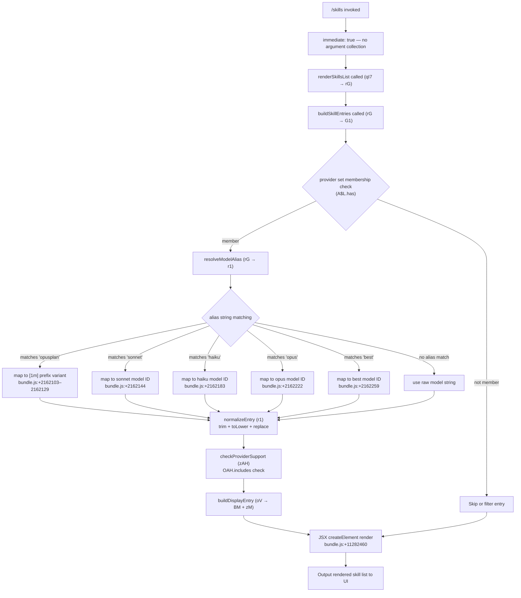

# `/skills`

> Analysis basis: CC v2.1.143 bundle.js (AST extraction + Claude interpretation)
> Minimum version: v2.1.143

---

## Overview

The `/skills` command lists all skills available to the current Claude Code session. It is implemented as a local JSX command that executes immediately upon invocation, rendering a structured skill list by querying registered skill entries and applying model-alias resolution and provider filtering logic before display.

---

## Registration

| Field | Value |
|---|---|
| type | `local-jsx` |
| name | `skills` |
| description | `List available skills` |
| immediate | `true` |
| module\_id | `sjq` |

Analysis basis: CC v2.1.143 bundle.js:+11282645

---

## Input Branching

Because `immediate: true` is set, the command fires without waiting for further user input. The implementation's branching logic (within the render function and its helpers) operates on the current runtime state rather than parsed user arguments.



Analysis basis: CC v2.1.143 bundle.js:+11282460, +11282534, +2160326, +2162082, +2162121

---

## Behavioral Spec

### Top-Level Render Function

```
function renderSkillsCommand(props):
    skillList = buildResolvedSkillList(props)
    return createElement(SkillListComponent, skillList)
```

Analysis basis: CC v2.1.143 bundle.js:+11282460

---

### Skill List Builder

```
function buildResolvedSkillList(props):
    rawEntries = buildSkillEntries(props)         // G1 path
    result = []
    for each entry in rawEntries:
        if providerSet.has(entry.provider):       // A$L.has
            resolved = resolveModelAlias(entry)
            result.append(resolved)
    return result
```

Analysis basis: CC v2.1.143 bundle.js:+2160270, +2160326

---

### Skill Entry Builder

```
function buildSkillEntries(context):
    baseEntries = loadBaseSkillRegistry(context)  // BU6 → R_ → Lu
    expanded = Object.entries(baseEntries)         // Object.entries
    processed = []
    for each [key, value] in expanded:
        normalized = applyModelMapping(key, value) // Cw
        if normalized includes expected pattern:   // H.includes
            withPrefix = applyInferenceProfile(normalized)  // WI8
            formatted  = formatDisplayString(withPrefix)    // PP
            processed.append(formatted)
    // numeric constant 4 used as slice/limit parameter
    return processed[:4]
```

The numeric literal `4` appears as a structural limit or slice parameter in the entry-building path.
Analysis basis: CC v2.1.143 bundle.js:+2160101, +2160124, +2160133, +2160184, +2160188, +2160254

---

### Model Alias Resolver

```
function resolveModelAlias(rawAlias):
    trimmed   = rawAlias.trim()
    lowered   = trimmed.toLowerCase()
    normalized = applySlugNormalization(lowered)  // nG → wAH → xH

    if normalized == "opusplan":
        return applyTokenBudgetPrefix(normalized)  // "[1m]" prefix variant
    if normalized == "sonnet":
        return resolveToSonnetModelId()
    if normalized == "haiku":
        return resolveToHaikuModelId()
    if normalized == "opus":
        return resolveToOpusModelId()
    if normalized == "best":
        return resolveToBestAvailableModelId()

    // fallback: check provider support
    supported = checkProviderSupport(normalized)  // zAH
    if not supported:
        return buildCompatibilityEntry(normalized) // oV

    return normalized
```

Known alias keywords and their bundle locations:
- `"opusplan"` → Analysis basis: CC v2.1.143 bundle.js:+2162103
- `"[1m]"` prefix string → Analysis basis: CC v2.1.143 bundle.js:+2162129
- `"sonnet"` → Analysis basis: CC v2.1.143 bundle.js:+2162144
- `"haiku"` → Analysis basis: CC v2.1.143 bundle.js:+2162183
- `"opus"` → Analysis basis: CC v2.1.143 bundle.js:+2162222
- `"best"` → Analysis basis: CC v2.1.143 bundle.js:+2162259

---

### Concrete Model ID Table

The following model ID strings are used in alias resolution and display. They are matched by the `applyModelMapping` (identifier `Cw`) function via `toLowerCase` and `includes` / `replace` operations.

| Alias Tier | Concrete Model ID String | Bundle Location |
|---|---|---|
| opus (latest) | `claude-opus-4-7` | bundle.js:+2159176 |
| opus | `claude-opus-4-6` | bundle.js:+2159233 |
| opus | `claude-opus-4-5` | bundle.js:+2159290 |
| opus | `claude-opus-4-1` | bundle.js:+2159347 |
| opus (base) | `claude-opus-4-0` | bundle.js:+2159436 |
| sonnet (latest) | `claude-sonnet-4-6` | bundle.js:+2159468 |
| sonnet | `claude-sonnet-4-5` | bundle.js:+2159529 |
| sonnet | `claude-sonnet-4-0` | bundle.js:+2159624 |
| haiku | `claude-haiku-4-5` | bundle.js:+2159658 |
| sonnet (legacy) | `claude-3-7-sonnet` | bundle.js:+2159717 |
| sonnet (legacy) | `claude-3-5-sonnet` | bundle.js:+2159778 |
| haiku (legacy) | `claude-3-5-haiku` | bundle.js:+2159839 |
| opus (legacy) | `claude-3-opus` | bundle.js:+2159898 |
| sonnet (legacy) | `claude-3-sonnet` | bundle.js:+2159951 |
| haiku (legacy) | `claude-3-haiku` | bundle.js:+2160008 |

Analysis basis: CC v2.1.143 bundle.js:+2159149 (`Cw` toLowerCase + includes + replace chain)

---

### Provider Support Check

```
function checkProviderSupport(modelId):
    // OAH is a list/set of supported provider tokens
    return OAH.includes(modelId)
```

Provider type constants found in the resolution path:
- `"firstParty"` → Analysis basis: CC v2.1.143 bundle.js:+2021195
- `"anthropicAws"` → Analysis basis: CC v2.1.143 bundle.js:+2021213
- `"gateway"` → Analysis basis: CC v2.1.143 bundle.js:+2021233

Analysis basis: CC v2.1.143 bundle.js:+2155411

---

### Application Inference Profile Handling

When a model ID string contains `"application-inference-profile"`, the entry-building path routes through a dedicated branch that applies additional mapping logic (`WI8`).

```
function applyInferenceProfile(modelId):
    if modelId.includes("application-inference-profile"):
        return mapInferenceProfileEntry(modelId)   // WI8
    return modelId
```

Analysis basis: CC v2.1.143 bundle.js:+2160144, +2160184

---

### String Normalization Helpers

```
function applySlugNormalization(str):
    // nG → wAH → xH → String coercion
    intermediate = slugifyTransform(str)        // wAH
    return String(intermediate)                 // xH → String

function formatDisplayString(str):
    // PP: H.replace chain
    return str.replace(matchPattern, replacement)

function checkBooleanFlag(value):
    // xH → String; "yes" and "on" are truthy sentinel values
    s = String(value).toLowerCase()
    return s == "yes" or s == "on"
```

Truthy sentinels `"yes"` and `"on"` appear in the boolean-coercion helper.
Analysis basis: CC v2.1.143 bundle.js:+26373, +26422, +26428

---

### Compatibility Entry Builder

```
function buildCompatibilityEntry(modelId):
    base = lookupBaseModelEntry(modelId)    // BM → DA
    extended = buildExtendedEntry(modelId)  // zM → KSH, N7L, pdA, UU6, DA
    return merge(base, extended)
```

Analysis basis: CC v2.1.143 bundle.js:+2158588, +2158600, +2022620, +2022645, +2022651, +2022655, +2022659

---

### Random Delay Helper (Depth-2 reachable via H)

```
function randomizedDelay(callback):
    // constants: 2, 1 used in random range calculation; setTimeout fires callback
    delay = Math.floor(Math.random() * 2) + 1
    setTimeout(callback, delay)
```

This helper is reachable at depth 2 from the main render path via identifier `H`. Its role in the `/skills` rendering pipeline is <!-- TODO: not found in depth-2 traversal; needs --depth 4 -->.
Analysis basis: CC v2.1.143 bundle.js:+12638154, +12638156, +12638170, +12638193

---

### File/Resource Close Helper (Depth-2 reachable via f)

```
function closeResources(handleA, handleQ):
    // constant 0 used as close argument
    handleA.close(0)
    handleQ.close(0)
    callFinalizer()   // L
```

Truncation limit of `40` characters appears in the `f → A.toLowerCase` path.
Analysis basis: CC v2.1.143 bundle.js:+14513626, +14513628, +14513638, +14513778, +14528099, +14528173

---

### Numeric Limit: Entry Count

Maximum number of skill entries rendered in a single `/skills` output: **4**
Analysis basis: CC v2.1.143 bundle.js:+2160254

---

### Numeric Limit: Provider Set Membership Threshold

Set membership check against `A$L` uses a threshold constant of **3** items (exact semantic role <!-- TODO: not found in depth-2 traversal; needs --depth 4 -->).
Analysis basis: CC v2.1.143 bundle.js:+2160339

---

## State & Side Effects

| Item | Detail |
|---|---|
| Telemetry | None — `telemetry` array is empty; no `tengu_*` events fired by `/skills` |
| Hook registration | `immediate: true` — command fires without a secondary input hook |
| appState changes | None observed within depth-2 traversal |
| Sound | None observed within depth-2 traversal |
| Provider set read | Reads from `A$L` (provider membership set) at runtime |
| Model registry read | Reads from base skill/model registry via `R_` → `Lu` |
| String coercion | Uses `String()` built-in for boolean sentinel and slug normalization paths |
| Resource handles | Close path (`f`) reachable at depth 2; full trigger condition <!-- TODO: not found in depth-2 traversal; needs --depth 4 --> |

---

## Version History

| Version | Change |
|---|---|
| v2.1.143 | Initial analysis |

---

## Common Mistakes

1. **Expecting argument parsing** — `/skills` is registered with `immediate: true`; it does not accept or parse any user-supplied arguments. Typing `/skills <anything>` does not filter the output at the command-dispatch level.
2. **Assuming all installed models appear** — the entry builder applies a hard limit of **4** entries (bundle.js:+2160254) and a provider membership filter via `A$L.has` (bundle.js:+2160326). Models not in the provider set are excluded from output.
3. **Treating alias keywords as case-sensitive** — alias resolution calls `.trim()` then `.toLowerCase()` before matching `"opusplan"`, `"sonnet"`, `"haiku"`, `"opus"`, and `"best"` (bundle.js:+2162007, +2162018).
4. **Assuming `"application-inference-profile"` models display identically** — these model IDs are routed through a separate mapping branch (`WI8`, bundle.js:+2160184) and may be displayed differently from standard model IDs.
5. **Expecting telemetry confirmation** — `/skills` emits zero telemetry events; monitoring pipelines that rely on `tengu_*` events will receive no signal from this command.

---

## Appendix — Identifier Mapping

> For bundle debugging only. Identifiers change across versions.

| Identifier | Role |
|---|---|
| `qI7` | Top-level skills command render function; entry point for `/skills` JSX output |
| `rG` | Resolved skill list coordinator; orchestrates entry building and alias resolution |
| `r1` | Model alias resolver; applies trim, toLower, slug normalization, and alias matching |
| `H` | Randomized delay helper; also participates in toLower/includes/replace string operations |
| `_` | String operation target (toLowerCase, replace); context-dependent string value |
| `nG` | Slug normalization entry point; delegates to `wAH` |
| `wAH` | Slug transform implementation; called by `nG`, delegates to `xH` |
| `A` | String mapping helper with toLower; participates in replace chain and resource close |
| `f` | Resource/file handle manager; performs close operations with constant `0` |
| `zAH` | Provider support checker; performs `OAH.includes` membership test |
| `oV` | Compatibility entry builder coordinator; calls `BM` and `zM` |
| `BM` | Base model entry lookup; delegates to `DA` |
| `zM` | Extended model entry builder; calls `KSH`, `N7L`, `pdA`, `UU6`, `DA` |
| `yxH` | Alternate extended entry path; delegates to `zM` |
| `rV` | Entry variant builder; calls both `BM` and `zM` |
| `UtA` | Upper-tier entry builder; delegates to `rV` |
| `YF6` | Inclusion filter; performs `q$L.includes` membership check |
| `SxH` | String coercion wrapper; delegates to `xH` |
| `xH` | Core string coercion primitive; wraps `String()` built-in |
| `G1` | Skill entry list builder; calls `BU6`, `Cw`, `WI8`, `PP` |
| `BU6` | Base skill registry loader; calls `R_` and `Object.entries` |
| `R_` | Registry source resolver; delegates to `Lu` |
| `Cw` | Model ID mapper; applies toLowerCase, includes, replace to match concrete model IDs |
| `WI8` | Inference profile mapper; handles `"application-inference-profile"` entries |
| `PP` | Display string formatter; applies `H.replace` for final output formatting |