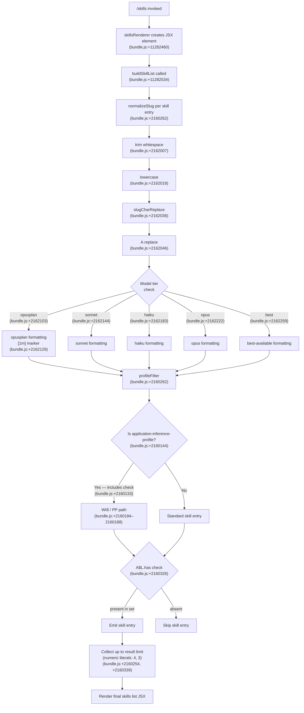

```
---
type: feature-spec
feature: "skills"
cc_version: "2.1.143"
updated: "2026-05-18"
tags: ["skills", "commands", "slash-commands"]
source: "bundle-analysis"
bundle_verified: true
analysis_basis: "CC v2.1.143 bundle.js (AST extraction + Claude interpretation)"
author: "ryujaeuk <ryujaeuk@gmail.com>"
repository: "https://github.com/MyLittleLuckyDog/cc-gnothi"
license: "AGPL-3.0-only"
---

# `/skills`

> Analysis basis: CC v2.1.143 bundle.js (AST extraction + Claude interpretation)
> Minimum version: v2.1.143

---

## Overview

The `/skills` command lists the skills (capabilities) available to the current Claude Code session. It executes immediately upon invocation without requiring additional user input, rendering a JSX component that enumerates discoverable skills filtered and formatted against the active model context.

---

## Registration

| Field | Value |
|---|---|
| type | `local-jsx` |
| name | `skills` |
| description | `List available skills` |
| immediate | `true` |
| module_id | `sjq` |

Analysis basis: CC v2.1.143 bundle.js:+11282645

---

## Input Branching

Because `immediate: true` is set, the command fires without a follow-up prompt. The rendering function (`skillsRenderer`) calls into the skill-list builder (`buildSkillList`), which in turn calls the slug-normalizer (`normalizeSlug`) and the profile-filter (`filterByProfile`).



---

## Behavioral Spec

### Skill List Rendering

```
function skillsRenderer(props):
    element = createElement(SkillListComponent, props)
    return element
```

Analysis basis: CC v2.1.143 bundle.js:+11282460, +11282534

---

### Slug Normalization

Each raw skill name passes through a multi-step normalization pipeline before being matched or displayed.

```
function normalizeSlug(rawName):
    s = rawName.trim()
    s = s.toLowerCase()
    s = slugCharReplace(s)          // remove/replace non-slug characters
    s = s.replace(pattern, replacement)
    tier = detectModelTier(s)
    s = applyTierFormatting(s, tier)
    s = s.replace(secondaryPattern, secondaryReplacement)
    return s
```

Analysis basis: CC v2.1.143 bundle.js:+2162007, +2162018, +2162036, +2162046, +2162349

---

### Model-Tier Detection

Skill entries carry a model-tier hint that governs display formatting. The recognized tier strings are matched in the following order:

```
function detectModelTier(slug):
    if slug contains "opusplan":   return TIER_OPUSPLAN   // bundle.js:+2162103
    if slug contains "sonnet":     return TIER_SONNET     // bundle.js:+2162144
    if slug contains "haiku":      return TIER_HAIKU      // bundle.js:+2162183
    if slug contains "opus":       return TIER_OPUS       // bundle.js:+2162222
    if slug contains "best":       return TIER_BEST       // bundle.js:+2162259
    return TIER_DEFAULT
```

The `opusplan` tier applies the bold marker `[1m]` to its display label.
Analysis basis: CC v2.1.143 bundle.js:+2162129

---

### Profile-Based Filtering

After slug normalization, each skill entry is passed through a profile filter that checks whether the active inference profile qualifies the entry for display.

```
function filterByProfile(skillEntry, activeProfileSet):
    profileId = skillEntry.profileId

    // Retrieve base profile metadata
    baseProfile = lookupBaseProfile(profileId)          // BU6: bundle.js:+2160101
    resolvedProfile = resolveProfile(baseProfile)       // Cw:  bundle.js:+2160124

    if resolvedProfile.type == "application-inference-profile":
        // bundle.js:+2160144
        if profileId.includes(requiredSubstring):       // bundle.js:+2160133
            qualified = applyWI8Filter(skillEntry)      // bundle.js:+2160184
            if not qualified:
                qualified = applyPPFilter(skillEntry)   // bundle.js:+2160188
        else:
            qualified = false
    else:
        qualified = true

    // Final membership check against known-skills set
    if activeProfileSet.has(skillEntry.key):            // bundle.js:+2160326
        return qualified
    else:
        return false
```

Analysis basis: CC v2.1.143 bundle.js:+2160101, +2160124, +2160133, +2160144, +2160184, +2160188, +2160326

---

### Result Limits

Two numeric constants govern how many skill entries are collected during list assembly:

- **Limit constant A**: `4` — Analysis basis: CC v2.1.143 bundle.js:+2160254
- **Limit constant B**: `3` — Analysis basis: CC v2.1.143 bundle.js:+2160339

The precise roles of these two limits (e.g., top-N display cap vs. column count) require deeper traversal.
<!-- TODO: not found in depth-2 traversal; needs --depth 4 -->

---

## State & Side Effects

| Item | Detail |
|---|---|
| Telemetry | None — no `tengu_*` events detected in the implementation at depth ≤ 2 |
| Hook registration | `immediate: true` — command executes without a secondary input prompt |
| appState changes | <!-- TODO: not found in depth-2 traversal; needs --depth 4 --> |
| Sound | <!-- TODO: not found in depth-2 traversal; needs --depth 4 --> |
| Render type | `local-jsx` — output is a JSX element rendered inline in the CLI UI, not plain text |

---

## Version History

| Version | Change |
|---|---|
| v2.1.143 | Initial analysis |

---

## Common Mistakes

1. **Assuming `/skills` accepts arguments**: The `immediate: true` flag means the command fires on entry; any trailing text typed after `/skills` is not processed as a filter argument by the command itself. Filtering happens internally based on the active model profile.
2. **Expecting telemetry events**: No telemetry events are emitted by this command. Integrations or tests that listen for `tengu_*` events after invoking `/skills` will receive none.
3. **Ignoring the `application-inference-profile` gate**: Skills tied to application inference profiles are subject to an additional `includes`-based check (bundle.js:+2160133). Skills that pass slug normalization may still be suppressed if the active profile does not satisfy this check.
4. **Overlooking model-tier ordering**: The `opusplan` check precedes the `opus` check (bundle.js:+2162103 vs. +2162222). A slug containing `opusplan` will never reach the `opus` branch; reversing the check order in derived tooling would misclassify such entries.
5. **Misreading the two numeric limits**: Constants `4` and `3` (bundle.js:+2160254, +2160339) are distinct limits applied at different points in list assembly. Treating them as interchangeable will produce incorrect result sets.

---

## Appendix — Identifier Mapping

> For bundle debugging only. Identifiers change across versions.

| Identifier | Role |
|---|---|
| `qI7` | `skillsRenderer` — top-level JSX render function for the `/skills` command |
| `rG` | `buildSkillList` — assembles the filtered, formatted list of skill entries |
| `r1` | `normalizeSlug` — multi-step slug normalization pipeline (trim → lowercase → replace → tier-format) |
| `G1` | `filterByProfile` — filters a skill entry against the active inference profile and known-skills set |
```