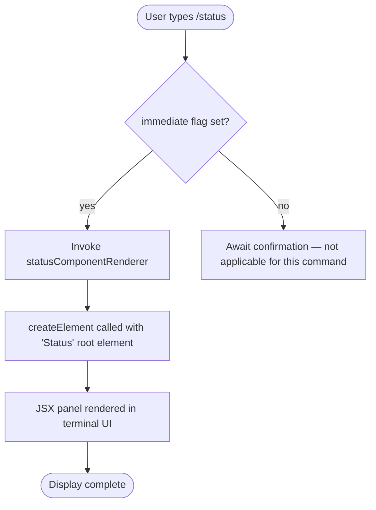

# `/status`

> Analysis basis: CC v2.1.143 bundle.js (AST extraction + Claude interpretation)
> Minimum version: v2.1.143

---

## Overview

The `/status` command is a local, immediately-executed slash command that renders a JSX panel displaying runtime information about the running Claude Code session. It aggregates and presents version, model, account, API connectivity, and tool availability into a single structured view. Because it is registered as `immediate: true`, the output is rendered inline in the terminal UI without requiring a separate confirmation step.

---

## Registration

| Field | Value |
|---|---|
| type | `local-jsx` |
| name | `status` |
| description | `Show Claude Code status including version, model, account, API connectivity, and tool statuses` |
| immediate | `true` |
| module_id | `_Pq` |

Analysis basis: CC v2.1.143 bundle.js:+11282994

---

## Input Branching

The `/status` command accepts no user-supplied arguments. Because `immediate: true` is set, the CLI dispatches the command handler as soon as the user submits `/status` — there is no argument-parsing or secondary prompt phase. The handler's single execution path is to construct and return a JSX element.



Analysis basis: CC v2.1.143 bundle.js:+11282994 (registration), +11282853 (createElement call edge), +11282907 (string literal "Status")

---

## Behavioral Spec

### Status Panel Renderer

The command implementation follows a single render path: when invoked, the status component renderer function is called with no arguments. It calls the React-compatible `createElement` API to construct a component tree rooted at a container element identified internally as `"Status"`. The resulting element tree is returned to the CLI's render pipeline for display.

```
function statusComponentRenderer():
    rootElement = createElement(StatusPanelComponent, props={})
    return rootElement
```

The `StatusPanelComponent` is responsible for assembling the displayed sections. Based on the registration description, these sections cover:

- **Version** — the running CC version string
- **Model** — the currently configured LLM model identifier
- **Account** — the authenticated account or API key identity
- **API connectivity** — reachability / latency state of the Anthropic API endpoint
- **Tool statuses** — availability of each registered tool (e.g., enabled, disabled, or errored)

Analysis basis: CC v2.1.143 bundle.js:+11282853 (createElement call), +11282907 (literal "Status")

> <!-- TODO: Internal sub-component structure of StatusPanelComponent (section-level field rendering, connectivity probe logic, tool enumeration) not found in depth-2 traversal; needs --depth 4 -->

---

## State & Side Effects

| Item | Detail |
|---|---|
| Telemetry | None — no `tengu_*` events emitted by this command at the analyzed traversal depth |
| Hook registration | None detected at depth ≤ 2 |
| appState changes | None detected at depth ≤ 2; command is read-only display |
| Sound | None detected |
| Network I/O | <!-- TODO: not found in depth-2 traversal; needs --depth 4 --> |
| File I/O | <!-- TODO: not found in depth-2 traversal; needs --depth 4 --> |

Analysis basis: CC v2.1.143 bundle.js:+11282994 (telemetry array empty in extracted data)

---

## Version History

| Version | Change |
|---|---|
| v2.1.143 | Initial analysis — `local-jsx`, `immediate: true`, single createElement render path confirmed |

---

## Common Mistakes

1. **Expecting argument support** — `/status` takes no arguments. Passing any text after `/status` has no defined effect at the analyzed traversal depth; the command does not parse or act on trailing input.
2. **Assuming telemetry is emitted** — No `tengu_*` telemetry events are fired by this command as of v2.1.143. Do not write tests or integrations that expect a telemetry event to confirm invocation.
3. **Treating output as machine-parseable** — The command renders a JSX component (`local-jsx` type) intended for terminal display. It does not emit structured JSON or a stable plain-text format that downstream scripts should depend on.
4. **Confusing `immediate` behavior** — Because `immediate: true` is set, the command fires on submission with no intermediate confirmation dialog. Tooling that intercepts confirmation prompts will not see one for `/status`.

---

## Appendix — Identifier Mapping

> For bundle debugging only. Identifiers change across versions.

| Identifier | Role |
|---|---|
| `LI7` | Status component renderer — the top-level command handler function that calls `createElement` to produce the status JSX panel |