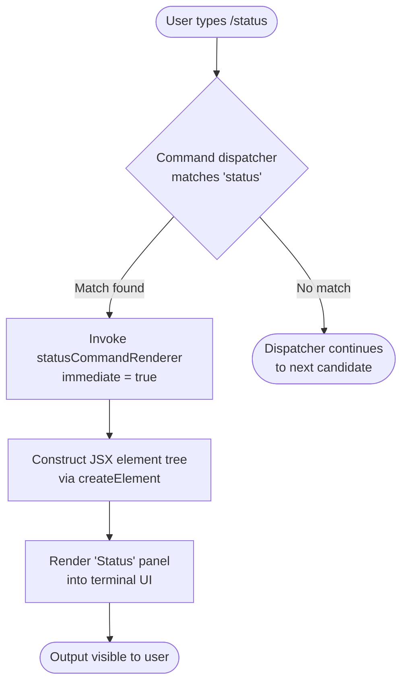

# `/status`

> Analysis basis: CC v2.1.143 bundle.js (AST extraction + Claude interpretation)
> Minimum version: v2.1.143

---

## Overview

The `/status` command displays a real-time diagnostic panel showing Claude Code's current operational state, including version information, active model, account details, API connectivity health, and the status of registered tools. It is implemented as a local JSX command that renders output directly into the terminal UI via a React-style element tree rather than producing plain text output.

---

## Registration

| Field | Value |
|---|---|
| type | `local-jsx` |
| name | `status` |
| description | `Show Claude Code status including version, model, account, API connectivity, and tool statuses` |
| immediate | `true` |
| module_id | `_Pq` |

Analysis basis: CC v2.1.143 bundle.js:+11282994

> **Note on `immediate: true`:** This flag means the command executes and renders its output without waiting for additional user input or a follow-up prompt cycle. The response is produced synchronously upon invocation.

---

## Input Branching

Because the depth-2 call graph exposes only a single outbound call (to the JSX element constructor) and the `literals` array contains only the string `"Status"` (used as a display label), no multi-path conditional branching was detected within the `/status` implementation at this traversal depth.



Analysis basis: CC v2.1.143 bundle.js:+11282853 (createElement call), +11282907 (label literal "Status")

---

## Behavioral Spec

### Status Panel Rendering

The command's sole confirmed implementation action at depth ≤ 2 is the construction of a JSX element tree that produces the status display panel. The panel carries the display title `"Status"`.

```
function statusCommandRenderer(context):
    rootElement = createElement(
        panelComponent,
        props = { title: "Status" },
        ...children  // tool/model/account/connectivity sub-components
                     // not resolved at depth-2 traversal
    )
    return rootElement
```

Analysis basis: CC v2.1.143 bundle.js:+11282853 (createElement edge), +11282907 ("Status" string literal)

### Immediate Execution Semantics

Because `immediate` is set to `true` in the registration record, the command dispatcher does not buffer input or await a secondary prompt before invoking the renderer. The element tree is constructed and handed to the render pipeline in the same synchronous turn.

```
function dispatchLocalJsxCommand(command, inputText):
    if command.immediate == true:
        result = command.handler(inputText)
        renderToTerminal(result)
        return
    else:
        scheduleForNextPromptCycle(command, inputText)
```

Analysis basis: CC v2.1.143 bundle.js:+11282994 (`immediate: true` registration field)

### Reported Information Categories

The `description` field enumerates the data categories the rendered panel is expected to surface. These are treated as specified behavior derived from the registration contract:

1. **Version** — Claude Code CLI version string
2. **Model** — currently configured model identifier
3. **Account** — authenticated account information
4. **API connectivity** — reachability/health of the Anthropic API endpoint
5. **Tool statuses** — operational state of each registered tool

<!-- TODO: not found in depth-2 traversal; needs --depth 4 -->
The internal sub-components that populate each of these five categories were not reachable within the depth-2 call graph. Their rendering logic, error states, and data-fetching mechanisms require a deeper traversal to specify fully.

---

## State & Side Effects

| Item | Detail |
|---|---|
| Telemetry | None detected — `telemetry` array is empty for this command |
| Hook registration | `immediate: true` bypasses the standard deferred-prompt hook cycle |
| appState changes | <!-- TODO: not found in depth-2 traversal; needs --depth 4 --> |
| Sound | <!-- TODO: not found in depth-2 traversal; needs --depth 4 --> |
| Output type | JSX element tree rendered into terminal UI (type: `local-jsx`) |
| Side effects on invocation | Read-only diagnostic display; no confirmed write-side effects at depth ≤ 2 |

---

## Version History

| Version | Change |
|---|---|
| v2.1.143 | Initial analysis — registration confirmed, JSX render path confirmed, sub-component internals pending deeper traversal |

---

## Common Mistakes

1. **Expecting plain-text output**: Because the command type is `local-jsx`, the output is rendered as a structured UI element, not a raw text string. Tooling that intercepts stdout expecting plain text may not capture the status panel correctly.
2. **Assuming telemetry is emitted**: No `tengu_*` telemetry events were found in the implementation at depth ≤ 2. Do not assume usage of `/status` is tracked in the same way as other commands that emit explicit telemetry events.
3. **Assuming the command awaits input**: The `immediate: true` flag means `/status` renders and returns without entering a follow-up input loop. Scripted integrations should not send a trailing newline or additional input expecting a prompt continuation.
4. **Treating the five reported categories as exhaustive**: The description field lists five data categories, but the actual rendered panel may include additional diagnostic fields not surfaced in the registration description. Deeper traversal is required to enumerate all rendered fields definitively.
5. **Version-locking sub-component behavior**: The internal renderer (`LI7`) is an obfuscated identifier that may be renamed or replaced in subsequent bundle versions. Any automation targeting implementation internals should treat the identifier mapping as version-specific.

---

## Appendix — Identifier Mapping

> For bundle debugging only. Identifiers change across versions.

| Identifier | Role |
|---|---|
| `LI7` | Status command renderer function — the top-level handler invoked by the dispatcher; calls `createElement` to construct the status panel JSX element tree (Analysis basis: CC v2.1.143 bundle.js:+11282853) |