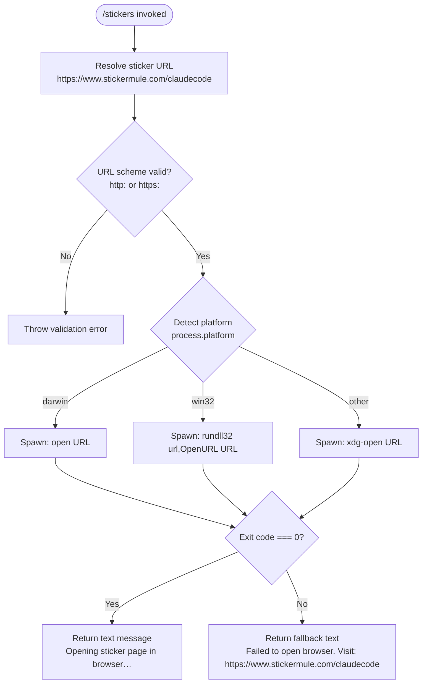

# `/stickers`

> Analysis basis: CC v2.1.143 bundle.js (AST extraction + Claude interpretation)
> Minimum version: v2.1.143

---

## Overview

The `/stickers` command opens the official Claude Code sticker order page (`https://www.stickermule.com/claudecode`) in the user's default system browser. It is a local, interactive-only command with no arguments and no telemetry. If the browser cannot be launched, it falls back to printing the URL in the terminal so the user can navigate there manually.

---

## Registration

| Field | Value |
|---|---|
| type | `local` |
| name | `stickers` |
| description | `Order Claude Code stickers` |
| supportsNonInteractive | `false` |
| module\_id | `LTq` |

Analysis basis: CC v2.1.143 bundle.js:+11622177

---

## Input Branching

The command accepts no user-supplied arguments. All branching is internal to the browser-launch logic.



Analysis basis: CC v2.1.143 bundle.js:+11621910, +7543066, +7543375, +7543623

---

## Behavioral Spec

### Command Entry Point

```
function stickersCommandHandler():
    url = "https://www.stickermule.com/claudecode"
    result = openUrlInBrowser(url)
    if result.success:
        yield textMessage("Opening sticker page in browser…")
    else:
        yield textMessage(
            "Failed to open browser. Visit: https://www.stickermule.com/claudecode"
        )
```

Analysis basis: CC v2.1.143 bundle.js:+11621910, +11621913, +11621967, +11621980, +11622051

---

### URL Validation

Before attempting to open, the browser-open utility validates that the URL scheme is either `http:` or `https:`. Any other scheme causes an `Error` to be thrown and the launch is aborted.

```
function validateUrl(url):
    scheme = extractScheme(url)           // characters up to and including ":"
    if scheme not in ["http:", "https:"]:
        throw Error("Invalid URL scheme")
```

Analysis basis: CC v2.1.143 bundle.js:+7543066, +7543088, +7543016

---

### Platform-Aware Browser Launch

After validation the utility inspects `process.platform` and selects the appropriate OS-level command to request a URL open. The child process exit code is checked; a code of `0` indicates success, any other value is treated as failure.

```
function openUrlInBrowser(url):
    validateUrl(url)

    platform = getPlatform()              // process.platform

    if platform == "darwin":
        command = "open"
        args    = [url]
    else if platform == "win32":
        command = "rundll32"
        args    = ["url,OpenURL", url]
    else:                                 // Linux / BSD / other POSIX
        command = "xdg-open"
        args    = [url]

    exitCode = spawnAndWait(command, args)

    return exitCode == 0
```

Analysis basis: CC v2.1.143 bundle.js:+7543375, +7543391, +7543475, +7543487, +7543549, +7543556, +7543623, +7543341

---

### Async Spawn Helper

The spawn wrapper used internally enforces a concurrency limit of **10** simultaneous child processes.

```
function spawnAndWait(command, args):
    acquireConcurrencySlot(limit=10)      // semaphore, max=10
    try:
        proc = spawnProcess(command, args)
        exitCode = waitForExit(proc)
        return exitCode
    finally:
        releaseConcurrencySlot()
```

Maximum concurrent spawned processes: **10** (Analysis basis: CC v2.1.143 bundle.js:+1038172)

Analysis basis: CC v2.1.143 bundle.js:+1038227, +1038338

---

## State & Side Effects

| Item | Detail |
|---|---|
| Telemetry | None — `telemetry` array is empty; no `tengu_*` events are emitted |
| Hook registration | None identified within depth-2 traversal |
| appState changes | None identified within depth-2 traversal |
| Sound | None identified within depth-2 traversal |
| Network | No direct network calls; the OS browser handles the HTTP request after the URL is handed off |
| Child process | One short-lived OS subprocess is spawned (`open` / `rundll32` / `xdg-open`) per invocation |
| Return type | Yields a single `text`-typed message (Analysis basis: CC v2.1.143 bundle.js:+11621967) |
| Interactive-only | `supportsNonInteractive: false` — the command must not be called in non-interactive/pipe mode (Analysis basis: CC v2.1.143 bundle.js:+11622177) |

---

## Version History

| Version | Change |
|---|---|
| v2.1.143 | Initial analysis |

---

## Common Mistakes

1. **Running in non-interactive mode** — because `supportsNonInteractive` is `false`, invoking `/stickers` inside a script or piped session will be rejected before the handler runs. Use an interactive terminal session.
2. **Expecting the browser to open in headless/SSH environments** — on remote servers without a display server or default browser configured, `xdg-open` (or equivalent) will return a non-zero exit code. The command will fall back to printing the URL; copy it manually into a local browser.
3. **Assuming telemetry is emitted** — no analytics events are fired by this command. Do not rely on telemetry presence to confirm the command executed successfully.
4. **Passing arguments** — the command registration accepts no parameters. Any text typed after `/stickers` is silently ignored or rejected by the CLI argument parser before reaching the handler.
5. **Invoking programmatically via the SDK in non-interactive mode** — since `supportsNonInteractive` is `false`, automated SDK callers should not include this command in scripted workflows.

---

## Appendix — Identifier Mapping

> For bundle debugging only. Identifiers change across versions.

| Identifier | Role |
|---|---|
| `Oy7` | Stickers command handler / entry-point function |
| `qK` | Browser-open orchestrator (validates URL, detects platform, spawns process) |
| `ex4` | URL scheme validator (throws `Error` on non-http/https schemes) |
| `hJ` | Platform detector / process-spawn dispatcher |
| `Y8` | Async child-process spawn helper with concurrency semaphore |