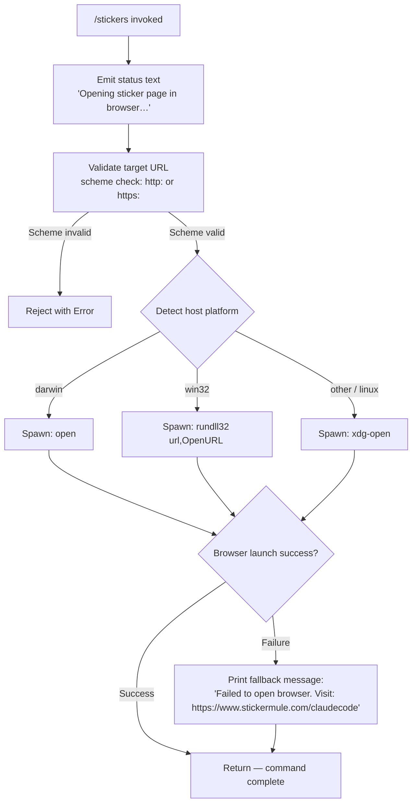

# `/stickers`

> Analysis basis: CC v2.1.143 bundle.js (AST extraction + Claude interpretation)
> Minimum version: v2.1.143

---

## Overview

The `/stickers` command opens the Claude Code sticker ordering page (`https://www.stickermule.com/claudecode`) in the user's default system browser. It is a local, interactive-only command that resolves the correct browser-launch mechanism per host operating system and falls back gracefully with a printed URL if the browser cannot be opened.

---

## Registration

| Field | Value |
|---|---|
| type | `local` |
| name | `stickers` |
| description | `Order Claude Code stickers` |
| supportsNonInteractive | `false` |
| module_id | `LTq` |

Analysis basis: CC v2.1.143 bundle.js:+11622177

---

## Input Branching

The command accepts no user-supplied arguments. All branching occurs internally during the browser-launch phase.



Analysis basis: CC v2.1.143 bundle.js:+11621910, +7543066, +7543375, +7543391, +7543475, +7543549, +7543556, +11621980, +11622051

---

## Behavioral Spec

### Command Entry Point

The top-level command handler (`commandHandler`) calls the URL-opener utility immediately with the fixed sticker URL. No argument parsing is performed.

```
function commandHandler(args, context):
    statusMessage = "Opening sticker page in browser…"
    emit(statusMessage, kind="text")

    targetURL = "https://www.stickermule.com/claudecode"
    result = openURLInBrowser(targetURL)

    if result is failure:
        emit("Failed to open browser. Visit: " + targetURL, kind="text")

    return
```

Analysis basis: CC v2.1.143 bundle.js:+11621910, +11621967, +11621980, +11622051

---

### URL Validation

Before any process is spawned, the URL-opener utility validates that the URL scheme is either `http:` or `https:`. Any other scheme causes an immediate rejection via a thrown `Error`.

```
function validateURLScheme(url):
    parsed = parseURL(url)
    if parsed.protocol not in ["http:", "https:"]:
        throw new Error("URL scheme not permitted: " + parsed.protocol)
    return parsed
```

Analysis basis: CC v2.1.143 bundle.js:+7543016, +7543066, +7543088

---

### Platform-Aware Browser Launcher

After validation, the launcher selects the appropriate OS-native command to open the URL.

```
function openURLInBrowser(url):
    validateURLScheme(url)               // throws on invalid scheme

    platform = getCurrentPlatform()      // e.g. process.platform

    if platform == "darwin":
        command = "open"
        args    = [url]
    else if platform == "win32":
        command = "rundll32"
        args    = ["url,OpenURL", url]
    else:
        command = "xdg-open"
        args    = [url]

    exitCode = spawnAndWait(command, args)

    if exitCode != 0:
        return failure
    return success
```

Analysis basis: CC v2.1.143 bundle.js:+7543303, +7543316, +7543341, +7543375, +7543391, +7543424, +7543475, +7543487, +7543549, +7543556

---

### Async Shell Execution Wrapper

The spawned child process is managed by a general-purpose async shell executor. Exit code `0` (Analysis basis: CC v2.1.143 bundle.js:+7543341) is treated as success; any non-zero exit triggers the fallback message path.

```
async function spawnAndWait(command, args):
    process = spawn(command, args)
    exitCode = await processExitPromise(process)
    return exitCode
```

Analysis basis: CC v2.1.143 bundle.js:+7543303, +7543316

---

### Async Context / Store Lookup

The implementation accesses an async-local store to retrieve the current execution context before performing the URL open. If the store lookup fails, a default context is derived.

```
function getExecutionContext():
    store = asyncLocalStorage.getStore()   // ph6.getStore
    if store is null or undefined:
        return buildDefaultContext()       // Fd
    return store
```

Analysis basis: CC v2.1.143 bundle.js:+965046, +965067, +965097

---

### Background Spare Process Lifecycle (Shared Infrastructure)

The call graph reaches background spare-process management infrastructure (shared across many commands, not sticker-specific). Two telemetry events are emitted by this layer.

```
function manageBackgroundSpare(event):
    if event == "enable":
        emit telemetry("tengu_bg_spare_enable")
        // check free memory, decide whether to pre-warm a spare process
        freeMemory = os.freemem()
        if freeMemory > THRESHOLD:
            scheduleSpareSpawn(delayMs=2000)
    if event == "spawn":
        emit telemetry("tengu_bg_spare_spawn")
        // actually fork the spare worker
```

Numeric constants observed in this layer:
- Retry/concurrency limit: `10` (Analysis basis: CC v2.1.143 bundle.js:+1038172)
- Memory threshold: `1,000,000` bytes (Analysis basis: CC v2.1.143 bundle.js:+1038694)
- Spare process count increment: `1` (Analysis basis: CC v2.1.143 bundle.js:+1034173)
- Spawn delay: `2000` ms (Analysis basis: CC v2.1.143 bundle.js:+14502927)

Analysis basis: CC v2.1.143 bundle.js:+14502631, +14502714, +14502927, +14502994

---

### Error Logging

A shared error-logging helper is invoked if the child process emits an error event. The string literal `"error"` is used as the event name discriminator.

```
function handleProcessError(err):
    errorLogger.logError(err)   // Wc.logError
    pushToErrorHistory(err)     // xRH.push
```

Analysis basis: CC v2.1.143 bundle.js:+960530, +960555, +960515

---

## State & Side Effects

| Item | Detail |
|---|---|
| Telemetry | `tengu_bg_spare_enable` (bundle.js:+14502634), `tengu_bg_spare_spawn` (bundle.js:+14502994) — emitted by shared background-process infrastructure, not sticker-specific logic |
| Hook registration | <!-- TODO: not found in depth-2 traversal; needs --depth 4 --> |
| appState changes | None detected at depth ≤ 2 |
| Sound | None detected at depth ≤ 2 |
| Browser process | Spawns a detached OS-native open utility (`open` / `rundll32` / `xdg-open`) as a child process |
| Stdout / UI output | Emits one `text`-typed message on initiation; emits a second `text`-typed fallback message only on browser-launch failure |
| Network | No direct network calls; the browser handles the HTTP request to `https://www.stickermule.com/claudecode` |
| Non-interactive support | Explicitly `false` — command must not be called in non-interactive / piped mode |

---

## Version History

| Version | Change |
|---|---|
| v2.1.143 | Initial analysis |

---

## Common Mistakes

1. **Running in non-interactive mode** — `/stickers` sets `supportsNonInteractive: false`. Invoking it via `--print` or in a CI pipeline will be rejected before the handler is reached.
2. **Expecting argument parsing** — The command ignores all arguments. Any text typed after `/stickers` is silently discarded; the URL is always the fixed value `https://www.stickermule.com/claudecode`.
3. **Assuming browser availability in headless environments** — On Linux servers without a desktop environment, `xdg-open` will fail with a non-zero exit code and the fallback message will be printed instead of opening a browser.
4. **Mistaking telemetry events as sticker-specific** — The `tengu_bg_spare_enable` and `tengu_bg_spare_spawn` events are emitted by shared infrastructure and do not indicate sticker-related analytics.
5. **Assuming the command blocks until the page loads** — The implementation only waits for the child process (`open` / `rundll32` / `xdg-open`) to exit, not for the browser page to finish loading.

---

## Appendix — Identifier Mapping

> For bundle debugging only. Identifiers change across versions.

| Identifier | Role |
|---|---|
| `Oy7` | Top-level stickers command handler / entry point |
| `qK` | URL-opener utility (validates scheme, selects platform command, spawns process) |
| `ex4` | URL scheme validator (throws `Error` on non-http/https schemes) |
| `hJ` | Child-process spawn helper |
| `Y8` | Async execution wrapper / context initializer |
| `$_` | Background spare-process orchestrator (shared infrastructure) |
| `KXH` | Core background process lifecycle manager |
| `D` | Spare process spawn scheduler (includes 2000 ms delay, memory check) |
| `_SK` | String coercion / argument normalizer |
| `NH` | Error event router / error logging dispatcher |
| `S6` | Async-local store accessor wrapper |
| `Uh6` | Async-local store reader (calls `ph6.getStore`, falls back via `Fd`) |
| `__` | Default context builder (calls `GV`) |