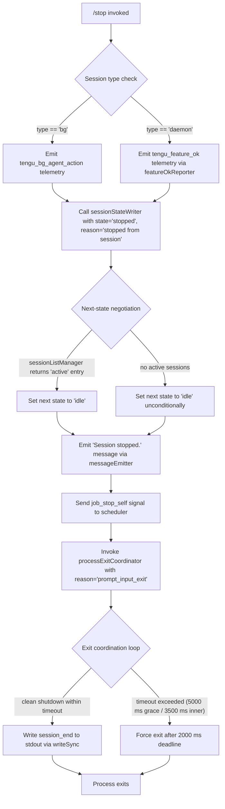

```
---
type: feature-spec
feature: "stop"
cc_version: "2.1.143"
updated: "2026-05-18"
tags: ["stop", "commands", "slash-commands"]
source: "bundle-analysis"
bundle_verified: true
analysis_basis: "CC v2.1.143 bundle.js (AST extraction + Claude interpretation)"
author: "ryujaeuk <ryujaeuk@gmail.com>"
repository: "https://github.com/MyLittleLuckyDog/cc-gnothi"
license: "AGPL-3.0-only"
---

# `/stop`

> Analysis basis: CC v2.1.143 bundle.js (AST extraction + Claude interpretation)
> Minimum version: v2.1.143

---

## Overview

The `/stop` command terminates the current background (`bg`) session, transitioning it to the `stopped` state while preserving both the session transcript and any associated worktree on disk. It executes immediately upon invocation (no confirmation prompt) and emits telemetry before handing off to the process-exit pathway.

---

## Registration

| Field | Value |
|---|---|
| type | `local-jsx` |
| name | `stop` |
| description | `Stop this background session; transcript and worktree are kept` |
| immediate | `true` |
| module\_id | `tNq` |

Analysis basis: CC v2.1.143 bundle.js:+12024236

---

## Input Branching

Because `immediate: true` is set, the command bypasses the normal argument-parsing pipeline and executes synchronously as soon as the user submits `/stop`. The branching that occurs inside the handler covers session-type detection, state transition, confirmation message emission, and process termination.



Analysis basis: CC v2.1.143 bundle.js:+12023955, +12023965, +12023547, +12023593, +12023737, +12023768, +12023790

---

## Behavioral Spec

### Top-Level Stop Handler

```
function stopCommandHandler(sessionContext):
    // Randomised jitter for telemetry deduplication (values 1–2)
    jitter = Math.floor(Math.random() * 2) + 1          // literals: 2 @ +12638154, 1 @ +12638170
    scheduleWithJitter(setTimeout, jitter)

    sessionStateTransition(sessionContext)               // core work
```

Analysis basis: CC v2.1.143 bundle.js:+12023955, +12023965, +12638154, +12638156, +12638193

---

### Session State Transition

```
function sessionStateTransition(ctx):
    // 1. Record the stop action in telemetry
    emitTelemetry("tengu_bg_agent_action", {action: "stop"})   // +12023374

    // 2. Resolve session type tag
    tag = resolveSessionType(ctx)           // returns "bg" or "daemon"  (+2169367, +2169426)

    // 3. Persist state change
    sessionStateWriter(ctx, state="stopped", reason="stopped from session")
                                            // +12023547, +12023564

    // 4. Load ordered session list to determine next focus
    orderedSessions = loadOrderedSessionList(
        sortKey="order",                    // +4022763
        secondaryKey="stateOrder"           // +4022784
    )

    // 5. Scan for another active session
    nextSession = null
    for each entry in orderedSessions:
        if stateManager.getState(entry) == "active":   // +4029481
            nextSession = entry
            break

    // 6. Collapse current session to idle regardless of nextSession result
    setLocalState(ctx, "idle")             // +12023593

    // 7. Emit confirmation message to UI
    emitMessage("Session stopped.")        // +12023737

    // 8. Dispatch self-stop job to scheduler
    dispatchJobSignal("job_stop_self")     // +12023768

    // 9. Invoke feature-ok reporter (daemon path records success metric)
    featureOkReporter()                    // tengu_feature_ok @ +955068

    // 10. Hand off to process-exit coordinator
    processExitCoordinator(reason="prompt_input_exit")   // +12023790
```

Analysis basis: CC v2.1.143 bundle.js:+12023372, +12023406, +12023435, +12023448, +12023457, +12023505, +12023518, +12023530, +12023706, +12023733, +12023765, +12023785

---

### Session List Manager (depth-2 detail)

```
function loadOrderedSessionList(sortKey, secondaryKey):
    // Stat all known session paths in parallel
    paths = sessionPathRegistry.join(...)       // SP.join @ +4022506
    stats = await Promise.all(
        paths.map(p => filesystem.stat(p))      // yP.stat @ +4022834
    )

    // Sort by sortKey; fall back to secondaryKey
    sorted = stats.sort((a, b) =>
        compareField(a, b, sortKey) || compareField(a, b, secondaryKey)
    )

    // Evict stale cache entry (warn on miss)
    sessionCache.delete(staleKey)               // f3H.delete @ +4023116
    cached = sessionCache.get(activeKey)        // f3H.get  @ +4023141

    if cached is null:
        log("warn", "cache miss on session list")   // "warn" @ +4023100

    // Read transcript file as UTF-8
    raw = filesystem.readFile(path, encoding="utf-8")   // yP.readFile @ +4023220, "utf-8" @ +4023234

    // Parse and validate numeric fields
    parsed = Number(raw)                        // Number @ +4023541
    if not Number.isFinite(parsed):             // +4023598
        parsed = 0                              // +4022901

    // Store result; evict full cache after 1000 ms TTL
    sessionCache.set(key, parsed)              // f3H.set @ +4023486
    scheduleEviction(delay=1000, fn=sessionCache.clear)
                                               // 1000 @ +4023698, f3H.clear @ +4023703

    return sorted
```

Analysis basis: CC v2.1.143 bundle.js:+4022736, +4022763, +4022784, +4022821, +4022834, +4022901, +4023100, +4023116, +4023141, +4023220, +4023234, +4023341, +4023486, +4023541, +4023598, +4023698, +4023703

---

### Worktree Path Resolver (depth-2 detail)

```
function resolveWorktreePath(sessionId):
    base = buildBasePath(sessionId)             // eO @ +4022503
    full = filesystem.join(base, sessionId)     // SP.join @ +4022506
    header = readWorktreeHeader(full)           // hH @ +4022521
    meta   = parseWorktreeMetadata(header)      // o2 @ +4022535
    return meta
```

> Note: the worktree is **not deleted** by `/stop`; it is preserved as stated in the command description.

Analysis basis: CC v2.1.143 bundle.js:+12023530, +4022503, +4022506, +4022521, +4022535

---

### Process Exit Coordinator (depth-2 detail)

```
function processExitCoordinator(reason):
    // Emit cache-eviction hint telemetry before exit
    emitTelemetry("tengu_cache_eviction_hint")     // +5229690

    // Resolve outstanding I/O promises first
    await Promise.resolve()                        // +5229257

    // Inner grace period: 3500 ms
    innerTimer = setTimeout(forceDrain, 3500)      // +5229361
    innerTimer.unref()                             // HzH.unref @ +5229370

    // Outer grace period: 5000 ms
    outerTimer = setTimeout(forceExit, 5000)       // +5229354

    // Race: clean exit vs. outer deadline
    result = await Promise.race([
        cleanExitPromise,
        outerDeadlinePromise
    ])                                             // Promise.race @ +5229474

    clearTimeout(innerTimer)                       // +5229551

    // Hard deadline: 2000 ms after race resolves
    hardDeadline = setTimeout(hardKill, 2000)      // +5229539

    // Abort any lingering I/O with AbortSignal
    signal = AbortSignal.timeout(remaining)        // +5229616

    // Write session_end sentinel to stdout
    process.stdout.writeSync("session_end")        // eOH.writeSync @ +5229794, "session_end" @ +5229725

    // Classify exit reason as "other" for metrics
    exitCategory = "other"                         // +5229128
```

Grace period constants:
- Inner drain timeout: **3500 ms** (bundle.js:+5229361)
- Outer grace timeout: **5000 ms** (bundle.js:+5229354)
- Hard-kill deadline: **2000 ms** (bundle.js:+5229539)

Analysis basis: CC v2.1.143 bundle.js:+5229257, +5229287, +5229300, +5229308, +5229325, +5229331, +5229337, +5229345, +5229354, +5229361, +5229370, +5229450, +5229474, +5229528, +5229539, +5229551, +5229599, +5229616, +5229652, +5229665, +5229677, +5229688, +5229725, +5229768, +5229794

---

## State & Side Effects

| Item | Detail |
|---|---|
| Telemetry — `tengu_bg_agent_action` | Fired at the start of the stop handler to record the agent action (bundle.js:+12023374) |
| Telemetry — `tengu_feature_ok` | Fired via the feature-ok reporter after state transition succeeds (bundle.js:+955068) |
| Telemetry — `tengu_cache_eviction_hint` | Fired inside the process-exit coordinator just before stdout flush (bundle.js:+5229690) |
| Session state write | Session record is updated to `"stopped"` with reason `"stopped from session"` (bundle.js:+12023547, +12023564) |
| Local UI state | Collapsed to `"idle"` after the stop is recorded (bundle.js:+12023593) |
| Job signal | `"job_stop_self"` dispatched to the background-job scheduler (bundle.js:+12023768) |
| UI message | `"Session stopped."` emitted to the active pane (bundle.js:+12023737) |
| Session cache | Stale entries deleted; new entries set with a 1000 ms eviction TTL (bundle.js:+4023698) |
| Worktree | **Preserved** — no deletion occurs |
| Transcript | **Preserved** — read-only during stop; not truncated |
| stdout sentinel | `"session_end"` written synchronously via `writeSync` before the process exits (bundle.js:+5229725, +5229794) |
| Process exit | Coordinated shutdown with up to 5000 ms outer + 2000 ms hard-kill window (bundle.js:+5229354, +5229539) |

---

## Version History

| Version | Change |
|---|---|
| v2.1.143 | Initial analysis |

---

## Common Mistakes

1. **Expecting the worktree to be cleaned up.** The command description explicitly states the worktree is kept. Users who want the worktree removed must delete it manually after stopping the session.
2. **Invoking `/stop` in a foreground (non-background) session.** The command is designed for `bg`/`daemon` session types. Calling it in a foreground interactive session may produce unexpected behavior because the session-type check (`"bg"` / `"daemon"`) will not match the expected branch.
3. **Assuming the process exits instantly.** The exit coordinator imposes up to 5000 ms of grace time followed by a further 2000 ms hard-kill deadline. Scripts or wrappers that poll for process termination should allow at least 7 seconds before treating the stop as hung.
4. **Re-using the session ID after `/stop`.** The session record is set to `"stopped"` but the transcript file and worktree directory remain on disk. Attempting to resume or re-attach to the same session ID without first checking the state field will encounter a `"stopped"` record and likely fail silently.
5. **Confusing `/stop` with a session-delete command.** `/stop` only transitions the session state; it does not remove any persisted data. A separate deletion workflow is required to reclaim disk space.

---

## Appendix — Identifier Mapping

> For bundle debugging only. Identifiers change across versions.

| Identifier | Role |
|---|---|
| `Eu7` | Top-level stop command handler (entry point for `/stop`) |
| `H` | Telemetry jitter scheduler (wraps `Math.random` + `setTimeout`) |
| `K28` | Session state transition orchestrator |
| `d` | Generic logger / diagnostic reporter (called from both `K28` and `SH`) |
| `V6` | Session type resolver (delegates to `GV`) |
| `Tu7` | Session record persistence helper |
| `T1` | Session-type tag emitter (`"bg"` / `"daemon"` branch dispatcher) |
| `s1` | Ordered session list manager (filesystem stat + cache layer) |
| `rw` | Active-session state reader (returns `"active"` entries) |
| `Bf` | Worktree path resolver |
| `XF6` | UI message emitter (`"Session stopped."`) |
| `z6H` | Job-signal dispatcher (`"job_stop_self"`) |
| `SH` | Feature-ok reporter (emits `tengu_feature_ok`) |
| `x9` | Process exit coordinator (grace-period + hard-kill logic) |
```