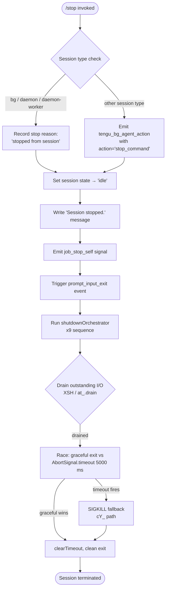

# `/stop`

> Analysis basis: CC v2.1.143 bundle.js (AST extraction + Claude interpretation)
> Minimum version: v2.1.143

---

## Overview

The `/stop` command terminates the current background session immediately, transitioning its state to `"stopped"` while preserving both the session transcript and any associated worktree on disk. It is registered as a `local-jsx` command with `immediate: true`, meaning it executes without waiting for a confirmation prompt. Internally it records a `"stopped from session"` reason, emits telemetry, and drives a structured shutdown sequence through the daemon and supervisor layers.

---

## Registration

| Field | Value |
|---|---|
| type | `local-jsx` |
| name | `stop` |
| description | `Stop this background session; transcript and worktree are kept` |
| immediate | `true` |
| module_id | `tNq` |

Analysis basis: CC v2.1.143 bundle.js:+12024236

---

## Input Branching

Because `immediate: true` is set, the command handler fires synchronously without any user-input collection step. The branching logic inside the command handler (`stopCommandHandler`) follows the flow below.



Analysis basis: CC v2.1.143 bundle.js:+12023406, +12023564, +12023593, +12023737, +12023768, +12023790, +5229354, +5229616, +5227919

---

## Behavioral Spec

### 1. Command Entry Point — `stopCommandHandler`

```
function stopCommandHandler(sessionContext):
    emit telemetry("tengu_bg_agent_action", action="stop_command")
    sessionContext.stopReason ← "stopped from session"
    sessionContext.state      ← "idle"
    writeUserMessage("Session stopped.")
    signalSelf("job_stop_self")
    dispatchEvent("prompt_input_exit")
    return shutdownOrchestrator(sessionContext)
```

Analysis basis: CC v2.1.143 bundle.js:+12023374, +12023564, +12023593, +12023737, +12023768, +12023790, +12023965

---

### 2. Session-Type Guard — `sessionTypeCheck`

The command inspects the running session's type string against a fixed set of known background-mode identifiers before choosing its internal action path.

```
function sessionTypeCheck(sessionType):
    knownBgTypes ← ["bg", "daemon", "daemon-worker"]
    if sessionType in knownBgTypes:
        return "background"
    else:
        return "other"
```

Analysis basis: CC v2.1.143 bundle.js:+2169283, +2169293, +2169307

---

### 3. State Transition — `applyStopState`

```
function applyStopState(session):
    validTerminalStates ← ["done", "success", "failed", "failure", "stopped"]
    if session.status in validTerminalStates:
        return   // already terminal, no-op
    session.status ← "stopped"
    session.activeFlag ← false
    persistSessionRecord(session)
```

Analysis basis: CC v2.1.143 bundle.js:+4029300, +4029313, +4029330, +4029345, +4029362, +4029481

---

### 4. Transcript & Worktree Preservation — `sessionFileManager`

The transcript file is read with UTF-8 encoding and its path is resolved via `SP.join` + `SP.basename`. The worktree directory is **not** deleted. File-cache entries are updated but not cleared, which is what keeps the transcript accessible after the session stops.

```
function sessionFileManager(sessionDir):
    transcriptPath ← path.join(sessionDir, path.basename(transcriptFile))
    raw ← fs.readFile(transcriptPath, encoding="utf-8")
    parsed ← JSON.parse(raw)
    fileCache.set(transcriptPath, parsed)
    // worktree path: left on disk, no unlink call issued
    return parsed
```

Analysis basis: CC v2.1.143 bundle.js:+4023003, +4023116, +4023141, +4023220, +4023234, +4023341, +4023486

---

### 5. Atomic Config Flush — `atomicConfigWriter`

Before the process exits, any pending config changes are flushed atomically to disk using a write-rename pattern with a random 4-byte hex temporary suffix.

```
function atomicConfigWriter(configPath, data):
    suffix  ← crypto.randomBytes(4).toString("hex")
    tmpPath ← configPath + "." + suffix
    fs.writeFile(tmpPath, JSON.stringify(data), encoding="utf8")
    fs.rename(tmpPath, configPath)
```

Analysis basis: CC v2.1.143 bundle.js:+2200342, +2200358, +2200370, +2200389, +2200416, +2200442, +4022503

---

### 6. Shutdown Orchestrator — `shutdownOrchestrator`

This is the primary async sequence that drives the process to exit cleanly.

```
async function shutdownOrchestrator(context):
    // Step 1: drain I/O buffers
    await drainOutputStream()                      // XSH → at_.drain

    // Step 2: scroll summary snapshot
    captureScrollSummary()                         // emits tengu_scroll_summary

    // Step 3: supervisor handoff
    supervisorChannel.stop()
    supervisorChannel.updateConfig()
    supervisorChannel.start()                      // restart with stopped config
    heartbeatRegistry.clear()                      // G_K → Zs

    // Step 4: render unmount + terminal restore
    unmountInkRenderer()                           // CEH → H.unmount
    restoreCursorPosition()                        // ESC-7 / ESC-8 sequences via za6

    // Step 5: write final stdout bytes
    process.stdout.writeSync(finalBytes)

    // Step 6: race graceful vs hard timeout
    timeout ← Math.max(5000, 3500)                // 5000 ms wins
    signal  ← AbortSignal.timeout(timeout)
    result  ← await Promise.race([
        gracefulExit(context),
        hardTimeout(signal)
    ])

    // Step 7: clear timer and exit
    clearTimeout(drainTimer)
    exitProcess(result)
```

Analysis basis: CC v2.1.143 bundle.js:+5229257, +5229287, +5229300, +5229308, +5229325, +5229331, +5229337, +5229345, +5229354, +5229361, +5229370, +5229450, +5229474, +5229528, +5229539, +5229551, +5229599, +5229616

---

### 7. Hard-Kill Fallback — `hardKillFallback`

```
function hardKillFallback(pid):
    clearTimeout(gracefulTimer)
    if process.exit is callable:
        process.exit(0)
    else:
        process.kill(pid, "SIGKILL")
        throw new Error("unreachable")
```

Signal used: `"SIGKILL"` (literal).
Analysis basis: CC v2.1.143 bundle.js:+5227788, +5227821, +5227869, +5227894, +5227919, +5227942

---

### 8. Cache Eviction Hint — `cacheEvictionHint`

After the session is marked stopped, a cache-eviction hint is dispatched so that downstream consumers know to release any in-memory references to the session.

```
function cacheEvictionHint(sessionId):
    emit telemetry("tengu_cache_eviction_hint", sessionId=sessionId)
```

Analysis basis: CC v2.1.143 bundle.js:+5229690

---

### 9. Session-End Telemetry — `emitSessionEnd`

```
function emitSessionEnd(sessionContext):
    metrics ← computeSessionMetrics(sessionContext)   // P91: Date.now, Math.max, Math.round
    emit telemetry("session_end", metrics)
```

Analysis basis: CC v2.1.143 bundle.js:+5229725, +5226042, +5226110, +5226183

---

### 10. Startup-Profiling Flush — `flushStartupProfiling`

If startup profiling was active, it is flushed with a report header and a 1 MiB per-mark cap before exit.

```
function flushStartupProfiling():
    if profilingActive:
        header ← "Startup profiling report:"
        for each mark in performanceMarks:
            if Buffer.byteLength(mark) <= 1048576:
                writeSync(stdout, formatMark(mark))
        emit telemetry("tengu_startup_perf")
```

Maximum mark payload: 1,048,576 bytes (bundle.js:+210914)
Analysis basis: CC v2.1.143 bundle.js:+210231, +210437, +210914, +211017

---

### 11. Terminal Display Mode — `terminalDisplayModeSelector`

```
function terminalDisplayModeSelector(env):
    if tmuxCCModeDetected(env):
        log("fullscreen disabled: tmux -CC (iTerm2 integration mode) detected · set CLAUDE_CODE_NO_FLICKER=1 to override")
        return "default"
    if windowsOverSSHDetected(env):
        log("fullscreen disabled: Windows over SSH (ConPTY re-rendering) detected · set CLAUDE_CODE_NO_FLICKER=1 to override")
        return "default"
    return "fullscreen"
```

Analysis basis: CC v2.1.143 bundle.js:+3331999, +3332185, +3332389, +3332415

---

### 12. Random Jitter Utility — `jitterDelay`

Used internally by the shutdown path to avoid thundering-herd on shared resources when multiple background sessions stop concurrently.

```
function jitterDelay(baseMs):
    jitter ← Math.floor(Math.random() * 2) + 1   // values: 1 or 2
    return setTimeout(callback, baseMs + jitter)
```

Analysis basis: CC v2.1.143 bundle.js:+12638154, +12638156, +12638170, +12638193

---

## State & Side Effects

| Item | Detail |
|---|---|
| Telemetry — `tengu_bg_agent_action` | Fired at command entry with `action="stop_command"` (bundle.js:+12023374, +12023969) |
| Telemetry — `tengu_feature_ok` | Fired on successful feature gate check (bundle.js:+955068) |
| Telemetry — `tengu_daemon_config_reload` | Fired after supervisor config is written during shutdown (bundle.js:+14517117) |
| Telemetry — `tengu_startup_perf` | Fired when startup profiling data is flushed on exit (bundle.js:+211017) |
| Telemetry — `tengu_scroll_summary` | Fired to snapshot terminal scroll state before unmount (bundle.js:+5228657) |
| Telemetry — `tengu_pewter_brook` | Fired from terminal display-mode selector (bundle.js:+3332480) |
| Telemetry — `tengu_cache_eviction_hint` | Fired after session is marked stopped to release in-memory caches (bundle.js:+5229690) |
| Session state mutation | `session.status` → `"stopped"`, `activeFlag` → `false` (bundle.js:+4029362, +4029481) |
| Stop reason string | `"stopped from session"` written to session record (bundle.js:+12023564) |
| Transcript file | Read, parsed, and re-cached; **not** deleted (bundle.js:+4023220, +4023486) |
| Worktree | Left intact on disk; no `unlink` or `rmdir` issued |
| Config file | Flushed atomically via write-then-rename with 4-byte hex suffix (bundle.js:+2200342, +2200389, +2200442) |
| File cache | Updated via `f3H.set`; stale entries removed via `f3H.delete` (bundle.js:+4023116, +4023486) |
| Ink renderer | Unmounted (`H.unmount`) as part of shutdown (bundle.js:+5227269) |
| Cursor position | Saved (`ESC 7`) and restored (`ESC 8`) via terminal escape sequences (bundle.js:+3666220, +3666231) |
| Supervisor | Stopped, config updated, restarted with stopped-session configuration (bundle.js:+14516592, +14516721, +14516739) |
| Heartbeat registry | Cleared on stop (bundle.js:+14515546, +14516841) |
| Graceful-exit timeout | 5,000 ms (bundle.js:+5229354) |
| Fallback timeout floor | 3,500 ms (bundle.js:+5229361) |
| Drain timeout | 2,000 ms (bundle.js:+5229539) |
| Hard-kill signal | `SIGKILL` (bundle.js:+5227919) |
| Abort-timeout API | `AbortSignal.timeout` (bundle.js:+5229616) |
| Sound | <!-- TODO: not found in depth-2 traversal; needs --depth 4 --> |

---

## Version History

| Version | Change |
|---|---|
| v2.1.143 | Initial analysis |

---

## Common Mistakes

1. **Expecting the worktree to be deleted.** `/stop` explicitly preserves both the transcript and the worktree. Use a separate cleanup command or manual deletion if disk reclamation is needed.

2. **Calling `/stop` on a non-background session.** The command is designed for background (`bg`, `daemon`, `daemon-worker`) session types. Invoking it in a foreground interactive session may fall through to the `"other"` branch and produce unexpected behaviour.

3. **Assuming the session disappears immediately.** The shutdown sequence involves I/O draining, supervisor handoff, renderer unmount, and a graceful-exit race up to 5,000 ms before a SIGKILL is issued. The session record transitions to `"stopped"` synchronously, but the process may still be alive for several seconds.

4. **Reusing the session after `/stop`.** Once `session.status` is set to `"stopped"`, the state is treated as terminal. Sending further commands to the session will not resume it; a new session must be created.

5. **Relying on config changes made in the same turn.** The atomic config flush happens inside the shutdown sequence. Any config mutations issued concurrently with `/stop` may or may not be captured in the flushed file depending on ordering.

6. **Ignoring the `immediate: true` flag in custom integrations.** Because the command is registered with `immediate: true`, any wrapper that expects a pre-execution confirmation dialog or argument-collection step will not receive one — the handler fires instantly.

---

## Appendix — Identifier Mapping

> For bundle debugging only. Identifiers change across versions.

| Identifier | Role |
|---|---|
| `Eu7` | Top-level stop command entry point / command handler factory |
| `H` | Jitter delay utility (wraps `Math.random` + `setTimeout`) |
| `K28` | Core stop execution sequence orchestrator |
| `d` | Generic logger / diagnostic emitter |
| `V6` | Environment / feature-flag resolver |
| `GV` | Feature-flag store accessor |
| `Tu7` | Session context accessor |
| `T1` | Session-type classifier (checks `"bg"`, `"daemon"`, `"daemon-worker"`) |
| `cB` | Session-type string comparator |
| `s1` | Session file manager (transcript read, cache update) |
| `$8` | File error classifier (checks `"ENOENT"`, `"code"`) |
| `L8` | Error-code extractor |
| `v` | Log record formatter / debug writer |
| `G5K` | Debug log sink |
| `hH` | JSON serialiser wrapper (`JSON.stringify`) |
| `_` | String utility (`.toUpperCase`, `.replaceAll`) |
| `P7` | Sensitive-value redactor (replaces secrets with `"[REDACTED]"`) |
| `cSH` | Log-level filter |
| `Z5K` | File write helper with `Buffer.byteLength` gating |
| `R6` | JSON parse wrapper |
| `rw` | Session-status mapper |
| `lE` | Status string normaliser |
| `bGH` | Status constant set (`"done"`, `"success"`, `"failed"`, `"stopped"`, etc.) |
| `Bf` | Atomic config writer coordinator |
| `eO` | Low-level atomic file writer (randomBytes + writeFile + rename) |
| `o2` | File-cache invalidation helper (`f3H.delete`) |
| `XF6` | Stop-reason string carrier (`"stopped from session"`) |
| `z6H` | User-facing message emitter (`"Session stopped."`) |
| `SH` | Feature-OK telemetry emitter (`tengu_feature_ok`) |
| `x9` | Shutdown orchestrator (main async exit sequence) |
| `K` | Supervisor channel map iterator |
| `L` | Per-supervisor task runner (add/finally/delete lifecycle) |
| `f` | Supervisor channel instance (close, write) |
| `CEH` | Ink renderer unmount + cursor-restore coordinator |
| `qS` | stdout final-bytes writer |
| `za6` | Terminal cursor save/restore (ESC-7 / ESC-8) |
| `xH` | String coercion helper |
| `dY_` | Final stdout line renderer (dim style, replaceAll escaping) |
| `EV` | Output stream reference |
| `sh` | Shell/terminal capability probe |
| `hO6` | Worktree path resolver (`statSync` check) |
| `g3` | Git worktree accessor |
| `W91` | Final message formatter |
| `cY_` | Hard-kill fallback (`clearTimeout` → `process.exit` → `process.kill SIGKILL`) |
| `XSH` | I/O drain initiator (`at_.drain`) |
| `Y` | Graceful-exit runner (supervisor stop/updateConfig/start, heartbeat clear) |
| `XJH` | Session record writer / state persister |
| `q` | Session file unlinker (on non-stop paths; `n8K.unlinkSync`) |
| `cIq` | Token / cost metrics aggregator |
| `T` | Input handler / keyboard event consumer |
| `Z` | Supervisor channel controller |
| `G_K` | Heartbeat registry clearer |
| `V` | New supervisor channel starter |
| `I66` | Startup-profiling flush coordinator |
| `wN8` | Performance mark reporter |
| `e6A` | Profiling initialiser |
| `N_8` | Scroll-summary snapshot emitter (`tengu_scroll_summary`) |
| `X91` | Scroll position reader |
| `P91` | Session-end metrics calculator (`Date.now`, `Math.max`, `Math.round`) |
| `rA` | Terminal display-mode selector (fullscreen vs default) |
| `ieH` | Cache eviction hint dispatcher (`tengu_cache_eviction_hint`) |
| `k_8` | Promise-race timeout wrapper (500 ms abort helper) |
| `r8` | Abortable timer factory (`setTimeout` + `clearTimeout` + SIGKILL guard) |