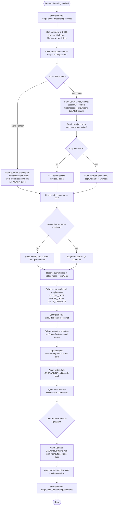

# `/team-onboarding`

> Analysis basis: CC v2.1.143 bundle.js (AST extraction + Claude interpretation)
> Minimum version: v2.1.143

---

## Overview

`/team-onboarding` is a `prompt`-type slash command that mines the invoking user's local Claude Code session transcripts (up to 365 days back) and co-authors a shareable `ONBOARDING.md` guide tailored to their team's actual usage patterns. The command runs a multi-step pipeline: it collects transcript data and MCP server configuration, injects them into a structured prompt, and then guides the agent through a collaborative, two-turn authoring session that produces a ready-to-paste onboarding document.

---

## Registration

| Field | Value |
|---|---|
| `type` | `prompt` |
| `name` | `team-onboarding` |
| `description` | Help teammates ramp on Claude Code with a guide from your usage |
| `isHidden` | `false` |
| `handler_method` | `getPromptForCommand` |
| `handler_method_start` (loc_byte) | `11955614` |
| `handler_method_end` (loc_byte) | `11956270` |
| `loc_byte` (registration open) | `11955276` |
| `loc_byte_end` (registration close) | `11956271` |
| `loc_line` | `7902` |
| `prompt_body.length` | `4539` characters |
| `prompt_body.trace` | `identifier→$ (local→1 ext vars)` |
| `arbor_handler.name` | `getPromptForCommand` |
| `arbor_handler.fqn` | `claude-2.1.143::getPromptForCommand` |
| `arbor_handler.kind` | `Method` |
| `arbor_handler.resolution_path` | `direct` |
| `arbor_handler.n_hits` | `2` |
| `loc_byte_end` | `11956271` |
| `handler_method_start` | `11955614` |
| `handler_method_end` | `11956270` |

Analysis basis: CC v2.1.143 bundle.js:+11955276 – +11956271

---

## Input Branching

The handler has more than three distinct execution paths (transcript window clamping, transcript-scan hit/miss, MCP config present/absent, git identity present/absent, guide template substitution), so a Mermaid flowchart is used.



Analysis basis: CC v2.1.143 bundle.js:+11955614 (handler open), +11955817 (Math clamping), +11944104 (transcript scanner), +11956007 (replaceAll), +11955651 (harbor prompt telemetry), +11956139 (generated telemetry)

---

## Behavioral Spec

### 1 — Invocation and window clamping

```
function handleTeamOnboarding(context):
    emit("tengu_team_onboarding_invoked")

    raw_days  = context.requested_window_days  // user-supplied or default
    window    = Math.floor(
                    Math.max(1,
                        Math.min(365, raw_days)))   // hard ceiling: 365 days
    // bundle.js:+11955817–11955835
```

The window is clamped to a maximum of **365 days** (literal `365` at bundle.js:+11955863) and a minimum of 1 day via `Math.max`.

---

### 2 — Transcript scanning (`transcriptScanner`)

```
async function transcriptScanner(projectsDir, windowDays):
    cutoff = Date.now() - windowDays * 24 * 60 * 1000
    // constants: 24 h/d, 60 min/h, 1000 ms/min — bundle.js:+11944117–11944126

    files = await fs.readdir(projectsDir)
    jsonlFiles = files.filter(f => path.extname(f) == ".jsonl")
    // extension filter — bundle.js:+11944232

    results = await Promise.all(jsonlFiles.map(async file =>
        stat = await fs.stat(join(projectsDir, file))
        if not stat.isFile(): return null
        if stat.mtime < cutoff: return null   // skip files older than window

        raw = await fs.readFile(file)
        lines = raw.split("\n")
        // top-N lines sampled: literal 10 — bundle.js:+11944628

        sessionDescriptor = extractDescriptor(lines)
        // regex exec via Mx7, $x7, Ox7 patterns — bundle.js:+11944952–11945183
        return sessionDescriptor
    ))

    return results.filter(r => r != null)
```

The scanner reads only `.jsonl` files (bundle.js:+11944232), applies a recency cutoff computed from the clamped window, and samples up to **10** lines per file (literal `10` at bundle.js:+11944628) to extract the session title, first user message, linked PR numbers (detected via `"name":"mcp__"` and `"content":["` patterns at bundle.js:+11944811, +11945161), and tool/MCP invocation counts.

---

### 3 — MCP server resolution (`mcpConfigReader`)

```
async function mcpConfigReader(workspaceRoot):
    configPath = path.join(workspaceRoot, ".mcp.json")
    // literal ".mcp.json" — bundle.js:+11946343

    try:
        raw = await fs.readFile(configPath, "utf8")
        // encoding literal "utf8" — bundle.js:+11946356
        parsed = JSON.parse(raw)
        servers = parsed["mcpServers"] ?? {}
        // key literal "mcpServers" — bundle.js:+11946399
        return servers
    catch (e):
        return {}   // absent config → empty map
```

Analysis basis: CC v2.1.143 bundle.js:+11946319 (`svq.readFile`), +11946332 (`UX8.join`), +11946366 (JSON parse)

---

### 4 — Git identity resolution (`gitIdentityResolver`)

```
async function gitIdentityResolver():
    result = await spawnProcess("git", ["config", "user.name"])
    // literals "git", "config", "user.name" — bundle.js:+11946966–11946982

    if result.exitCode != 0: return null

    repoOrigin = await spawnProcess("git", ["remote", "get-url", "origin"])
    // literals "remote", "get-url", "origin" — bundle.js:+11947038–11947057

    return { userName: result.stdout.trim(), remoteOrigin: repoOrigin.stdout.trim() }
```

If `user.name` is unavailable, the `generatedBy` field is **omitted** from the guide header rather than substituted with a placeholder (per prompt body instruction).

Analysis basis: CC v2.1.143 bundle.js:+11946933 (`Yx7`), +11947154 (`UX8.basename`)

---

### 5 — Prompt assembly and template substitution

```
function assemblePrompt(windowDays, usageData, guideTemplate):
    basePrompt = PROMPT_TEMPLATE   // 4539-char body — bundle.js:+11955276

    filled = basePrompt
        .replaceAll("{{WINDOW_DAYS}}", String(windowDays))
        .replaceAll("{{USAGE_DATA}}", JSON.stringify(usageData))
        .replaceAll("{{GUIDE_TEMPLATE}}", guideTemplate)
    // replaceAll call — bundle.js:+11956007
    // String() cast — bundle.js:+11956038
    // literal "{{WINDOW_DAYS}}" — bundle.js:+11956020
    // literal "{{GUIDE_TEMPLATE}}" — bundle.js:+11956060
    // literal "{{USAGE_DATA}}" — bundle.js:+11956095

    emit("tengu_flint_harbor_prompt")
    return filled
```

Three template variables are replaced inline: `{{WINDOW_DAYS}}`, `{{USAGE_DATA}}`, and `{{GUIDE_TEMPLATE}}`. All three literals are confirmed in the bundle (bundle.js:+11956020, +11956060, +11956095).

---

### 6 — Agent-side guide authoring (two-turn protocol)

The assembled prompt instructs the agent to follow a strict two-turn protocol:

**Turn 1 — Immediate draft**

```
agent_turn_1():
    // Step 1 (mandatory, before any reasoning):
    print("> Looking at how you've used Claude over the last X days ...")
    // short citation: "Looking at how you've used" — prompt body

    // Step 2 — classify sessions into work types:
    for session in sessionDescriptors:
        taskType = classify(session)  // one of: build_feature, debug_fix,
                                      // improve_quality, analyze_data,
                                      // plan_design, prototype, write_docs

    workBreakdown = top3to5ByCount(taskTypes, asPercentages)
    // display as title-case with spaces in the rendered guide

    // Step 3 — gather repos and MCP server descriptions

    // Step 4 — write ONBOARDING.md following GUIDE_TEMPLATE
    //   • ascii bar charts: █ (filled) / ░ (empty), 20 chars wide
    //   • real numbers from usage data, no placeholders
    //   • generatedBy from git user.name; omit if missing
    //   • Team Tips and Get Started left as TODO

    // Step 5 — render guide in code block, then post Review section:
    print("---")
    print("**Review**")
    print("1. Team name confirmation or question")
    print("2. Starter task question")
    print("3. Team tips question")
```

**Turn 2 — Revision and save**

```
agent_turn_2(userAnswers):
    update ONBOARDING.md with:
        - confirmed team name
        - starter task (ticket / doc link, optional)
        - team tips not already in CLAUDE.md

    // Mandatory closing line (verbatim per prompt):
    print("Saved to `ONBOARDING.md`. Drop it in your team docs ...")
    // short citation: "Saved to `ONBOARDING.md`" — prompt body

    apply any further edits the user requests
```

Analysis basis: CC v2.1.143 bundle.js:+11955614 (handler body), +11956116 (`ZO8` share helper), +11956139 (generated telemetry)

---

### 7 — Work-type classification rules

| Task type (internal) | Rendered label | Signals |
|---|---|---|
| `build_feature` | Build Feature | New functionality, scripts, tools, config/CI/env setup |
| `debug_fix` | Debug Fix | Investigating and fixing bugs |
| `improve_quality` | Improve Quality | Refactoring, tests, cleanup, code review |
| `analyze_data` | Analyze Data | Queries, metrics, number crunching |
| `plan_design` | Plan Design | Architecture, approach, strategy, design review |
| `prototype` | Prototype | Spikes, POCs, throwaway exploration |
| `write_docs` | Write Docs | PRDs, RFCs, READMEs, design docs, copy/doc review |

Classification precedence: first user message is primary signal; session title and PR-number links are enrichment; tool and MCP invocation counts are a weak fallback when messages are uninformative. Only 3–5 categories are surfaced, with rough percentages. A new category is invented only if the work type is genuinely absent from the list above.

Analysis basis: CC v2.1.143 bundle.js (prompt body, loc_byte range +11955614–+11956270)

---

## State & Side Effects

| Item | Detail |
|---|---|
| **Telemetry — invocation** | `tengu_team_onboarding_invoked` (bundle.js:+11955874) — fired immediately on command entry |
| **Telemetry — harbor prompt** | `tengu_flint_harbor_prompt` (bundle.js:+11955651) — fired after prompt assembly |
| **Telemetry — guide generated** | `tengu_team_onboarding_generated` (bundle.js:+11956139) — fired after guide is written |
| **Telemetry — harbor share** | `tengu_flint_harbor_share` (bundle.js:+9067496) — fired by the share helper (`ZO8`) |
| **Telemetry — config parse error** | `tengu_config_parse_error` (bundle.js:+3164878) — fired if config read fails |
| **Telemetry — feature flag ok/bad** | `tengu_feature_ok` / `tengu_feature_bad` (bundle.js:+955068, +955126) — feature-gate evaluation |
| **Telemetry — bg daemon** | `tengu_bg_dispatch_sigkill_escalate`, `tengu_bg_dispatch_low_mem`, `tengu_bg_spare_*`, `tengu_daemon_control`, `tengu_bg_low_mem_mb`, `tengu_bg_spare_spawn` — background daemon infrastructure, not command-specific |
| **File written** | `ONBOARDING.md` in the current workspace — created or overwritten during Turn 2 |
| **File read** | `.mcp.json` in workspace root (bundle.js:+11946343) |
| **Directories read** | Claude Code projects directory (`.jsonl` transcript files, bundle.js:+11944145) |
| **External process** | `git config user.name` and `git remote get-url origin` spawned to identify the guide author and repo (bundle.js:+11946966, +11947057) |
| **Experiment tracking** | `GrowthbookExperimentEvent` / `growthbook_experiment` emitted by feature-gate helper (bundle.js:+3135738, +3136165) |
| **appState changes** | <!-- TODO: not found in depth-2 traversal; needs --depth 4 --> |
| **Sound** | <!-- TODO: not found in depth-2 traversal; needs --depth 4 --> |
| **Hook registration** | `h9` → `at_.register` (bundle.js:+56977) — file-watch hook registered by transcript watcher infrastructure |

---

## Version History

| Version | Change |
|---|---|
| v2.1.143 | Initial analysis — command introduced with 4 539-char prompt, two-turn authoring protocol, 365-day transcript window |

---

## Common Mistakes

1. **Quoting the team name incorrectly.** The agent infers the team name from available context and asks for confirmation in the Review section. If the user skips answering the Review questions, `ONBOARDING.md` may be saved with a wrong or placeholder team name.

2. **Running with no transcripts.** If Claude Code has never been used in the current environment, the `USAGE_DATA` will be empty. The agent leaves the work-type breakdown as a `TODO` in the guide rather than fabricating percentages — this is correct behaviour, but users may not expect a partially blank guide.

3. **Missing `.mcp.json`.** MCP server configuration is read only from the workspace root `.mcp.json`. Servers configured through other mechanisms (environment variables, global config) will not appear in the generated onboarding guide.

4. **Window clamping surprises.** Any value larger than **365 days** is silently clamped down (bundle.js:+11955817). Users expecting a longer history window will get at most one year of transcripts.

5. **Interrupting Turn 1 before the Review section.** The guide template is written and the Review questions are posted in a single turn. Sending a message before the agent finishes its first turn may leave `ONBOARDING.md` in a partial state, because Turn 2 (the save step) has not yet run.

6. **Expecting the save confirmation to be paraphrased.** The closing line ("Saved to `ONBOARDING.md`. Drop it in your team docs…") is prescribed verbatim by the prompt; users should not mistake it for a general acknowledgment — it signals the file has been written.

---

## Appendix — Identifier Mapping

> For bundle debugging only. Identifiers change across versions.

| Identifier | Role |
|---|---|
| `__handler_team-onboarding` | Synthetic BFS entry point for the command handler (not a real bundle symbol) |
| `G6` | Prompt-delivery / harbor dispatch helper |
| `m76` | Harbor sub-helper A (argument marshalling) |
| `p76` | Harbor sub-helper B (argument marshalling) |
| `Ts` | Template-string interpolation wrapper |
| `xH` | String conversion utility |
| `jF` | Session / conversation context accessor |
| `Uu` | Context record builder (wraps RSL, OO, TA6) |
| `Ci6` | Deduplication / seen-set gate for prompt delivery |
| `lA_` | Prompt enqueue and emit coordinator |
| `$0H` | Internal send helper (`sR`) |
| `pu` | Random-bytes / UUID generator for prompt IDs |
| `hH` | JSON.stringify wrapper |
| `EhL` | Event label / emit helper |
| `eA_` | Async prompt executor |
| `wD9` | Error wrapper for executor |
| `R_` | Promise resolution helper (`Lu`) |
| `aE9` | Async executor sub-step |
| `VRH` | Permission / allowlist checker (`JvK.has`) |
| `N6` | Transcript store / project-file manager |
| `x6` | Path existence / validation utility |
| `z9_` | Config state accessor |
| `H$H` | Config file loader (reads, parses, backs up config JSON) |
| `q` | Filesystem module alias (sync ops: readFileSync, statSync, mkdirSync, etc.) |
| `R6` | JSON.parse wrapper |
| `jR` | String prefix-strip utility (startsWith + slice) |
| `_` | General utility / underscore-style helper |
| `L8` | Logger / level-based log emitter |
| `zZ9` | Directory scanner (readdirStringSync, stat, sibling-repo discovery) |
| `v` | Structured log formatter (debug level) |
| `NH` | Error logging / notification helper |
| `d` | Application state / context object |
| `X9_` | Backup-path builder (`lz.join` + `x8`) |
| `w` | Background daemon process manager |
| `nhL` | File-watch / transcript-watch registrar |
| `Tl` | Watch-event handler |
| `h9` | Hook registration shim (`at_.register`) |
| `wx7` | Top-level usage-data gatherer (orchestrates `ovq`, `Dx7`, `Yx7`, `$_`) |
| `__` | Locale / i18n string helper (`GV`) |
| `GV` | Gettext / translation lookup |
| `C2` | Projects-directory path resolver |
| `hV` | Base projects path builder |
| `YO` | Path sanitiser / slug normaliser |
| `H` | Generic string / process handle (context-dependent) |
| `OkK` | Numeric abs / hash helper |
| `ovq` | Transcript directory scanner (reads `.jsonl` files, applies recency cutoff) |
| `C9` | Log-level or capacity helper (`L8`) |
| `K` | Collection filter / pad helper |
| `L` | Promise task queue item |
| `f` | File/stream handle (context-dependent) |
| `O` | File-stat result wrapper |
| `N8` | Stat object constructor |
| `$` | Transcript line processor / session extractor |
| `JZq` | Session-descriptor builder |
| `z` | Background session handle |
| `SH` | Daemon stop-session helper |
| `mH` | Daemon stop-failed helper |
| `xN` | Daemon control request builder |
| `Ox` | Daemon orchestrator (Promise.race / process.exit) |
| `D` | Background process dispatcher / health monitor |
| `IG6` | Low-memory check helper |
| `$o_` | Spare-process spawner (`Bun.spawn`) |
| `Dx7` | MCP config reader (reads `.mcp.json`) |
| `$8` | Error-level log helper (`L8`) |
| `Yx7` | Git identity resolver (spawns `git config user.name`, `git remote get-url origin`) |
| `$_` | Child-process spawner wrapper (`KXH`) |
| `KXH` | Core child-process execution engine |
| `YzA` | Platform command builder (win32 / unix) |
| `qu8` | Process stdin pipe helper |
| `Ku8` | Process stdin pipe + encoding helper |
| `fu8` | Platform argument assembler |
| `GOA` | Finite-number validator |
| `hA6` | Child-process result parser |
| `Au8` | Reflect.apply / defineProperty utility |
| `oOA` | Process exit-event listener |
| `WOA` | Timeout-with-Promise.race helper |
| `TOA` | Kill-with-cleanup helper |
| `POA` | Process on-data handler (bound) |
| `XOA` | Process kill handler (bound) |
| `iOA` | Parallel stream collector |
| `xA6` | Stream multiplexer (`mx8`) |
| `lOA` | Pipe / readable-stream connector |
| `nOA` | Output collector (`QOA.default`) |
| `IOA` | stdout/stderr binding helper (`nx8.bind`) |
| `_SK` | String coercion helper |
| `$XH` | Git URL parser (extracts host, org/repo from remote URL) |
| `kSK` | Git URL component extractor (`m1`) |
| `m1` | indexOf + slice string slicer |
| `ZO8` | Harbor share / guide-share emitter |
| `zq` | Network / API channel accessor (`A$A`) |
| `A$A` | HTTP client wrapper (`xH`) |

---

*Note: index built via Arbor fallback; some signals (telemetry, literals) may be missing — see arbor-fallback.js.*