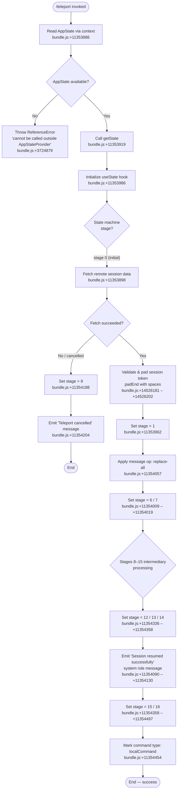

# `/teleport`

> Analysis basis: CC v2.1.143 bundle.js (AST extraction + Claude interpretation)
> Minimum version: v2.1.143

---

## Overview

`/teleport` (alias: `/tp`) is a local JSX slash command that resumes a Claude Code session previously initiated on claude.ai. It reads session data from an external source, applies a full `replace-all` message operation to restore conversation state, and signals completion with a system-level confirmation message. If the user cancels mid-flow, the command emits a dedicated cancellation notice and discards any partial state.

---

## Registration

| Field | Value |
|---|---|
| type | `local-jsx` |
| name | `teleport` |
| description | Resume a Claude Code session from claude.ai |
| aliases | `["tp"]` |
| module_id | `ePq` |

Analysis basis: CC v2.1.143 bundle.js:+11354711

---

## Input Branching

The command handler (`teleportCommand`) follows a multi-stage state machine. Numeric state constants (0–16) found in the implementation drive each transition.

Analysis basis: CC v2.1.143 bundle.js:+11353857 – +11354497



---

## Behavioral Spec

### Context Resolution

Before any session work begins, the command resolves the application state context. If the command is rendered outside the required `<AppStateProvider />` boundary, a `ReferenceError` is thrown immediately with a human-readable message.

```
function resolveAppContext():
    context = useContext(appStateContext)
    if context is undefined or null:
        throw ReferenceError(
            "useAppState/useSetAppState cannot be called outside of an <AppStateProvider />"
        )
    return context
```

Analysis basis: CC v2.1.143 bundle.js:+3724832, +3724864, +3724879

---

### Session Token Acquisition and Padding

After context is resolved, the handler retrieves the current application state and fetches the remote session payload. The session token string is right-padded with space characters (`"  "`, two spaces per pad unit) via `padEnd` before being processed further.

```
function acquireSessionToken(currentState):
    rawToken = fetchFromRemoteSession(currentState)
    if rawToken is empty or absent:
        return null
    paddedToken = rawToken.padEnd(targetLength, "  ")
    return paddedToken
```

- Pad character literal: `"  "` (two spaces)
- Maximum padded width constant: 40 characters

Analysis basis: CC v2.1.143 bundle.js:+14526181, +14526202, +14528173

---

### Message Operation — Replace-All

The core restoration step applies a `"replace-all"` message operation to the local conversation store. This atomically replaces the entire local message list with the session content retrieved from claude.ai, discarding any messages that existed locally before the teleport.

```
function applySessionMessages(sessionPayload):
    op = {
        type: "replace-all",
        messages: sessionPayload.messages
    }
    messageStore.applyMessageOp(op)
```

Analysis basis: CC v2.1.143 bundle.js:+11354034, +11354057

---

### State Machine Transitions

The command uses a numeric stage variable (managed via `useState`) to sequence its async steps. The stage integer transitions observed in the implementation are:

| Stage constant | Semantic role |
|---|---|
| 0 | Initial / idle |
| 1 | Token acquired; ready to apply |
| 6 | Message op dispatched |
| 7 | Message op acknowledged |
| 8 | Post-apply validation begins |
| 9 | Cancellation detected |
| 10 | Intermediate processing A |
| 11 | Intermediate processing B |
| 12 | Finalisation step 1 |
| 13 | Finalisation step 2 |
| 14 | Finalisation step 3 |
| 15 | Success confirmed |
| 16 | Command teardown complete |

Analysis basis: CC v2.1.143 bundle.js:+11353857 (max stage 16), +11353898 (stage 0), +11353962 (stage 1), +11354009 (stage 6), +11354019 (stage 7), +11354158 (stage 8), +11354188 (stage 9), +11354290 (stage 10), +11354298 (stage 11), +11354336 (stage 12), +11354347 (stage 13), +11354358 (stage 14), +11354497 (stage 15/16)

---

### Cancellation Path

If the user cancels at any prompt during session acquisition (stage 9), the command emits a `"system"`-role message with the text `"Teleport cancelled"` and halts all further processing. No `replace-all` operation is issued and existing local messages are untouched.

```
function handleCancellation(messageStore):
    messageStore.emit({
        role: "system",
        content: "Teleport cancelled"
    })
    return  // no further state changes
```

Analysis basis: CC v2.1.143 bundle.js:+11354188, +11354204

---

### Success Confirmation

On successful restoration the command emits a `"system"`-role message with the text `"Session resumed successfully"`, then marks the command invocation record as `"localCommand"` before final teardown.

```
function emitSuccessAndFinalize(messageStore, commandRecord):
    messageStore.emit({
        role: "system",
        content: "Session resumed successfully"
    })
    commandRecord.type = "localCommand"
```

Analysis basis: CC v2.1.143 bundle.js:+11354090, +11354130, +11354454

---

### Connection and File Cleanup

During teardown, the implementation closes two internal handles (`connectionHandle.close()` and `queueHandle.close()`) and, when required, removes a temporary file via `unlinkSync`.

```
function cleanupResources(connectionHandle, queueHandle, tempFilePath):
    connectionHandle.close()
    queueHandle.close()
    if tempFilePath exists:
        filesystem.unlinkSync(tempFilePath)
```

Analysis basis: CC v2.1.143 bundle.js:+14513628, +14513638, +14482768

---

### In-Progress Tracking

While session acquisition is in flight, the task is registered in an active-task set via `taskSet.add(task)`. The task is removed via `taskSet.delete(task)` inside a `finally` block, guaranteeing removal even on error or cancellation.

```
function trackActiveTask(taskSet, task):
    taskSet.add(task)
    try:
        await task
    finally:
        taskSet.delete(task)
```

Analysis basis: CC v2.1.143 bundle.js:+14507672, +14507681, +14507695

---

### String Normalisation

One utility reached during traversal applies `toLowerCase()` with a right-pad width limit of 40 characters. This is likely used when normalising the session identifier or command token for comparison.

```
function normaliseToken(raw):
    lower = raw.toLowerCase()
    return lower.padEnd(40)
```

Analysis basis: CC v2.1.143 bundle.js:+14528099, +14528173

---

## State & Side Effects

| Item | Detail |
|---|---|
| Telemetry | None — no `tengu_*` events found in depth-2 traversal |
| AppState reads | `getState()` called once at command entry (bundle.js:+11353919) |
| AppState writes | Session messages replaced via `applyMessageOp("replace-all")` (bundle.js:+11354034) |
| useState hook | Numeric stage variable, range 0–16 (bundle.js:+11353986) |
| System messages emitted | `"Session resumed successfully"` (success path) · `"Teleport cancelled"` (cancel path) |
| Message role | `"system"` for both emitted messages (bundle.js:+11354130) |
| File system | `unlinkSync` on temporary file during cleanup (bundle.js:+14482768) |
| Network handles | Two handles closed on teardown: `A.close()`, `q.close()` (bundle.js:+14513628, +14513638) |
| Active-task set | Task added on start, deleted in `finally` (bundle.js:+14507672, +14507695) |
| Command record type | Set to `"localCommand"` on success (bundle.js:+11354454) |
| Sound | <!-- TODO: not found in depth-2 traversal; needs --depth 4 --> |
| Hook registration | <!-- TODO: not found in depth-2 traversal; needs --depth 4 --> |

---

## Version History

| Version | Change |
|---|---|
| v2.1.143 | Initial analysis — command registered with alias `tp`; `replace-all` session restoration; 16-stage state machine |

---

## Common Mistakes

1. **Invoking `/teleport` outside `<AppStateProvider />`** — The command immediately throws a `ReferenceError` if the React context is absent. Ensure the CLI shell has fully initialised its state provider before the command can be used (bundle.js:+3724879).
2. **Expecting partial message merge** — The `replace-all` operation is destructive and atomic. Any messages present in the local session before teleporting are permanently replaced. There is no merge or append path (bundle.js:+11354057).
3. **Treating `/tp` and `/teleport` as different commands** — Both aliases resolve to the same handler (`tPq`). There is no behavioural difference between them (bundle.js:+11354711).
4. **Assuming telemetry is emitted** — No `tengu_*` telemetry events are fired by this command. Tooling that monitors telemetry streams will see no signal from a teleport invocation.
5. **Cancelling and assuming state is preserved** — Cancellation (stage 9) emits a `"Teleport cancelled"` system message but does not roll back any state changes that may have partially occurred before cancellation was detected. Restarting the session cleanly is safer than retrying after a cancel.

---

## Appendix — Identifier Mapping

> For bundle debugging only. Identifiers change across versions.

| Identifier | Role |
|---|---|
| `tPq` | Teleport command handler (main component / entry point) |
| `xI7` | Module-level helper or export wrapper for teleport |
| `$L` | AppState context accessor (calls `bL_` internally) |
| `bL_` | Inner context resolution function; enforces `<AppStateProvider />` boundary |
| `K` | Application state store; exposes `getState` and `map` operations |
| `L` | Active-task tracking wrapper; manages add/delete lifecycle |
| `f` | Connection or session handle; exposes `close`, `padEnd`, `finally` |
| `q` | Queue or message-store handle; exposes `applyMessageOp`, `close`, `delete` |
| `A` | String normalisation utility; exposes `toLowerCase` and pad operations |