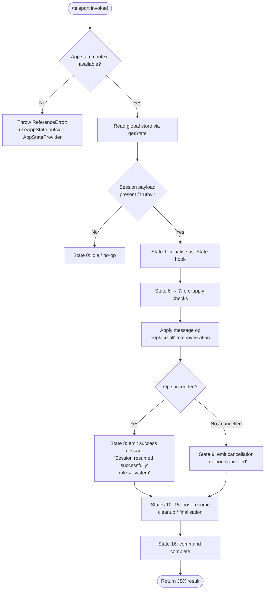

# `/teleport`

> Analysis basis: CC v2.1.143 bundle.js (AST extraction + Claude interpretation)
> Minimum version: v2.1.143

---

## Overview

The `/teleport` command (alias: `/tp`) resumes a Claude Code session that was previously initiated or saved from claude.ai. It operates as a local JSX command that reads incoming session state, applies a `replace-all` message operation to reconstruct the conversation context, and either confirms success with `"Session resumed successfully"` or surfaces a cancellation notice to the user.

---

## Registration

| Field | Value |
|---|---|
| type | `local-jsx` |
| name | `teleport` |
| description | `Resume a Claude Code session from claude.ai` |
| aliases | `["tp"]` |
| module_id | `ePq` |

Analysis basis: CC v2.1.143 bundle.js:+11354711

---

## Input Branching

The command implementation follows a multi-stage state-machine pattern driven by integer state discriminants (0–16 found in literals). The high-level branching is illustrated below.



Analysis basis: CC v2.1.143 bundle.js:+11353851 (state-machine entry), +11353898 (state 0), +11353962 (state 1), +11354009 (state 6), +11354019 (state 7), +11354057 (`replace-all` literal), +11354090 (success string), +11354204 (cancellation string), +11353857 (value 16 upper bound)

---

## Behavioral Spec

### Context Guard

Before any session logic runs, the command verifies it is executing inside a valid `<AppStateProvider />` React context tree. If the context object is absent, a `ReferenceError` is raised with the message `"useAppState/useSetAppState cannot be called outside of an <AppStateProvider />"`.

```
function assertAppStateContext(contextValue):
    if contextValue is undefined or null:
        raise ReferenceError(
            "useAppState/useSetAppState cannot be called outside of an <AppStateProvider />"
        )
    return contextValue
```

Analysis basis: CC v2.1.143 bundle.js:+3724832 (`useContext` call), +3724864 (`ReferenceError` site), +3724879 (error message literal)

---

### State Initialisation

After the context guard passes, the command calls `getState()` on the global store to retrieve any pending teleport payload, then initialises a local React state variable (via `useState`) seeded with the result.

```
function initialiseTeleportState(store):
    rawPayload = store.getState()
    sessionPayload = Boolean(rawPayload)   // coerced to presence flag
    [localState, setLocalState] = useState(initialStateDiscriminant: 1)
    return (sessionPayload, localState, setLocalState)
```

Analysis basis: CC v2.1.143 bundle.js:+11353911 (`Boolean` coercion), +11353919 (`getState`), +11353986 (`useState`)

---

### Session Payload Application

When a truthy session payload is detected, the command advances through state discriminants 6 and 7, then calls `applyMessageOp` with the operation kind `"replace-all"` and a target role index of `6`/`7`. This replaces the entire current message list in the conversation with the messages arriving from the claude.ai session.

```
function applyTeleportSession(messageOpDispatcher, payload):
    advanceState(6)   // pre-validation step
    advanceState(7)   // pre-apply step
    messageOpDispatcher.applyMessageOp(
        kind    = "replace-all",
        payload = payload
    )
```

Analysis basis: CC v2.1.143 bundle.js:+11354009 (state 6), +11354019 (state 7), +11354034 (`applyMessageOp`), +11354057 (`"replace-all"`)

---

### Success Path

On a successful `applyMessageOp`, the command advances to state 8 and injects a synthetic system-role message with the content `"Session resumed successfully"` into the conversation.

```
function emitSuccessNotice(conversationWriter):
    advanceState(8)
    conversationWriter.write(
        content = "Session resumed successfully",
        role    = "system"
    )
```

Analysis basis: CC v2.1.143 bundle.js:+11354088 (handler `A`), +11354090 (success string), +11354130 (`"system"` role), +11354158 (state 8)

---

### Cancellation Path

If the operation is not completed (user cancels, or payload validation fails), the command advances to state 9 and emits `"Teleport cancelled"` to the user.

```
function emitCancellationNotice(conversationWriter):
    advanceState(9)
    conversationWriter.write(
        content = "Teleport cancelled",
        role    = "system"
    )
```

Analysis basis: CC v2.1.143 bundle.js:+11354188 (state 9), +11354204 (`"Teleport cancelled"`)

---

### Post-Resume Cleanup

States 10 through 15 represent the cleanup and finalisation sequence. Observable operations in this range include closing open file handles, deleting temporary session queue entries, and unlinking temporary files on disk. The command is tagged `"localCommand"` in the final state (15) before reaching the terminal state 16.

```
function finaliseSession(sessionQueue, fileHandles):
    for handle in fileHandles:
        handle.close()
    sessionQueue.close()
    for entry in sessionQueue:
        sessionQueue.delete(entry)
    unlinkTemporaryFiles(sessionQueue)
    markAs("localCommand")    // state 15
    advanceState(16)          // terminal
```

Analysis basis: CC v2.1.143 bundle.js:+11354290 (state 10), +11354298 (state 11), +11354336 (state 12), +11354347 (state 13), +11354358 (state 14), +11354454 (`"localCommand"`), +11354497 (state 15), +11353857 (value 16 terminal)

---

### Session Queue and File Management (Store Layer)

The global store layer (reached through `getState`) manages an active session queue backed by the filesystem. Key observed behaviours at depth ≤ 2:

- Queue entries are added via an `add` operation before session data is consumed.
- Temporary files are removed with `unlinkSync` on cleanup.
- Session identifiers are normalised to lowercase before comparison (column width padded to **40** characters with two-space padding `"  "`).

```
function manageSessionQueue(queue, sessionId):
    normalised = sessionId.toLowerCase().padEnd(40, "  ")
    queue.add(normalised)
    try:
        consumeSession(normalised)
    finally:
        queue.delete(normalised)
        unlinkSync(temporaryPath(normalised))
```

Analysis basis: CC v2.1.143 bundle.js:+14507672 (`q.add`), +14482768 (`unlinkSync`), +14507681 (`f.finally`), +14507695 (`q.delete`), +14528099 (`toLowerCase`), +14528173 (value 40), +14526181 (`padEnd`), +14526202 (`"  "` padding)

---

## State & Side Effects

| Item | Detail |
|---|---|
| Telemetry | None detected in depth-2 traversal (telemetry array is empty) |
| Hook registration | Consumes `useContext` from the React context identified as `g$H`; registers one `useState` instance initialised at discriminant `1` |
| appState changes | Reads app state via `getState()`; writes back session messages via `applyMessageOp("replace-all", …)` |
| Conversation injection | Injects a `"system"`-role message (`"Session resumed successfully"` or `"Teleport cancelled"`) after the operation resolves |
| Filesystem side effects | Unlinks temporary session files via `unlinkSync`; manages a transient queue of session entries that are deleted on completion |
| Command self-identification | Tags itself as `"localCommand"` at state 15 before terminal state 16 |
| Sound | <!-- TODO: not found in depth-2 traversal; needs --depth 4 --> |

---

## Version History

| Version | Change |
|---|---|
| v2.1.143 | Initial analysis |

---

## Common Mistakes

1. **Invoking `/teleport` outside a valid session origin.** The command expects a populated session payload in the global store. Running it in a fresh local session with no prior claude.ai export results in a no-op at state 0 — no error is surfaced, but nothing is restored.

2. **Confusing `/tp` scope.** The alias `/tp` resolves to `/teleport` only; it does not share namespace with any hypothetical teleport-point management subcommands. There are no subcommands: the command takes no structured arguments.

3. **Expecting telemetry events.** Unlike many other Claude Code commands, `/teleport` emits zero `tengu_*` telemetry events as observed in this version. Do not instrument dashboards expecting event-driven signals from this command.

4. **Assuming the success message is user-authored.** The `"Session resumed successfully"` string is injected with role `"system"`, not `"assistant"` or `"user"`, so it may render differently in UIs that style messages by role.

5. **Premature file cleanup assumptions.** The `unlinkSync` call occurs in the store cleanup layer, not in the JSX command layer itself. Intercepting or mocking the command handler will not prevent filesystem cleanup if the store layer runs independently.

---

## Appendix — Identifier Mapping

> For bundle debugging only. Identifiers change across versions.

| Identifier | Role |
|---|---|
| `xI7` | Module-level export or utility helper (exact role not resolved at depth ≤ 2) |
| `tPq` | Primary teleport command implementation function (JSX component / handler) |
| `$L` | App-state hook accessor (`useAppState` / `useSetAppState` wrapper) |
| `bL_` | Inner context-guard function that calls `useContext` and raises `ReferenceError` if outside provider |
| `K` | Global session store object; exposes `getState()` and session-queue mapping logic |
| `L` | Session lifecycle manager; orchestrates `add`, `delete`, `finally` cleanup on queue entries |
| `q` | Session queue object; exposes `add`, `close`, `delete`, and `unlinkSync`-backed removal |
| `f` | Async session operation handle; exposes `close`, `finally`, and the recursive call back into `L` |
| `A` | Conversation writer / message injector; exposes `close` and `toLowerCase`; used to emit success/cancellation messages |