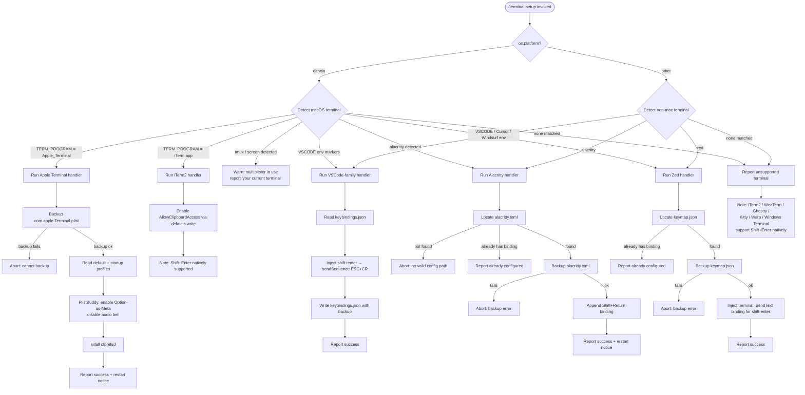

# `/terminal-setup`

> Analysis basis: CC v2.1.143 bundle.js (AST extraction + Claude interpretation)
> Minimum version: v2.1.143

---

## Overview

`/terminal-setup` is a local JSX slash command that detects the user's current terminal emulator and automatically configures it for optimal Claude Code integration. It patches terminal-specific configuration files (keybindings, preferences, plist entries) to enable features such as Shift+Enter newline insertion and Option-as-Meta key behavior. The command is platform-aware, branching across macOS (Apple Terminal, iTerm2), VS Code-family editors (VSCode, Cursor, Windsurf), Alacritty, and Zed.

---

## Registration

| Field | Value |
|---|---|
| type | `local-jsx` |
| name | `terminal-setup` |
| description | *(null — no description registered)* |
| loc_byte | `+11367218` |
| loc_line | `6976` |
| module_id | `su9` |

Analysis basis: CC v2.1.143 bundle.js:+11367218

---

## Input Branching

The top-level dispatch function (identifier: `DnL`) reads `process.platform` and environment variables to identify the active terminal, then routes to a terminal-specific handler. The overall decision tree has more than three paths, so a Mermaid flowchart is provided below.



Analysis basis: CC v2.1.143 bundle.js:+3904081 (platform check), +3902161 (darwin literal), +3904277 (iTerm2 path), +3905551 (Ps6 dispatch)

---

## Behavioral Spec

### 1. Terminal Detection

```
function detectTerminal(env, platform):
    if platform == "darwin":
        termProgram = env["TERM_PROGRAM"]
        if termProgram == "Apple_Terminal":
            return "Apple_Terminal"
        if termProgram == "iTerm.app":
            return "iTerm2"
        if env contains tmux or screen indicators:
            return "your current terminal"   // multiplexer fallback
    if vscodeServerDir exists in HOME (.vscode-server, .cursor-server, .windsurf-server):
        return appropriate VSCode-family name
    if TERM_PROGRAM in ["vscode", "cursor", "windsurf"]:
        return that value
    if TERM_PROGRAM == "alacritty":
        return "alacritty"
    if TERM_PROGRAM == "zed":
        return "zed"
    return null  // unsupported
```

Analysis basis: CC v2.1.143 bundle.js:+3902145 (platform read), +3902161 ("darwin"), +3902185 ("Apple_Terminal"), +3901733 (".vscode-server"), +3901763 (".cursor-server"), +3901793 (".windsurf-server")

---

### 2. Apple Terminal Handler

This handler (identifier: `JnL`) configures `com.apple.Terminal` via the macOS `defaults` and `/usr/libexec/PlistBuddy` utilities.

```
async function configureAppleTerminal():
    // Step 1 — backup preferences
    result = runCommand("defaults", "export", "com.apple.Terminal", backupPath)
    if result.exitCode != 0:
        throw Error("Failed to create backup of Terminal.app preferences, bailing out")

    // Step 2 — discover profiles (default and startup)
    defaultProfile = runCommand("defaults", "read", "com.apple.Terminal",
                                "Default Window Settings").stdout.trim()
    if defaultProfile is empty:
        throw Error("Failed to read default Terminal.app profile")

    startupProfile = runCommand("defaults", "read", "com.apple.Terminal",
                                "Startup Window Settings").stdout.trim()
    if startupProfile is empty:
        throw Error("Failed to read startup Terminal.app profile")

    // Step 3 — patch profiles via PlistBuddy
    profiles = deduplicate([defaultProfile, startupProfile])
    patchedCount = 0
    for each profile in profiles:
        ok = plistBuddySetOptionAsMeta(profile)
              AND plistBuddyDisableAudioBell(profile)
        if ok: patchedCount++

    if patchedCount == 0:
        throw Error("Failed to enable Option as Meta key or disable audio bell for any Terminal.app profile")

    // Step 4 — flush preferences daemon
    runCommand("killall", "cfprefsd")

    // Step 5 — report
    output success lines:
        "Configured Terminal.app settings:"
        "- Enabled \"Use Option as Meta key\""
        "- Switched to visual bell"
        platform-appropriate newline hint   // Shift+Return or Option+Enter
    output dim note: "You must restart Terminal.app for changes to take effect."
```

`plistBuddySetOptionAsMeta` and `plistBuddyDisableAudioBell` both shell out to `/usr/libexec/PlistBuddy` with `-c` flag.

Analysis basis: CC v2.1.143 bundle.js:+3910306 (JnL→backup), +3910352 (backup-failure message), +3910490 ("Default Window Settings"), +3910550 (default-profile error), +3910667 ("Startup Window Settings"), +3910727 (startup-profile error), +3909579 ("/usr/libexec/PlistBuddy"), +3909606 ("-c"), +3910937 (all-profiles-failed error), +3911036 ("killall"), +3911047 ("cfprefsd"), +3911089 ("Configured Terminal.app settings:"), +3911156 ("- Enabled…"), +3911218 ("- Switched…"), +3911397 (restart notice)

**Newline hint selection** (identifier: `OA`):

```
function selectNewlineHint(terminalContext):
    if context includes "foreground" marker:
        if color starts with "rgb(":    return rgb variant
        if color starts with "ansi256(": return ansi256 variant
        if color starts with "ansi:":   return ansi variant
    // platform selection:
    if platform == "darwin" and terminal == "Apple_Terminal":
        return "Shift+Return will now enter a newline."
    else:
        return "Option+Enter will now enter a newline."
```

Analysis basis: CC v2.1.143 bundle.js:+3692201 ("foreground"), +3692258 ("rgb("), +3692299 ("ansi256("), +3692325 ("ansi:"), +3911263 ("Shift+Return…"), +3911312 ("Option+Enter…")

**Backup restore path** (identifier: `ws6`): If a prior backup exists (detected via `N4_.stat`), the handler can restore it via `defaults import com.apple.Terminal <backup>`. Outcome states observed in literals: `no_backup`, `import`, `failed`, `restored`.

Analysis basis: CC v2.1.143 bundle.js:+3898699 ("no_backup"), +3898851 ("import"), +3898908 ("failed"), +3898985 ("restored")

---

### 3. iTerm2 Handler

```
async function configureITerm2():
    // Read current value
    currentValue = runCommand("defaults", "read",
                              "com.googlecode.iterm2", "AllowClipboardAccess")
    if currentValue indicates already enabled:
        report "iTerm2 clipboard access already enabled"
        return

    // Enable clipboard access
    result = runCommand("defaults", "write", "com.googlecode.iterm2",
                        "AllowClipboardAccess", "-bool", "true")
    if result indicates error:
        report warning "Couldn't update iTerm2 clipboard setting."
        return

    report success:
        "Enabled \"Applications in terminal may access clipboard\" in iTerm2"
    report info:
        "Restart iTerm2 for this to take effect. Undo: defaults write com.googlecode.iterm2 AllowClipboardAccess -bool false"
```

Analysis basis: CC v2.1.143 bundle.js:+3903138 ("com.googlecode.iterm2"), +3903162 ("AllowClipboardAccess"), +3903237 ("already enabled" message), +3903325 ("write"), +3903380 ("-bool"), +3903431 (warning message), +3903522 (success message), +3903605 (undo hint)

---

### 4. VSCode-Family Handler (VSCode, Cursor, Windsurf)

This handler (identifier: `R4_`) targets `keybindings.json` and `settings.json` in the editor's user-data directory.

```
async function configureVSCodeFamily(editorName):
    // Resolve user-data directory (identifier: U4_)
    if platform == "win32":
        userDataDir = join(HOME, "AppData", "Roaming", editorName, "User")
    elif platform == "darwin":
        userDataDir = join(HOME, "Library", "Application Support", editorName, "User")
    else:
        userDataDir = join(HOME, ".config", editorName, "User")

    keybindingsPath = join(userDataDir, "keybindings.json")

    // Detect remote server environment (identifier: C4_)
    if HOME contains ".vscode-server" or ".cursor-server" or ".windsurf-server":
        report warning "VSCode remote server detected; keybindings must be set on the local machine"

    // Read existing keybindings
    await mkdir(userDataDir, recursive=true)
    raw = await readFile(keybindingsPath) ?? "[]"
    bindings = parseJSON(raw)   // via SR6/C9

    // Check for duplicate
    if bindings already contains shift+enter binding:
        skip insertion

    // Generate random backup suffix (4 random hex bytes)
    backupPath = keybindingsPath + "." + randomHex(4) + ".bak"
    await copyFile(keybindingsPath, backupPath)

    // Build new binding entry (identifier: szA / azA)
    newEntry = {
        "key": "shift+enter",
        "command": "workbench.action.terminal.sendSequence",
        "args": { "text": "\x1b\r" },   // ESC + CR
        "when": "terminalFocus"
    }
    bindings.push(newEntry)

    // Write updated file
    await writeFile(keybindingsPath, JSON.stringify(bindings, null, 2), "utf-8")

    report success for editorName
    report info: platform-appropriate newline hint
```

Analysis basis: CC v2.1.143 bundle.js:+3906127 ("Code"), +3906180 ("win32"), +3906196–+3906218 (Windows path components), +3906259–+3906309 (macOS/Linux path components), +3908243 ("keybindings.json"), +3908306 ("[]" default), +3908357 ("utf-8"), +3908424 (randomBytes), +3908440 (4 bytes), +3908452 ("hex"), +3908692 ("shift+enter"), +3908714 ("workbench.action.terminal.sendSequence"), +3908766 (ESC+CR sequence), +3908781 ("terminalFocus"), +3906481 ("settings.json"), +3906508 ("{}" default)

Editor name mapping in literals:
- `"vscode"` env → display name `"VSCode"` (bundle.js:+3907557)
- `"cursor"` env → display name `"Cursor"` (bundle.js:+3902510)
- `"windsurf"` env → display name `"Windsurf"` (bundle.js:+3902580)

---

### 5. Alacritty Handler

```
async function configureAlacritty():
    // Collect candidate config paths (platform-aware)
    candidates = buildAlacrittyConfigPaths(HOME, platform)
    // e.g. ~/.config/alacritty/alacritty.toml, ~/.alacritty.toml, etc.

    configPath = candidates.find(p => fileExists(p))
    if configPath is null:
        throw Error("No valid config path found for Alacritty")

    content = await readFile(configPath)

    // Check idempotency
    if content includes 'mods = "Shift"' and 'key = "Return"':
        report info "Alacritty Shift+Enter key binding already configured"
        return

    // Backup
    backupPath = configPath + "." + randomHex(4) + ".bak"
    try:
        await copyFile(configPath, backupPath)
    catch:
        throw Error("Error backing up existing Alacritty config. Bailing out.")

    // Append binding block
    newContent = content + ALACRITTY_SHIFT_ENTER_TOML_BLOCK
    // Block sets mods = "Shift", key = "Return", action = send ESC+CR

    // If path's directory does not exist, create it
    await mkdir(dirname(configPath), recursive=true)
    await writeFile(configPath, newContent, "utf-8")

    report success "Installed Alacritty Shift+Enter key binding"
    report info "You may need to restart Alacritty for changes to take effect"
```

Analysis basis: CC v2.1.143 bundle.js:+3912041 ("alacritty.toml"), +3912402 (no-config-path error), +3912470 ('mods = "Shift"'), +3912500 ('key = "Return"'), +3912543 (already-configured message), +3912642 (randomBytes), +3912705 (copyFile backup), +3912753 (backup error), +3912901 (mkdir), +3912910 (dirname), +3913071 (writeFile), +3913127 (success message), +3913197 (restart notice), +3913422 (failure message)

---

### 6. Zed Handler

```
async function configureZed():
    keymapPath = join(HOME, ".config", "zed", "keymap.json")
    await mkdir(dirname(keymapPath), recursive=true)

    raw = await readFile(keymapPath) ?? "[]"
    keymap = parseJSON(raw)   // via R6/JSON.parse

    // Idempotency check
    if any entry contains "shift-enter" binding:
        report info "Zed Shift+Enter key binding already configured"
        return

    // Backup
    backupPath = keymapPath + "." + randomHex(4) + ".bak"
    try:
        await copyFile(keymapPath, backupPath)
    catch:
        throw Error("Error backing up existing Zed keymap. Bailing out.")

    // Build entry
    newEntry = {
        "context": "Terminal",
        "bindings": {
            "shift-enter": ["terminal::SendText", "\x1b\r"]
        }
    }

    if Array.isArray(keymap):
        keymap.push(newEntry)
    else:
        keymap = [newEntry]

    await writeFile(keymapPath, JSON.stringify(keymap, null, 2), "utf-8")

    report success "Installed Zed Shift+Enter key binding"
```

Analysis basis: CC v2.1.143 bundle.js:+3913506 (DS.join path construction), +3913514 (qt.homedir), +3913581 (mkdir), +3913636 (readFile), +3913711 ("shift-enter"), +3913722 (already-configured), +3913833 ($C backup helper), +3913855 (randomBytes), +3913918 (copyFile), +3913966 (backup error), +3914112 (R6/JSON.parse), +3914119 (Array.isArray), +3914159 (push), +3914175 ("Terminal" context), +3914211 ("terminal::SendText"), +3914251 (writeFile), +3914266 (hH/JSON.stringify), +3914276 (indent=2), +3914322 (success), +3914525 (failure)

---

### 7. Backup File Helper

All terminal handlers share a common backup helper (identifier: `$C`) that:

```
function createBackup(sourcePath):
    suffix = crypto.randomBytes(4).toString("hex")
    backupPath = sourcePath + "." + suffix + ".bak"
    // Converts path to file URL (ru9.pathToFileURL) for uniform handling
    await copyFile(sourcePath, backupPath)
    return backupPath
```

Analysis basis: CC v2.1.143 bundle.js:+3902020 (n2 call), +3902051 (ru9.pathToFileURL), +3908424 (R4_→randomBytes), +3908487 (R4_→copyFile), +3907008 (h4_→randomBytes), +3907059 (h4_→copyFile)

---

### 8. Shell-Command Execution Utility

The command runner (identifier: `Qu9`) used for macOS `defaults`/`PlistBuddy` calls:

```
async function runShellCommand(executable, ...args):
    // Uses N4_.stat to verify executable exists
    // Spawns child process via nUH (spawn wrapper)
    // Collects stdout chunks via Y8 (stream reader)
    // Returns { exitCode, stdout, stderr }
    // Passes exit code 0 as success, non-zero as $nL (error result)
    // On non-zero exit emits NH (error notification)
```

Analysis basis: CC v2.1.143 bundle.js:+3898371 (nUH spawn), +3898412 (Y8 stream), +3898492 (N4_.stat), +3898584 ($nL error path), +3898609 (NH notification), +3910306 (JnL→runShellCommand), +3910334 (Qu9)

---

### 9. Config Persistence and Lock

The global config writer (identifier: `a6`) used by `cUH` (onboarding-complete state setter) employs file locking:

```
async function saveGlobalConfig(updater):
    // Acquires advisory lock via P9_ (lock-file helper)
    // Lock timeout: 60000 ms (bundle.js:+3162978)
    // Warns if acquisition > 100 ms (bundle.js:+3162202):
    //   "Lock acquisition took longer than expected - another Claude instance may be running"
    // Reads current config from disk
    // Guards against auth-loss (GH #3117):
    //   if disk config is missing auth that cache has → abort write
    //   emits tengu_config_stale_write telemetry
    // Writes file with mode 0o600 (384 decimal, bundle.js:+3163509)
    // Rotates up to 5 backup copies (bundle.js:+3163227), suffix ".backup."
```

Analysis basis: CC v2.1.143 bundle.js:+3162978 (60 000 ms lock timeout), +3162208 (slow-lock warning), +3162624 (auth-loss guard message), +3159506 (fallback auth-loss message), +3163509 (file mode 384 = 0o600), +3163227 (5 backup copies), +3163094 (".backup." suffix)

---

## State & Side Effects

| Item | Detail |
|---|---|
| Telemetry — `tengu_bg_spare_enable` | Emitted when a background spare process is enabled (bundle.js:+14502634) |
| Telemetry — `tengu_bg_spare_spawn` | Emitted when a background spare process is spawned (bundle.js:+14502994) |
| Telemetry — `tengu_config_lock_contention` | Emitted when the config file lock cannot be acquired within the expected window (bundle.js:+3162297) |
| Telemetry — `tengu_config_stale_write` | Emitted when a write is refused because the on-disk config is stale relative to the cache (bundle.js:+3162433) |
| Telemetry — `tengu_config_auth_loss_prevented` | Emitted when a write is refused specifically to prevent wiping authentication credentials (bundle.js:+3162776) |
| Telemetry — `tengu_config_parse_error` | Emitted when the config file cannot be parsed (bundle.js:+3164878) |
| Telemetry — `tengu_feature_ok` | Emitted when a feature check succeeds (bundle.js:+955068) |
| File writes | `keybindings.json` (VSCode-family), `alacritty.toml` (Alacritty), `keymap.json` (Zed); all with a random-hex `.bak` backup copy |
| macOS plist writes | `com.apple.Terminal` plist via `defaults export/import`; `com.googlecode.iterm2` via `defaults write` |
| Process spawning | `defaults`, `/usr/libexec/PlistBuddy`, `killall cfprefsd` on macOS |
| Config lock | Advisory lock on `~/.claude.json` during any global-config save; 60 000 ms timeout |
| Onboarding state | `onboarding_project_complete` written to global config via `cUH`/`SH` after successful setup (bundle.js:+3897630) |
| appState changes | <!-- TODO: not found in depth-2 traversal; needs --depth 4 --> |
| Sound | No sound-related literals or call edges found in traversal |

---

## Version History

| Version | Change |
|---|---|
| v2.1.143 | Initial analysis |

---

## Common Mistakes

1. **Running inside tmux or screen**: The command detects multiplexer wrapping and reports the outer terminal as "your current terminal" (bundle.js:+3904209, +3904231). Configure from a raw terminal session, not inside a multiplexer, to ensure the correct terminal is detected and configured.

2. **VSCode remote SSH sessions**: When `HOME` contains `.vscode-server`, `.cursor-server`, or `.windsurf-server` subdirectories, the handler emits a warning that keybindings must be applied on the **local** machine's editor installation, not on the remote host (bundle.js:+3901733–+3901793, +3907590).

3. **Forgetting to restart the terminal**: Apple Terminal requires a restart after preferences changes because `cfprefsd` is only flushed, not the GUI (bundle.js:+3911397). Alacritty may also require a restart (bundle.js:+3913197). iTerm2 requires a restart for clipboard access to take effect (bundle.js:+3903605).

4. **Applying to an already-configured terminal**: The Alacritty and Zed handlers are idempotent — they detect existing bindings and exit early. The VSCode-family handler performs a similar duplicate check before modifying `keybindings.json`. Re-running the command after a successful setup is safe but produces no additional changes.

5. **Parallel Claude instances during config write**: The global config writer uses a file lock with a 60-second timeout. If another Claude Code instance is running and holds the lock, the save may time out or emit `tengu_config_lock_contention`. Wait for other instances to finish before running setup-related commands that modify `~/.claude.json` (bundle.js:+3162978, +3162297).

6. **Apple Terminal backup failure aborts silently**: If the `defaults export` backup step fails (non-zero exit), the entire Apple Terminal setup aborts with the message "Failed to create backup of Terminal.app preferences, bailing out" (bundle.js:+3910352). Ensure Terminal.app preferences are readable and that the backup destination directory is writable.

---

## Appendix — Identifier Mapping

> For bundle debugging only. Identifiers change across versions.

| Identifier | Role |
|---|---|
| `IGH` | Platform-string reader (wraps `qt.platform`) |
| `Ps6` | Terminal-handler dispatcher; routes to per-terminal setup functions |
| `JnL` | Apple Terminal configuration handler |
| `Qu9` | Shell-command execution utility (spawn + collect output) |
| `Y8` | Async stream-to-string reader |
| `nu9` | PlistBuddy command builder for Option-as-Meta setting |
| `iu9` | PlistBuddy command builder for audio-bell disable setting |
| `lUH` | Backup-restore helper for Apple Terminal plist |
| `OA` | Newline-hint / color-format selector |
| `ws6` | Apple Terminal plist backup/restore orchestrator |
| `R4_` | VSCode-family keybindings.json configurator |
| `C4_` | VSCode remote-server environment detector |
| `U4_` | VSCode user-data directory resolver (platform-aware path builder) |
| `SR6` | JSON parse wrapper with schema validation |
| `C9` | File-system error classifier (ENOENT, EACCES, EPERM, etc.) |
| `$C` | Shared backup-file creator (randomHex + copyFile) |
| `szA` | VSCode keybinding entry builder (shift+enter → sendSequence) |
| `h4_` | VSCode settings.json configurator |
| `azA` | VSCode settings entry builder |
| `jnL` | Alacritty configuration handler |
| `A` | Candidate config path accumulator (array) |
| `PnL` | Zed keymap.json configurator |
| `R6` | JSON.parse thin wrapper |
| `hH` | JSON.stringify thin wrapper |
| `a6` | Global config read/write orchestrator with lock |
| `P9_` | File-lock acquisition and rotation helper |
| `H` | Randomized retry delay helper (Math.random + setTimeout) |
| `emH` | Config entry enumerator / migrator |
| `OZ9` | Object.entries-based config diff walker |
| `HpH` | Lock-hold timestamp tracker |
| `H$H` | Config file reader with access guard |
| `d76` | Config cache manager |
| `d` | General async deferred / promise utility |
| `j9_` | Config file writer (atomic write via temp file) |
| `cUH` | Onboarding-complete state setter |
| `X$` | Onboarding state initializer |
| `pu9` | v4_ (UUID?) generator for onboarding token |
| `b3` | Project-scoped config save with lock |
| `SH` | Config field setter (writes `onboarding_project_complete`) |
| `p4_` | Config reader with shell-command integration |
| `wnL` | Shell config line parser |
| `NH` | Error notification / logger dispatcher |
| `v_` | Error string formatter |
| `xH` | String coercion helper |
| `zq` | A$A-based telemetry queue consumer |
| `kNK` | Telemetry ring-buffer manager (shift/push on Ch6) |
| `m4_` | Config mutation handler (wraps N6 + a6) |
| `N6` | Config watcher and snapshot manager |
| `x6` | File path existence checker |
| `z9_` | Config snapshot differ |
| `nhL` | File-watch registration helper (di6.watchFile wrapper) |
| `x4_` | Config read-only accessor (wraps N6) |
| `u4_` | Config subscription accessor (wraps N6) |
| `au9` | iTerm2 clipboard-access configurator |
| `DnL` | Top-level `/terminal-setup` command handler (entry point) |
| `Js6` | Terminal display-name formatter |