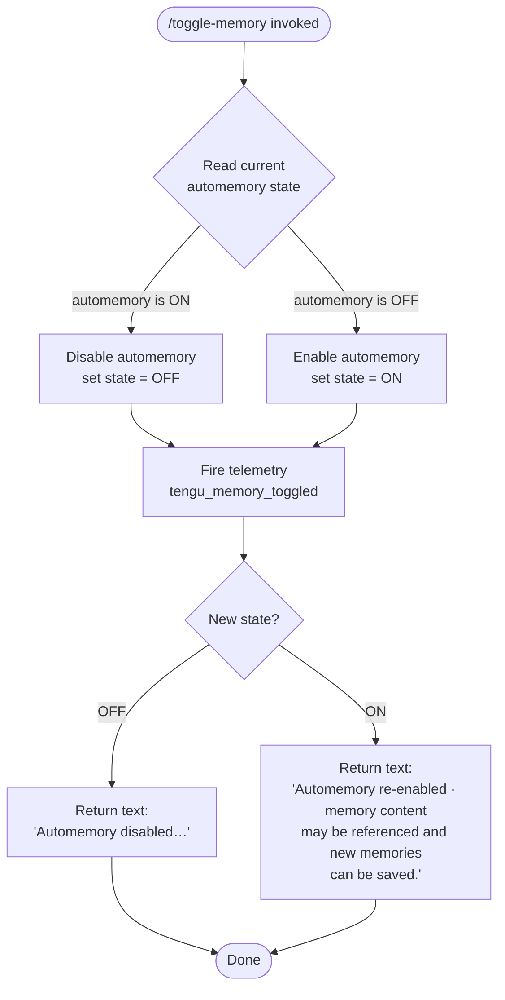

# `/toggle-memory`

> Analysis basis: CC v2.1.143 bundle.js (AST extraction + Claude interpretation)
> Minimum version: v2.1.143

---

## Overview

The `/toggle-memory` command flips the automemory feature on or off for the current session. When automemory is disabled, Claude Code will neither reference saved memory content nor persist new memories; invoking the command again re-enables those behaviors. The toggle state is session-scoped and is communicated back to the user as a plain-text response.

---

## Registration

| Field | Value |
|---|---|
| type | `local` |
| name | `toggle-memory` |
| description | `Toggle automemory off/on for this session` |
| supportsNonInteractive | `false` |
| thinClientDispatch | `post-text` |
| isHidden | `false` |
| module_id | `s5q` |

Analysis basis: CC v2.1.143 bundle.js:+10612554

---

## Input Branching

The command accepts no user-supplied arguments. All branching is driven by the **current automemory state** at invocation time.



Analysis basis: CC v2.1.143 bundle.js:+10612107 – +10612391

---

## Behavioral Spec

### Command Handler — Toggle Automemory

```
function handleToggleMemory(context):
    currentState  = readAutomemoryState(context)        // calls getAutomemoryState
    newState      = NOT currentState

    writeAutomemoryState(context, newState)             // calls setAutomemoryState

    emitTelemetry("tengu_memory_toggled", {
        new_state: newState
    })                                                  // immediately after state write

    if newState == OFF:
        message = buildDisabledMessage()                // derived from UI string constants
    else:
        message = "Automemory re-enabled · memory content may be referenced " +
                  "and new memories can be saved."

    return Response(kind="text", body=message)
```

Analysis basis: CC v2.1.143 bundle.js:+10612107 (getAutomemoryState call), +10612119 (setAutomemoryState call), +10612126 (dispatch/return call), +10612128 (telemetry emit), +10612174 (response kind `"text"`), +10612391 (re-enabled message literal)

### Response Construction

The command always returns a response object whose `kind` field is the string `"text"`.

```
function buildTextResponse(body: string) -> Response:
    return Response {
        kind : "text",          // literal "text" — loc +10612174
        body : body
    }
```

The `thinClientDispatch` registration value `"post-text"` instructs thin-client environments to post this text response directly into the conversation stream rather than handling it as a structured action.

Analysis basis: CC v2.1.143 bundle.js:+10612174, +10612554

### Non-Interactive Guard

`supportsNonInteractive` is `false`, meaning the command is rejected before the handler runs when Claude Code is invoked in a non-interactive (headless / pipe) context. No state mutation or telemetry fires in that code path.

Analysis basis: CC v2.1.143 bundle.js:+10612554

---

## State & Side Effects

| Item | Detail |
|---|---|
| Telemetry | `tengu_memory_toggled` — fired once per invocation, after the state flip, before the response is returned (bundle.js:+10612128) |
| Automemory state | Toggled between `ON` and `OFF` in session-scoped application state via `setAutomemoryState` (bundle.js:+10612119) |
| Response channel | Plain `"text"` message posted to the conversation; thin-client dispatch strategy: `post-text` (bundle.js:+10612174, +10612554) |
| Hook registration | <!-- TODO: not found in depth-2 traversal; needs --depth 4 --> |
| Sound | <!-- TODO: not found in depth-2 traversal; needs --depth 4 --> |
| Persistence beyond session | <!-- TODO: not found in depth-2 traversal; needs --depth 4 --> |

---

## Version History

| Version | Change |
|---|---|
| v2.1.143 | Initial analysis — command registered as `local`, non-hidden, non-interactive unsupported, `thinClientDispatch: post-text` |

---

## Common Mistakes

1. **Expecting the toggle to persist across sessions.** The description explicitly scopes the toggle to "this session." Starting a new Claude Code session will reset automemory to its default state; re-running `/toggle-memory` is required each session if a non-default state is desired.

2. **Passing arguments to the command.** The handler reads no user-supplied input — any text after `/toggle-memory` is silently ignored. The only input that matters is the pre-existing automemory state.

3. **Running in non-interactive mode and expecting a result.** Because `supportsNonInteractive` is `false`, scripted or headless invocations will not execute the toggle; operators automating Claude Code via pipes or CI should not rely on this command.

4. **Assuming the re-enabled message means memories were immediately reloaded.** The re-enabled confirmation string (`"Automemory re-enabled · memory content may be referenced and new memories can be saved."`) describes the restored capability, not a guarantee that a specific memory was loaded at that exact moment.

5. **Toggling rapidly and checking telemetry counts.** Each invocation emits exactly one `tengu_memory_toggled` event regardless of direction (on→off or off→on). Downstream analytics that need directionality must correlate the event with the resulting session state independently.

---

## Appendix — Identifier Mapping

> For bundle debugging only. Identifiers change across versions.

| Identifier | Role |
|---|---|
| `AP7` | Command handler function — the top-level entry point for `/toggle-memory` |
| `gd` | `getAutomemoryState` — reads the current automemory enabled/disabled flag from session state |
| `IV8` | `setAutomemoryState` — writes the new automemory flag into session state |
| `d` | `dispatchTextResponse` — constructs and returns the final `"text"`-kind response object |