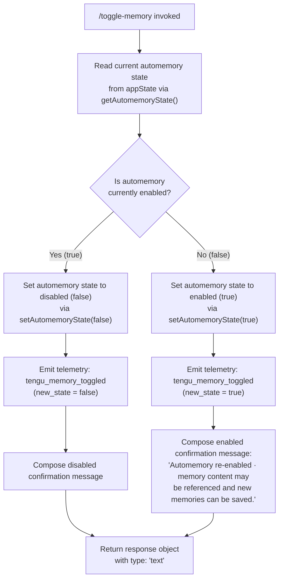

# `/toggle-memory`

> Analysis basis: CC v2.1.143 bundle.js (AST extraction + Claude interpretation)
> Minimum version: v2.1.143

---

## Overview

The `/toggle-memory` command toggles the automemory subsystem on or off for the current session. When invoked, it reads the current automemory state, flips it, emits a telemetry event, and outputs a `"text"` response message confirming the new state. Because the command is registered as `local` and does not support non-interactive mode, it is intended for interactive terminal sessions only.

---

## Registration

| Field | Value |
|---|---|
| type | `local` |
| name | `toggle-memory` |
| description | Toggle automemory off/on for this session |
| supportsNonInteractive | `false` |
| thinClientDispatch | `post-text` |
| isHidden | `false` |
| module\_id | `s5q` |

Analysis basis: CC v2.1.143 bundle.js:+10612554

---

## Input Branching

The command accepts no user-supplied arguments. Its entire branching logic depends on the **current automemory enabled state** read from application state at invocation time.



Analysis basis: CC v2.1.143 bundle.js:+10612107 (call to `getAutomemoryState`), +10612119 (call to `setAutomemoryState`), +10612126 (call to `dispatchResponse`), +10612128 (telemetry emit), +10612174 (response type literal `"text"`), +10612391 (re-enabled message literal)

---

## Behavioral Spec

### Toggle Automemory State

The command handler reads the live automemory flag, negates it, persists the new value, fires a telemetry event, and returns a text message to the terminal.

```
function handleToggleMemory(appState):

    currentState = getAutomemoryState(appState)
    newState     = NOT currentState

    setAutomemoryState(appState, newState)

    emitTelemetry("tengu_memory_toggled", { new_state: newState })

    if newState == true:
        message = "Automemory re-enabled · memory content may be referenced and new memories can be saved."
    else:
        message = <!-- TODO: not found in depth-2 traversal; needs --depth 4 -->

    return buildResponse(type="text", content=message)
```

Analysis basis: CC v2.1.143 bundle.js:+10612107 (`getAutomemoryState` call), +10612119 (`setAutomemoryState` call), +10612126 (`buildResponse` call), +10612128 (`tengu_memory_toggled` emit), +10612174 (`"text"` type constant), +10612391 (re-enabled message string)

### Response Object Shape

The return value of the handler is a structured response whose `type` field is always the string literal `"text"`.

```
function buildResponse(type, content):
    return {
        type:    type,      // always "text"  (bundle.js:+10612174)
        content: content
    }
```

Analysis basis: CC v2.1.143 bundle.js:+10612174

### Thin-Client Dispatch

Because `thinClientDispatch` is set to `"post-text"`, thin-client environments forward the resulting text response back through the standard post-text pipeline rather than handling it locally.

Analysis basis: CC v2.1.143 bundle.js:+10612554

---

## State & Side Effects

| Item | Detail |
|---|---|
| Telemetry | `tengu_memory_toggled` — fired once per invocation, immediately after the state flip (bundle.js:+10612128) |
| appState changes | The automemory enabled flag in `appState` is mutated from its previous boolean value to its logical inverse via `setAutomemoryState` (bundle.js:+10612119) |
| Hook registration | <!-- TODO: not found in depth-2 traversal; needs --depth 4 --> |
| Sound | <!-- TODO: not found in depth-2 traversal; needs --depth 4 --> |
| Persistence scope | Session-scoped; the toggle applies only to the running session (registration description: "for this session", bundle.js:+10612554) |
| Non-interactive support | Not supported (`supportsNonInteractive: false`); invoking from a non-interactive context is undefined behavior per registration (bundle.js:+10612554) |

---

## Version History

| Version | Change |
|---|---|
| v2.1.143 | Initial analysis |

---

## Common Mistakes

1. **Invoking in non-interactive mode**: `/toggle-memory` has `supportsNonInteractive: false`. Calling it from scripts or piped input contexts is not supported and may produce no output or an error.
2. **Expecting persistent cross-session state**: The description explicitly scopes the toggle to "this session." Restarting Claude Code resets automemory to its default state; the toggle does not write to a persistent configuration file (as far as depth-2 traversal reveals).
3. **Assuming arguments are accepted**: The command registration defines no argument schema. Passing any text after `/toggle-memory` has no defined effect and may be silently ignored.
4. **Expecting a disabled-state confirmation message**: The re-enabled confirmation string is confirmed in the bundle (bundle.js:+10612391). The corresponding disabled-state message was not found within the depth-2 call graph traversal; do not rely on its exact wording matching the enabled message's format.
5. **Conflating `thinClientDispatch: "post-text"` with interactive output**: In thin-client deployments the response travels through the post-text pipeline, not a direct terminal write; downstream consumers should handle it accordingly.

---

## Appendix — Identifier Mapping

> For bundle debugging only. Identifiers change across versions.

| Identifier | Role |
|---|---|
| `AP7` | Command handler function — top-level entry point for `/toggle-memory` |
| `gd` | `getAutomemoryState` — reads the current automemory boolean from `appState` |
| `IV8` | `setAutomemoryState` — writes the new automemory boolean into `appState` |
| `d` | `buildResponse` / dispatch helper — constructs and returns the `"text"` response object |