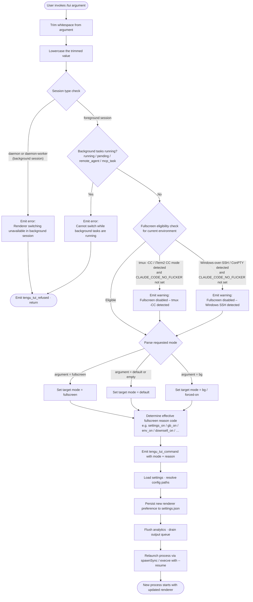

# `/tui`

> Analysis basis: CC v2.1.143 bundle.js (AST extraction + Claude interpretation)
> Minimum version: v2.1.143

---

## Overview

The `/tui` command allows users to switch the terminal UI renderer between `default` and `fullscreen` modes at runtime. It validates the current session context and active background task state before committing a renderer change, and triggers a full process relaunch to apply the new renderer. If the switch cannot be performed safely (background session, running tasks, or environment-forced overrides), the command emits an explanatory error message instead of proceeding.

---

## Registration

| Field | Value |
|---|---|
| type | `local-jsx` |
| name | `tui` |
| description | `Set the terminal UI renderer (default \| fullscreen)` |
| argumentHint | `[default\|fullscreen]` |
| module_id | `bXq` |

Analysis basis: CC v2.1.143 bundle.js:+11390923

---

## Input Branching

The command handler trims and lowercases the raw argument, then follows a multi-stage gate sequence before applying the renderer change.



Analysis basis: CC v2.1.143 bundle.js:+11388898, +11389068, +11389187, +11389526, +11389652, +11389866, +11390126, +11390551

---

## Behavioral Spec

### 1. Argument Normalisation

```
function normaliseArgument(rawInput):
    trimmed = rawInput.trim()                    // strip leading/trailing whitespace
    normalised = trimmed.toLowerCase()           // case-insensitive comparison
    return normalised
```

Analysis basis: CC v2.1.143 bundle.js:+11388898 (trim call), +14528099 (toLowerCase call)

---

### 2. Background-Session Gate

The handler resolves the current session type. If the session type is `"daemon"` or `"daemon-worker"`, the command is refused immediately.

```
function checkSessionAllowed(sessionType):
    if sessionType in ["daemon", "daemon-worker"]:
        displayError(
            "Renderer switching isn't available in a background session" +
            " — press ← to detach and run /tui from a foreground session."
        )
        emitTelemetry("tengu_tui_refused")
        return REFUSED
    return ALLOWED
```

Blocking message (exact string from bundle):
> `"Renderer switching isn't available in a background session — press ← to detach and run /tui from a foreground session."`

Analysis basis: CC v2.1.143 bundle.js:+11389201, +11389654

---

### 3. Active-Task Gate

The handler inspects the set of background tasks for any entry whose state is one of `"running"`, `"pending"`, `"remote_agent"`, or `"mcp_task"`. If any such task exists, the switch is blocked.

```
function checkNoActiveTasks(taskList):
    blocked_states = {"running", "pending", "remote_agent", "mcp_task"}
    for task in taskList:
        if task.state in blocked_states:
            displayError(
                "Cannot switch renderers while background tasks are running" +
                " — wait for them to finish (or stop them via /tasks), then run /tui again."
            )
            emitTelemetry("tengu_tui_refused")
            return REFUSED
    return ALLOWED
```

Blocking message (exact string from bundle):
> `"Cannot switch renderers while background tasks are running — wait for them to finish (or stop them via /tasks), then run /tui again."`

Analysis basis: CC v2.1.143 bundle.js:+11389565, +11389587, +11389608, +11389633, +11389695, +11389654

---

### 4. Fullscreen Eligibility Detection

Before resolving the final mode, the implementation detects two environment conditions that auto-disable fullscreen unless overridden by `CLAUDE_CODE_NO_FLICKER=1`.

#### 4a. tmux Control-Client Detection

```
function detectTmuxControlClient(termProgram):
    if termProgram.startsWith("screen") or termProgram.startsWith("tmux"):
        result = spawnSync("tmux", ["display-message", "-p", "#{client_control_mode}"],
                           {encoding: "utf8", timeout: 2000})
        if result indicates control-client mode:
            return true
    return false
```

Warning message when detected (and `CLAUDE_CODE_NO_FLICKER` is unset):
> `"fullscreen disabled: tmux -CC (iTerm2 integration mode) detected · set CLAUDE_CODE_NO_FLICKER=1 to override"`

Analysis basis: CC v2.1.143 bundle.js:+3331099, +3331124, +3331309, +3331327, +3331332, +3331368, +3331383, +3331999

#### 4b. Windows-over-SSH / ConPTY Detection

```
function detectWindowsSSH(platform, termProgram):
    if platform == "windows":
        // checks for ConPTY re-rendering artifacts over SSH
        return true
    return false
```

Warning message when detected (and `CLAUDE_CODE_NO_FLICKER` is unset):
> `"fullscreen disabled: Windows over SSH (ConPTY re-rendering) detected · set CLAUDE_CODE_NO_FLICKER=1 to override"`

Analysis basis: CC v2.1.143 bundle.js:+3331593, +3332185

---

### 5. Renderer Mode Resolution

After gates pass, the implementation maps the normalised argument to one of the known renderer tokens and computes an internal reason code used for telemetry and settings persistence.

```
function resolveMode(normalisedArg, envFlags, settingsValue, geofenceFlags):
    // accepted mode tokens
    if normalisedArg == "fullscreen":
        targetMode = "fullscreen"
    else if normalisedArg == "default" or normalisedArg == "":
        targetMode = "default"
    else if normalisedArg == "bg":
        targetMode = "bg"           // background / force-on variant

    // derive reason code for telemetry
    reason = determineReasonCode(envFlags, settingsValue, geofenceFlags)
    // reason is one of:
    //   "env_off" | "env_on" | "tmux_cc_auto_off" | "win_ssh_auto_off"
    //   "bg_forced_on" | "settings_on" | "settings_off"
    //   "downsell_on" | "gb_on" | "gb_off"

    return (targetMode, reason)
```

Known reason codes (from bundle literals):

| Reason Code | Meaning |
|---|---|
| `env_off` | `CLAUDE_CODE_DISABLE_ALTERNATE_SCREEN` env var forces default |
| `env_on` | `CLAUDE_CODE_FORCE_FULLSCREEN_UPSELL` env var forces fullscreen |
| `tmux_cc_auto_off` | Automatically disabled due to tmux -CC detection |
| `win_ssh_auto_off` | Automatically disabled due to Windows SSH detection |
| `bg_forced_on` | Background mode forced on |
| `settings_on` | Fullscreen enabled via settings |
| `settings_off` | Fullscreen disabled via settings |
| `downsell_on` | Upsell/downsell logic engaged |
| `gb_on` | Geofence/gate-B on |
| `gb_off` | Geofence/gate-B off |

Analysis basis: CC v2.1.143 bundle.js:+3332389, +3332415, +3332354, +3332770, +3332828, +3332852, +3332886, +3332958, +3333013, +3333047, +3333120, +3333185, +3333193

---

### 6. Settings Persistence

The resolved mode is written to the user settings file before relaunch.

```
function persistRendererSetting(targetMode):
    settingsPath = join(homedir(), ".claude", "settings.json")
    existingSettings = readSettings(settingsPath)
    existingSettings["renderer"] = targetMode
    writeSettings(settingsPath, existingSettings)
```

Settings file paths observed in traversal:
- User settings: `~/.claude/settings.json` (Analysis basis: CC v2.1.143 bundle.js:+1197610, +1197620)
- Local settings: `~/.claude/settings.local.json` (Analysis basis: CC v2.1.143 bundle.js:+1197682)

Analysis basis: CC v2.1.143 bundle.js:+1197378, +1197386, +1197395

---

### 7. Telemetry Emission

```
function emitTuiCommandEvent(targetMode, reasonCode, uptimeSeconds):
    emitTelemetry("tengu_tui_command", {
        mode: targetMode,
        reason: reasonCode,
        uptime: Math.round(process.uptime())
    })
```

Analysis basis: CC v2.1.143 bundle.js:+11390126, +11390205, +11390216

---

### 8. Relaunch Sequence

After persisting settings and emitting telemetry, the process re-execs itself with the `--resume` flag so that the new renderer takes effect from a fresh process start.

```
function performRelaunch():
    flushAnalyticsQueue(timeout=30000)         // "flush timeout (relaunch)"
    drainOutputQueue()                         // XSH / at_.drain
    removeAllProcessListeners()                // SIGINT, SIGTERM, SIGHUP
    registerExitHandlers()                     // beforeExit, exit
    newArgv = currentArgv + ["--resume"]
    spawnSyncOrExecve(currentExecutable, newArgv, {stdio: "inherit"})
    process.exit(0)
```

Timeout constants:
- Flush timeout (relaunch): 30 000 ms (Analysis basis: CC v2.1.143 bundle.js:+11385864)
- Cleanup timeout: referenced as `"cleanup timeout"` (Analysis basis: CC v2.1.143 bundle.js:+11385926)
- Analytics flush timeout: referenced as `"analytics flush timeout"` (Analysis basis: CC v2.1.143 bundle.js:+11385982)
- Abort timeout: 500 ms (Analysis basis: CC v2.1.143 bundle.js:+5228946)

Analysis basis: CC v2.1.143 bundle.js:+11385802, +11385843, +11385856, +11385915, +11385971, +11386320, +11386350, +11386377, +11386466, +11386507, +11386626

---

### 9. Environment Variable Overrides

| Environment Variable | Effect |
|---|---|
| `CLAUDE_CODE_NO_FLICKER` | Overrides auto-disable of fullscreen for tmux-CC and Windows-SSH environments |
| `CLAUDE_CODE_DISABLE_ALTERNATE_SCREEN` | Forces renderer to `default` (reason: `env_off`) |
| `CLAUDE_CODE_FORCE_FULLSCREEN_UPSELL` | Forces fullscreen upsell path (reason: `env_on`) |

Analysis basis: CC v2.1.143 bundle.js:+11387208, +11387233, +11387272

---

## State & Side Effects

| Item | Detail |
|---|---|
| Telemetry — `tengu_tui_refused` | Fired when the command is blocked (background session or active tasks) |
| Telemetry — `tengu_tui_command` | Fired on every successful switch attempt; carries `mode`, `reason`, and `uptime` |
| Telemetry — `tengu_amber_creek` | Fired inside the fullscreen-mode resolution path |
| Telemetry — `tengu_pewter_brook` | Fired inside the fullscreen-mode resolution path |
| Settings write | `~/.claude/settings.json` is updated with the new renderer value before relaunch |
| Process relaunch | After a successful switch, the process re-execs itself with `--resume`; all existing signal listeners are removed and re-registered |
| Output queue drain | The output/write queue (`at_.drain`) is flushed before relaunch to prevent data loss |
| Analytics flush | In-flight analytics events are flushed before relaunch (30 000 ms timeout) |
| Cache clear | Internal caches (`kV6`, `EZ8`) are cleared as part of the settings-reload path |
| Hook registration | `at_.register` is called during the relaunch setup path |

Analysis basis: CC v2.1.143 bundle.js:+11389654, +11390126, +3332572, +3332480, +57020, +26086, +26098, +56977

---

## Version History

| Version | Change |
|---|---|
| v2.1.143 | Initial analysis |

---

## Common Mistakes

1. **Running `/tui` inside a background/daemon session.** The command is gated to foreground sessions only. Detach from the background session first, then invoke `/tui` in a foreground terminal.

2. **Running `/tui fullscreen` while background tasks are active.** The switch is blocked until all tasks with states `running`, `pending`, `remote_agent`, or `mcp_task` have completed or been stopped via `/tasks`.

3. **Expecting an instant in-process renderer switch.** The renderer change requires a full process relaunch (`--resume`). All unsaved in-memory state that is not covered by the resume mechanism will be lost.

4. **Assuming `fullscreen` always takes effect in tmux or Windows-SSH environments.** Both environments are auto-detected and fullscreen is suppressed unless `CLAUDE_CODE_NO_FLICKER=1` is set explicitly.

5. **Passing an unrecognised mode token.** Only `default`, `fullscreen`, and `bg` are valid tokens. Any other value will not match a known mode path.

6. **Expecting the argument to be case-sensitive.** The argument is lowercased before evaluation; `Fullscreen` and `FULLSCREEN` are both accepted.

---

## Appendix — Identifier Mapping

> For bundle debugging only. Identifiers change across versions.

| Identifier | Role |
|---|---|
| `Hv7` | Top-level `/tui` command handler function |
| `A` | Normalised argument string (post-trim, post-lowercase) |
| `f` | File/stream handle used during relaunch cleanup |
| `q` | Secondary file/stream handle; also temp-file unlink path |
| `L` | Promise/task tracking set (add/delete/finally) |
| `R_` | Settings load orchestrator (triggers `Lu`) |
| `Lu` | Core settings-from-disk loader |
| `ah` | Settings load sub-step A |
| `P1` | Performance mark emitter (records memory usage) |
| `px` | Dynamic `require` wrapper (loads `perf_hooks`) |
| `nm8` | Settings load telemetry + merge pipeline |
| `T8` | Log file appender (appendFileSync / mkdirSync) |
| `SV6` | Settings layer merger — step 1 |
| `j96` | Flag-settings layer handler |
| `oDA` | Policy-settings layer handler |
| `K` | Column-formatter for settings display (padEnd, width 40) |
| `k5H` | Settings path resolver (userSettings / projectSettings / localSettings) |
| `XB` | Settings validation / schema check |
| `nDA` | SDK-inline-settings layer handler |
| `WB` | Settings object builder / aggregator |
| `__` | Shared utility / identity helper |
| `fH6` | Settings builder sub-component F |
| `RV8` | Settings builder sub-component R |
| `_H6` | Settings builder sub-component underscore-H |
| `xjH` | Settings builder sub-component xj |
| `MH6` | Settings builder sub-component M |
| `V5H` | Settings builder sub-component V5 |
| `I5H` | Settings builder sub-component I5 |
| `Um8` | Settings builder sub-component U |
| `hDA` | Settings builder sub-component h |
| `vc` | Settings builder sub-component vc |
| `P96` | Settings builder sub-component P96 |
| `yV6` | Post-load settings finaliser |
| `rA` | Environment / terminal capability detector |
| `VRH` | Terminal-type registry checker |
| `u1_` | Terminal string renderer (uses `String`) |
| `Sq` | String conversion helper A |
| `xH` | String conversion helper B |
| `hl` | iTerm / multiplexer detection dispatcher |
| `kbL` | tmux control-client probe (spawnSync "display-message") |
| `NbL` | TERM_PROGRAM prefix checker (`startsWith`) |
| `v` | Telemetry event builder / logger |
| `G5K` | Telemetry transport layer |
| `tt_` | Telemetry encoder (TLK / ELK sub-encoders) |
| `H` | Random / timer utility (Math.random, setTimeout) |
| `hH` | JSON serialiser (JSON.stringify wrapper) |
| `_` | String uppercaser / set-like container |
| `P7` | Redaction / sensitive-value scrubber (`[REDACTED]`) |
| `h6A` | Header-map builder for telemetry |
| `cSH` | Terminal write wrapper |
| `X6A` | Raw terminal write (H.write) |
| `Z5K` | Conversation / file-write pipeline |
| `PSH` | Buffered output scheduler (clearTimeout / setTimeout / setImmediate) |
| `i8H` | Output chunk assembler |
| `x6` | Logging / debug output helper |
| `gv8` | Filesystem write helper L8 wrapper |
| `U6A` | Path-join + write helper |
| `p6A` | Atomic file rename helper (stat / rename / unlink) |
| `E5K` | Async append-file-with-mkdir helper |
| `h9` | Write-queue hook registrar (`at_.register`) |
| `x1_` | Boolean / platform string resolver |
| `ybL` | Fullscreen-mode decision tree entry point |
| `G6` | Renderer-state machine / mode applier |
| `m76` | Renderer sub-component M |
| `p76` | Renderer sub-component P |
| `Ts` | Renderer string formatter |
| `Ci6` | Renderer deduplication guard |
| `N6` | Renderer commit / timestamp recorder |
| `T1` | Session-type classifier |
| `cB` | Daemon / daemon-worker type constant holder |
| `d` | JSX element factory / React-compat helper |
| `$$H` | Fullscreen-mode context provider component |
| `p_` | Process relaunch orchestrator |
| `wO` | Pre-relaunch settings snapshot helper |
| `lm8` | Settings serialiser for relaunch |
| `AP` | Active-context / CWD resolver |
| `Tc` | File reader with encoding detection (UTF-8 / UTF-16) |
| `uM` | File stat + realpath helper (lstatSync / realpathSync) |
| `Bh6` | File-read sub-helper B |
| `Fh6` | File-read sub-helper F |
| `$8` | Filesystem error classifier (L8 wrapper) |
| `L8` | Low-level error-code normaliser |
| `nu8` | Timestamp recorder (RR6.set + Date.now) |
| `XXH` | Pre-relaunch settings + WB snapshot |
| `JC6` | Settings path joiner (pV.resolve / pV.dirname) |
| `yA6` | Atomic file write helper (randomBytes temp-file + fsync + rename) |
| `O` | Background-session state inspector |
| `N8` | Background-session type constant |
| `hz` | Cache clearer (kV6.clear / EZ8.clear) |
| `VR6` | Settings file writer (mkdir / readFile / appendFile / writeFile) |
| `S6` | Async-local-storage context getter (Uh6 / ph6.getStore) |
| `Uh6` | AsyncLocalStorage store accessor |
| `Ru8` | Settings merge helper R |
| `uu8` | Git-ignore checker for settings path |
| `$_` | Git-spawn wrapper (check-ignore) |
| `ySK` | Home-dir config path builder (pzA.homedir + ZR6.join) |
| `hy` | `.claude` directory path builder (pV.join) |
| `NH` | Error reporter / log-error dispatcher |
| `v_` | Error / String converter |
| `zq` | Error formatter |
| `A$A` | Error string builder |
| `kNK` | Error ring-buffer (Ch6 shift/push) |
| `DI` | Terminal environment probe (JetBrains / Cursor / VS Code / xterm.js) |
| `h56` | Terminal probe sub-component H |
| `hJ` | Terminal probe sub-component hJ |
| `vq_` | IDE terminal version detector (EpL) |
| `EpL` | Version-string parser |
| `P$H` | Terminal probe fallback handler |
| `ZpL` | Terminal column-count calculator (parseFloat / Math.min, max 20) |
| `Nq_` | Column-count sub-helper |
| `jF` | Renderer component factory |
| `Uu` | Renderer component builder (RSL / OO / TA6) |
| `RSL` | Renderer layout component (xH / Sw) |
| `Sw` | firstParty renderer sub-component |
| `OO` | Renderer output handler |
| `TA6` | Renderer async helper (A$A) |
| `uq` | User-account / billing-plan resolver |
| `N1q` | Account data fetcher (wC_ / I1q) |
| `wC_` | Account fetch orchestrator |
| `bp` | Account model (enterprise / team plan handler) |
| `I1q` | Local account file reader (readFileSync) |
| `K0H` | Account string formatter (xH) |
| `CXq` | Relaunch executor (twH wrapper) |
| `twH` | Full relaunch sequence (spawn, flush, exit) |
| `Xb` | Version-file path resolver (p58 / se) |
| `p58` | Version lookup via HJ6.join + zYH |
| `se` | Local-bin path builder (`.local/bin`) |
| `JM` | Array.isArray guard wrapper |
| `Ip` | Ink / React render instance holder |
| `V6` | GV-based component helper |
| `GV` | Core React/Ink render function |
| `SO6` | Interval-clear helper (oY_ / clearInterval) |
| `oY_` | clearInterval wrapper |
| `CEH` | Unmount / screen-clear helper (writeSync + unmount) |
| `qS` | Screen-clear sub-helper |
| `za6` | ANSI save/restore cursor emitter (`\x1b7` / `\x1b8`) |
| `N_8` | Scroll / render-frame helper (EV / X91 / P91) |
| `EV` | Scroll event emitter |
| `X91` | Frame-render sub-component |
| `P91` | Render-timing helper (Date.now / Math.max / Math.round) |
| `jf` | Promise race with timeout helper |
| `dZ` | Conversation-persistence helper (KL) |
| `KL` | Conversation save + hook (h9) |
| `XSH` | Output-queue drain caller (`at_.drain`) |
| `k_8` | Async cleanup Promise.all / Promise.race runner |
| `r8` | Timeout-with-abort helper (setTimeout / clearTimeout) |
| `yU_` | Post-relaunch Ink re-mount helper |
| `FK` | GV wrapper for re-mount |
| `vXq` | Native-library loader (bun:ffi / dlopen / execve) |
| `$` | Spawn-result accumulator (JZq) |
| `w` | Background-process pool manager (spawn / kill / SIGKILL) |
| `M` | Daemon process map manager (L.get / L.values) |
| `z` | Daemon state accessor (SH / mH / xN / Ox) |
| `XH` | String-coercion wrapper |
| `wX` | Pre-exit file writer (writeFileSync + av8.join) |