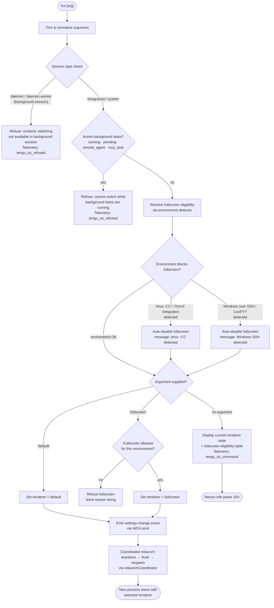

# `/tui`

> Analysis basis: CC v2.1.143 bundle.js (AST extraction + Claude interpretation)
> Minimum version: v2.1.143

---

## Overview

The `/tui` command lets the user switch the terminal UI renderer between `default` and `fullscreen` modes at runtime. It validates session context and active background task state before performing the switch, then relaunches the process with the selected renderer via a coordinated teardown-and-respawn sequence. If the environment is incompatible (tmux control mode, Windows-over-SSH, background session, active tasks), the command refuses and explains why.

---

## Registration

| Field | Value |
|---|---|
| type | `local-jsx` |
| name | `tui` |
| description | `Set the terminal UI renderer (default \| fullscreen)` |
| argumentHint | `[default\|fullscreen]` |
| module_id | `bXq` |
| load_inline | `true` |
| loc_byte | `11390923` |
| loc_byte_end | `11391105` |
| loc_line | `6979` |
| arbor_handler.name | `Hv7` |
| arbor_handler.fqn | `claude-2.1.143::Hv7` |
| arbor_handler.kind | `AsyncFunction` |
| arbor_handler.resolution_path | `module_id` |
| arbor_handler.n_hits | `0` |

Analysis basis: CC v2.1.143 bundle.js:+11390923

---

## Input Branching

The command has many distinct branches (session type, background-task state, environment compatibility, argument value, renderer state), so a Mermaid flowchart is used.



Analysis basis: CC v2.1.143 bundle.js:+11388898 – +11390650

---

## Behavioral Spec

### 1. Argument Normalization

```
async function tuiCommandHandler(args, context):
    rawArg = args.trim()                        // bundle.js:+11388898
    mode   = rawArg.toLowerCase()               // via normalizeArg
```

The handler calls `A.trim` (trimArg) immediately on the raw argument string, then lowercases through a second helper.

Analysis basis: CC v2.1.143 bundle.js:+11388898

---

### 2. Session-Type Guard

```
function isBackgroundSession(context):
    sessionType = getSessionType(context)       // T1 → cB
    return sessionType in ["daemon", "daemon-worker"]
                                                // literals:+2169293, +2169307
```

If the session is a daemon or daemon-worker (background session), the handler emits the telemetry event `tengu_tui_refused` and returns the error message:

> "Renderer switching isn't available in a background session — press ← to detach and run /tui from a foreground session."

(bundle.js:+11389201)

Analysis basis: CC v2.1.143 bundle.js:+11389187

---

### 3. Background-Task Guard

```
function hasActiveTasks(taskList):
    BLOCKING_STATES = ["running", "pending", "remote_agent", "mcp_task"]
                                                // literals:+11389565 – +11389633
    return taskList.some(t => BLOCKING_STATES.includes(t.state))
```

If any task is in a blocking state, the handler emits `tengu_tui_refused` and returns:

> "Cannot switch renderers while background tasks are running — wait for them to finish (or stop them via /tasks), then run /tui again."

(bundle.js:+11389695)

Analysis basis: CC v2.1.143 bundle.js:+11389526 – +11389695

---

### 4. Environment Compatibility Detection (`fullscreenEligibilityResolver`)

This sub-system (primary entry `rA`, calling `VRH`, `u1_`, `xH`, `hl`, `kbL`, `NbL`, `ybL`, `G6`) determines whether fullscreen is allowed and what reason string to show.

```
function resolveFullscreenEligibility(env):
    // Check tmux control-mode (iTerm2 integration)
    if terminalStartsWith("iTerm.app")              // literal:+3331031
       and (env.TERM contains "screen" or "tmux"):  // literals:+3331099, +3331124
        // Probe tmux: spawnSync tmux display-message -p "#{client_control_mode}"
        // timeout 2000ms, encoding utf8             // literals:+3331309 – +3331383
        if tmuxProbeSucceeds():
            return {
                allowed: false,
                reason: "tmux_cc_auto_off",         // literal:+3332852
                message: "fullscreen disabled: tmux -CC (iTerm2 integration mode) detected …"
                                                    // literal:+3331999
            }

    // Check platform
    if platform == "windows":                       // literal:+3331593
        // Windows over SSH / ConPTY detection
        return {
            allowed: false,
            reason: "win_ssh_auto_off",             // literal:+3332886
            message: "fullscreen disabled: Windows over SSH (ConPTY re-rendering) detected …"
                                                    // literal:+3332185
        }

    // Explicit env-var overrides
    if CLAUDE_CODE_NO_FLICKER == "no" or "off":     // literals:+26573, +26578
        return { allowed: false, reason: "env_off" } // literal:+3332770

    if CLAUDE_CODE_NO_FLICKER == "yes" or "on":     // literals:+26422, +26428
        return { allowed: true, reason: "env_on" }  // literal:+3332828

    // Background forced-on
    if context.bg:                                  // literal:+3332354
        return { allowed: true, reason: "bg_forced_on" } // literal:+3332958

    // Settings-level overrides
    settingValue = readFullscreenSetting()
    if settingValue == "fullscreen":                // literal:+3332389
        return { allowed: true, reason: "settings_on" }  // literal:+3333013
    if settingValue == "default":                   // literal:+3332415
        return { allowed: false, reason: "settings_off" } // literal:+3333047

    // Gradual-rollout / downsell flags
    if downsellFlag: return { allowed: true, reason: "downsell_on" }  // literal:+3333120
    if gbFlag:       return { allowed: true, reason: "gb_on" }        // literal:+3333185
    else:            return { allowed: false, reason: "gb_off" }      // literal:+3333193
```

Telemetry events fired inside this resolver:
- `tengu_pewter_brook` (bundle.js:+3332480)
- `tengu_amber_creek` (bundle.js:+3332572)

Analysis basis: CC v2.1.143 bundle.js:+11388923 – +3332569

---

### 5. No-Argument Display Path

```
function buildInfoPanel(eligibility, currentRenderer, knownModes):
    // Object.values over renderer registry      // bundle.js:+11389526
    rows = knownModes.map(m => {
        padded = m.padEnd(40)                    // literal:+14528173
        status = (m == currentRenderer) ? "active" : ""
        return [padded, eligibility[m].reason, status]
    })
    return renderTable(rows)
```

When called with no argument (or an unrecognized argument), the handler shows a table of available renderer modes, their current eligibility, and which is active.

Analysis basis: CC v2.1.143 bundle.js:+11389022 – +11389187

---

### 6. Renderer Switch & Relaunch (`relaunchCoordinator`)

```
async function applyRendererSwitch(newMode, context):
    // Persist new renderer choice to settings
    persistRendererSetting(newMode)

    // Emit change event so current render loop can react
    WCH.emit("renderer-change", newMode)         // bundle.js:+11389214 (via p_)

    // Load settings from disk (loadSettingsFromDisk)
    await loadSettingsFromDisk()                 // Lu → nm8 → k5H …
                                                 // perf mark: "loadSettingsFromDisk_start"
                                                 //            "loadSettingsFromDisk_end"

    // Coordinated teardown (CXq → twH)
    await coordinatedRelaunch({
        flushTimeout:   30000,    // literal:+11385864 "flush timeout (relaunch)"
        cleanupTimeout: "cleanup timeout",        // literal:+11385926
        analyticsFlushTimeout: "analytics flush timeout", // literal:+11385982
        signals: ["SIGINT","SIGTERM","SIGHUP"],   // literals:+11386291 – +11386310
        respawnArgs: ["--resume"],               // literal:+11385802
    })

    // Inside relaunch:
    //   1. Drain write queue (XSH → at_.drain)
    //   2. Flush scroll summary (tengu_scroll_summary)
    //   3. Remove all process listeners; re-attach SIGINT/SIGTERM/SIGHUP
    //   4. spawnSync new process (kXq.spawnSync)    // bundle.js:+11386377
    //   5. process.exit(128 + signal) on failure    // literal:+11386739
    //      or emit "relaunch_spawn_error"            // literal:+11386602
```

The relaunch sequence also checks for env vars:
- `CLAUDE_CODE_NO_FLICKER` — suppresses alternate-screen flicker (literal:+11387208)
- `CLAUDE_CODE_DISABLE_ALTERNATE_SCREEN` — disables alternate screen (literal:+11387233)
- `CLAUDE_CODE_FORCE_FULLSCREEN_UPSELL` — overrides upsell logic (literal:+11387272)

The `process.uptime()` value is captured (bundle.js:+11390216) and rounded (`Math.round`, bundle.js:+11390205) for inclusion in the `tengu_tui_command` telemetry payload.

Analysis basis: CC v2.1.143 bundle.js:+11389882 – +11390577

---

### 7. Settings Load Pipeline (supporting sub-system)

`loadSettingsFromDisk` (`Lu` → `nm8` → `k5H`) reads and merges settings in priority order:

| Layer | Key | Source |
|---|---|---|
| 1 | `flagSettings` | In-process flags (literal:+1194183) |
| 2 | `policySettings` | Policy file (literal:+1194205) |
| 3 | `userSettings` | `~/.claude/settings.json` (literals:+1197356, +1197610, +1197620) |
| 4 | `projectSettings` | Project-level settings (literal:+1197407) |
| 5 | `localSettings` | `settings.local.json` (literals:+1197429, +1197682) |
| 6 | `SDK inline settings` | Inline SDK config (literal:+1196459) |

Performance markers emitted: `"loadSettingsFromDisk_start"` / `"loadSettingsFromDisk_end"` (literals:+1204991, +1205047).
Telemetry logged: `"settings_load_started"` / `"settings_load_completed"` (literals:+1201720, +1202397).

Analysis basis: CC v2.1.143 bundle.js:+1204658 – +1205075

---

## State & Side Effects

| Item | Detail |
|---|---|
| Telemetry: `tengu_tui_refused` | Fired when command is rejected (background session or active tasks). bundle.js:+11389654 |
| Telemetry: `tengu_tui_command` | Fired on successful mode switch; payload includes `process.uptime()` rounded value. bundle.js:+11390126 |
| Telemetry: `tengu_pewter_brook` | Fired inside fullscreen eligibility resolver. bundle.js:+3332480 |
| Telemetry: `tengu_amber_creek` | Fired inside fullscreen eligibility resolver. bundle.js:+3332572 |
| Telemetry: `tengu_scroll_summary` | Fired during relaunch teardown. bundle.js:+5228657 |
| Telemetry: `tengu_slate_kestrel` | Fired in daemon/session context used by relaunch path. bundle.js:+10022817 |
| Telemetry: `tengu_bg_dispatch_sigkill_escalate` | Background worker escalation during teardown. bundle.js:+14503217 |
| Telemetry: `tengu_bg_dispatch_low_mem` | Low-memory event in background dispatcher. bundle.js:+14503796 |
| Telemetry: `tengu_bg_spare_enable` | Spare background session enabled. bundle.js:+14504411 |
| Telemetry: `tengu_bg_spare_claim` | Spare session claimed. bundle.js:+14504532 |
| Telemetry: `tengu_bg_spare_claim_fail` | Spare session claim failed. bundle.js:+14504795 |
| Telemetry: `tengu_daemon_control` | Daemon control event during teardown. bundle.js:+14538273 |
| Settings persisted | Renderer preference written to settings layer via `VR6` (settingsWriter). bundle.js:+11389882 |
| Event emitted | `WCH.emit("renderer-change", mode)` notifies the active render loop. bundle.js:+11389214 |
| Cache cleared | `hz` clears `kV6` and `EZ8` caches on settings reload. bundle.js:+26086, +26098 |
| Process replaced | `kXq.spawnSync` replaces the current process with `--resume`. bundle.js:+11386377 |
| File I/O | Settings written via `O5H.writeFile` / `O5H.appendFile`. bundle.js:+1063742, +1063680 |
| Temp file atomicity | Renderer settings use rename-based atomic write (`p6A` → `lv.rename`). bundle.js:+200215 |
| Sound | None observed in depth-2 traversal |
| Hook registration | `h9` → `at_.register` registers a drain hook used during flush. bundle.js:+56977 |

---

## Version History

| Version | Change |
|---|---|
| v2.1.143 | Initial analysis |

---

## Common Mistakes

1. **Running `/tui` in a background/daemon session.** The command will always refuse in `daemon` or `daemon-worker` session types. Detach to a foreground session first.
2. **Running `/tui fullscreen` while tasks are in `running`, `pending`, `remote_agent`, or `mcp_task` state.** Wait for all background tasks to complete (or cancel them via `/tasks`) before switching renderers.
3. **Expecting fullscreen to work in tmux `-CC` (iTerm2 control mode).** The environment detector probes tmux and automatically disables fullscreen in this configuration. Set `CLAUDE_CODE_NO_FLICKER=1` to override.
4. **Expecting fullscreen to work over Windows SSH / ConPTY.** ConPTY re-rendering is detected and fullscreen is automatically disabled. Set `CLAUDE_CODE_NO_FLICKER=1` to override.
5. **Omitting the argument expecting a toggle.** Without an argument, `/tui` shows an informational table of renderer modes and eligibility; it does not toggle the current mode.
6. **Assuming the switch is instantaneous.** The command performs a full process relaunch (flush → drain → `spawnSync`) with a 30-second flush timeout; there is a brief interruption in the terminal UI.

---

## Appendix — Identifier Mapping

> For bundle debugging only. Identifiers change across versions.

| Identifier | Role |
|---|---|
| `Hv7` | Main handler for `/tui` command (AsyncFunction) |
| `R_` | Settings initializer / loadSettingsFromDisk coordinator |
| `Lu` | Settings load orchestrator (calls perf marks, nm8, WB) |
| `ah` | Settings load sub-helper A |
| `P1` | Performance measurement / memory usage recorder |
| `px` | `perf_hooks` require wrapper |
| `nm8` | Settings load core (reads flag/policy/user/project/local layers) |
| `T8` | Logger: appendFileSync-based structured logger |
| `SV6` | Settings validation helper |
| `j96` | Flag settings merger |
| `oDA` | Policy settings reader |
| `k5H` | Multi-layer settings merge (user + project + local) |
| `XB` | User settings reader |
| `nDA` | SDK inline settings reader |
| `WB` | Settings state builder (aggregates all layers into app state) |
| `__` | Generic async utility / promise helper |
| `fH6` | Settings field: flagSettings |
| `RV8` | Settings field: policySettings |
| `_H6` | Settings field: userSettings |
| `xjH` | Settings field: projectSettings |
| `MH6` | Settings field: localSettings |
| `V5H` | Settings field: sdkSettings |
| `I5H` | Settings field: computedSettings |
| `Um8` | Settings field: effectiveSettings |
| `hDA` | Settings field: overrides |
| `vc` | Settings validation checker |
| `P96` | WSL detection helper |
| `yV6` | Settings post-processor |
| `rA` | Fullscreen eligibility resolver (top-level) |
| `VRH` | JetBrains IDE terminal detector |
| `u1_` | Terminal color capability detector |
| `Sq` | String coercion helper A |
| `xH` | String coercion helper B |
| `hl` | tmux control-mode probe dispatcher |
| `kbL` | tmux spawnSync probe executor |
| `NbL` | Terminal name prefix checker (iTerm.app) |
| `v` | Logger / debug output helper |
| `G5K` | Log formatting helper |
| `tt_` | Log transport A |
| `H` | Random / setTimeout utility or log buffer |
| `hH` | JSON.stringify log serializer |
| `P7` | Log line builder (replace / slice / lastIndexOf) |
| `h6A` | Log field mapper |
| `cSH` | Terminal write helper |
| `X6A` | Raw terminal write (H.write) |
| `Z5K` | Async file append/write manager |
| `PSH` | Batched write queue (setTimeout/setImmediate flush) |
| `i8H` | File write inner helper |
| `gv8` | File size checker (L8) |
| `U6A` | Path join + version helper |
| `p6A` | Atomic rename-based file write |
| `E5K` | Async mkdir + appendFile helper |
| `h9` | Drain hook registrar (at_.register) |
| `x1_` | Boolean capability resolver |
| `ybL` | Fullscreen eligibility decision tree |
| `G6` | Renderer state manager / subscription dispatcher |
| `m76` | Renderer state field A |
| `p76` | Renderer state field B |
| `Ts` | Renderer state serializer |
| `Ci6` | Renderer subscriber registry |
| `N6` | Renderer change notifier (Date.now, nhL) |
| `T1` | Session type resolver |
| `cB` | Session type constants |
| `d` | Generic data accessor |
| `$$H` | Renderer switch pre-flight (calls u1_, xH, hl, x1_, R_, G6) |
| `p_` | Settings persistence + event emit + relaunch coordinator |
| `wO` | Settings + state initializer (k5H + WB) |
| `lm8` | Settings reload helper (oDA, k5H, XB, nDA, Gc) |
| `AP` | File-context builder |
| `Tc` | File read helper (readFileSync, encoding detection) |
| `uM` | File stat / symlink resolver |
| `Bh6` | File path resolver helper |
| `Fh6` | File encoding helper |
| `$8` | Error categorizer (L8) |
| `L8` | Error code extractor |
| `nu8` | Timestamp recorder (RR6.set + Date.now) |
| `XXH` | Settings path resolver (JC6 + WB) |
| `JC6` | Config directory resolver (pV.resolve, pV.dirname) |
| `yA6` | Atomic file write with temp+rename (randomBytes, fchmodSync, fsyncSync) |
| `O` | Session/task state object |
| `N8` | Session state constants |
| `hz` | Cache invalidator (kV6.clear, EZ8.clear) |
| `VR6` | Settings file writer (mkdir, readFile, appendFile, writeFile) |
| `S6` | AsyncLocalStorage context reader (Uh6) |
| `Uh6` | AsyncLocalStorage getStore wrapper |
| `Ru8` | Settings merge helper (mL) |
| `uu8` | Git ignore checker ($_) |
| `$_` | Git check-ignore runner (KXH, D, _SK, NH) |
| `ySK` | Config path builder (homedir + .config) |
| `hy` | Claude config path builder (.claude/settings.json) |
| `NH` | Error handler / logger push (v_, xH, zq, kNK, xRH, Wc.logError) |
| `v_` | Error wrapper (Error, String) |
| `zq` | Error formatter (A$A) |
| `A$A` | Error string builder (xH) |
| `kNK` | Circular log buffer (Ch6.shift, Ch6.push) |
| `DI` | IDE/terminal environment detector |
| `h56` | Terminal environment helper A |
| `hJ` | Terminal environment helper B |
| `vq_` | Terminal capability probing sub-routine |
| `EpL` | Terminal capability probe helper |
| `P$H` | Terminal environment probe (hJ) |
| `ZpL` | Terminal dimension resolver (parseFloat, Math.min) |
| `Nq_` | Terminal dimension sub-helper |
| `jF` | Renderer JSX factory / component builder |
| `Uu` | Renderer root component |
| `RSL` | Renderer layout helper (xH, Sw) |
| `Sw` | Render transport (DA) |
| `OO` | Renderer output handler |
| `TA6` | Renderer state accessor (A$A) |
| `uq` | User/account context builder |
| `N1q` | Account data loader (wC_) |
| `wC_` | Account file reader (bp, I1q) |
| `bp` | Account data parser (DA, bf, j3, xA, G6) |
| `I1q` | Account file reader (Z1q.readFileSync, ND8, A1, MC_) |
| `K0H` | Account string helper (xH) |
| `CXq` | Relaunch entry point |
| `twH` | Relaunch orchestrator (teardown + flush + spawnSync + exit) |
| `Xb` | Claude binary path resolver |
| `p58` | Version directory walker (JM, HJ6.join, zYH) |
| `se` | Local bin path resolver (_78, Hw6.join) |
| `JM` | Array.isArray version list walker |
| `Ip` | Relaunch context object |
| `V6` | GV promise helper |
| `GV` | Generic async/deferred helper |
| `SO6` | Interval clearance helper (oY_) |
| `oY_` | clearInterval wrapper |
| `CEH` | Ink/terminal unmount + cleanup (eOH.writeSync, X4.get, H.unmount, qS, za6, xH) |
| `qS` | Terminal cleanup sub-helper |
| `za6` | Alternate screen escape writer (Qs.writeSync, n0H, d0H, h0) |
| `N_8` | Scroll/render teardown (EV, X91, d, P91, rA) |
| `EV` | Render teardown helper A |
| `X91` | Render teardown helper B |
| `P91` | Render frame finalizer (Date.now, Math.max/round, Object.assign, J91) |
| `jf` | Timeout-race promise (setTimeout, Promise.race, clearTimeout) |
| `dZ` | Drain coordinator (KL) |
| `KL` | Drain inner (h9) |
| `XSH` | Write queue drainer (at_.drain) |
| `k_8` | Analytics flush with race timeout (Promise.all/race, MI, ZF, r8) |
| `r8` | Abort-signal timeout helper (K, Error, q, setTimeout, O, clearTimeout, L.unref) |
| `yU_` | Post-relaunch environment setup (Ip, __, hXq.dirname, l$, FK) |
| `FK` | GV fork helper |
| `vXq` | Native library loader (bun:ffi, dlopen, execve for macos/linux) |
| `w` | Background worker manager (spawn, kill, SIGKILL, low-mem, spare sessions) |
| `M` | Daemon module accessor (SvH, THK, L.get, v, L.values, $, B95) |
| `z` | Daemon state object (SH, mH, xN, Ox) |
| `XH` | String coercion utility C |
| `wX` | State file writer (dSH.writeFileSync, av8.join) |