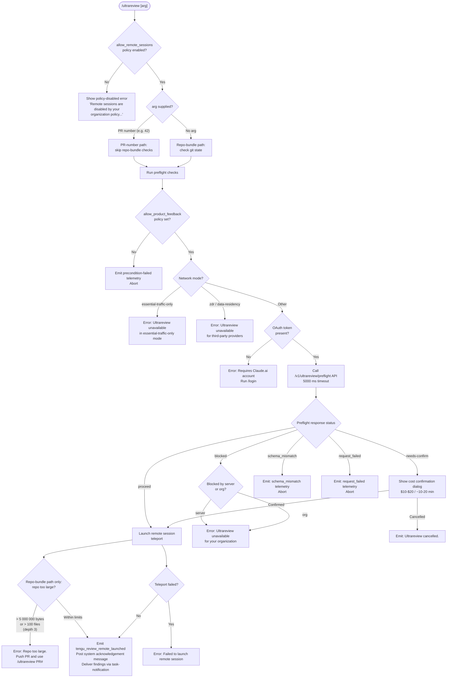

# `/ultrareview`

> Analysis basis: CC v2.1.143 bundle.js (AST extraction + Claude interpretation)
> Minimum version: v2.1.143

---

## Overview

`/ultrareview` launches a remote, cloud-hosted code-review session ("bughunter") against either a GitHub Pull Request number or the current local repository snapshot. The command performs a multi-stage preflight check—validating policy permissions, account authentication, network mode, repository state, and cost thresholds—before teleporting the session to Anthropic's infrastructure and delivering findings asynchronously via task-notification. Estimated cost is **$10–$20** and runtime is approximately **10–20 minutes**.

---

## Registration

| Field | Value |
|---|---|
| type | `local-jsx` |
| name | `ultrareview` |
| description | *(null — not present in registration object)* |
| module\_id | `Tjq` |
| loc\_line | 6784 |

Analysis basis: CC v2.1.143 bundle.js:+11265162

---

## Input Branching

The top-level command handler (`commandEntryPoint`) branches on two orthogonal axes: (1) whether `allow_remote_sessions` policy is set, and (2) whether a PR number argument was supplied. Sub-branches inside the main review dispatcher (`reviewDispatcher`) then switch on the preflight API response status.



Analysis basis: CC v2.1.143 bundle.js:+11262949, +11262952, +11262986, +10026148, +10026179, +11223685, +11227541, +11227686, +11227921, +11223815, +11223962, +11224095

---

## Behavioral Spec

### 1. Policy and Permission Guard (`permissionGuard`)

```
function permissionGuard(appState):
    if not appState.settings.has("allow_remote_sessions"):
        display error: "Remote sessions are disabled by your organization's
                        policy. Contact your organization admin to enable them."
        return BLOCKED

    if not appState.settings.get("allow_product_feedback"):
        emit telemetry: tengu_review_remote_precondition_failed
        return BLOCKED

    return ALLOWED
```

Analysis basis: CC v2.1.143 bundle.js:+11262952, +10026148, +10026179, +11224974

---

### 2. Network Mode Check (`networkModeCheck`)

```
function networkModeCheck(networkMode, provider):
    if networkMode == "essential-traffic-only":
        display error: "Ultrareview runs in Claude Code on the web and is
                        unavailable when essential-traffic-only mode is active."
        return BLOCKED

    if provider == "zdr" or provider == "data-residency":
        display error: "Ultrareview runs in Claude Code on the web and is
                        unavailable on third-party providers."
        return BLOCKED

    return ALLOWED
```

Analysis basis: CC v2.1.143 bundle.js:+11223779, +11223815, +11223923, +11223934, +11223962

---

### 3. Authentication Check (`authCheck`)

```
function authCheck(session):
    if session.authMode == "no-auth" or session.oauthToken == null:
        display error: "Ultrareview requires a Claude.ai account.
                        Run /login to authenticate."
        record reason: "no_oauth_token"
        return BLOCKED
    return ALLOWED
```

Analysis basis: CC v2.1.143 bundle.js:+11224074, +11224095, +11224167

---

### 4. Preflight API Call (`preflightApiCall`)

```
function preflightApiCall(session, orgHeader):
    endpoint = "/v1/ultrareview/preflight"
    headers  = { "teleport-org": orgHeader }
    timeout  = 5000  // milliseconds

    response = httpPost(endpoint, headers, timeout)

    emit telemetry: api_ultrareview_preflight   // note: string literal, not tengu_ event

    switch response.status:
        case "proceed":
            return proceed(response)
        case "needs-confirm":
            return awaitUserConfirmation(response)
        case "blocked":
            return handleBlocked(response)
        case "schema_mismatch":
            record reason: "schema_mismatch"
            return BLOCKED
        case network/request error:
            record reason: "request_failed"
            return BLOCKED
```

Analysis basis: CC v2.1.143 bundle.js:+11223685, +11223719, +11223742, +11224306, +11224334, +11224495, +11227541, +11227686, +11227921

---

### 5. Cost Confirmation Dialog (`costConfirmationDialog`)

```
function costConfirmationDialog(preflightData):
    // Shown only when preflight returns "needs-confirm"
    display dialog:
        estimated_cost    = "$10-$20"
        estimated_runtime = "~10–20 min"
        options           = ["confirm", "cancel"]

    if user chooses "confirm":
        emit telemetry: tengu_review_overage_dialog_shown
        return CONFIRMED

    if user chooses "cancel":
        display: "Ultrareview cancelled."
        return CANCELLED
```

Analysis basis: CC v2.1.143 bundle.js:+11223149, +11223241, +11227854, +11227921, +11263586, +11263891

---

### 6. Overage / Billing Guard (`overageGuard`)

```
function overageGuard(billingState):
    // Checks subscription type and org role before allowing launch
    acceptedPlans = [
        "stripe_subscription",
        "stripe_subscription_contracted",
        "apple_subscription",
        "google_play_subscription"
    ]
    acceptedTiers  = ["max", "pro"]
    acceptedRoles  = ["admin", "billing", "owner", "primary_owner"]

    if billingState.plan not in acceptedPlans
       or billingState.tier not in acceptedTiers:
        emit telemetry: tengu_review_overage_blocked
        display link:   "/admin-settings/"
        return BLOCKED

    return ALLOWED
```

Analysis basis: CC v2.1.143 bundle.js:+11263251, +11263373, +2928259, +2928286, +2928324, +2928350, +2023354, +2023365, +2023434, +2023442, +2023452, +2023460

---

### 7. Git Repository Validation (`gitRepoValidator`) — Repo-bundle path only

```
function gitRepoValidator(workingDirectory):
    // Step 1: confirm inside a git work-tree
    run: git rev-parse --is-inside-work-tree
    if fails:
        record reason: "not_in_git_repo"
        return BLOCKED

    // Step 2: resolve remote origin URL
    run: git config --get remote.origin.url
    if output empty:
        record reason: "no_git_remote"
        error: "No git remote URL found"
        return BLOCKED

    // Step 3: confirm remote is GitHub
    if "github.com" not in remoteUrl:
        return BLOCKED

    // Step 4: determine default branch
    run: git symbolic-ref --short refs/remotes/origin/HEAD
    defaultBranch = first of [parsed result, "main", "master"]

    // Step 5: determine current branch
    run: git rev-parse --verify --quiet HEAD
    run: git symbolic-ref --abbrev-ref HEAD

    // Step 6: find merge-base
    run: git merge-base <defaultBranch> HEAD

    // Step 7: compute diff stat
    run: git diff --shortstat <mergeBase>

    return OK
```

Analysis basis: CC v2.1.143 bundle.js:+6615049, +6615061, +1050851, +1050860, +1050868, +1050997, +11225687, +11226209, +11226220, +11226610, +11227125, +11227132, +1059429, +1059444, +1059601, +1059616, +1059626, +1059739, +1059746, +11228293, +11228518

---

### 8. Repository Size Guard (`repoSizeGuard`) — Repo-bundle path only

```
function repoSizeGuard(repoStats):
    MAX_DEPTH        = 3
    MAX_FILES        = 100
    MAX_BYTES        = 5_000_000

    if repoStats.fileCount > MAX_FILES
       or repoStats.totalBytes > MAX_BYTES:
        display error: "Repo is too large to bundle. Push a PR and use
                        `/ultrareview <PR#>` instead."
        return BLOCKED

    return ALLOWED
```

Analysis basis: CC v2.1.143 bundle.js:+7993133, +7993141, +7993160, +11226079

---

### 9. PR-Number Input Normaliser (`prNumberNormaliser`) — PR-number path only

```
function prNumberNormaliser(rawArg):
    arg = rawArg.trim().toLowerCase()
    // Strip leading "#" if present
    // Validate numeric; reject non-integer strings
    // Pad output string to minimum width with spaces as separator ("  ")
    return normalisedPrNumber
```

Analysis basis: CC v2.1.143 bundle.js:+11225950, +14526181, +14526202, +14528099

---

### 10. Remote Session Launch and Teleport (`remoteSessionLaunch`)

```
function remoteSessionLaunch(payload):
    // Build session payload with environment sentinel
    payload.env_key = "env_011111111111111111111113"

    // Compute token parameters
    tokenBase    = random integer in [5, 20]           // Math.random * (20-5) + 5
    tokenExpiry  = Math.floor(result)

    // Timing parameters
    POLL_MIN_MS  = 600
    POLL_MAX_MS  = 1800
    TICK_LOW     = 22
    TICK_HIGH    = 27

    // Dispatch session identifier string; max label width = 40 chars
    sessionId = String(payload.id).padStart(5)

    // Start async polling loop (setTimeout-based)
    schedulePoller(POLL_MIN_MS, POLL_MAX_MS, TICK_LOW, TICK_HIGH)

    // On success:
    emit telemetry: tengu_review_remote_launched
    post system message type "text":
        "The output above is already visible to the user. Briefly acknowledge it
         without repeating the target, URL, or billing note. Findings will
         arrive via task-notification."

    // On failure:
    emit telemetry: tengu_review_remote_teleport_failed
    display error: "Ultrareview failed to launch the remote session.
                    Check that this is a GitHub repo and try again."
```

Analysis basis: CC v2.1.143 bundle.js:+11228892, +11229051, +11229103, +11229126, +11229128, +11229192, +11229255, +11229259, +11229328, +11229331, +11230890, +11230406, +11262612, +11262799, +12638154, +12638193, +12638156

---

### 11. Bughunter Config Display (`bughunterConfigDisplay`)

```
function bughunterConfigDisplay(config):
    emit telemetry: tengu_review_bughunter_config
    // Renders cost range and timing estimate to the UI before confirmation
    show: estimatedCost    = "$10-$20"
    show: estimatedRuntime = "~10–20 min"
    // VaH renders the formatted config block; G6 handles display routing
```

Analysis basis: CC v2.1.143 bundle.js:+11223029, +11223032, +11223149, +11223241

---

### 12. Daemon Stop Sequence (`daemonStop`) — invoked on cancel or terminal error

```
function daemonStop(daemonHandle):
    emit telemetry: tengu_daemon_control
    action = "daemon_stop"

    try:
        stopDaemon(daemonHandle)
    catch:
        action = "daemon_stop_failed"
        // Failure is non-fatal; session considered ended
```

Analysis basis: CC v2.1.143 bundle.js:+14538195, +14538218, +14538235, +14538270, +14538273, +14538324

---

### 13. Organisation Membership Check (`orgMembershipCheck`)

```
function orgMembershipCheck(orgRecord):
    // Checks whether the authenticated user belongs to an enterprise or team org
    acceptedOrgTypes = ["enterprise", "team"]
    PRIORITY_LEVELS  = { firstParty: 1, other: 0 }

    if orgRecord.type not in acceptedOrgTypes:
        return NOT_ELIGIBLE

    // Also checks the essential-traffic network flag (string: "essential-traffic")
    // which is distinct from "essential-traffic-only" mode
    emit telemetry: tengu_slate_kestrel

    return ELIGIBLE
```

Analysis basis: CC v2.1.143 bundle.js:+10022610, +10022617, +10022637, +10022711, +10022817, +10022903, +10022938, +959252

---

## Constants and Limits

| Constant | Value | Analysis basis |
|---|---|---|
| Preflight API endpoint | `/v1/ultrareview/preflight` | bundle.js:+11223685 |
| Preflight request timeout | 5000 ms | bundle.js:+11223742 |
| Maximum repository file count (bundle path) | 100 files | bundle.js:+7993141 |
| Maximum repository size (bundle path) | 5 000 000 bytes | bundle.js:+7993160 |
| Maximum repository scan depth (bundle path) | 3 levels | bundle.js:+7993133 |
| Estimated cost range shown to user | `$10-$20` | bundle.js:+11223149 |
| Estimated runtime shown to user | `~10–20 min` | bundle.js:+11223241 |
| Session label maximum display width | 40 characters | bundle.js:+14528173 |
| Poll interval minimum | 600 ms | bundle.js:+11229255 |
| Poll interval maximum | 1800 ms | bundle.js:+11229259 |
| Token range minimum | 5 | bundle.js:+11229126 |
| Token range maximum | 20 | bundle.js:+11229128 |
| Tick low threshold | 22 | bundle.js:+11229328 |
| Tick high threshold | 27 | bundle.js:+11229331 |
| Branch list search minimum results | 10 | bundle.js:+1038172 |
| Session random factor base | 2 | bundle.js:+12638154 |
| Default branch fallbacks | `main`, `master` | bundle.js:+1059739, +1059746 |
| Git merge-base command | `merge-base` | bundle.js:+11226610 |

---

## State & Side Effects

| Item | Detail |
|---|---|
| Telemetry: `tengu_slate_kestrel` | Fired during org eligibility / firstParty check (bundle.js:+10022817) |
| Telemetry: `tengu_review_remote_precondition_failed` | Fired when `allow_product_feedback` policy is absent (bundle.js:+11224974) |
| Telemetry: `tengu_daemon_control` | Fired when stopping the background daemon, records `daemon_stop` or `daemon_stop_failed` action (bundle.js:+14538273) |
| Telemetry: `tengu_review_overage_blocked` | Fired when billing/subscription check prevents launch (bundle.js:+11263251) |
| Telemetry: `tengu_review_overage_dialog_shown` | Fired when the cost-confirmation dialog is displayed to the user (bundle.js:+11263586) |
| Telemetry: `tengu_review_bughunter_config` | Fired when the bughunter config block is rendered (bundle.js:+11223032) |
| Telemetry: `tengu_review_remote_teleport_failed` | Fired when the remote session teleport step fails (bundle.js:+11230406) |
| Telemetry: `tengu_review_remote_launched` | Fired on successful remote session launch (bundle.js:+11230890) |
| Hook registration | <!-- TODO: not found in depth-2 traversal; needs --depth 4 --> |
| appState changes | Writes `allow_remote_sessions` presence into settings; sets session-tracking state during polling loop |
| Sound | <!-- TODO: not found in depth-2 traversal; needs --depth 4 --> |
| System message injection | Posts a `"system"` role message with acknowledgement text after launch (bundle.js:+11263105, +11262612) |
| Async polling | Registers a `setTimeout`-based poller to track remote session progress (bundle.js:+12638193) |
| Git subprocess side effects | Spawns up to 6 git subprocesses in the repo-bundle path (rev-parse, config, symbolic-ref × 2, merge-base, diff) |
| Admin settings navigation | On billing block, surfaces `/admin-settings/` link (bundle.js:+11263373) |

---

## Version History

| Version | Change |
|---|---|
| v2.1.143 | Initial analysis — feature-spec derived from AST extraction |

---

## Common Mistakes

1. **Running without GitHub as the remote**: `/ultrareview` explicitly checks for `github.com` in the remote origin URL. Repositories hosted on GitLab, Bitbucket, or self-hosted Git servers will fail the repo-bundle path git validation. Use a GitHub-hosted PR number instead if the remote is non-GitHub.

2. **Running in essential-traffic-only network mode**: Organisations that restrict outbound traffic to essential endpoints only will receive an immediate block. The command cannot fall back to a local mode; there is no offline equivalent.

3. **Omitting `/login` before first use**: Without a valid Claude.ai OAuth token the command aborts immediately with a prompt to run `/login`. API-key-only configurations are insufficient.

4. **Exceeding the repository size limit on the no-argument path**: Repositories larger than 5 000 000 bytes or containing more than 100 files at depth ≤ 3 cannot be bundled. The correct workaround is to open a Pull Request and pass the PR number as the argument: `/ultrareview <PR#>`.

5. **Expecting synchronous results**: The review runs remotely and findings are delivered via task-notification, not inline in the terminal. Closing the session or terminal before the notification arrives will not cancel the remote analysis but will cause the notification to be missed.

6. **Using on third-party or data-residency providers**: The command is only available when Claude Code is operating through Anthropic's own infrastructure. Zero-data-residency (`zdr`) and other data-residency configurations are explicitly blocked.

7. **Incorrect org plan or role**: The cost-confirmation and billing paths require a paid subscription plan (`max` or `pro` tier with a recognised billing mechanism) and an org role of `admin`, `billing`, `owner`, or `primary_owner`. Users without these attributes will be blocked and directed to `/admin-settings/`.

---

## Appendix — Identifier Mapping

> For bundle debugging only. Identifiers change across versions.

| Identifier | Role |
|---|---|
| `CV7` | Top-level command entry-point component (ultrareview command handler) |
| `uq` | Permission and policy guard orchestrator |
| `N1q` | Essential-traffic network mode classifier |
| `bp` | Org membership and eligibility checker |
| `zq` | Network mode / traffic-class resolver |
| `K0H` | String conversion utility (wraps `String()`) |
| `H` | Random-delay / setTimeout scheduler for session polling |
| `cp_` | Git repository state resolver (working-tree, remote, branch, diff) |
| `A18` | Git work-tree presence check (`rev-parse --is-inside-work-tree`) |
| `d` | General-purpose async dispatcher / promise utility |
| `S6` | Git subprocess runner |
| `ky` | Remote origin URL resolver (`git config --get remote.origin.url`) |
| `oS1` | Repository size and file-count guard |
| `Y8` | Branch list / current branch resolver |
| `z` | Daemon lifecycle controller (stop / stop-failed) |
| `CV` | Default branch resolver (`symbolic-ref refs/remotes/origin/HEAD`) |
| `FJ` | Current branch resolver (`symbolic-ref --abbrev-ref HEAD`) |
| `K` | Diff-stat formatter (maps lines, pads columns) |
| `L` | Async task queue manager (add / delete / finally) |
| `$` | Session notification dispatcher |
| `lp_` | Preflight result router (proceed / blocked / needs-confirm) |
| `aJq` | Preflight API caller (`/v1/ultrareview/preflight`) |
| `mNH` | Bughunter config renderer |
| `af8` | Subscription / billing type checker |
| `xH` | String coercion helper |
| `lV` | Subscription plan validator |
| `QMH` | Billing metadata resolver |
| `Pu` | User account tier and role checker |
| `HA` | Subscription type classifier |
| `fq` | Payment provider type resolver |
| `N6` | Timestamp and session-record writer (`Date.now`) |
| `Zr` | Remote session launcher / teleport initiator |
| `VaH` | Bughunter config display renderer |
| `RV7` | Review mode dispatcher (PR-number vs. repo-bundle router) |
| `np_` | Core review payload builder and poller |
| `A` | Input string normaliser (toLowerCase) |
| `hV7` | PR list mapper |
| `dp_` | Cancellation / cleanup handler |