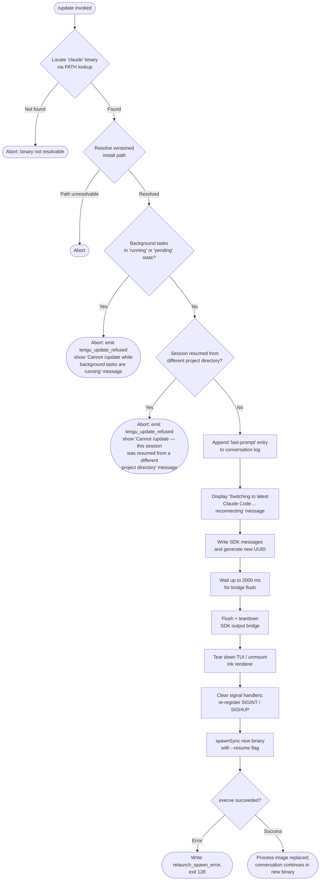

# `/update`

> Analysis basis: CC v2.1.143 bundle.js (AST extraction + Claude interpretation)
> Minimum version: v2.1.143

---

## Overview

The `/update` command performs an in-process hot-swap of the Claude Code CLI binary to the latest installed version, preserving the active conversation context. It resolves the target binary path, validates that preconditions are met (no background tasks running, no cross-directory session resume), tears down the current process's I/O and SDK bridge, then executes the new binary via `execve`-style replacement, passing `--resume` so the conversation continues seamlessly.

---

## Registration

| Field | Value |
|---|---|
| type | `local` |
| name | `update` |
| description | `Switch to the latest version (conversation continues)` |
| supportsNonInteractive | `false` |
| isHidden | `true` |
| module_id | `cTq` |

Analysis basis: CC v2.1.143 bundle.js:+11654476

---

## Input Branching

The command handler performs a series of guard checks before initiating the relaunch sequence. If any guard fails the command aborts with an error message and emits a `tengu_update_refused` telemetry event. The happy path tears down the running process and re-execs the new binary.



Analysis basis: CC v2.1.143 bundle.js:+11652271, +11652324, +11652632, +11652654, +11652735, +11652976, +11653469, +11653536, +11653539, +11653590, +11385802, +11386377, +11386602, +11386739

---

## Behavioral Spec

### 1. Binary and Path Resolution

```
function resolveBinaryPath():
    # Locate the 'claude' executable on PATH using Bun.which
    executablePath = findOnPath("claude")           # uses Bun.which
    if executablePath is null:
        return error("binary not found")

    # Derive the versioned install layout from the executable path:
    # Walk up from the executable to find the versions directory,
    # then resolve the path components through the home directory.
    homeDir = os.homedir()                          # dZ1.homedir
    versionedBase = path.join(homeDir, ".local", "share", "versions")
    # Build a candidate path array; join with platform separator
    parts = buildPathArray(executablePath, versionedBase)   # JM + HJ6.join
    binPath = path.join(versionedBase, "bin")       # Hw6.join

    return { executablePath, versionedBase, binPath }
```

Analysis basis: CC v2.1.143 bundle.js:+11652271, +11652274, +1050212, +7943694, +7943718, +7578316, +7578589, +7578598, +7578668

### 2. Guard: Background Task Check

```
function checkNoBackgroundTasks(appState):
    tasks = Object.values(appState.backgroundTasks)
    for task in tasks:
        if task.status == "running" or task.status == "pending":
            emitTelemetry("tengu_update_refused", { reason: "bg_tasks" })
            return Error(
                "Cannot /update while background tasks are running " +
                "— wait for them to finish, then try again."
            )
    return OK
```

Analysis basis: CC v2.1.143 bundle.js:+11652594, +11652632, +11652654, +11652735, +11652371

### 3. Guard: Cross-Directory Resume Check

```
function checkSameProjectDirectory(appState, currentCwd):
    resumedDir = appState.resumedProjectDirectory   # from getAppState
    if resumedDir is set and resumedDir != currentCwd:
        emitTelemetry("tengu_update_refused", { reason: "dir_mismatch" })
        return Error(
            "Cannot /update — this session was resumed from a different " +
            "project directory. Restart manually with --resume to continue " +
            "on the latest version."
        )
    return OK
```

Analysis basis: CC v2.1.143 bundle.js:+11652976, +11652371, +11653223

### 4. Pre-Relaunch Conversation Persistence

```
function persistConversationState(conversationLog, appState):
    # Strip any message whose role begins with "assistant-" prefix
    cleanedMessages = filterMessages(conversationLog, prefix="assistant-")
    # Append a sentinel "last-prompt" entry so the resumed session
    # knows where to continue
    conversationLog.appendEntry("last-prompt", cleanedMessages)
    # Write SDK-format messages for the bridge
    sdkMessages = buildSdkMessages(appState)        # O.writeSdkMessages
    newUUID = generateUUID()                        # QTq -> UP8.randomUUID
    setAppState({ pendingResumeId: newUUID })       # _.setAppState
```

Analysis basis: CC v2.1.143 bundle.js:+11652849, +11653277, +12128287, +12128307, +11653445, +11653465, +11651344, +11653302, +11653359

### 5. User-Facing Status Message

```
function showRelaunchMessage():
    # Emit a text-type content block with the transition message
    yield contentBlock(
        type = "text",
        text = "Switching to latest Claude Code… reconnecting"
    )
```

Analysis basis: CC v2.1.143 bundle.js:+11653469, +11652417

### 6. Bridge Flush and SDK Teardown

```
function flushAndTeardownBridge(outputBridge):
    # Race a timed flush against a hard 2000 ms deadline
    result = await Promise.race([
        outputBridge.flush(),                       # O.flush
        timeout(2000, label="bridge flush")
    ])
    # Unconditionally tear down the bridge regardless of flush result
    await outputBridge.teardown()                   # O.teardown
```

Flush timeout: 2000 milliseconds (bundle.js:+11653549).
Analysis basis: CC v2.1.143 bundle.js:+11653536, +11653539, +11653549, +11653554, +11653590

### 7. TUI Teardown and Terminal Restore

```
function teardownTerminalUI():
    # Stop any active interval-based spinners
    clearAllIntervals()                             # SO6 -> oY_

    # Unmount the Ink/React render tree
    inkInstance = renderRegistry.get()              # X4.get
    if inkInstance:
        inkInstance.unmount()                       # H.unmount

    # Restore terminal cursor / alternate screen state
    writeSync(ANSI_SAVE_CURSOR)                     # "\x1b7"
    writeSync(ANSI_RESTORE_CURSOR)                  # "\x1b8"

    # Perform fullscreen/scroll restore if terminal supports it
    # (checks for tmux-CC / iTerm2 / Ghostty / screen multiplexers)
    restoreScrollRegion()                           # N_8 -> rA
```

Analysis basis: CC v2.1.143 bundle.js:+11385819, +11385825, +5227192, +5227218, +5227269, +5227303, +5227351, +3666087, +3666220, +3666231, +11385831

### 8. Process Signal Reset and Relaunch

```
function relaunchProcess(newBinaryPath, currentArgv, currentEnv):
    # Drain any pending async tasks registered with the task tracker
    drainAsyncTasks()                               # XSH -> at_.drain

    # Wait for all cleanup promises with a 30 000 ms outer timeout
    await Promise.all([
        analyticsFlushWithTimeout(500, "analytics flush timeout"),
        cleanupPromisesWithTimeout(30000, "flush timeout (relaunch)")
    ])

    # Remove all existing signal listeners
    process.removeAllListeners("SIGINT")
    process.removeAllListeners("SIGHUP")

    # Register no-op handlers so signals during re-exec are absorbed
    process.on("SIGINT", noop)
    process.on("SIGHUP", noop)
    process.on("beforeExit", noop)
    process.on("exit", noop)

    # Spawn the new binary synchronously (replaces this process image)
    result = spawnSync(newBinaryPath, ["--resume", ...passedArgs], {
        stdio: "inherit",
        env: currentEnv
    })

    if result indicates error:
        writeErrorFile("relaunch_spawn_error")      # wX -> dSH.writeFileSync
        process.exit(128)

    # If execve-style replacement is used, signal the parent group
    process.kill(-process.pid, "SIGKILL")           # final escalation
```

Cleanup outer timeout: 30,000 milliseconds (bundle.js:+11385864).
Analytics flush timeout: 500 milliseconds (bundle.js:+5228946).
Exit code on spawn error: 128 (bundle.js:+11386739).
Analysis basis: CC v2.1.143 bundle.js:+11385843, +11385856, +11385915, +11385971, +11386179, +11386247, +11386253, +11386320, +11386350, +11386377, +11386466, +11386507, +11386599, +11386602, +11386626, +11386691, +11386739, +11385802

### 9. Fullscreen / Scroll Region Handling (Terminal Compatibility)

The scroll-restore path (`rA`) checks terminal environment before attempting full-screen manipulation:

```
function restoreScrollRegion(terminalEnv):
    if terminalEnv.isLocalAgent("local-agent"):
        # Check for known incompatible multiplexers
        if tmuxCCMode detected:            # "tmux -CC" + iTerm2 integration
            log("fullscreen disabled: tmux -CC (iTerm2 integration mode) detected")
            return
        if windowsOverSSH detected:        # ConPTY
            log("fullscreen disabled: Windows over SSH (ConPTY re-rendering) detected")
            return
    if fullscreenMode == "fullscreen":
        performScrollRestore()
    # Emit telemetry for the scroll/amber/pewter rendering paths
    emitTelemetry("tengu_scroll_summary")
    emitTelemetry("tengu_amber_creek")   # or "tengu_pewter_brook" depending on path
```

Analysis basis: CC v2.1.143 bundle.js:+3331844, +3331999, +3332185, +3332389, +5228657, +3332572, +3332480

---

## State & Side Effects

| Item | Detail |
|---|---|
| Telemetry — primary | `tengu_update_refused` emitted when either background-task guard or cross-directory guard triggers (bundle.js:+11652371) |
| Telemetry — scroll | `tengu_scroll_summary` emitted during TUI teardown scroll-restore phase (bundle.js:+5228657) |
| Telemetry — rendering | `tengu_amber_creek` and `tengu_pewter_brook` emitted based on terminal scroll-region rendering path taken (bundle.js:+3332572, +3332480) |
| Telemetry — indirect (bg daemon) | `tengu_bg_dispatch_sigkill_escalate`, `tengu_bg_low_mem_mb`, `tengu_bg_dispatch_low_mem`, `tengu_daemon_idle_exit`, `tengu_bg_spare_enable`, `tengu_bg_sendclaim_failed`, `tengu_bg_spare_claim`, `tengu_bg_spare_spawn`, `tengu_bg_spare_claim_fail`, `tengu_daemon_control` — emitted by daemon-layer functions reachable through relaunch cleanup, not directly by `/update` logic |
| Hook registration | A `last-prompt` entry is appended to the conversation log via `_.appendEntry` before re-exec (bundle.js:+12128287, +12128307) |
| appState changes | `_.getAppState` is read to check resume directory; `_.setAppState` is called to write the pending resume UUID before teardown (bundle.js:+11653223, +11653359) |
| SDK bridge | `O.writeSdkMessages`, `O.flush`, and `O.teardown` are called in sequence during the shutdown phase (bundle.js:+11653445, +11653539, +11653590) |
| Signal handlers | All existing `SIGINT` / `SIGHUP` listeners are removed via `process.removeAllListeners`; no-op replacements are installed before `spawnSync` (bundle.js:+11386320, +11386350) |
| Async task drain | `at_.drain` is called via `XSH` to drain the registered async-task queue (bundle.js:+11385915, +57020) |
| Terminal I/O | Ink renderer is unmounted; ANSI cursor-save/restore escape sequences are written to stdout; scroll region is conditionally restored (bundle.js:+5227269, +3666220, +3666231) |
| Sound | <!-- TODO: not found in depth-2 traversal; needs --depth 4 --> |
| Exit code on spawn failure | `128` — process exits with this code if `spawnSync` of the new binary fails (bundle.js:+11386739) |

---

## Version History

| Version | Change |
|---|---|
| v2.1.143 | Initial analysis |

---

## Common Mistakes

1. **Running `/update` during an active background task** — The command will be refused with the message *"Cannot /update while background tasks are running — wait for them to finish, then try again."* Wait for all background tasks to reach a terminal state before retrying.

2. **Running `/update` after resuming from a different project directory** — If the session was resumed via `--resume` while the working directory differs from the original session's project directory, the command will be refused with a message directing you to restart manually with `--resume`.

3. **Expecting a fully interactive response** — `/update` is `isHidden: true` and `supportsNonInteractive: false`. It is not surfaced in command-completion menus and must be typed in full. It cannot be invoked from non-interactive (piped/headless) sessions.

4. **Assuming the process PID is preserved** — `/update` performs a full process-image replacement via `spawnSync` / `execve`. The resulting process has a new PID; any external tooling tracking the original PID will lose the handle.

5. **Expecting the flush to always complete** — The bridge flush is raced against a hard 2,000 ms timeout. Under high I/O load, in-flight messages may be dropped before the new binary takes over.

---

## Appendix — Identifier Mapping

> For bundle debugging only. Identifiers change across versions.

| Identifier | Role |
|---|---|
| `FP8` | Binary path resolver — looks up the `claude` executable on PATH and derives the versioned install directory |
| `w$` | PATH-based executable finder — wraps `Bun.which` to locate `claude` |
| `NzA` | Bun.which caller — inner helper that performs the actual `Bun.which` call |
| `Xb` | Versioned install path builder — assembles the full install-directory path from the home directory and path components |
| `p58` | Path array constructor — builds the ordered array of path segments for the versioned install layout |
| `JM` | Array normalizer — uses `Array.isArray` to coerce path inputs to a consistent form |
| `zYH` | Home-relative path helper — resolves paths relative to `os.homedir()` via `_78` |
| `_78` | Home directory resolver — calls `dZ1.homedir` to obtain the user's home directory |
| `se` | Bin-subdirectory path resolver — constructs the `bin/` path within the versioned install tree |
| `ry7` | Main `/update` command handler — orchestrates all guard checks, state mutations, and the relaunch sequence |
| `T1` | Process role classifier — distinguishes `bg`, `daemon`, and `daemon-worker` process types |
| `cB` | Background/daemon role check helper |
| `d` | Generic async delay / deferred utility |
| `x0` | Basename + version extractor — uses `SP.basename` to derive the version string from the binary path |
| `V6` | Version comparison / rendering utility |
| `GV` | Core version-string parser |
| `Ip` | Install-path resolver used by multiple relaunch helpers |
| `yU_` | Directory-of-current-binary resolver — uses `hXq.dirname` to find the directory containing the running executable |
| `__` | Inner GV-calling helper within the binary directory resolver |
| `FK` | Alternative GV-calling helper within the binary directory resolver |
| `C6H` | Conversation message filter — removes intermediate assistant-prefixed messages before persistence |
| `yr` | Hook/attachment type classifier — checks `nm7.has` to determine if a message item is a hook result |
| `j28` | Hook result type constant provider |
| `FB_` | Conversation log persistence handler — calls `_.appendEntry` with `last-prompt` and appended messages |
| `KL` | Log entry appender — invokes `h9` to register the entry |
| `h9` | Async-task registrar — calls `at_.register` |
| `NH` | Structured error logger — formats errors via `v_` / `xH` and calls `Wc.logError` |
| `v_` | Error object coercion helper |
| `xH` | String coercion wrapper |
| `zq` | Log-line formatter |
| `A$A` | Inner log formatter calling `xH` |
| `kNK` | Rotating error buffer — uses `Ch6.shift` / `Ch6.push` to maintain a bounded error log |
| `uZ` | App state pending-resume writer |
| `O` | SDK output bridge — provides `writeSdkMessages`, `flush`, and `teardown` |
| `N8` | SDK message serializer |
| `QTq` | UUID generator wrapper — calls `UP8.randomUUID` |
| `jf` | Timed promise helper — races a promise against `setTimeout` / `clearTimeout` |
| `twH` | Full relaunch executor — handles TUI teardown, signal reset, spawnSync, and execve |
| `SO6` | Interval clearer — calls `oY_` to stop active spinner intervals |
| `oY_` | `clearInterval` wrapper for spinner teardown |
| `CEH` | Ink/TUI unmounter — writes ANSI sequences, calls `H.unmount`, invokes scroll restore |
| `H` | Ink renderer instance (React/Ink render tree) |
| `qS` | Terminal query / capability probe used during TUI teardown |
| `za6` | ANSI escape writer for cursor save/restore |
| `n0H` | Terminal type detector — identifies Ghostty and iTerm.app by name and version |
| `d0H` | Multiplexer detector used alongside `n0H` |
| `h0` | tmux/screen escape-sequence adapter — replaces standard escapes for multiplexer environments |
| `N_8` | Scroll region restore orchestrator — calls `rA`, `EV`, `X91`, `P91`, `d` |
| `EV` | Scroll event emitter used within scroll restore |
| `X91` | Scroll region state accessor |
| `P91` | Scroll timing calculator — uses `Date.now`, `Math.max`, `Math.round` |
| `J91` | Scroll region assignment helper |
| `rA` | Full-screen / scroll-region controller — checks local-agent, multiplexer, and OS conditions |
| `VRH` | JvK set membership checker used in rendering path selection |
| `u1_` | Rendering sub-path A (`Sq` + `xH`) |
| `hl` | Rendering sub-path helper calling `kbL` |
| `v` | Terminal-feature classifier — checks platform, environment variables, and trim/case helpers |
| `x1_` | Windows-environment detector using `d6` and `Boolean` |
| `R_` | `Lu`-based rendering path selector |
| `ybL` | `G6`-delegating rendering helper |
| `G6` | Core rendering state machine — manages `sMH`, `x76`, `PF`, `Ci6`, and `N6` |
| `dZ` | Secondary log-entry appender via `KL` |
| `XSH` | Async-task queue drainer — calls `at_.drain` |
| `k_8` | Parallel cleanup runner — races `Promise.all` / `Promise.race` with timeouts |
| `r8` | Process abort helper — handles the "aborted" / "abort" state and cleanup |
| `K` | Pending-task padded-output formatter |
| `q` | Temporary file unlinker via `n8K.unlinkSync` |
| `L` | Async-task lifecycle tracker — `q.add` / `f.finally` / `q.delete` |
| `vXq` | execve-style relaunch executor — handles `process.chdir`, `require`, FFI dlopen, and `M.execve` |
| `f` | Native module (FFI) handle — `dlopen` result providing `execve` |
| `A` | Process map / registry used by the daemon supervisor |
| `$` | Task-set registry |
| `JZq` | Task record factory — uses `Date.now` and `d1` |
| `w` | Daemon worker supervisor — manages worker lifecycle, memory checks, and spawn/kill |
| `C` | Worker process controller — writes to `z.write`, sends SIGKILL escalations |
| `mH` | Worker "bad feature" state handler |
| `SH` | Worker "ok feature" state handler |
| `IG6` | Low-memory checker — compares against 1024 MB threshold via `d6` and `G6` |
| `x` | Worker idle-retirement manager — uses `setTimeout` / `clearTimeout` |
| `Oo_` | Worker claim/connection handler — connects to daemon socket via `qE8.connect` |
| `jo_` | Worker job lifecycle manager — handles done/killed/failed/crashed/blocked/working/active/idle states |
| `D` | Spare-worker spawn decision engine — uses `G6`, `IG6`, `Date.now`, and `$o_` |
| `L8` | Worker registry size checker |
| `h` | Worker handle object |
| `M` | MCP server manager — provides `execve`, `getClients`, and `applyMcpUpdate` |
| `SvH` | MCP server connection orchestrator — handles stdio/sse/http/sse-ide/ws-ide transport types |
| `THK` | MCP update applier — calls `H.applyMcpUpdate`, `A.cleanup`, `wv`, `HJ` |
| `B95` | MCP server reconciler — diffs current vs desired server set and drives reconnect/teardown |
| `z` | Daemon IPC channel — wraps `SH`, `mH`, `xN`, `Ox` |
| `xN` | IPC message parser — uses `jF`, `wF.push`, `$0H`, `cA_` |
| `Ox` | Daemon shutdown sequencer — races `Promise.race` / `Promise.all`, calls `process.exit` |
| `XH` | String-to-content-block coercion helper |
| `wX` | Error file writer — calls `dSH.writeFileSync` with the spawn-error marker |