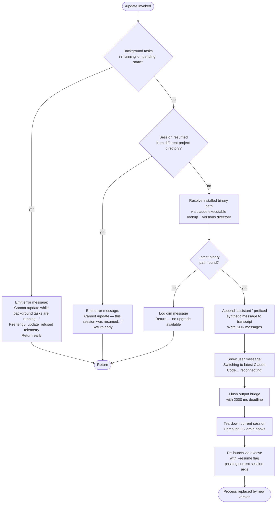

# `/update`

> Analysis basis: CC v2.1.143 bundle.js (AST extraction + Claude interpretation)
> Minimum version: v2.1.143

---

## Overview

`/update` performs an in-place upgrade of Claude Code to the latest available version while preserving the active conversation session. It tears down the current process bridge, re-launches the CLI binary under the latest installed version, and then resumes the conversation — all without requiring the user to restart manually.

---

## Registration

| Field | Value |
|---|---|
| type | `local` |
| name | `update` |
| description | `Switch to the latest version (conversation continues)` |
| loc_byte | `11654476` |
| loc_byte_end | `11654678` |
| loc_line | `7227` |
| supportsNonInteractive | `false` |
| isHidden | `true` |
| module_id | `cTq` |
| load_inline | `true` |
| arbor_handler.name | `ry7` |
| arbor_handler.fqn | `claude-2.1.143::ry7` |
| arbor_handler.kind | `AsyncFunction` |
| arbor_handler.resolution_path | `module_id` |
| arbor_handler.n_hits | `0` |

Analysis basis: CC v2.1.143 bundle.js:+11654476

---

## Input Branching

The handler contains 5+ distinct branches (background-task guard, path-mismatch guard, binary-not-found guard, flush/teardown sequence, re-launch), so a Mermaid flowchart is used.



---

## Behavioral Spec

### 1. Guard — Background Tasks Running

Before any upgrade activity, the handler reads the current `appState` and checks whether any background tasks are in `"running"` or `"pending"` status.

```
function checkBackgroundTaskGuard(appState):
    tasks = Object.values(appState.backgroundTasks)
    if any task has status == "running" or status == "pending":
        emit telemetry event "tengu_update_refused"
        return ErrorMessage(
            "Cannot /update while background tasks are running — wait for them to finish, then try again."
        )
    return null
```

Analysis basis: CC v2.1.143 bundle.js:+11652371 (telemetry), +11652632 (literal "running"), +11652654 (literal "pending"), +11652735 (error string)

---

### 2. Guard — Resumed Session from Different Project Directory

The handler detects whether the current session was resumed from a directory that differs from the current working directory. If so, it refuses to update because the binary re-launch would not safely reconstruct the session context.

```
function checkProjectDirectoryGuard(appState, currentCwd):
    if appState.resumedProjectDir != null
       and appState.resumedProjectDir != currentCwd:
        return ErrorMessage(
            "Cannot /update — this session was resumed from a different project directory. Restart manually with --resume to continue on the latest version."
        )
    return null
```

Analysis basis: CC v2.1.143 bundle.js:+11652976 (error string literal)

---

### 3. Binary Discovery

The handler resolves the path to the latest installed `claude` binary. It calls the package-path resolver (identifier `Xb`, role: resolve-install-path) which internally:
- Uses `Bun.which("claude")` to find the executable on `$PATH` (via resolver `NzA`)
- Computes the versions directory under `~/.local/share/versions` (literals at +7578589, +7578598, +7943718)
- Locates the `bin` subdirectory (literal at +7578668)

```
function resolveLatestBinary():
    claudeOnPath = whichBinary("claude")          // Bun.which
    versionsDir  = joinPath(homeDir(), ".local", "share", "versions")
    latestBinDir = joinPath(versionsDir, latestVersion, "bin")
    candidate    = joinPath(latestBinDir, "claude")
    if not exists(candidate):
        return null
    return candidate
```

Analysis basis: CC v2.1.143 bundle.js:+11652271 (FP8→w$ call), +11652324 (FP8→Xb call), +7578589, +7578598, +7943718, +7578668

---

### 4. Pre-Launch: Synthetic Transcript Message

Before tearing down, the handler appends a synthetic `"assistant-"` prefixed message to the active conversation transcript and writes it via the SDK message writer, so the session log reflects that an update occurred.

```
function appendUpdateTranscriptEntry(conversationId):
    syntheticRole = "assistant-" + generateSuffix()   // literal "assistant-" at +11653277
    entry = buildTextMessage(role=syntheticRole, content="text")
    appendEntry(entry)
    writeSdkMessages([entry])
```

Analysis basis: CC v2.1.143 bundle.js:+11653277 (literal "assistant-"), +11652417 (literal "text"), +11653445 (`O.writeSdkMessages`)

---

### 5. User Notification

A UUID is generated (via `QTq` → `UP8.randomUUID`) and the status message `"Switching to latest Claude Code… reconnecting"` is displayed to the user before teardown begins.

```
function notifyUser():
    messageId = randomUUID()
    displayStatusMessage("Switching to latest Claude Code… reconnecting", id=messageId)
```

Analysis basis: CC v2.1.143 bundle.js:+11653469 (literal string), +11653465 (`QTq` call)

---

### 6. Output Bridge Flush

The handler calls `O.flush` with a 2000 ms deadline (implemented via `jf` — a `Promise.race` against a `setTimeout`), then calls `O.teardown`.

```
async function flushAndTeardown(bridge):
    await Promise.race([
        bridge.flush(),
        timeout(2000)          // literal 2000 at +11653549
    ])
    // label: "bridge flush"   // literal at +11653554
    await bridge.teardown()
```

Analysis basis: CC v2.1.143 bundle.js:+11653536 (`jf` call), +11653539 (`O.flush`), +11653590 (`O.teardown`), +11653549 (2000 ms literal), +11653554 (label literal)

---

### 7. Full Session Teardown and Re-launch (`twH`)

The teardown-and-relaunch function (identifier `twH`) performs the complete handoff:

```
async function teardownAndRelaunch(latestBinaryPath, sessionArgs):
    // 1. stat the new binary to confirm it exists
    await fs.stat(latestBinaryPath)

    // 2. Stop spinner / progress indicators (SO6 / CEH)
    clearSpinner()
    unmountUI()

    // 3. Run scroll-summary telemetry (N_8 → tengu_scroll_summary)
    await recordScrollSummary()

    // 4. Flush analytics pipeline with 30000 ms deadline
    //    literal "flush timeout (relaunch)" at +11385870
    await Promise.race([
        flushAnalytics(),           // XSH → at_.drain
        timeout(30000)
    ])

    // 5. Flush pending background session tasks (k_8)
    //    with "analytics flush timeout" guard (+11385982)
    await flushBackgroundSessions(timeout=500)

    // 6. Compute new argv via yU_ (resolve install dir + build --resume arg)
    newArgv = buildArgv(latestBinaryPath, "--resume", ...sessionArgs)

    // 7. Assign updated environment (vXq: chdir, load native ffi, set env vars)
    prepareEnvironment()

    // 8. Reset signal handlers
    process.removeAllListeners("SIGINT")   // literal at +11386291
    process.removeAllListeners("SIGHUP")   // literal at +11386310
    process.on("beforeExit", ...)          // literal at +11386466
    process.on("exit", ...)                // literal at +11386507

    // 9. spawnSync is called as a pre-flight (kXq.spawnSync)
    //    then execve replaces the process image
    writeRelaunchErrorFile(...)           // wX → dSH.writeFileSync on error path
    execve(latestBinaryPath, newArgv, env)   // M.execve — no return on success

    // 10. If execve fails: write error, process.exit(128)
    //     literal "relaunch_spawn_error" at +11386602
    //     exit code 128 at +11386739
    on error:
        logError("relaunch_spawn_error")
        process.exit(128)
```

Analysis basis: CC v2.1.143 bundle.js:+11653779 (`twH` call), +11385749 (`yXq.stat`), +11385843 (`Promise.all`), +11385856 (`jf`), +11385864 (30000 ms), +11385870 (label), +11385971 (`k_8`), +11386247 (`yU_`), +11386253 (`vXq`), +11386320 (`process.removeAllListeners`), +11386377 (`kXq.spawnSync`), +11385322 (`M.execve`), +11386602, +11386626, +11386691, +11386739

---

### 8. The `--resume` Flag

The new process is always launched with `--resume` so the conversation session is restored under the upgraded binary.

Analysis basis: CC v2.1.143 bundle.js:+11385802 (literal `"--resume"`)

---

## State & Side Effects

| Item | Detail |
|---|---|
| Telemetry — `tengu_update_refused` | Fired when the update is blocked because background tasks are active (bundle.js:+11652371) |
| Telemetry — `tengu_scroll_summary` | Fired during teardown to record terminal scroll metrics (bundle.js:+5228657) |
| Telemetry — `tengu_amber_creek` | Fired during UI/fullscreen detection in teardown path (bundle.js:+3332572) |
| Telemetry — `tengu_pewter_brook` | Fired during UI/fullscreen detection in teardown path (bundle.js:+3332480) |
| Telemetry — `tengu_bg_dispatch_sigkill_escalate` | Fired if a background session requires SIGKILL escalation during teardown (bundle.js:+14503217) |
| Telemetry — `tengu_feature_bad` / `tengu_feature_ok` | Fired to record success/failure of terminal feature detection (bundle.js:+955126, +955068) |
| Telemetry — `tengu_bg_low_mem_mb` | May fire if daemon detects low memory during background session drain (bundle.js:+11972252) |
| Telemetry — `tengu_daemon_control` | Fired during daemon stop sequence in teardown (bundle.js:+14538273) |
| Telemetry — `tengu_bg_spare_enable/claim/spawn` | Background spare-session lifecycle events emitted during shutdown (bundle.js:+14504411, +14504532, +14502994) |
| appState changes | `_.getAppState` read (+11653223), `_.setAppState` written (+11653359) — records update-in-progress state |
| SDK message writer | `O.writeSdkMessages` appends synthetic assistant turn before relaunch (+11653445) |
| Conversation transcript | `FB_.appendEntry` with label `"last-prompt"` (+12128307) |
| Hook registration | `KL` → `h9` → `at_.register` called during message append path (+56977); `XSH` → `at_.drain` called in flush (+57020) |
| UI unmount | `CEH` → `H.unmount` (+5227269) — Ink/React UI is unmounted before re-exec |
| Process replacement | `M.execve` replaces the process image with the new binary — no return on success (+11385322) |
| Error file | On `execve` failure, `wX` → `dSH.writeFileSync` writes a relaunch error record (+188710) |
| Sound | <!-- TODO: not found in depth-2 traversal; needs --depth 4 --> |

---

## Version History

| Version | Change |
|---|---|
| v2.1.143 | Initial analysis |

---

## Common Mistakes

1. **Running `/update` while background tasks are active** — the command will be refused with a clear error. Wait for all background tasks to reach a terminal state (`done`, `killed`, `failed`) before retrying.
2. **Using `/update` in a session resumed from a different project directory** — the command refuses to re-launch to avoid corrupting the session context. Use `claude --resume` manually from the correct directory instead.
3. **Expecting an immediate terminal response** — the command replaces the process via `execve`; the current terminal session is effectively restarted. Any unsaved in-memory state outside the conversation transcript is lost.
4. **Confusing `/update` with a package-manager upgrade** — `/update` switches to a version already present in the local `~/.local/share/versions` directory; it does not download a new version from the internet.
5. **Attempting `/update` in non-interactive (`--print`) mode** — `supportsNonInteractive: false` means the command is disabled in headless pipelines.

---

## Appendix — Identifier Mapping

> For bundle debugging only. Identifiers change across versions.

| Identifier | Role |
|---|---|
| `ry7` | Main async handler for `/update` (arbor_handler; AsyncFunction, module_id resolution) |
| `FP8` | Background-task state inspector; checks running/pending task counts |
| `w$` | Binary path lookup via `Bun.which("claude")` wrapper |
| `NzA` | `Bun.which` thin wrapper |
| `Xb` | Resolve installed-versions directory and candidate binary path |
| `p58` | Sub-path builder for versioned install directories |
| `JM` | Array normalizer used in path construction |
| `zYH` | Compute `~/.local/share` base path |
| `_78` | Home directory resolver (`dZ1.homedir`) |
| `se` | Alternate path segment builder (bin subdirectory) |
| `T1` | Process-type classifier (bg / daemon / daemon-worker guard) |
| `cB` | Process-type constant provider |
| `d` | General async delay / deferred utility |
| `x0` | Binary basename extractor (`SP.basename`) |
| `V6` | Version string formatter / comparator |
| `GV` | Low-level string helper |
| `Ip` | Install-path resolver utility |
| `yU_` | Build new argv array with `--resume` and install path |
| `__` | Internal string helper used by `yU_` |
| `FK` | Fallback path helper used by `yU_` |
| `C6H` | Conversation-state accessor used before transcript write |
| `yr` | Hook/attachment type discriminator |
| `j28` | Hook entry factory |
| `FB_` | Transcript entry appender; calls `_.appendEntry` with `"last-prompt"` label |
| `KL` | Hook registration coordinator |
| `h9` | Hook registry registrar (`at_.register`) |
| `_` | App-state / conversation-store singleton |
| `NH` | Structured logger / error reporter with telemetry integration |
| `v_` | Error wrapper constructor |
| `xH` | String coercion helper |
| `zq` | Log-queue flusher |
| `A$A` | Log-entry formatter |
| `kNK` | Ring-buffer log manager (shift/push) |
| `uZ` | State update builder used before `_.setAppState` |
| `O` | Output bridge (writeSdkMessages, flush, teardown) |
| `N8` | SDK message serializer |
| `QTq` | UUID generator (`UP8.randomUUID`) |
| `jf` | Promise-race timeout wrapper (2000 ms flush deadline) |
| `twH` | Full teardown-and-relaunch orchestrator |
| `SO6` | Spinner/progress-indicator stopper |
| `oY_` | Interval clearer (`clearInterval`) |
| `CEH` | UI unmount coordinator (`H.unmount`, terminal output writer) |
| `H` | Ink/React renderer instance |
| `qS` | Terminal state cleanup helper |
| `za6` | Terminal escape sequence writer (cursor save/restore) |
| `n0H` | Terminal type detector (Ghostty, iTerm2 version checks) |
| `d0H` | Terminal cleanup helper |
| `h0` | tmux / screen multiplexer detection helper |
| `N_8` | Scroll-summary recorder (fires `tengu_scroll_summary`) |
| `EV` | Scroll metrics collector |
| `X91` | Scroll data serializer |
| `P91` | Scroll statistics calculator (`Date.now`, `Math.max`, `Math.round`) |
| `J91` | Scroll summary submitter |
| `rA` | Fullscreen/UI-mode detector (fires `tengu_amber_creek`, `tengu_pewter_brook`) |
| `VRH` | Fullscreen capability checker |
| `u1_` | Terminal size query helper |
| `hl` | Fullscreen mode activator/deactivator |
| `v` | Verbose terminal-type classifier (debug, tmux, Windows-SSH, fullscreen) |
| `x1_` | Platform guard for fullscreen (Windows check) |
| `R_` | TTY resource manager |
| `ybL` | Fullscreen state updater |
| `G6` | Render state manager (tracks active fullscreen renders) |
| `dZ` | Hook drain helper (calls `KL`) |
| `XSH` | Analytics pipeline drainer (`at_.drain`) |
| `k_8` | Background-session flush with `Promise.all` / timeout |
| `r8` | Process/worker lifecycle manager |
| `K` | Worker formatter (pads worker IDs) |
| `q` | Temp-file cleanup helper (`n8K.unlinkSync`) |
| `L` | Managed-worker registry (q.add / q.delete lifecycle) |
| `vXq` | Environment preparer and `execve` caller; handles FFI dlopen, chdir, env mutation |
| `f` | Native FFI module handle (dlopen result) |
| `A` | Worker map / process registry |
| `$` | Pending-spawn queue |
| `JZq` | Spawn-record constructor |
| `w` | Daemon background-session manager (spawn, claim, retire) |
| `C` | Child-process supervisor (writes to `z`, sends SIGKILL) |
| `mH` | Session "feature bad" recorder |
| `SH` | Session "feature ok" recorder |
| `IG6` | Low-memory detector for background sessions |
| `x` | Transient-worker handle (idle-timeout, `tengu_daemon_idle_exit`) |
| `Oo_` | Daemon-socket connector (claim + connect) |
| `jo_` | Session lifecycle state machine (done/killed/failed/crashed/blocked/working/active/idle) |
| `D` | Spare-session spawner (`tengu_bg_spare_spawn`) |
| `L8` | Session-roster entry manager |
| `h` | Transient-session handle |
| `M` | MCP / daemon orchestrator (execve, `M.execve`) |
| `SvH` | MCP server connection manager (stdio/sse/http/ws-ide transports) |
| `THK` | MCP update applier (`H.applyMcpUpdate`) |
| `B95` | MCP retry/recovery coordinator |
| `z` | Daemon control channel writer |
| `xN` | Notification channel handler |
| `Ox` | Daemon process-race handler (`process.exit`) |
| `XH` | String serializer |
| `wX` | Relaunch error file writer (`dSH.writeFileSync`) |

---

Note: index built via Arbor fallback; some signals (telemetry, literals) may be missing — see arbor-fallback.js.