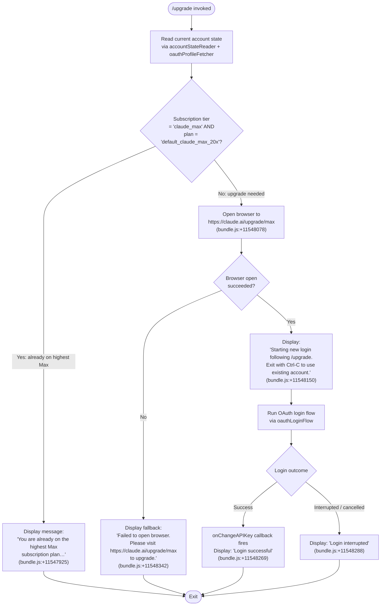

# `/upgrade`

> Analysis basis: CC v2.1.141 bundle.js (AST extraction + Claude interpretation)
> Minimum version: v2.1.141

---

## Overview

The `/upgrade` command guides users from a standard Claude account to the **Claude Max** subscription plan, which provides higher rate limits and increased access to Opus models. It performs an account-tier check first, and if the user is not already on the maximum Max plan, it opens `https://claude.ai/upgrade/max` in the system browser and then initiates a fresh OAuth login flow to capture updated credentials. If the browser cannot be opened, a fallback message instructs the user to visit the URL manually.

---

## Registration

| Field | Value |
|---|---|
| type | `local-jsx` |
| name | `upgrade` |
| description | `Upgrade to Max for higher rate limits and more Opus` |
| loc_byte | `11548549` |
| loc_byte_end | `11548809` |
| loc_line | `7194` |
| module_id | `ZGq` |
| load_inline | `true` |
| arbor_handler.name | `k06` |
| arbor_handler.fqn | `claude-2.1.141::k06` |
| arbor_handler.kind | `AsyncFunction` |
| arbor_handler.resolution_path | `module_id` |
| arbor_handler.n_hits | `0` |

Analysis basis: CC v2.1.141 bundle.js:+11548549

---

## Input Branching

The command has four distinct execution paths depending on subscription tier, browser availability, and login outcome. A Mermaid flowchart is used.



---

## Behavioral Spec

### 1. Handler Entry Point (`k06`)

The handler is an `AsyncFunction` resolved via `module_id` → `ZGq`. The Arbor symbol graph confirms the handler as `k06` (FQN: `claude-2.1.141::k06`).

Analysis basis: CC v2.1.141 bundle.js:+11547595

```
async function upgradeCommandHandler(context):
    accountInfo = await fetchAccountState(context)      // KA → mw
    oauthProfile = await fetchOAuthProfile(context)     // Ja

    if isAlreadyOnHighestMaxPlan(accountInfo, oauthProfile):
        display("You are already on the highest Max subscription plan…")
        return

    browserOpened = await openBrowserToUpgradeURL(
        "https://claude.ai/upgrade/max"
    )                                                   // eq → jb4 / O8

    if not browserOpened:
        display("Failed to open browser. Please visit https://claude.ai/upgrade/max to upgrade.")
        return

    display("Starting new login following /upgrade. Exit with Ctrl-C to use existing account.")

    loginResult = await runOAuthLoginFlow(context)      // kH

    if loginResult.success:
        context.onChangeAPIKey(loginResult.apiKey)
        display("Login successful")
    else:
        display("Login interrupted")
```

Analysis basis: CC v2.1.141 bundle.js:+11547595 – +11548321

---

### 2. Account State & Tier Check (`KA`, `mw`)

The command reads account state by calling `accountStateReader` (`KA`), which internally invokes `authConfigReader` (`mw`). The reader inspects several provider strings to determine which authentication backend is active.

Provider literals observed (Analysis basis: CC v2.1.141 bundle.js:+2006501 – +2006718):

| Provider literal | Meaning |
|---|---|
| `bedrock` | AWS Bedrock |
| `foundry` | Azure AI Foundry |
| `anthropicAws` | Anthropic AWS |
| `mantle` | Mantle |
| `vertex` | Google Vertex AI |
| `firstParty` | Anthropic first-party (claude.ai) |

The tier check inspects two string constants:
- Subscription tier string `"claude_max"` (bundle.js:+11547824)
- Plan identifier `"default_claude_max_20x"` (bundle.js:+11547706)

```
function isAlreadyOnHighestMaxPlan(accountInfo, oauthProfile):
    tier = oauthProfile.subscriptionTier       // string "max" at +11547681
    plan = oauthProfile.planIdentifier         // "default_claude_max_20x"
    accountType = accountInfo.type             // "claude_max"

    return accountType == "claude_max"
           AND plan == "default_claude_max_20x"
```

Analysis basis: CC v2.1.141 bundle.js:+11547681, +11547706, +11547824

---

### 3. OAuth Profile Fetch (`Ja`)

The OAuth profile fetch uses an HTTP GET with `Content-Type: application/json` and a timeout of 10 000 ms. Two telemetry events bracket success and failure:

- On success: emits `"oauth_profile_fetch"` (bundle.js:+2010804)
- On failure: emits `"oauth_profile_token_failed"` (bundle.js:+2010871)

```
async function fetchOAuthProfile(context):
    try:
        response = await httpGet(
            oauthProfileEndpoint,
            headers = {"Content-Type": "application/json"},
            timeout = 10000                        // +2010788
        )
        emit("oauth_profile_fetch")
        return parseProfile(response)
    catch error:
        emit("oauth_profile_token_failed")
        logError(error, level="error")             // +2010971
        return null
```

Analysis basis: CC v2.1.141 bundle.js:+2010745, +2010788, +2010804, +2010871

---

### 4. Browser Open (`eq`, `jb4`, `O8`)

The URL opener (`eq`) dispatches to a platform-specific sub-function:

```
async function openBrowserToURL(url):
    validateURL(url)                     // jb4: rejects non-http/https schemes
                                         // +7462238, +7462260

    platform = process.platform
    if platform == "darwin":             // +7462510
        spawn("open", [url])
    elif platform == "win32":            // +7462526
        spawn("rundll32", ["url,OpenURL", url])
                                         // +7462610, +7462622
    else:                                // Linux / other
        spawn("xdg-open", [url])         // +7462684, +7462691

    return success
```

The URL validator (`jb4`) raises an `Error` if the scheme is neither `http:` nor `https:` (bundle.js:+7462188, +7462238, +7462260).

Analysis basis: CC v2.1.141 bundle.js:+11548075, +7462475, +7462559

---

### 5. OAuth Login Flow (`kH`)

After the browser is opened, a new OAuth login flow starts. The flow uses:

- A rotating short-lived token ring (`GvK` manages `shift`/`push` operations on an internal queue, bundle.js:+950333, +950345)
- Error classification via `k_` which converts errors to strings and checks for known patterns (bundle.js:+169268, +169274)
- Traffic-tier constants `"essential-traffic"` (bundle.js:+949578), `"no-telemetry"` (bundle.js:+949637), `"default"` (bundle.js:+949711)
- The result delivers a new API key which is passed to `onChangeAPIKey` (bundle.js:+11548246)

```
async function runOAuthLoginFlow(context):
    tokenQueue = initializeTokenQueue()       // GvK
    try:
        result = await performOAuthExchange(tokenQueue)   // kH, Vq, cMA
        return {success: true, apiKey: result.apiKey}
    catch error:
        classifiedError = classifyError(error)            // k_
        logError(classifiedError)                         // Oc.logError +951053
        return {success: false}
```

Analysis basis: CC v2.1.141 bundle.js:+11548321, +950653, +950912, +950995, +951013, +951053

---

### 6. API Key File Descriptor Handling (`bA`, `pl8`)

Two environment-variable-based file descriptor paths are supported for supplying credentials without environment variable exposure:

- `CLAUDE_CODE_OAUTH_TOKEN_FILE_DESCRIPTOR` (bundle.js:+2024089) — reads an OAuth token; label `"OAuth token"` (bundle.js:+2024155)
- `CLAUDE_CODE_API_KEY_FILE_DESCRIPTOR` (bundle.js:+2024233) — reads a raw API key; label `"API key"` (bundle.js:+2024295)

If neither an `ANTHROPIC_API_KEY` env var nor an OAuth token is present at the end of the login flow, the system raises:

> `"ANTHROPIC_API_KEY or CLAUDE_CODE_OAUTH_TOKEN env var is required"` (bundle.js:+2896406)

Analysis basis: CC v2.1.141 bundle.js:+2024089, +2024233, +2896406

---

### 7. `setTimeout` Guard (`k06`)

A `setTimeout` call appears directly in the handler body (bundle.js:+11547910). This is a safety guard that provides a bounded wait before proceeding with the login flow, ensuring asynchronous UI rendering has completed before the OAuth prompt is displayed.

Analysis basis: CC v2.1.141 bundle.js:+11547910

---

## State & Side Effects

| Item | Detail |
|---|---|
| Telemetry: `tengu_feature_ok` | Emitted on successful feature flag check (bundle.js:+945566) |
| Telemetry: `tengu_feature_sad` | Emitted on failed feature flag check (bundle.js:+945699) |
| Telemetry: `tengu_bg_spare_enable` | Emitted when background spare process is enabled (bundle.js:+14464520) |
| Telemetry: `tengu_bg_spare_spawn` | Emitted when a background spare process is spawned (bundle.js:+14464880) |
| Telemetry: `oauth_profile_fetch` | Emitted on successful OAuth profile retrieval (bundle.js:+2010804) |
| Telemetry: `oauth_profile_token_failed` | Emitted when OAuth profile fetch fails (bundle.js:+2010871) |
| Browser side effect | Opens `https://claude.ai/upgrade/max` in the system default browser |
| `onChangeAPIKey` callback | Called with new API key after successful login (bundle.js:+11548246) |
| appState changes | Account state updated with new credentials after successful OAuth exchange |
| File I/O | Log appending via `appendFile` (bundle.js:+198185); log rotation via `rename`/`unlink` (bundle.js:+197882, +197922) |
| Sound | <!-- TODO: not found in depth-2 traversal; needs --depth 4 --> |

---

## Version History

| Version | Change |
|---|---|
| v2.1.141 | Initial analysis |

---

## Common Mistakes

1. **Running `/upgrade` on a non-first-party account** — The command targets `claude.ai` OAuth. If you are authenticated via `bedrock`, `vertex`, `foundry`, `anthropicAws`, or `mantle` provider, the upgrade flow will not apply and may produce unexpected errors. Use `/login` to switch to a first-party account before upgrading.

2. **Expecting `/upgrade` to work without browser access** — In headless or SSH-only environments, the browser-open step will fail and the command will print the fallback URL. You must visit `https://claude.ai/upgrade/max` manually from another device and then re-authenticate with `/login`.

3. **Cancelling mid-flow with Ctrl-C** — The message explicitly warns `"Exit with Ctrl-C to use existing account"`. Pressing Ctrl-C after the browser opens but before login completes will leave credentials unchanged; the existing session remains active.

4. **Assuming `/upgrade` upgrades immediately** — The command only opens the upgrade page and then re-runs the login flow. The actual subscription change happens on the claude.ai web side; the CLI merely captures updated tokens after you complete the web upgrade.

5. **Using `/upgrade` when already on `default_claude_max_20x`** — The command detects this tier and displays an informational message rather than re-initiating the upgrade flow. If you want to switch to an API-billed account instead, use `/login` directly as the message instructs.

---

## Appendix — Identifier Mapping

> For bundle debugging only. Identifiers change across versions.

| Identifier | Role |
|---|---|
| `k06` | Main upgrade command handler (AsyncFunction, Arbor-resolved) |
| `KA` | Account state reader |
| `mw` | Auth configuration reader / provider dispatcher |
| `JL` | Configuration field accessor |
| `RH` | String conversion / environment variable reader |
| `FR` | Auth credential resolution (API key vs OAuth) |
| `FU6` | OAuth token file descriptor reader |
| `Q46` | Credential validator |
| `ja` | OAuth token environment reader |
| `yu` | Flag settings resolver |
| `tj` | Provider guard (blocks non-first-party providers) |
| `WA` | Provider name normalizer |
| `j$` | API key resolution orchestrator |
| `G8_` | Flag settings applicator |
| `$V` | Key source classifier |
| `DH6` | VS Code environment detector |
| `pl8` | API key file descriptor reader |
| `h6` | Credential cache writer |
| `IR` | Credential string slicer (last 20 chars, +2025575) |
| `RB` | Boolean coercion helper |
| `Ja` | OAuth profile fetcher |
| `bA` | OAuth base URL resolver |
| `bfA` | OAuth environment selector |
| `zIK` | OAuth URL builder |
| `hH` | HTTP client for profile fetch (success path) |
| `Q` | Underlying HTTP request executor |
| `D8` | HTTP client for profile fetch (error path) |
| `Yy` | Profile response parser |
| `v` | Subprocess / child-process spawner |
| `J7K` | Subprocess argument builder |
| `Qt_` | Platform command selector |
| `H` | Random delay / subprocess handle |
| `SH` | JSON serializer for debug logging |
| `t7` | Log path builder |
| `T6A` | Log directory mapper |
| `q` | Sync file unlinker |
| `A` | File path lowercaser |
| `MSH` | Stdio writer |
| `M6A` | Raw stream writer |
| `X7K` | Log file writer / rotator |
| `bhH` | Buffered write flusher |
| `A_H` | Log entry formatter |
| `Cv8` | EISDIR error handler |
| `y6A` | Log file path resolver |
| `k6A` | Log file rotator |
| `P7K` | Log append-with-rotation writer |
| `b9` | Active-operation tracker (Set add/delete) |
| `kH` | OAuth login flow orchestrator |
| `k_` | Error classifier / stringifier |
| `Vq` | Token exchange executor |
| `cMA` | Token response handler |
| `GvK` | Token queue manager (shift/push) |
| `eq` | Cross-platform URL opener |
| `jb4` | URL scheme validator |
| `O8` | Platform-specific browser launcher |
| `M_` | Process spawner with retry |
| `jXH` | Child-process lifecycle manager |
| `D` | Background spare process manager |
| `lkK` | String-based process argument builder |
| `N6` | AsyncLocalStorage context accessor |
| `bS6` | Store retrieval helper |
| `e8` | Context default provider |

---

Note: index built via Arbor fallback; some signals (telemetry, literals) may be missing — see arbor-fallback.js.