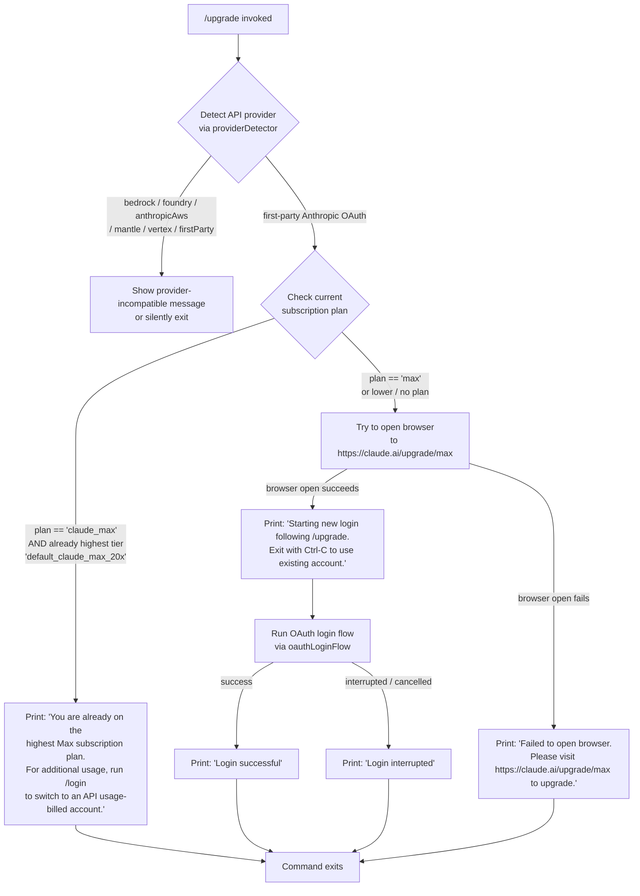

# `/upgrade`

> Analysis basis: CC v2.1.143 bundle.js (AST extraction + Claude interpretation)
> Minimum version: v2.1.143

---

## Overview

The `/upgrade` command guides the user through upgrading their Claude account to the Max subscription tier, which provides higher rate limits and increased access to the Opus model family. It checks whether the user is already on the highest Max plan tier, and if not, opens the upgrade URL (`https://claude.ai/upgrade/max`) in the system browser before initiating a fresh OAuth login flow. If the browser cannot be opened, a fallback message is printed directing the user to the URL manually.

---

## Registration

| Field | Value |
|---|---|
| type | `local-jsx` |
| name | `upgrade` |
| description | `Upgrade to Max for higher rate limits and more Opus` |
| module_id | `GEq` |

Analysis basis: CC v2.1.143 bundle.js:+11674673

---

## Input Branching

The command entry point (`upgradeCommandHandler`) performs a series of conditional checks before taking action. The flowchart below describes the full branching logic derived from the call graph and string literals.



Analysis basis: CC v2.1.143 bundle.js:+11673719, +11673805, +11673830, +11673948, +11674034, +11674049, +11674202, +11674274, +11674393, +11674412, +11674466

---

## Behavioral Spec

### Plan Tier Detection

The command reads the authenticated account's current subscription plan identifier from app state and compares it against known plan strings.

```
function detectCurrentPlan(appState):
    planId = appState.currentSubscriptionPlan
    if planId == "claude_max":
        return "claude_max"
    if planId == "max":
        return "max"
    return "none_or_lower"
```

Known plan literal `"claude_max"` at Analysis basis: CC v2.1.143 bundle.js:+11673948  
Known tier literal `"default_claude_max_20x"` (highest Max tier) at Analysis basis: CC v2.1.143 bundle.js:+11673830  
Known tier literal `"max"` at Analysis basis: CC v2.1.143 bundle.js:+11673805

---

### Already-at-Highest-Tier Guard

If the user is already on the highest Max plan tier, the command prints a static message and exits without opening a browser or launching a login flow.

```
function alreadyHighestTierGuard(planId, planTier):
    if planId == "claude_max" AND planTier == "default_claude_max_20x":
        print("You are already on the highest Max subscription plan. " +
              "For additional usage, run /login to switch to an API usage-billed account.")
        return EXIT
```

Analysis basis: CC v2.1.143 bundle.js:+11674049

---

### Provider Compatibility Check

Before attempting an upgrade, the command checks the active API provider. Non-first-party providers (such as AWS Bedrock, Azure Foundry, Vertex, etc.) are incompatible with the claude.ai upgrade flow.

```
function providerCompatibilityCheck(providerInfo):
    incompatibleProviders = [
        "bedrock", "foundry", "anthropicAws", "mantle", "vertex"
    ]
    if providerInfo.type in incompatibleProviders:
        # Exit or render incompatibility notice; upgrade only valid for firstParty
        return INCOMPATIBLE
    if providerInfo.type == "firstParty":
        return COMPATIBLE
```

Analysis basis: CC v2.1.143 bundle.js:+2020544, +2020594, +2020650, +2020704, +2020752, +2020761

---

### Browser Launch

The command attempts to open the upgrade URL using the platform-appropriate mechanism.

```
function launchUpgradeURL(targetURL):
    platform = process.platform
    if platform == "darwin":
        spawn("open", [targetURL])
    elif platform == "win32":
        spawn("rundll32", ["url,OpenURL", targetURL])
    else:
        # Linux / other POSIX
        spawn("xdg-open", [targetURL])
```

Upgrade URL constant: `"https://claude.ai/upgrade/max"`  
Analysis basis: CC v2.1.143 bundle.js:+11674202, +7543375, +7543391, +7543475, +7543487, +7543549, +7543556

On failure (spawn throws or returns non-zero), the command falls through to the browser-failure message path.

Analysis basis: CC v2.1.143 bundle.js:+11674466

---

### OAuth Login Flow (Post-Upgrade)

After the browser is successfully launched, the command triggers a new OAuth login flow so that the freshly upgraded credentials are picked up immediately.

```
function postUpgradeLoginFlow(appState, onChangeAPIKey):
    print("Starting new login following /upgrade. " +
          "Exit with Ctrl-C to use existing account.")

    result = await oauthLoginFlow(appState)   # calls qK -> KXH -> oauthClient

    if result.success:
        onChangeAPIKey(result.newKey)
        print("Login successful")
    else:
        print("Login interrupted")
```

Analysis basis: CC v2.1.143 bundle.js:+11674199, +11674274, +11674370, +11674389, +11674393, +11674412

The OAuth flow reads `ANTHROPIC_API_KEY` and `CLAUDE_CODE_OAUTH_TOKEN_FILE_DESCRIPTOR` environment variables during credential resolution.  
Analysis basis: CC v2.1.143 bundle.js:+2911962, +2038871

The OAuth flow also reads `CLAUDE_CODE_API_KEY_FILE_DESCRIPTOR` as an alternative credential source.  
Analysis basis: CC v2.1.143 bundle.js:+2039014

---

### OAuth Profile Fetch

During the login flow, a profile fetch request is made to verify token validity. The profile fetch has a timeout of **10000 ms**.

```
function fetchOAuthProfile(token):
    response = httpGet(profileEndpoint,
                       headers={"Content-Type": "application/json"},
                       timeout=10000)
    if response.ok:
        emit telemetry "oauth_profile_fetch"
    else:
        emit telemetry "oauth_profile_token_failed"
    return response
```

Profile fetch timeout: 10000 ms (Analysis basis: CC v2.1.143 bundle.js:+2024831)  
Telemetry event `"oauth_profile_fetch"`: Analysis basis: CC v2.1.143 bundle.js:+2024847  
Telemetry event `"oauth_profile_token_failed"`: Analysis basis: CC v2.1.143 bundle.js:+2024914

HTTP error status codes handled: `401`, `403`, `429`  
Analysis basis: CC v2.1.143 bundle.js:+172567, +172576, +172585

---

### API Key Validation During Credential Resolution

When resolving credentials, the key format is validated. The environment variable `ANTHROPIC_API_KEY` is checked; if neither `ANTHROPIC_API_KEY` nor the OAuth token is available, the flow throws:

> `"ANTHROPIC_API_KEY or CLAUDE_CODE_OAUTH_TOKEN env var is required"`

Analysis basis: CC v2.1.143 bundle.js:+2912383

---

### Credential Logging / Redaction

Sensitive credential values are replaced with the string `"[REDACTED]"` in any logging output.

Analysis basis: CC v2.1.143 bundle.js:+193318

---

### JSX Render Component

The command's `type` is `local-jsx`, meaning it renders a React element via `createElement` for in-terminal display. The render component (`upgradeJsxComponent`) is constructed by `Q06` and references `oB_.createElement`.

```
function upgradeJsxComponent(props):
    element = createElement(upgradeUI, {
        onChangeAPIKey: props.onChangeAPIKey,
        appState: props.appState
    })
    return element
```

Analysis basis: CC v2.1.143 bundle.js:+11674235, +11674370

---

### Background Spare Process (Ambient — Not Upgrade-Specific)

The call graph reaches background spare-process management functions (`tengu_bg_spare_enable`, `tengu_bg_spare_spawn`) at depth 2 via the OAuth client initialization path. These are infrastructure-level side effects, not behaviors initiated by `/upgrade` itself.

Analysis basis: CC v2.1.143 bundle.js:+14502634, +14502994

---

## State & Side Effects

| Item | Detail |
|---|---|
| Telemetry — `tengu_feature_ok` | Fired on successful feature execution (depth-2, via `SH` → `d`) — Analysis basis: bundle.js:+955068 |
| Telemetry — `tengu_feature_sad` | Fired on feature execution failure (depth-2, via `J8` → `d`) — Analysis basis: bundle.js:+955201 |
| Telemetry — `tengu_bg_spare_enable` | Fired when background spare process is enabled (infrastructure, depth-2) — Analysis basis: bundle.js:+14502634 |
| Telemetry — `tengu_bg_spare_spawn` | Fired when background spare process spawns (infrastructure, depth-2) — Analysis basis: bundle.js:+14502994 |
| Telemetry — `oauth_profile_fetch` | Fired on successful OAuth profile fetch — Analysis basis: bundle.js:+2024847 |
| Telemetry — `oauth_profile_token_failed` | Fired when OAuth profile fetch fails due to bad token — Analysis basis: bundle.js:+2024914 |
| OAuth token storage | New OAuth token written to disk via `appendFile` / `rename` pattern in `writeTokenFile` — Analysis basis: bundle.js:+200518, +200215 |
| `appState` changes | `onChangeAPIKey` callback is called with the new credential after successful login — Analysis basis: bundle.js:+11674370, +11674389 |
| Browser subprocess | Platform-appropriate browser launcher is spawned (`open` / `rundll32` / `xdg-open`) — Analysis basis: bundle.js:+7543549, +7543475, +7543556 |
| Hook registration | `at_.register` hook is registered during the OAuth client initialization path — Analysis basis: bundle.js:+56977 |
| Sound | <!-- TODO: not found in depth-2 traversal; needs --depth 4 --> |
| Error logging | `Wc.logError` is called on OAuth flow errors — Analysis basis: bundle.js:+960555 |

---

## Version History

| Version | Change |
|---|---|
| v2.1.143 | Initial analysis |

---

## Common Mistakes

1. **Running `/upgrade` on a non-first-party provider**: If the Claude Code session is configured to use AWS Bedrock, Azure Foundry, Vertex AI, Mantle, or `anthropicAws`, the upgrade flow is incompatible with `https://claude.ai/upgrade/max`. The command checks the provider type before proceeding. Analysis basis: bundle.js:+2020544–+2020761.

2. **Expecting no login prompt after upgrading**: After successfully opening the upgrade URL, the command immediately launches a full OAuth re-login flow. Users who press `Ctrl-C` to cancel will see `"Login interrupted"` and their existing session credentials will remain unchanged. Analysis basis: bundle.js:+11674412.

3. **Assuming the command is re-entrant on the highest tier**: If the current account is already on the `default_claude_max_20x` tier with plan `claude_max`, the command exits immediately with an informational message and does **not** open a browser. Analysis basis: bundle.js:+11673830, +11673948, +11674049.

4. **Browser launch failure is non-fatal**: If the system browser cannot be opened (e.g., headless environment), the command does not throw an error — it prints a fallback message with the upgrade URL and exits cleanly. The login flow is **not** initiated in this case. Analysis basis: bundle.js:+11674466.

5. **Environment variable requirements**: If neither `ANTHROPIC_API_KEY` nor `CLAUDE_CODE_OAUTH_TOKEN` (or equivalent file-descriptor variants) is available during the post-upgrade login resolution, the flow throws a hard error. Analysis basis: bundle.js:+2912383.

---

## Appendix — Identifier Mapping

> For bundle debugging only. Identifiers change across versions.

| Identifier | Role |
|---|---|
| `Q06` | Upgrade command handler / JSX component root |
| `HA` | Subscription / account state reader |
| `Uw` | Credential resolution orchestrator |
| `TK` | Environment variable accessor |
| `xH` | Low-level value coercion / type utility |
| `SN` | API key source selector |
| `nU6` | OAuth token file-descriptor reader |
| `eAH` | Credential string formatter |
| `gc` | OAuth token environment variable resolver |
| `fI` | Flag settings / API key config reader |
| `Sw` | Provider type detector |
| `DA` | Provider string classifier |
| `j3` | API key resolution and validation logic |
| `Q46` | API key helper sub-resolver |
| `$E` | API key "none" sentinel handler |
| `$SH` | VS Code integration detector (`claude-vscode`) |
| `Oq6` | API key file-descriptor reader |
| `N6` | Telemetry event emitter |
| `Qy` | Credential slice / truncation utility |
| `SR` | Subscription plan array inclusion checker |
| `H` | General-purpose utility / randomization helper |
| `Ea` | OAuth profile fetch orchestrator |
| `K9` | OAuth endpoint URL builder |
| `lfA` | OAuth base URL resolver |
| `WvK` | OAuth environment selector |
| `SH` | Feature success telemetry emitter (`tengu_feature_ok`) |
| `d` | Core telemetry dispatch function |
| `J8` | Feature failure telemetry emitter (`tengu_feature_sad`) |
| `NY` | OAuth profile response parser |
| `v` | HTTP request dispatcher |
| `G5K` | HTTP client factory |
| `tt_` | HTTP transport layer selector |
| `hH` | JSON serializer for request body |
| `P7` | Request path builder / sanitizer |
| `h6A` | URL component mapper |
| `q` | File cleanup utility |
| `A` | Filename normalizer |
| `cSH` | Credential write helper |
| `X6A` | Raw stream writer |
| `Z5K` | Token file writer (atomic write with rename) |
| `PSH` | Write queue / debounce manager |
| `i8H` | Path join and file append helper |
| `x6` | Directory existence checker |
| `gv8` | Directory error handler (`EISDIR`) |
| `U6A` | Token storage path resolver |
| `p6A` | Atomic file rename / `.txt` extension handler |
| `E5K` | File append-and-rotate implementation |
| `h9` | Process exit hook registrar (`at_.register`) |
| `NH` | OAuth HTTP client / network request executor |
| `v_` | HTTP error classifier |
| `zq` | Request serializer |
| `A$A` | Request body coercer |
| `kNK` | Request queue manager (shift/push) |
| `qK` | Browser-open and login flow initiator |
| `ex4` | URL protocol validator (`http:` / `https:`) |
| `hJ` | Cross-platform browser launcher |
| `Y8` | OAuth client factory |
| `$_` | OAuth session manager |
| `KXH` | Full OAuth client implementation |
| `D` | Background spare process manager |
| `_SK` | Session token string formatter |
| `S6` | Async-local-storage context accessor |
| `Uh6` | Store accessor (`ph6.getStore`) |
| `__` | Global state accessor (`GV`) |