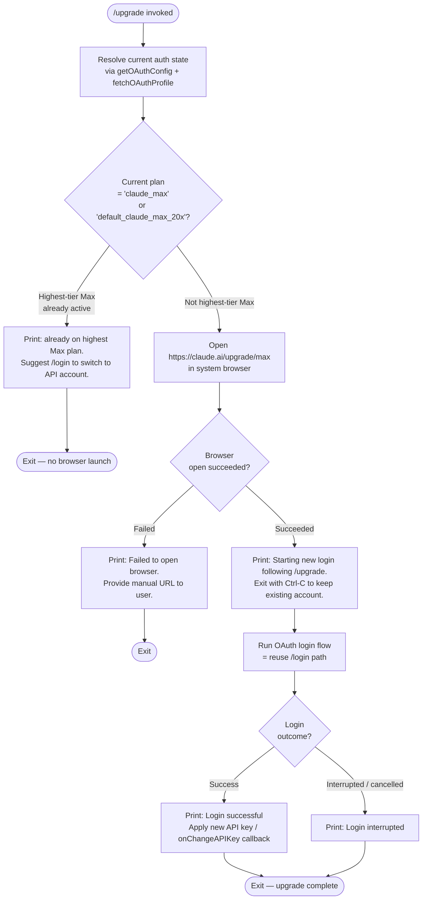

# `/upgrade`

> Analysis basis: CC v2.1.143 bundle.js (AST extraction + Claude interpretation)
> Minimum version: v2.1.143

---

## Overview

The `/upgrade` command guides the user through upgrading their Claude account to the Max subscription tier, which provides higher rate limits and increased access to Opus models. It first inspects the current account's subscription state and, if an upgrade is possible, opens `https://claude.ai/upgrade/max` in the system browser and then initiates a fresh OAuth login flow to pick up the new entitlements. If the account is already on the highest Max plan, the command exits immediately with an informational message instead of launching the browser.

---

## Registration

| Field | Value |
|---|---|
| type | `local-jsx` |
| name | `upgrade` |
| description | `Upgrade to Max for higher rate limits and more Opus` |
| module\_id | `GEq` |

Analysis basis: CC v2.1.143 bundle.js:+11674673

---

## Input Branching

The command accepts no user-supplied arguments. All branching is driven by the current account's subscription tier, the result of the browser-open attempt, and the outcome of the subsequent OAuth login.



Analysis basis: CC v2.1.143 bundle.js:+11673719, +11673948, +11674034, +11674199, +11674202, +11674274, +11674370, +11674393, +11674412, +11674445, +11674466

---

## Behavioral Spec

### 1. Command Entry Point

```
function upgradeCommandHandler(appState, callbacks):
    authConfig  = resolveOAuthConfig(appState)     // getOAuthConfig
    profileData = fetchOAuthProfile(authConfig)     // Ea / network call

    if currentPlanIsHighestMax(profileData):
        displayMessage(ALREADY_MAX_MESSAGE)
        return

    browserOpened = openUrlInSystemBrowser(UPGRADE_URL)

    if not browserOpened:
        displayMessage(BROWSER_FAILED_MESSAGE)
        return

    displayMessage(STARTING_LOGIN_MESSAGE)
    loginResult = runOAuthLoginFlow(appState)

    if loginResult.success:
        callbacks.onChangeAPIKey(loginResult.newKey)
        displayMessage("Login successful")
    else:
        displayMessage("Login interrupted")
```

Analysis basis: CC v2.1.143 bundle.js:+11673719, +11673891, +11674034, +11674199, +11674235, +11674370, +11674393, +11674412

---

### 2. Subscription Tier Detection

The command checks whether the currently authenticated account is already on the highest Max tier by inspecting two plan identifier strings obtained from the OAuth profile response.

```
function currentPlanIsHighestMax(profileData):
    plan = profileData.plan  // or equivalent subscription field

    if plan == "claude_max" or plan == "default_claude_max_20x":
        return true

    return false
```

- Plan identifier `"claude_max"`: Analysis basis: CC v2.1.143 bundle.js:+11673948
- Plan identifier `"default_claude_max_20x"`: Analysis basis: CC v2.1.143 bundle.js:+11673830
- Plan identifier `"max"` (intermediate tier sentinel): Analysis basis: CC v2.1.143 bundle.js:+11673805

When the account is already on the highest plan, the following literal message is displayed verbatim:

> "You are already on the highest Max subscription plan. For additional usage, run /login to switch to an API usage-billed account."

Analysis basis: CC v2.1.143 bundle.js:+11674049

---

### 3. OAuth Configuration Resolution

Before any network call, the command resolves the OAuth environment and endpoint from application state. Three environment strings are recognized.

```
function resolveOAuthConfig(appState):
    env = readEnvOrAppState(appState)   // checks CLAUDE_CODE_CUSTOM_OAUTH_URL

    if env == "local":
        baseUrl = LOCAL_OAUTH_BASE
    else if env == "staging":
        baseUrl = STAGING_OAUTH_BASE
    else if env == "prod":
        baseUrl = PROD_OAUTH_BASE
    else:
        // custom OAuth URL path
        if not isApprovedEndpoint(env):
            raise Error("CLAUDE_CODE_CUSTOM_OAUTH_URL is not an approved endpoint.")
        baseUrl = env

    return OAuthConfig(baseUrl, suffix="-custom-oauth")
```

- Environment literal `"local"`: Analysis basis: CC v2.1.143 bundle.js:+940188
- Environment literal `"staging"`: Analysis basis: CC v2.1.143 bundle.js:+940213
- Environment literal `"prod"`: Analysis basis: CC v2.1.143 bundle.js:+940243
- Error string for unapproved custom endpoint: Analysis basis: CC v2.1.143 bundle.js:+940373
- Custom OAuth path suffix `"-custom-oauth"`: Analysis basis: CC v2.1.143 bundle.js:+940889

---

### 4. OAuth Profile Fetch

After the config is resolved, the command performs an HTTP GET to retrieve the user's profile, including the active subscription plan. The request carries a JSON `Content-Type` header and enforces a hard timeout.

```
function fetchOAuthProfile(authConfig):
    response = httpGet(
        url     = authConfig.profileEndpoint,
        headers = { "Content-Type": "application/json" },
        timeout = PROFILE_FETCH_TIMEOUT_MS
    )

    emit telemetry event "oauth_profile_fetch"

    if response.ok:
        return parseProfile(response.body)
    else:
        emit telemetry event "oauth_profile_token_failed"
        handleHttpError(response.status)   // 401 / 403 / 429 recognized
        return null
```

- `Content-Type` header value `"application/json"`: Analysis basis: CC v2.1.143 bundle.js:+940188, +2024788, +2024803
- Profile fetch timeout: **10 000 ms** — Analysis basis: CC v2.1.143 bundle.js:+2024831
- Telemetry event `"oauth_profile_fetch"`: Analysis basis: CC v2.1.143 bundle.js:+2024847
- Telemetry event `"oauth_profile_token_failed"`: Analysis basis: CC v2.1.143 bundle.js:+2024914
- HTTP status codes inspected: `401`, `403`, `429` — Analysis basis: CC v2.1.143 bundle.js:+172567, +172576, +172585

---

### 5. System Browser Launch

The command opens `https://claude.ai/upgrade/max` using the platform's native browser-launch mechanism.

```
function openUrlInSystemBrowser(url):
    validateUrlScheme(url)   // must start with "http:" or "https:"

    platform = process.platform

    if platform == "darwin":
        spawn("open", [url])
    else if platform == "win32":
        spawn("rundll32", ["url,OpenURL", url])
    else:
        // Linux / other POSIX
        spawn("xdg-open", [url])

    return true on success, false on spawn error
```

- Upgrade URL: `"https://claude.ai/upgrade/max"` — Analysis basis: CC v2.1.143 bundle.js:+11674202
- Allowed URL schemes `"http:"` and `"https:"`: Analysis basis: CC v2.1.143 bundle.js:+7543066, +7543088
- macOS platform string `"darwin"`: Analysis basis: CC v2.1.143 bundle.js:+7543375
- Windows platform string `"win32"`: Analysis basis: CC v2.1.143 bundle.js:+7543391
- Windows launcher `"rundll32"` / argument `"url,OpenURL"`: Analysis basis: CC v2.1.143 bundle.js:+7543475, +7543487
- macOS command `"open"`: Analysis basis: CC v2.1.143 bundle.js:+7543549
- Linux command `"xdg-open"`: Analysis basis: CC v2.1.143 bundle.js:+7543556
- Browser-failed fallback message: `"Failed to open browser. Please visit https://claude.ai/upgrade/max to upgrade."` — Analysis basis: CC v2.1.143 bundle.js:+11674466

---

### 6. OAuth Login Flow (Post-Upgrade)

After the browser is opened, the command reuses the standard `/login` OAuth flow so that freshly granted Max entitlements are reflected in the local session. A random jitter delay is applied before the poll loop begins.

```
function runOAuthLoginFlow(appState):
    displayMessage(STARTING_LOGIN_MESSAGE)   // "Starting new login following /upgrade…"

    // jitter before polling (0..2 range)
    jitter = Math.random() * 2
    setTimeout(beginPollLoop, jitter * BASE_POLL_INTERVAL_MS)

    pollLoop:
        token = pollForOAuthToken()
        if token received:
            storeToken(token)
            return LoginResult(success=true, newKey=token.apiKey)
        if user pressed Ctrl-C:
            return LoginResult(success=false)
```

- Starting login message literal: Analysis basis: CC v2.1.143 bundle.js:+11674274
- Random jitter upper bound `2`: Analysis basis: CC v2.1.143 bundle.js:+12638154
- `setTimeout` used for jitter scheduling: Analysis basis: CC v2.1.143 bundle.js:+12638193
- Base poll interval `10` (units: seconds, multiplied internally): Analysis basis: CC v2.1.143 bundle.js:+1038172
- `"Login successful"` message: Analysis basis: CC v2.1.143 bundle.js:+11674393
- `"Login interrupted"` message: Analysis basis: CC v2.1.143 bundle.js:+11674412
- `onChangeAPIKey` callback invoked on success: Analysis basis: CC v2.1.143 bundle.js:+11674370

---

### 7. Feature-Event Telemetry (OAuth Sub-layer)

The OAuth sub-layer used by this command emits two generic feature telemetry events, independent of the upgrade-specific telemetry.

```
function featureEventWrapper(operation):
    try:
        result = operation()
        emitTelemetry("tengu_feature_ok")
        return result
    catch error:
        emitTelemetry("tengu_feature_sad")
        raise error
```

- `tengu_feature_ok`: Analysis basis: CC v2.1.143 bundle.js:+955068
- `tengu_feature_sad`: Analysis basis: CC v2.1.143 bundle.js:+955201

---

## State & Side Effects

| Item | Detail |
|---|---|
| Telemetry — generic success | `tengu_feature_ok` emitted on successful OAuth sub-operation (bundle.js:+955068) |
| Telemetry — generic failure | `tengu_feature_sad` emitted on failed OAuth sub-operation (bundle.js:+955201) |
| Telemetry — profile fetch | `"oauth_profile_fetch"` emitted after profile HTTP call (bundle.js:+2024847) |
| Telemetry — profile token fail | `"oauth_profile_token_failed"` emitted when profile fetch returns an error token state (bundle.js:+2024914) |
| Browser side effect | Opens system browser to `https://claude.ai/upgrade/max` via platform-native launcher (bundle.js:+11674202) |
| `onChangeAPIKey` callback | Invoked with the newly obtained API key when login completes successfully (bundle.js:+11674370) |
| App state — auth token | New OAuth token written to local session store on successful login flow |
| App state — subscription tier | Refreshed from the profile endpoint; `"claude_max"` / `"default_claude_max_20x"` checked (bundle.js:+11673948, +11673830) |
| `setTimeout` (jitter) | Asynchronous delay injected before OAuth poll loop begins (bundle.js:+12638193) |
| Hook registration | <!-- TODO: not found in depth-2 traversal; needs --depth 4 --> |
| Sound | <!-- TODO: not found in depth-2 traversal; needs --depth 4 --> |

---

## Version History

| Version | Change |
|---|---|
| v2.1.143 | Initial analysis — command registered as `local-jsx` in module `GEq`; upgrade URL `https://claude.ai/upgrade/max`; highest-Max check against `"claude_max"` and `"default_claude_max_20x"` plan identifiers |

---

## Common Mistakes

1. **Running `/upgrade` when already on the highest Max plan.** The command detects `"claude_max"` or `"default_claude_max_20x"` and exits immediately with an explanatory message. No browser is opened. To switch to API-billed usage instead, run `/login` directly.

2. **Interrupting the browser open with Ctrl-C before the OAuth poll starts.** The command displays a prompt explicitly noting that Ctrl-C will abort the new login and leave the existing account intact. If Ctrl-C is pressed, the session remains unchanged and the upgrade may not be reflected.

3. **Assuming the upgrade takes effect immediately without completing the login flow.** Even after the subscription is upgraded on the claude.ai side, the local Claude Code session must complete the post-browser OAuth login to receive the new entitlements. Closing the terminal or pressing Ctrl-C before `"Login successful"` is printed means the local session still carries the old tier.

4. **Using a non-approved custom OAuth URL.** If the environment variable `CLAUDE_CODE_CUSTOM_OAUTH_URL` is set to an endpoint not on the approved list, the command throws `"CLAUDE_CODE_CUSTOM_OAUTH_URL is not an approved endpoint."` before any network request is made (bundle.js:+940373).

5. **Expecting the browser to open on a headless / remote server.** On Linux systems without a desktop environment, `xdg-open` will fail and the command will display the fallback message instructing the user to visit `https://claude.ai/upgrade/max` manually (bundle.js:+11674466).

---

## Appendix — Identifier Mapping

> For bundle debugging only. Identifiers change across versions.

| Identifier | Role |
|---|---|
| `Q06` | Upgrade command top-level handler / render function |
| `HA` | Auth state resolver (orchestrates OAuth config + profile fetch) |
| `Uw` | OAuth configuration builder (reads env, sets base URL and suffix) |
| `SR` | Subscription / plan membership check (Array.isArray + includes) |
| `Ea` | OAuth profile fetcher (HTTP GET with timeout and header) |
| `K9` | OAuth endpoint URL constructor (handles local / staging / prod / custom) |
| `SH` | Feature-event success wrapper (emits `tengu_feature_ok`) |
| `J8` | Feature-event failure wrapper (emits `tengu_feature_sad`) |
| `NY` | Error classification / HTTP status inspector (401 / 403 / 429) |
| `v` | Token / plan string normalizer (toUpperCase, trim, includes) |
| `NH` | OAuth poll loop controller (schedules token polling, pushes to result list, logs errors) |
| `qK` | System browser launcher (platform detection + spawn) |
| `ex4` | URL scheme validator (rejects non-http/https URLs) |
| `hJ` | Platform command selector (darwin → open, win32 → rundll32, else → xdg-open) |
| `Y8` | Browser spawn executor (invokes OS process with URL argument) |
| `_` | Current app / session state object (carries API key, plan, OAuth config) |
| `H` | Jitter / delay utility (Math.random × 2, then setTimeout) |