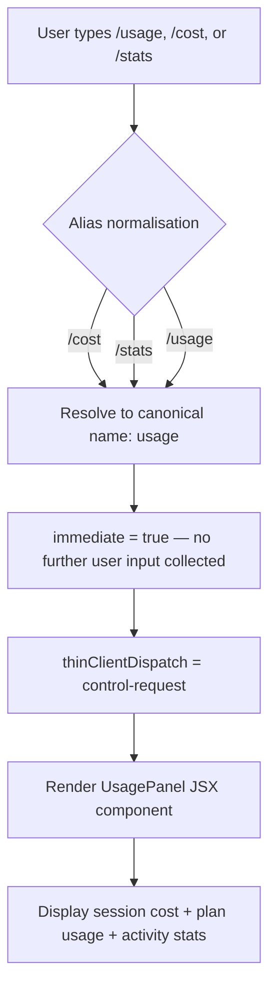

# `/usage`

> Analysis basis: CC v2.1.143 bundle.js (AST extraction + Claude interpretation)
> Minimum version: v2.1.143

---

## Overview

The `/usage` command (also accessible as `/cost` or `/stats`) displays a summary panel covering the current session's token cost, plan-level usage, and activity statistics. It is implemented as a local JSX component that renders immediately upon invocation and dispatches a control request to the thin client rather than producing a model-facing chat message.

---

## Registration

| Field | Value |
|---|---|
| type | `local-jsx` |
| name | `usage` |
| description | `Show session cost, plan usage, and activity stats` |
| aliases | `cost`, `stats` |
| immediate | `true` |
| thinClientDispatch | `control-request` |
| module\_id | `zXq` |

Analysis basis: CC v2.1.143 bundle.js:+11368596

---

## Input Branching

Because `immediate: true` is set, the command executes without waiting for any additional argument input from the user. The thin-client dispatch type `control-request` means the rendered JSX component is handled locally by the CLI shell rather than being forwarded to the model conversation stream.



Analysis basis: CC v2.1.143 bundle.js:+11368596 (registration), +11367989 (alias literal `stats`)

---

## Behavioral Spec

### Panel Rendering

The command's sole runtime action is the construction and return of a JSX element. No network call, no model turn, and no stateful write are initiated by the command handler itself.

```
function renderUsageCommand():
    element = createElement(UsagePanel, props)
    return element
```

The element is created via a single `createElement` call. The two UI label literals found in the implementation — `"Stats"` and `"Usage"` — indicate that the rendered panel contains at minimum two labelled sections or tab headings.

Analysis basis: CC v2.1.143 bundle.js:+11367931 (`createElement` call), +11367997 (label `"Stats"`), +11368005 (label `"Usage"`)

### Section Labels

| Literal value | Likely role |
|---|---|
| `"stats"` | Internal section key / tab identifier |
| `"Stats"` | Human-readable section heading |
| `"Usage"` | Human-readable section heading |

Analysis basis: CC v2.1.143 bundle.js:+11367989, +11367997, +11368005

### Dispatch Path

Because `thinClientDispatch` is set to `"control-request"`, the CLI shell intercepts the command result before it reaches the conversation renderer. The panel is displayed as an out-of-band UI overlay or inline control block, not as an assistant message.

```
function dispatchUsageCommand(commandResult):
    if commandResult.thinClientDispatch == "control-request":
        send to local shell control handler
        // does NOT enter conversation message stream
    render commandResult.element inside control handler
```

Analysis basis: CC v2.1.143 bundle.js:+11368596

---

## State & Side Effects

| Item | Detail |
|---|---|
| Telemetry | None — no `tengu_*` events emitted by this command |
| Hook registration | <!-- TODO: not found in depth-2 traversal; needs --depth 4 --> |
| appState changes | <!-- TODO: not found in depth-2 traversal; needs --depth 4 --> |
| Sound | <!-- TODO: not found in depth-2 traversal; needs --depth 4 --> |

---

## Version History

| Version | Change |
|---|---|
| v2.1.143 | Initial analysis |

---

## Common Mistakes

1. **Expecting model output**: Because `thinClientDispatch` is `"control-request"` and `immediate` is `true`, `/usage` never produces an assistant chat message. Do not attempt to parse its output from the conversation transcript.
2. **Alias confusion**: `/cost` and `/stats` are full aliases resolved before execution. They are not separate commands and share identical behaviour with `/usage`.
3. **Assuming telemetry coverage**: This command emits zero telemetry events. Usage-analytics pipelines that rely on `tengu_*` events will see no signal from invocations of this command.
4. **Expecting argument support**: The `immediate` flag means the command fires without collecting any trailing arguments. Any text typed after `/usage` may be silently ignored or cause unexpected routing depending on the shell version.

---

## Appendix — Identifier Mapping

> For bundle debugging only. Identifiers change across versions.

| Identifier | Role |
|---|---|
| `FI7` | Usage command render function — constructs and returns the UsagePanel JSX element |