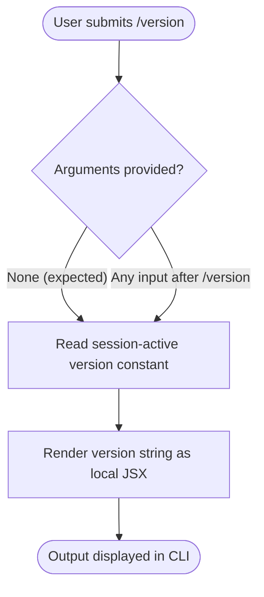

# `/version`

> Analysis basis: CC v2.1.143 bundle.js (AST extraction + Claude interpretation)
> Minimum version: v2.1.143

---

## Overview

The `/version` command prints the version of Claude Code that is currently running in the active session. Critically, it reports the **session-active** version — the version that was loaded at process start — rather than any newer version that the autoupdate mechanism may have silently downloaded in the background. This distinction is what makes the command useful for diagnosing update-lag discrepancies.

---

## Registration

| Field | Value |
|---|---|
| type | `local-jsx` |
| name | `version` |
| description | `Print the version this session is running (not what autoupdate downloaded)` |
| immediate | `true` |

Analysis basis: CC v2.1.143 bundle.js:+11593719

### Field Notes

- **`type: local-jsx`** — The command renders its output as a JSX component evaluated locally within the CLI process, rather than being forwarded to the model or handled as a pure text transformation.
- **`immediate: true`** — The command executes and renders without waiting for any model response or asynchronous operation. As soon as the user submits `/version`, the output is produced synchronously within the CLI render cycle.

---

## Input Branching

The AST traversal at depth ≤ 2 found no call graph entries and no conditional literals for this command. Based on the `immediate: true` registration flag and the absence of branching data, the execution path is linear: the command accepts no arguments, performs no validation, and unconditionally renders the session version string.



> **Note on argument handling:** The registration object contains no argument schema and the call graph is empty, so any text typed after `/version` is silently ignored. The flowchart reflects this by routing both branches to the same step.

Analysis basis: CC v2.1.143 bundle.js:+11593719

---

## Behavioral Spec

### Version String Resolution

Because the call graph is empty at depth ≤ 2, the exact internal function names used to retrieve the version constant are not available from the extracted data. The behavior is inferred from the registration fields and the command's stated description.

```
function resolveSessionVersion():
    # Read the version that was embedded in the bundle at build time
    # and loaded when the CLI process started.
    sessionVersion = readBuildTimeVersionConstant()

    # This value is NOT refreshed from disk or the autoupdate cache.
    # Even if autoupdate has written a newer bundle to disk,
    # this function returns the version of the bundle currently in memory.
    return sessionVersion


function handleVersionCommand(userInput):
    # No argument parsing; userInput is discarded entirely.
    version = resolveSessionVersion()
    renderLocalJSX(VersionDisplay, props={ version: version })
```

Analysis basis: CC v2.1.143 bundle.js:+11593719

> **Entry-function caveat:** The AST note records `"no entry functions found for module 'undefined'"`. The pseudocode above describes the logical behavior derivable from the registration contract; the concrete internal call chain is <!-- TODO: not found in depth-2 traversal; needs --depth 4 -->.

### JSX Rendering

The `type: local-jsx` registration signals that the output component is rendered inside the CLI's own React/Ink render tree rather than streamed as assistant text. The rendered element displays the version string in the CLI viewport.

```
function renderVersionOutput(version):
    # Produce a local JSX element — no model roundtrip occurs.
    element = <VersionBadge value={version} />
    mountInCLIViewport(element)
```

Analysis basis: CC v2.1.143 bundle.js:+11593719

### Autoupdate Isolation

The description explicitly states the version shown is "not what autoupdate downloaded." This means:

```
function isAutoupdateVersionShown():
    # The command reads the in-memory constant set at process startup.
    # It does NOT:
    #   - stat the autoupdate download directory
    #   - parse any manifest or lockfile written by the updater
    #   - compare against a "latest downloaded" cache entry
    return false   # autoupdate version is never surfaced here
```

Analysis basis: CC v2.1.143 bundle.js:+11593719 (description field)

---

## State & Side Effects

| Item | Detail |
|---|---|
| Telemetry | None — no `tengu_*` events found in the implementation at depth ≤ 2 |
| Hook registration | <!-- TODO: not found in depth-2 traversal; needs --depth 4 --> |
| appState changes | None observed; command is read-only with respect to application state |
| Sound | None |
| Network I/O | None; version is read from the in-process build-time constant |
| File I/O | None; autoupdate artifacts on disk are not accessed |
| Model invocation | None; `immediate: true` bypasses the model entirely |

---

## Version History

| Version | Change |
|---|---|
| v2.1.143 | Initial analysis — `immediate: true`, `local-jsx` rendering, no telemetry |

---

## Common Mistakes

1. **Assuming `/version` reflects the autoupdated binary.** The command explicitly reports the session-active version. If autoupdate downloaded v2.1.200 but the current session was started with v2.1.143, `/version` prints `2.1.143`. Restart the CLI to load the updated bundle.

2. **Passing arguments expecting filtered or formatted output.** The command accepts no arguments. Text typed after `/version` (e.g., `/version --json`) is silently discarded; the output format is fixed by the JSX component.

3. **Confusing `local-jsx` output with assistant messages.** The version output is rendered by the CLI's own component tree, not produced by the model. It will not appear in conversation history exported as assistant turns.

4. **Expecting telemetry confirmation.** Because no telemetry events are fired, operators monitoring `tengu_*` event streams cannot detect when a user runs `/version`. Do not rely on telemetry for audit trails of this command.

5. **Using `/version` to verify a live update took effect.** A new process must be started after autoupdate completes for the new version to be loaded into memory and thus reported by `/version`.

---

## Appendix — Identifier Mapping

> For bundle debugging only. Identifiers change across versions.

| Identifier | Role |
|---|---|
| *(none)* | The depth-≤-2 AST traversal returned an empty `identifiers` array; no obfuscated identifiers were reachable from the command's entry point. See note: `"no entry functions found for module 'undefined'"`. |