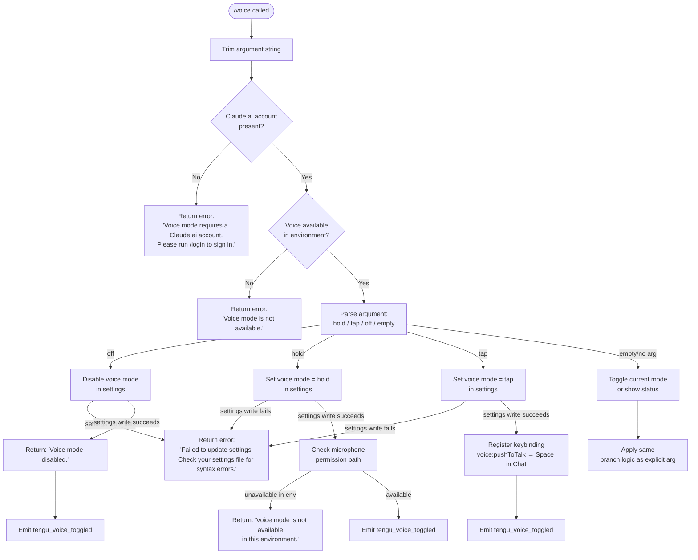

# `/voice`

> Analysis basis: CC v2.1.143 bundle.js (AST extraction + Claude interpretation)
> Minimum version: v2.1.143

---

## Overview

The `/voice` command toggles voice input mode for Claude Code, accepting an optional subcommand argument (`hold`, `tap`, or `off`) to select the interaction style. It enforces account-level prerequisites (Claude.ai login and environment availability) before applying the requested mode, and emits a telemetry event on every successful state change. When `tap` mode is activated, it also registers a push-to-talk keybinding (`Space` in the `Chat` context).

---

## Registration

| Field | Value |
|---|---|
| type | `local` |
| name | `voice` |
| description | Toggle voice mode |
| argumentHint | `[hold\|tap\|off]` |
| supportsNonInteractive | `false` |
| module_id | `Ivq` |

Analysis basis: CC v2.1.143 bundle.js:+11931518

---

## Input Branching

The command handler (identifier: `bb7`) begins by parsing and trimming the raw argument string. It then executes a multi-path decision tree based on authentication state, environment capability, argument value, and settings persistence outcome.



Analysis basis: CC v2.1.143 bundle.js:+11928972, +11929112, +11929150, +11929197, +11929333, +11929512, +11929569, +11929629, +11929659, +11929738, +11930779, +11930913

---

## Behavioral Spec

### Authentication and Availability Guard

Before any mode logic executes, the command handler checks two preconditions in order.

```
function checkVoicePrerequisites(appState):
    if not appState.hasClaudeAiAccount():
        return textResult(
            "Voice mode requires a Claude.ai account. Please run /login to sign in."
        )
    if not voiceIsAvailableInEnvironment(appState):
        return textResult("Voice mode is not available.")
    return null  // prerequisites satisfied
```

- The account-check error message is a fixed string literal.
  Analysis basis: CC v2.1.143 bundle.js:+11929013
- The availability-check error message is a fixed string literal.
  Analysis basis: CC v2.1.143 bundle.js:+11929112

### Argument Normalization

The raw argument string is trimmed of surrounding whitespace before comparison. The recognized token set is exactly `{"hold", "tap", "off"}`. Any other non-empty value is treated as `"invalid"`.

```
function normalizeVoiceArg(rawArg):
    token = rawArg.trim()
    if token in {"hold", "tap", "off"}:
        return token
    if token == "":
        return "empty"
    return "invalid"
```

Analysis basis: CC v2.1.143 bundle.js:+11928889 (`hold`), +11928901 (`tap`), +11928912 (`off`), +11928933 (`invalid`), +11929264 (trim call)

### Mode Application and Settings Persistence

For each recognized mode, the handler writes the new value to user settings via the settings-persistence subsystem. If the write fails (e.g., malformed settings JSON), a fixed error message is returned and no state change is committed.

```
function applyVoiceMode(mode, settingsWriter):
    success = settingsWriter.setVoiceMode(mode)
    if not success:
        return textResult(
            "Failed to update settings. Check your settings file for syntax errors."
        )
    return null  // caller proceeds with post-write logic
```

Analysis basis: CC v2.1.143 bundle.js:+11929431

### Off Mode

```
function handleVoiceOff(settingsWriter, telemetry):
    err = applyVoiceMode("off", settingsWriter)
    if err: return err
    telemetry.emit("tengu_voice_toggled", {mode: "off"})
    return textResult("Voice mode disabled.")
```

Analysis basis: CC v2.1.143 bundle.js:+11929569, +11929514

### Hold Mode

After persisting the setting, the handler checks whether the current runtime environment can actually provide microphone access (e.g., SSH-only or container environments may not). If the environment cannot support voice, a distinct message is returned.

```
function handleVoiceHold(settingsWriter, telemetry, environment):
    err = applyVoiceMode("hold", settingsWriter)
    if err: return err
    if not environment.supportsVoiceCapture():
        return textResult("Voice mode is not available in this environment.")
    telemetry.emit("tengu_voice_toggled", {mode: "hold"})
    return successResult()
```

Analysis basis: CC v2.1.143 bundle.js:+11929813, +11929514

### Tap Mode and Push-to-Talk Keybinding Registration

In `tap` mode, after persisting the setting, the handler registers a keybinding entry for the action `voice:pushToTalk`, bound to `Space` within the `Chat` context.

```
function handleVoiceTap(settingsWriter, keybindingManager, telemetry):
    err = applyVoiceMode("tap", settingsWriter)
    if err: return err
    keybindingManager.register(
        action  = "voice:pushToTalk",
        context = "Chat",
        key     = "Space"
    )
    telemetry.emit("tengu_voice_toggled", {mode: "tap"})
    return successResult()
```

Analysis basis: CC v2.1.143 bundle.js:+11930779 (`voice:pushToTalk`), +11930801 (`Chat`), +11930808 (`Space`), +11929514

### Keybinding Subsystem Integration

The keybinding registration call routes through the keybinding loader (`Lj`), which reads and validates `keybindings.json`. If the action name is not recognized by the registry, the event `tengu_keybinding_fallback_used` is emitted. Invalid file structure produces `tengu_custom_keybindings_loaded` with an error flag.

```
function loadAndApplyKeybindings(keybindingsPath, actionRegistry):
    raw = readFile(keybindingsPath)
    parsed = JSON.parse(raw)
    if not isObject(parsed) or not isArray(parsed.bindings):
        emitTelemetry("tengu_keybinding_config_invalid_format")
        return error("keybindings.json must have a \"bindings\" array")
    for block in parsed.bindings:
        if not hasValidStructure(block):
            emitTelemetry("tengu_keybinding_config_invalid_structure")
            continue
        for key, actionName in block.bindings:
            if actionName not in actionRegistry:
                emitTelemetry("tengu_keybinding_fallback_used")
            else:
                register(block.context, key, actionName)
    emitTelemetry("tengu_custom_keybindings_loaded")
```

Analysis basis: CC v2.1.143 bundle.js:+11930779, +3748456, +3748633, +3753849, +3753931

### Microphone Permission Path (macOS)

When checking environment support, the implementation references the macOS permission path as a string literal: `"System Settings → Privacy & Security → Microphone"`. This string is surfaced in diagnostic output when microphone access cannot be confirmed.

Analysis basis: CC v2.1.143 bundle.js:+11930320

### Return Type Convention

All textual responses from the command are wrapped in a result object typed as `"text"`.

Analysis basis: CC v2.1.143 bundle.js:+11929000

---

## State & Side Effects

| Item | Detail |
|---|---|
| Telemetry | `tengu_voice_toggled` emitted on every successful mode change (hold, tap, off). loc: +11929514 |
| Telemetry (keybinding) | `tengu_keybinding_fallback_used` emitted when a registered action is not found in the keybinding registry. loc: +3753931 |
| Telemetry (keybinding load) | `tengu_custom_keybindings_loaded` emitted after keybindings.json is processed. loc: +3746151 |
| Telemetry (keybinding format) | `tengu_keybinding_config_invalid_format` / `tengu_keybinding_config_invalid_structure` emitted on invalid keybindings.json. loc: +3748320, +3748931 |
| Hook registration | In `tap` mode, registers the `voice:pushToTalk` action bound to `Space` in the `Chat` keybinding context. loc: +11930779 |
| appState changes | Writes the `voiceMode` setting (`hold`, `tap`, or `off`) to persistent user settings via the settings subsystem. loc: +11929333 |
| Settings file path | Settings are stored under `.claude/settings.json` (user) and `.claude/settings.local.json` (local). loc: +1197620, +1197682 |
| Sound | <!-- TODO: not found in depth-2 traversal; needs --depth 4 --> |
| Non-interactive | Command is not available in non-interactive mode (`supportsNonInteractive: false`). loc: +11931518 |

---

## Version History

| Version | Change |
|---|---|
| v2.1.143 | Initial analysis — `hold`, `tap`, `off` subcommands; push-to-talk keybinding registration in tap mode; dual prerequisite guard (Claude.ai login + environment availability). |

---

## Common Mistakes

1. **Running `/voice` without being logged in to Claude.ai.** The command performs an account check before any other logic; users must complete `/login` first. Analysis basis: CC v2.1.143 bundle.js:+11929013
2. **Using `/voice tap` in an SSH or headless environment.** Even if the mode is persisted, a subsequent availability check may return the "not available in this environment" message. Analysis basis: CC v2.1.143 bundle.js:+11929813
3. **Passing an unrecognized argument such as `/voice toggle`.** Only `hold`, `tap`, and `off` are valid tokens; any other non-empty string is classified as `"invalid"` and will not change state. Analysis basis: CC v2.1.143 bundle.js:+11928933
4. **Corrupted or malformed `settings.json`.** If the settings file cannot be written (e.g., JSON syntax error), the command returns a settings-failure message and no voice mode change is applied. Analysis basis: CC v2.1.143 bundle.js:+11929431
5. **Expecting `/voice` to work non-interactively.** The `supportsNonInteractive` flag is `false`; the command will not execute in pipeline or headless invocations. Analysis basis: CC v2.1.143 bundle.js:+11931518

---

## Appendix — Identifier Mapping

> For bundle debugging only. Identifiers change across versions.

| Identifier | Role |
|---|---|
| `bb7` | Top-level voice command handler / entry point |
| `YsH` | Voice prerequisite check dispatcher |
| `fg_` | Account availability checker (Claude.ai login guard) |
| `Uw` | Authentication context resolver |
| `TK` | Token / credential accessor |
| `SN` | API key / auth chain validator |
| `Sw` | First-party auth mode selector |
| `j3` | Auth key retrieval and error handler |
| `eAH` | Auth header builder |
| `jG6` | Voice environment availability checker |
| `R_` | Settings loader bootstrap |
| `Lu` | Settings load-from-disk orchestrator |
| `ah` | Settings read helper (early phase) |
| `P1` | Performance measurement initializer |
| `px` | Native module `require` wrapper (`perf_hooks`) |
| `nm8` | Settings telemetry and merge engine |
| `T8` | Log file appender |
| `SV6` | Settings version resolver |
| `j96` | Flag-settings merger |
| `oDA` | SDK inline settings extractor |
| `L` | Active WebSocket / connection tracker (module-level) |
| `K` | Log-line formatter / buffer |
| `k5H` | User settings file path builder |
| `f` | Connection lifecycle manager |
| `XB` | Settings source aggregator |
| `nDA` | SDK inline settings normalizer |
| `WB` | Full settings object assembler |
| `__` | Global config accessor |
| `fH6` | Flag settings reader |
| `RV8` | Policy settings reader |
| `_H6` | Project settings reader |
| `xjH` | Local settings reader |
| `MH6` | Operator settings reader |
| `V5H` | System settings reader |
| `I5H` | Default settings reader |
| `Um8` | Settings merge utility |
| `hDA` | Settings deprecation handler |
| `vc` | Settings validation helper |
| `P96` | Settings persistence writer |
| `yV6` | Post-load settings watcher registrar |
| `Cb7` | Argument token validator (hold/tap/off/invalid classifier) |
| `H` | Random-delay / retry utility (module-level) |
| `p_` | Settings write and environment check orchestrator |
| `wO` | Settings write helper (path + assembler combo) |
| `x6` | Path existence checker |
| `lm8` | Settings reload helper |
| `AP` | File-access permission checker |
| `Tc` | File reader with encoding detection |
| `uM` | File-type/stat inspector |
| `v` | Environment variable reader |
| `Bh6` | Path-existence guard |
| `_` | Generic utility (array/string) |
| `Fh6` | File slice reader |
| `$8` | Atomic write helper |
| `L8` | Error code classifier |
| `nu8` | Timestamp cache setter |
| `XXH` | Settings path + assembler combo (post-write) |
| `JC6` | Settings file path resolver |
| `yA6` | Atomic file write implementation |
| `q` | Filesystem module wrapper |
| `O` | Symbolic-link stat wrapper |
| `N8` | Background-session stopped sentinel |
| `hH` | JSON serializer wrapper |
| `hz` | Cache-clear utility (clears two module-level Maps) |
| `VR6` | Git-ignore / config-file writer |
| `S6` | Async-store context reader |
| `Uh6` | AsyncLocalStorage `.getStore()` accessor |
| `Ru8` | Config migration helper |
| `uu8` | Git-check-ignore runner |
| `$_` | Git subprocess wrapper |
| `ySK` | Home-directory config path builder |
| `hy` | `.claude` directory path joiner |
| `NH` | Structured log emitter |
| `v_` | Error stringifier |
| `xH` | String coercion wrapper |
| `zq` | Log-queue flusher |
| `A$A` | Log-entry formatter |
| `kNK` | Rolling log-buffer manager |
| `d` | Deferred / promise utility |
| `M` | MCP server manager / registry |
| `SvH` | MCP server connection orchestrator |
| `KHH` | MCP config loader |
| `cqH` | MCP server config parser |
| `qHH` | MCP SDK server enumerator |
| `ww6` | MCP SSE/HTTP transport handler |
| `rI` | MCP tool-list fetcher |
| `X$` | MCP tool invocation wrapper |
| `RG_` | MCP reconnect gate |
| `H_` | MCP server health monitor |
| `f26` | MCP filter / deduplicate |
| `_57` | MCP connection attempt scheduler |
| `bh_` | MCP needs-auth cache reader |
| `v78` | MCP tool-hash calculator |
| `Ei` | MCP error formatter |
| `kj` | MCP tool-hash builder (SHA-256) |
| `I78` | MCP debug-log dispatcher |
| `dK` | MCP debug-key resolver |
| `A8` | MCP debug push helper |
| `Yh_` | MCP remote-server connector |
| `w77` | MCP server metadata reader |
| `PB` | MCP auth token fetcher |
| `tHH` | MCP OAuth callback-server and token-exchange handler |
| `mrH` | MCP OAuth in-flight request tracker |
| `D` | Daemon spare-worker controller |
| `BY8` | MCP needs-auth cache writer |
| `UQ` | MCP reconnect orchestrator |
| `Ku` | Anthropic API token accessor |
| `Y` | MCP supervisor writer |
| `_7` | MCP error logger |
| `XH` | Error-to-string converter |
| `J77` | MCP auth race-condition handler |
| `D77` | SSH/remote environment detector for MCP |
| `Dh_` | MCP tool-result dispatcher |
| `urH` | MCP pending-request getter |
| `prH` | MCP pending-cache getter |
| `x8q` | MCP needs-auth cache fetcher |
| `d1` | AsyncLocalStorage store getter |
| `tY8` | MCP needs-auth cache path builder |
| `Oh_` | MCP tool-call hasher and logger |
| `NG_` | MCP claudeai-proxy transport handler |
| `a6` | Global config reader/writer |
| `A` | Platform-name normalizer |
| `J` | Background session process manager |
| `y` | Subprocess stdin writer |
| `S8q` | MCP server-count reporter |
| `Yn` | Async iterator / readable-stream helper |
| `M26` | MCP server index parser (parseInt) |
| `xh_` | MCP tool index parser (parseInt) |
| `THK` | MCP apply-update handler |
| `eY8` | MCP update serializer |
| `wv` | MCP server cleanup runner |
| `drH` | MCP debug-log serializer |
| `$` | JZq-backed persistent store accessor |
| `JZq` | Daemon status JSON writer |
| `ha` | Daemon status file helper |
| `r06` | Daemon status file path builder |
| `B95` | MCP server diff/sync engine |
| `k78` | MCP server capability checker |
| `r8` | Timed-promise / abort helper |
| `Lj` | Keybinding loader and action registrar |
| `ma6` | Keybinding file reader |
| `Jf6` | Keybinding file parser and validator |
| `dL_` | Keybinding entry normalizer |
| `Hm` | Global config guard |
| `d9H` | Keybinding file path builder |
| `R6` | JSON parse wrapper |
| `mH` | Feature-flag telemetry emitter |
| `ba6` | Keybinding block structure validator |
| `Ra6` | Keybinding entry array builder |
| `BC9` | Keybinding default-value resolver |
| `gL_` | Keybinding duplicate-key detector |
| `QL_` | Keybinding action-registry applicator |
| `SH` | Feature-flag state reader |
| `pa6` | Keybinding context mapper |
| `iL_` | Keybinding context validator |
| `IgL` | Keybinding context key checker |
| `YGH` | Keybinding display-name mapper |
| `HSH` | Language/locale normalizer |
| `N6` | Config file watcher bootstrapper |
| `z9_` | Config file path validator |
| `H$H` | Config file reader with backup/migration |
| `jR` | Config comment stripper |
| `zZ9` | Config backup directory scanner |
| `X9_` | Config backup path builder |
| `w` | Background worker / daemon session manager |
| `C` | Subprocess lifecycle controller |
| `IG6` | macOS low-memory reporter |
| `x` | Subprocess retire-if-settled handler |
| `G6` | Global config accessor with MCP integration |
| `Oo_` | Background worker Unix socket connector |
| `jo_` | Background worker session lifecycle handler |
| `h` | Subprocess handle holder |
| `nhL` | Config file watcher registrar |
| `Tl` | Config-change debounce handler |
| `h9` | Signal / shutdown hook registrar |