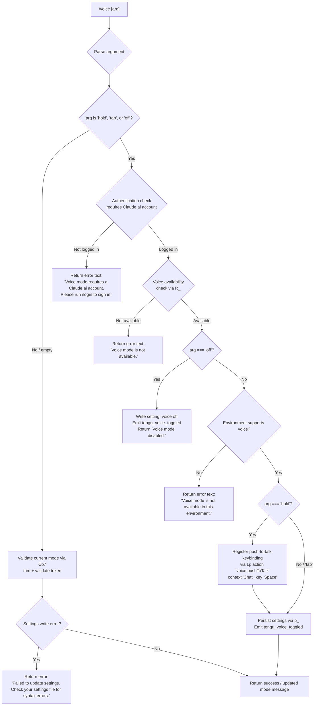

# `/voice`

> Analysis basis: CC v2.1.143 bundle.js (AST extraction + Claude interpretation)
> Minimum version: v2.1.143

---

## Overview

The `/voice` command toggles voice input mode in Claude Code, allowing users to switch between three operational sub-modes: `hold` (push-to-talk), `tap` (toggle-to-talk), and `off` (disabled). It validates authentication and environment prerequisites before applying or updating the voice-mode setting, and registers a push-to-talk keybinding when the `hold` sub-mode is activated.

---

## Registration

| Field | Value |
|---|---|
| type | `local` |
| name | `voice` |
| description | `Toggle voice mode` |
| argumentHint | `[hold\|tap\|off]` |
| supportsNonInteractive | `false` |
| isHidden | `null` |
| module_id | `Ivq` |
| load_inline | `true` |
| loc_byte | `11931518` |
| loc_byte_end | `11931760` |
| loc_line | `7760` |
| arbor_handler.name | `bb7` |
| arbor_handler.fqn | `claude-2.1.143::bb7` |
| arbor_handler.kind | `AsyncFunction` |
| arbor_handler.resolution_path | `module_id` |
| arbor_handler.n_hits | `1` |

Analysis basis: CC v2.1.143 bundle.js:+11931518

---

## Input Branching

The handler has 5+ distinct paths based on argument value, authentication state, and environment availability.



---

## Behavioral Spec

### Main Handler (`bb7`)

The Arbor-resolved handler is `bb7` (AsyncFunction, `claude-2.1.143::bb7`), reached via `module_id` resolution from `Ivq`.

Analysis basis: CC v2.1.143 bundle.js:+11928972

```
async function voiceCommandHandler(args, appState):
    rawArg = args.trim()                         // H.trim at +11929264

    // Step 1 — Argument validation via validateVoiceArg (Cb7)
    validatedMode = validateVoiceArg(rawArg)      // Cb7 at +11929197
    // Accepted values: "hold", "tap", "off", or empty/null for query

    // Step 2 — Account / auth guard
    hasAccount = checkClaudeAiAccount(appState)   // YsH / fg_ at +11928972
    if not hasAccount:
        return { type: "text",
                 content: "Voice mode requires a Claude.ai account. Please run /login to sign in." }
        // literal at +11929013

    // Step 3 — Feature availability guard
    isAvailable = checkVoiceAvailability(appState) // R_ at +11929150
    if not isAvailable:
        return { type: "text",
                 content: "Voice mode is not available." }
        // literal at +11929112

    // Step 4 — Dispatch on validated mode
    if validatedMode === "off":
        persistVoiceSetting(appState, "off")       // p_ at +11929333
        emitTelemetry("tengu_voice_toggled", ...)  // at +11929514
        return { type: "text", content: "Voice mode disabled." }
        // literal at +11929569

    else if validatedMode === "hold" or "tap":
        envOk = checkEnvironmentSupport(appState)  // d at +11929512
        if not envOk:
            return { type: "text",
                     content: "Voice mode is not available in this environment." }
            // literal at +11929813

        if validatedMode === "hold":
            registerPushToTalkKeybinding()         // Lj at +11930779
            // Registers action "voice:pushToTalk" in context "Chat"
            // with default key "Space"
            // literals at +11930782, +11930801, +11930808

        persistVoiceSetting(appState, validatedMode) // p_ at +11929333
        emitTelemetry("tengu_voice_toggled", ...)
        return { type: "text", content: <updated mode message> }

    else:
        // Invalid argument ("invalid" sentinel from Cb7)
        return error or usage hint
        // "invalid" literal at +11928933
```

Analysis basis: CC v2.1.143 bundle.js:+11928972–+11931240

---

### Argument Validation (`Cb7`)

```
function validateVoiceArg(raw):
    trimmed = raw.trim()                    // H.trim at +11928842
    if trimmed === "hold":  return "hold"   // literal +11928889
    if trimmed === "tap":   return "tap"    // literal +11928901
    if trimmed === "off":   return "off"    // literal +11928912
    if trimmed === "":      return null     // query current state
    return "invalid"                        // literal +11928933
```

Analysis basis: CC v2.1.143 bundle.js:+11928842

---

### Authentication / Account Check (`YsH` → `fg_`)

```
function checkClaudeAiAccount(appState):
    sessionInfo = loadSessionInfo(appState)    // fg_ at +11919505
    hasSession  = Boolean(sessionInfo)         // Boolean at +11919443
    isOAuth     = checkOAuthToken(sessionInfo) // xA at +11919431
    return hasSession AND isOAuth
```

The check ensures the user is signed in with a Claude.ai account (OAuth-based), not merely an API key session.

Analysis basis: CC v2.1.143 bundle.js:+11919505

---

### Voice Availability Check (`R_` → `Lu`)

```
function checkVoiceAvailability(appState):
    settings = loadSettingsFromDisk()   // Lu at +11929150
    // Internally: loadSettingsFromDisk_start / loadSettingsFromDisk_end marks
    // literals at +1204991, +1205047
    return settings.voiceEnabled        // resolves feature flag
```

Analysis basis: CC v2.1.143 bundle.js:+11929150

---

### Settings Persistence (`p_`)

```
async function persistVoiceSetting(appState, mode):
    configDir   = getConfigPath()                   // wO at +1206360
    currentCfg  = readCurrentSettings()             // lm8 at +1206432
    newCfg      = merge(currentCfg, { voice: mode })
    writeSettings(newCfg)                           // VR6 at +1207042
    // Uses: path helpers (hy, __), file helpers (yA6), JSON serializer (hH)
    clearCaches()                                   // hz at +1207017
    // Clears kV6 and EZ8 caches
    emitEvent("WCH")                                // WCH.emit at +1207214

    on write error:
        return { type: "text",
                 content: "Failed to update settings. Check your settings file for syntax errors." }
        // literal at +11929431
```

Analysis basis: CC v2.1.143 bundle.js:+11929333

---

### Push-to-Talk Keybinding Registration (`Lj`)

```
function registerPushToTalkKeybinding():
    // Reads keybinding config from keybindings.json
    keyConfig = loadKeybindings()         // ma6 at +3753849
    // Defines:
    //   action  = "voice:pushToTalk"      (literal +11930782)
    //   context = "Chat"                  (literal +11930801)
    //   key     = "Space"                 (literal +11930808)
    binding = buildBinding(action, context, key)   // pa6 at +3753859
    if not alreadyRegistered(binding):             // cC9.has at +3753907
        registerBinding(binding)                   // cC9.add at +3753918
    emitTelemetry("tengu_keybinding_customization_release", ...)
```

On macOS, if microphone permission is not granted the user is directed to:
`System Settings → Privacy & Security → Microphone`
(literal at +11930320)

Analysis basis: CC v2.1.143 bundle.js:+11930779

---

### Environment Support Check (`d`)

```
function checkEnvironmentSupport(appState):
    // Checks platform-level voice capability
    // Returns false in environments without microphone/audio support
    // e.g., SSH sessions, CI environments, or locked-down containers
    return platformSupportsVoice()
```

Analysis basis: CC v2.1.143 bundle.js:+11929512

---

### MCP Server Lifecycle (`M` → `SvH`, `B95`, `THK`)

The `/voice` command triggers a full MCP server roster sync as part of `appState` refresh. This is part of the standard command execution pipeline, not voice-specific. The call graph depth-2 traversal captures MCP reconnection, OAuth flows, and daemon interactions incidentally.

Analysis basis: CC v2.1.143 bundle.js:+11930088

---

## State & Side Effects

| Item | Detail |
|---|---|
| Telemetry | `tengu_voice_toggled` (emitted on every mode change; +11929514) |
| Telemetry (incidental) | `tengu_mcp_oauth_flow_start`, `tengu_mcp_oauth_flow_success`, `tengu_mcp_oauth_flow_error`, `tengu_bg_spare_enable`, `tengu_bg_spare_spawn`, `tengu_daemon_config_reload`, `tengu_config_auth_loss_prevented`, `tengu_daemon_yield`, `tengu_keybinding_customization_release`, `tengu_custom_keybindings_loaded`, `tengu_keybinding_fallback_used`, `tengu_config_parse_error`, `tengu_bg_dispatch_sigkill_escalate`, `tengu_bg_low_mem_mb`, `tengu_bg_dispatch_low_mem`, `tengu_daemon_idle_exit`, `tengu_bg_sendclaim_failed`, `tengu_bg_spare_claim`, `tengu_bg_spare_claim_fail` |
| Settings write | Persists `voice` field to user settings via `VR6` / `O5H.writeFile` |
| Cache invalidation | Clears `kV6` and `EZ8` caches via `hz` on settings write |
| Event emission | `WCH.emit` fired after settings update |
| Keybinding registration | Registers `voice:pushToTalk` → `Space` in `Chat` context when `hold` mode is activated (via `Lj`; `cC9.add` at +11930918) |
| Keybinding file | Reads/writes `keybindings.json` (literal at +3746245) |
| appState changes | Voice mode field updated; MCP server roster refresh may occur as side-effect |
| Sound | None directly; microphone access is implied by `hold`/`tap` modes |
| Non-interactive | Not supported (`supportsNonInteractive: false`) |

---

## Version History

| Version | Change |
|---|---|
| v2.1.143 | Initial analysis |

---

## Common Mistakes

1. **Running without a Claude.ai account**: The command requires OAuth login (not just an API key). Using `/voice` without first running `/login` yields the error `"Voice mode requires a Claude.ai account. Please run /login to sign in."` (bundle.js:+11929013).
2. **Using in an unsupported environment**: SSH sessions, headless CI, or containers without audio devices will receive `"Voice mode is not available in this environment."` (bundle.js:+11929813). There is no workaround at the CLI level.
3. **Passing an unrecognized argument**: Only `hold`, `tap`, and `off` are accepted. Any other argument resolves to the `"invalid"` sentinel (bundle.js:+11928933) and produces an error or usage hint rather than a mode change.
4. **Expecting `hold` mode to work without microphone permission on macOS**: The command will instruct the user to grant access via `System Settings → Privacy & Security → Microphone` (bundle.js:+11930320) but cannot grant permission itself.
5. **Assuming non-interactive use**: `supportsNonInteractive` is `false`. Running `/voice` in a script or piped session is not supported.

---

## Appendix — Identifier Mapping

> For bundle debugging only. Identifiers change across versions.

| Identifier | Role |
|---|---|
| `bb7` | Main voice command async handler (Arbor-resolved entry point) |
| `YsH` | Account authentication check orchestrator |
| `fg_` | Session/OAuth token loader called by `YsH` |
| `Uw` | Settings initializer / environment setup |
| `TK` | Low-level config reader |
| `SN` | Settings node constructor / merge helper |
| `Sw` | First-party settings loader |
| `j3` | API key / credential validator |
| `eAH` | Error/state reporter for auth failures |
| `jG6` | Secondary auth token resolver |
| `R_` | Voice feature availability checker |
| `Lu` | Settings-from-disk loader (with `loadSettingsFromDisk_start`/`_end` marks) |
| `ah` | Settings loader helper |
| `P1` | Performance mark initializer |
| `px` | `perf_hooks` require wrapper |
| `nm8` | Core settings load routine |
| `T8` | Settings log appender |
| `SV6` | Settings validation helper |
| `j96` | Flag/policy settings merger |
| `oDA` | Settings object builder |
| `L` | Shared async queue / file handle utility |
| `K` | Log/pad formatting utility |
| `k5H` | Settings path resolver (`.claude/settings.json`) |
| `f` | File handle / session cleanup utility |
| `XB` | Settings source combiner |
| `nDA` | Inline SDK settings loader |
| `WB` | Settings merge/write coordinator |
| `__` | Global state accessor |
| `fH6` | Flag settings accessor |
| `RV8` | Policy settings reader |
| `_H6` | User settings reader |
| `xjH` | Project settings reader |
| `MH6` | Local settings reader |
| `V5H` | Settings validator |
| `I5H` | Settings schema checker |
| `Um8` | Settings updater |
| `hDA` | Settings delta applier |
| `vc` | Settings version checker |
| `P96` | Settings persistence dispatcher |
| `yV6` | Settings reload trigger |
| `Cb7` | Voice argument validator (`hold`/`tap`/`off`/`invalid`) |
| `H` | String utility / random timer namespace |
| `p_` | Voice settings persistence function (write + cache clear + event emit) |
| `wO` | Config path resolver |
| `x6` | Path utility |
| `lm8` | Current settings reader before merge |
| `AP` | Settings apply coordinator |
| `Tc` | File content reader with BOM/encoding detection |
| `uM` | File stat / real path resolver |
| `v` | Line ending / encoding detector |
| `Bh6` | File buffer reader |
| `_` | Generic collection / string utility |
| `Fh6` | File content post-processor |
| `$8` | Error code classifier |
| `L8` | ENOENT / error handler |
| `nu8` | Timestamp recorder (`RR6.set` + `Date.now`) |
| `XXH` | Settings path + write-back helper |
| `JC6` | Config directory resolver |
| `yA6` | Atomic file write helper (temp-file + rename + fsync) |
| `q` | File system namespace (lstat, rename, unlink, etc.) |
| `O` | Symbolic link / stat result object |
| `N8` | Background session state token |
| `hH` | JSON serializer (`JSON.stringify`) |
| `hz` | Dual-cache clear (`kV6.clear`, `EZ8.clear`) |
| `VR6` | Settings write-to-disk routine |
| `S6` | Git ignore check helper |
| `Uh6` | AsyncLocalStorage store getter |
| `Ru8` | Settings encoding converter |
| `uu8` | Git-ignore wrapper |
| `$_` | Git subprocess invoker |
| `ySK` | Home directory config path builder |
| `hy` | `.claude` path joiner |
| `NH` | Notification / error event emitter |
| `v_` | Error string formatter |
| `xH` | String coercer |
| `zq` | Async notification dispatcher |
| `A$A` | Notification queue processor |
| `kNK` | Ring-buffer notification manager |
| `d` | Environment / platform capability probe |
| `M` | MCP server manager (top-level) |
| `SvH` | MCP server set initializer |
| `KHH` | MCP server config aggregator |
| `cqH` | MCP server config entry processor |
| `qHH` | SDK MCP server collector |
| `ww6` | SSE/HTTP MCP server registry |
| `rI` | MCP tool registry |
| `X$` | Tool registration helper |
| `RG_` | Tool result router |
| `H_` | MCP capability flag reader |
| `f26` | MCP filter helper |
| `_57` | MCP server health probe |
| `bh_` | MCP server status builder |
| `v78` | MCP tool hasher |
| `Ei` | MCP message serializer |
| `kj` | SHA-256 tool hash builder |
| `I78` | MCP server ID mapper |
| `dK` | MCP connection descriptor builder |
| `A8` | MCP debug logger |
| `Yh_` | MCP server connection lifecycle manager |
| `w77` | MCP server transport factory |
| `PB` | MCP auth coordinator |
| `tHH` | MCP OAuth local server handler |
| `mrH` | MCP in-flight request tracker |
| `D` | Background daemon state machine |
| `BY8` | MCP server status snapshot builder |
| `UQ` | MCP server reconnect handler |
| `Ku` | Auth token accessor |
| `Y` | MCP supervisor write/control |
| `_7` | MCP error logger |
| `XH` | String coercer (variant) |
| `J77` | MCP connection timeout handler |
| `D77` | SSH environment detector |
| `Dh_` | MCP server dispose/cleanup |
| `urH` | MCP request map getter |
| `prH` | MCP pending request getter |
| `x8q` | MCP needs-auth cache handler |
| `d1` | AsyncLocalStorage store reader |
| `tY8` | MCP cache path builder |
| `Oh_` | MCP tool fetch handler |
| `NG_` | MCP tool name/namespace builder |
| `a6` | Global config save/load |
| `A` | Lowercase string / collection utility |
| `J` | Process values iterator |
| `y` | Subprocess write utility |
| `S8q` | MCP capability query |
| `Yn` | Async iterator / stream utility |
| `M26` | MCP port parser |
| `xh_` | MCP port selector |
| `THK` | MCP update applicator |
| `eY8` | MCP update serializer |
| `wv` | MCP client cleanup coordinator |
| `drH` | MCP client teardown |
| `$` | MCP session dispose |
| `JZq` | Daemon status file writer |
| `ha` | Status file helper |
| `r06` | Daemon status path builder |
| `B95` | MCP full roster sync |
| `k78` | MCP server inclusion filter |
| `r8` | Async retry-with-timeout utility |
| `Lj` | Push-to-talk keybinding registrar |
| `ma6` | Keybinding config file loader |
| `Jf6` | Keybinding JSON parser |
| `dL_` | Keybinding schema validator |
| `Hm` | Keybinding release tracker |
| `d9H` | Keybinding file path builder |
| `R6` | JSON parse wrapper |
| `mH` | Feature-state logger |
| `ba6` | Keybinding array validator |
| `Ra6` | Keybinding entry expander |
| `BC9` | Keybinding config writer |
| `gL_` | Keybinding duplicate detector |
| `QL_` | Keybinding merge/dedup pipeline |
| `SH` | Feature state reporter |
| `pa6` | Keybinding binding builder |
| `iL_` | Keybinding action validator |
| `IgL` | Keybinding action registry lookup |
| `YGH` | Keybinding map formatter |
| `HSH` | Language/locale normalizer |
| `N6` | Config file watcher initializer |
| `z9_` | Config file path resolver |
| `H$H` | Config file reader with backup |
| `jR` | Config comment stripper |
| `zZ9` | Config backup directory scanner |
| `X9_` | Backup path builder |
| `w` | Background worker session manager |
| `C` | Subprocess controller |
| `IG6` | Low-memory event emitter |
| `x` | Background worker health monitor |
| `G6` | Shared global config accessor |
| `Oo_` | Unix socket connection helper |
| `jo_` | Background session roster entry writer |
| `h` | Worker health state holder |
| `nhL` | Config file watcher setup |
| `Tl` | File watch debounce helper |
| `h9` | Signal handler registrar |

---

Note: index built via Arbor fallback; some signals (telemetry, literals) may be missing — see arbor-fallback.js.