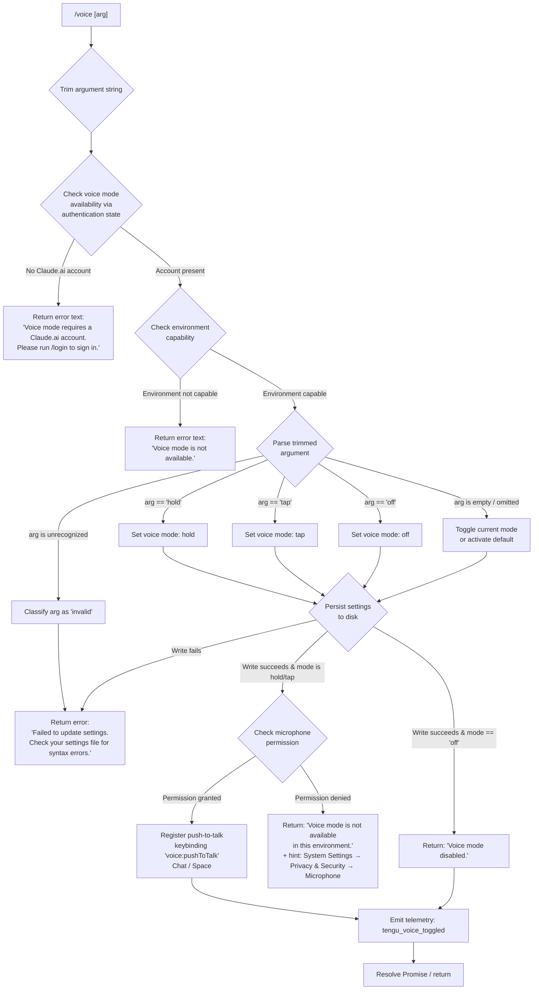

# `/voice`

> Analysis basis: CC v2.1.143 bundle.js (AST extraction + Claude interpretation)
> Minimum version: v2.1.143

---

## Overview

The `/voice` command toggles voice input mode for Claude Code, enabling spoken interaction via microphone. It accepts an optional mode argument (`hold`, `tap`, or `off`) that controls the activation mechanism for audio capture. The command validates account eligibility, checks environment capability, updates persistent settings, and registers a push-to-talk keybinding when applicable.

---

## Registration

| Field | Value |
|---|---|
| type | `local` |
| name | `voice` |
| description | `Toggle voice mode` |
| argumentHint | `[hold\|tap\|off]` |
| supportsNonInteractive | `false` |
| module_id | `Ivq` |

Analysis basis: CC v2.1.143 bundle.js:+11931518

---

## Input Branching

The command entry point (`bb7`) follows this decision tree after receiving the raw argument string:



Analysis basis: CC v2.1.143 bundle.js:+11928972, +11928889, +11929013, +11929112, +11929264, +11929431, +11929512, +11929569, +11929629, +11929813

---

## Behavioral Spec

### Argument Parsing

```
function parseVoiceArgument(rawInput):
    trimmed = rawInput.trim()                     // Cb7 → H.trim
    if trimmed == "hold":
        return { mode: "hold", valid: true }
    else if trimmed == "tap":
        return { mode: "tap", valid: true }
    else if trimmed == "off":
        return { mode: "off", valid: true }
    else if trimmed == "":
        return { mode: null, valid: true }        // toggle / default path
    else:
        return { mode: "invalid", valid: false }
```

Analysis basis: CC v2.1.143 bundle.js:+11928842, +11928889, +11928901, +11928912, +11928933, +11929264

---

### Authentication Check

```
function checkVoiceEligibility(appState):
    authInfo = getAuthenticationState(appState)   // YsH → fg_
    hasOAuthToken = Boolean(authInfo.token)        // fg_ → Boolean (+11919443)
    loginType = getLoginProvider(authInfo)         // fg_ → Uw, xA
    if loginType != 1 and hasOAuthToken == false:  // literals: 0, 1 (+11919386, +11919423)
        return { eligible: false,
                 reason: "Voice mode requires a Claude.ai account. Please run /login to sign in." }
    return { eligible: true }
```

Analysis basis: CC v2.1.143 bundle.js:+11928972, +11919505, +11919411, +11919431, +11919443, +11919386, +11919423, +11929013

---

### Environment Capability Check

```
function checkVoiceEnvironment(appState):
    envFlags = readEnvironmentFlags(appState)      // Uw → SN, TK, Sw
    if envFlags.voiceSupported == false:
        return { capable: false,
                 reason: "Voice mode is not available." }
    return { capable: true }
```

Analysis basis: CC v2.1.143 bundle.js:+11928983, +11929112

---

### Settings Persistence

The command uses the layered settings subsystem to persist the chosen voice mode. The write path resolves through the following layers in order:

| Priority | Layer key | File |
|---|---|---|
| 1 | `userSettings` | `~/.claude/settings.json` |
| 2 | `localSettings` | `.claude/settings.local.json` |
| 3 | `projectSettings` | `.claude/settings.json` |
| 4 | `policySettings` | policy-managed settings |
| 5 | `flagSettings` | flag-managed settings |

```
function persistVoiceMode(mode):
    settingsPath = resolvePath(homeDir, ".claude", "settings.json")   // hy → pV.join + ".claude" + "settings.json"
    try:
        currentSettings = loadSettingsFromDisk()                       // Lu (loadSettingsFromDisk_start/_end)
        currentSettings.voice = { mode: mode }
        atomicWriteSettings(settingsPath, currentSettings)             // yA6 → atomic write with rename
        return { ok: true }
    catch error:
        return { ok: false,
                 reason: "Failed to update settings. Check your settings file for syntax errors." }
```

Atomic write procedure (within `atomicWriteSettings` / `yA6`):
```
function atomicWriteSettings(targetPath, data):
    randomSuffix = crypto.randomBytes(6).toString("hex")     // Ix8.randomBytes, 6 bytes, "hex" encoding
    tempPath = targetPath + "." + randomSuffix
    serialized = JSON.stringify(data)                         // hH → JSON.stringify
    stat = fs.lstatSync(targetPath)                           // q.lstatSync
    if stat.isSymbolicLink():
        resolvedPath = resolveSymlink(targetPath)             // q.readlinkSync, _5.isAbsolute/resolve/dirname
    fd = fs.openSync(tempPath, "w")
    fs.writeFileSync(fd, serialized, { encoding: "utf-8" })   // "utf-8"
    fs.fchmodSync(fd, originalPermissions)                    // preserve original mode bits
    fs.fsyncSync(fd)
    fs.closeSync(fd)
    fs.renameSync(tempPath, targetPath)                       // atomic replace
```

Analysis basis: CC v2.1.143 bundle.js:+11929150, +11929333, +1206856, +1197602, +1197610, +1197620, +1197682, +1000212, +1000940, +1000968, +1001376, +1001434, +1001500, +1001628, +11929431

---

### Config Lock Contention

Settings writes go through a file-lock mechanism (`a6` → `P9_`) that detects and handles concurrent Claude instances:

```
function acquireConfigLock(configPath):
    lockDir = path.dirname(configPath)
    fs.mkdirSync(lockDir, { recursive: true })
    deadline = Date.now() + 60000                // 60 000 ms timeout
    attempt = 0
    loop:
        attempt++
        if attempt > 100:                        // 100 max spin iterations
            log.warn("Lock acquisition took longer than expected - another Claude instance may be running")
            emit telemetry: tengu_config_lock_contention
        try:
            acquireLock()
            break
        catch EEXIST:
            sleep and retry
    return lockHandle
```

Guard against auth-loss on stale write:
```
    reRead = readConfigFromDisk()
    if cacheHasAuth and reReadMissingAuth:
        emit telemetry: tengu_config_auth_loss_prevented
        throw "saveConfigWithLock: re-read config is missing auth..."    // GH #3117 guard
```

Analysis basis: CC v2.1.143 bundle.js:+3159299, +3162024, +3162069, +3162202, +3162208, +3162297, +3162555, +3162624, +3162776, +3162978, +3165092

---

### Push-to-Talk Keybinding Registration

When voice mode is set to `hold` or `tap`, the command registers an action binding for push-to-talk:

```
function registerPushToTalkBinding(mode):
    actionName = "voice:pushToTalk"                // literal +11930782
    context   = "Chat"                             // literal +11930801
    triggerKey = "Space"                           // literal +11930808
    bindingDef = buildKeybinding(actionName, context, triggerKey, mode)
    result = registerKeybinding(bindingDef)        // Lj → ma6 (Jf6), pa6 (iL_, YGH)
    if result == "action_not_found":               // literal +3754002
        emit telemetry: tengu_keybinding_fallback_used
        useFallbackBinding()
    deduplicateBindings(registeredSet)             // Lj → cC9.has / cC9.add
```

Analysis basis: CC v2.1.143 bundle.js:+11930779, +11930782, +11930801, +11930808, +3753849, +3753859, +3753907, +3753918, +3754002, +3753929, +3753931

---

### Locale / Language Guard

The keybinding subsystem enforces a language check before processing keys:

```
function normalizeKey(rawKey):
    lang = detectLanguage()                   // HSH → H.toLowerCase
    supportedLangs = getLanguageSet()         // HSH → xt_.has
    if lang not in supportedLangs:
        lang = "en"                           // default "en" +27065
    parts = rawKey.split(separator)           // HSH → _.split
    return normalizedKeySequence(parts)
```

Analysis basis: CC v2.1.143 bundle.js:+11930913, +27065, +27077, +27127, +27192

---

### Microphone Permission Path

When the environment is detected as capable but the microphone permission is denied at the OS level, the command emits a specific message referencing the macOS permission location:

```
function handleMicrophonePermissionDenied():
    hint = "System Settings → Privacy & Security → Microphone"   // literal +11930320
    return {
        type: "text",
        content: "Voice mode is not available in this environment.\n" + hint
    }
```

Analysis basis: CC v2.1.143 bundle.js:+11929813, +11930320

---

### MCP / Remote Server State During Voice Toggle

The voice command trigger path (`bb7 → M`) includes an MCP server state reconciliation step executed as a side effect of the broader app-state update:

```
function reconcileMcpState(appState):
    for each [serverName, serverConfig] in Object.entries(mcpServers):
        if serverConfig.status == "disabled":
            skip
        transport = serverConfig.transport    // "stdio" | "sse" | "http" | "sse-ide" | "ws-ide"
        if cachedStatus == "needs-auth":
            log("Skipping connection (cached needs-auth)")
            continue
        if transport == "claudeai-proxy":
            applyClaudeAiProxySettings(serverConfig)
        status = connectOrReconnect(serverConfig)
        if all remote servers recovered:
            log("[MCP] Retry: all remote servers recovered, stopping")
            stopRetry()
```

Analysis basis: CC v2.1.143 bundle.js:+11930088, +9694646, +9694745, +9694847, +9694881, +9694913, +9694946, +9694982, +9695254, +9695386, +9695452, +9695554, +9696127, +14234909

---

## State & Side Effects

| Item | Detail |
|---|---|
| Telemetry — voice toggled | `tengu_voice_toggled` fired on every successful mode change (Analysis basis: CC v2.1.143 bundle.js:+11929514) |
| Telemetry — keybinding fallback | `tengu_keybinding_fallback_used` fired when push-to-talk action name is not found in the action registry (Analysis basis: CC v2.1.143 bundle.js:+3753931) |
| Telemetry — config parse error | `tengu_config_parse_error` fired when the settings JSON on disk cannot be parsed (Analysis basis: CC v2.1.143 bundle.js:+3164878) |
| Telemetry — config lock contention | `tengu_config_lock_contention` fired when the lock spin exceeds 100 iterations (Analysis basis: CC v2.1.143 bundle.js:+3162297) |
| Telemetry — stale write | `tengu_config_stale_write` fired when a concurrent write would overwrite a newer revision (Analysis basis: CC v2.1.143 bundle.js:+3162433) |
| Telemetry — auth loss prevented | `tengu_config_auth_loss_prevented` fired when a write is suppressed to avoid wiping auth credentials (GH #3117 guard) (Analysis basis: CC v2.1.143 bundle.js:+3162776) |
| Hook registration | Push-to-talk keybinding `voice:pushToTalk` registered on `Chat` context / `Space` key when mode is `hold` or `tap` |
| appState changes | `voice.mode` field updated in user settings layer (`userSettings` key); MCP server state reconciled as a side effect |
| Settings files written | `~/.claude/settings.json` (primary); `.claude/settings.local.json` or `.claude/settings.json` for project-scoped overrides |
| Cache invalidation | `kV6` and `EZ8` caches cleared via `hz` after settings write (Analysis basis: CC v2.1.143 bundle.js:+26086, +26098) |
| Timestamp tracking | `RR6` map updated with `Date.now()` after successful settings write via `nu8` (Analysis basis: CC v2.1.143 bundle.js:+1086635, +1086645) |
| Event emission | `WCH.emit` called to notify internal subscribers of settings change (Analysis basis: CC v2.1.143 bundle.js:+1207214) |
| Sound | <!-- TODO: not found in depth-2 traversal; needs --depth 4 --> |

---

## Version History

| Version | Change |
|---|---|
| v2.1.143 | Initial analysis — `hold`, `tap`, `off` modes; push-to-talk keybinding; Claude.ai account gate; atomic settings write with auth-loss guard |

---

## Common Mistakes

1. **Running `/voice` without a Claude.ai account.** The command requires OAuth authentication (`CLAUDE_CODE_OAUTH_TOKEN`). API-key-only sessions (`ANTHROPIC_API_KEY`) do not satisfy the account gate and will receive the login prompt error.

2. **Passing an unrecognized argument.** Only `hold`, `tap`, and `off` are valid. Any other string is classified as `"invalid"` and causes a settings-write failure message, not a helpful usage hint.

3. **Running in a non-interactive environment.** `supportsNonInteractive` is `false`; invoking `/voice` in a pipe or CI context will have no effect or will be rejected by the CLI argument parser before the command body executes.

4. **Ignoring the microphone permission error.** On macOS, if the OS-level microphone permission for Claude Code is not granted, the command will appear to accept the mode but immediately report unavailability and reference `System Settings → Privacy & Security → Microphone`. The setting is still written; the keybinding is not registered.

5. **Editing settings files manually while Claude Code is running.** The config lock (`P9_`) uses a spin-wait with a 60 000 ms timeout. A concurrent manual edit can trigger `tengu_config_lock_contention` and potentially block or delay the `/voice` write for up to 60 seconds.

6. **Expecting `/voice` to work over SSH or in headless environments.** The environment capability check (`checkVoiceEnvironment`) will return "Voice mode is not available." in environments that lack audio device access, regardless of authentication state.

---

## Appendix — Identifier Mapping

> For bundle debugging only. Identifiers change across versions.

| Identifier | Role |
|---|---|
| `bb7` | Voice command main handler (entry point) |
| `YsH` | Authentication state reader for voice eligibility |
| `fg_` | OAuth token presence check (extracts token + provider from auth state) |
| `jG6` | Secondary auth-state helper called from eligibility check |
| `Uw` | Environment / app-state resolver |
| `TK` | Environment flag accessor |
| `SN` | Capability flag aggregator |
| `Sw` | First-party login-type tagger (`"firstParty"`) |
| `j3` | API key / auth configuration loader |
| `eAH` | Auth-config reader with IRH integration |
| `R_` | Settings persistence orchestrator |
| `Lu` | Settings loader from disk (`loadSettingsFromDisk_start` / `loadSettingsFromDisk_end`) |
| `Cb7` | Argument trimmer / mode string classifier |
| `H` | Utility namespace (trim, includes, Math.random, setTimeout) |
| `p_` | Settings write pipeline coordinator |
| `wO` | Settings path builder helper |
| `x6` | File-existence / path-check utility |
| `lm8` | Settings directory resolver |
| `WB` | Settings layer multiplexer (userSettings, projectSettings, localSettings, etc.) |
| `AP` | Settings applicator / transformer |
| `$8` | ENOENT-tolerant file reader |
| `v` | Log / debug emitter (`"debug"` level) |
| `nu8` | Settings timestamp recorder (`RR6.set` + `Date.now`) |
| `XXH` | Settings cache updater (`JC6` + `WB`) |
| `yA6` | Atomic file writer (temp-file + rename pattern) |
| `hH` | JSON serializer wrapper (`JSON.stringify`) |
| `hz` | Cache invalidator (`kV6.clear` + `EZ8.clear`) |
| `VR6` | Append/write file utility with mkdir (async FS layer) |
| `hy` | Settings path joiner (`.claude` + filename via `pV.join`) |
| `__` | Global-state accessor (`GV`) |
| `NH` | Error logger / reporter (`Wc.logError` + `xRH.push`) |
| `d` | Promise / async continuation helper |
| `L` | Connection/resource set manager (`q.add` / `q.delete` / `f.finally`) |
| `q` | File-system sync namespace (unlinkSync, etc.) |
| `f` | Resource handle (close, finally) |
| `K` | Column/display formatter (`L.map` + `f.padEnd`) |
| `M` | MCP server state reconciler |
| `SvH` | MCP server connection dispatcher (multi-transport) |
| `THK` | MCP update applicator (`applyMcpUpdate`, cleanup, retry) |
| `$` | MCP connection wrapper (`JZq`) |
| `B95` | MCP server filter and bulk reconnect orchestrator |
| `Lj` | Keybinding registrar (deduplication via `cC9`) |
| `ma6` | Action definition builder (`Jf6`) |
| `pa6` | Keybinding installer (`iL_`, `YGH`) |
| `HSH` | Key normalizer / language guard (`toLowerCase`, `xt_.has`, `split`) |
| `_` | String utility namespace (toUpperCase, split) |
| `N6` | Config file reader with backup/snapshot logic |
| `z9_` | Config snapshot helper |
| `H$H` | Low-level config file reader (readFileSync, mkdirSync, copyFileSync) |
| `nhL` | File watcher for config changes (`di6.watchFile` / `di6.unwatchFile`) |
| `a6` | Config write coordinator (global config path) |
| `P9_` | Config write with lock, rotation, and auth-loss guard |
| `emH` | Config format migrator |
| `OZ9` | Config entries enumerator (`Object.entries`) |
| `HpH` | Config write timestamp tracker (`Date.now`) |
| `d76` | Config diff / merge helper |
| `j9_` | Project-scoped config writer (`lz.dirname`, `hH`, `yA6`) |