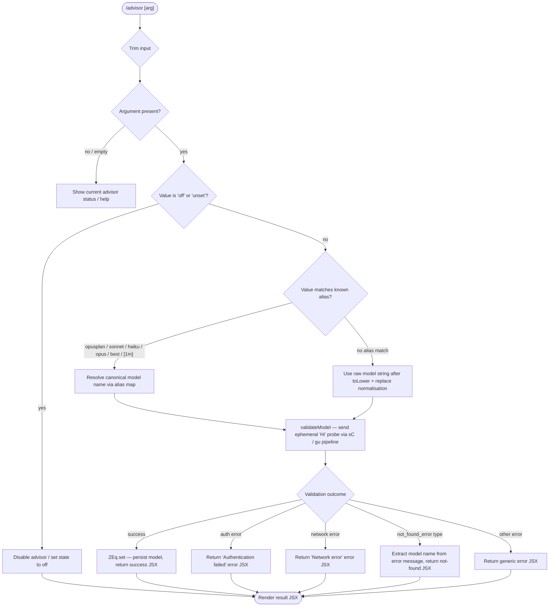

# `/advisor`

> Analysis basis: CC v2.1.144 bundle.js (AST extraction + Claude interpretation)
> Minimum version: v2.1.144

---

## Overview

The `/advisor` command configures the **Advisor Tool**, which enables Claude Code to consult a stronger model for guidance at key decision points during a task. The user specifies a target model (or toggles the feature off) by name; the handler validates that model identifier against the current API provider, then either activates advisory mode or disables it. The result is rendered as a JSX component displayed inline in the CLI.

---

## Registration

| Field | Value |
|---|---|
| type | `local-jsx` |
| name | `advisor` |
| description | Configure the Advisor Tool to consult a stronger model for guidance at key moments during a task |
| loc_byte | `11653393` |
| loc_byte_end | `11653680` |
| loc_line | `7233` |
| argumentHint | `null` |
| isHidden | `null` |
| module_id | `kEq` |
| load_inline | `true` |
| arbor_handler.name | `rS7` |
| arbor_handler.fqn | `claude-2.1.144::rS7` |
| arbor_handler.kind | `AsyncFunction` |
| arbor_handler.resolution_path | `module_id` |
| arbor_handler.n_hits | `1` |

Analysis basis: CC v2.1.144 bundle.js:+11653393

---

## Input Branching

The command has more than three distinct branches (model-name absent, "off"/"unset" tokens, alias keywords, model validation success/failure, auth error, network error, model-not-found error), so a Mermaid flowchart is used.



Analysis basis: CC v2.1.144 bundle.js:+11652851 (handler entry), +11652927 ("off"), +11652938 ("unset"), +11645478 ("Model name cannot be empty"), +11645886 ("Hi" probe literal), +11646177 (auth error message), +11646279 (network error message), +11646398 ("not_found_error"), +11645930 (ZEq.set)

---

## Behavioral Spec

### 1. Handler Entry — `advisorCommandHandler` (`rS7`)

The handler is an `AsyncFunction` resolved via `module_id → kEq`. It is the sole entry point for `/advisor`.

```
async function advisorCommandHandler(context):
    rawArg = context.input.trim()                  // A.trim  +11652851
    resultElement = createElement(AdvisorResultComponent, ...)  // xJ.createElement  +11652887

    if rawArg is empty:
        return show-current-status JSX             // early exit, no validation

    normalised = normaliseModelToken(rawArg)        // zq  +11653005
    if normalised == "off" or normalised == "unset":
        disableAdvisor()
        return resultElement(disabled=true)

    validationResult = await validateModelName(normalised, context)   // YP8  +11653019

    providerContext = resolveProviderContext(context)  // H  +11653045
    includeCheck = checkProviderCompatibility(providerContext)  // aO6  +11653093

    finalParts = buildResultParts(validationResult, includeCheck)  // wQH.join  +11653162
    return renderJSX(finalParts)
```

Analysis basis: CC v2.1.144 bundle.js:+11652851, +11652887, +11653005, +11653019, +11653045, +11653093, +11653162

---

### 2. Model Token Normalisation — `normaliseModelToken` (`zq`)

Converts user input into a canonical model identifier. Handles alias keywords, string replacement (removing non-alphanumeric separators), and a known-alias inclusion check.

```
function normaliseModelToken(input):
    trimmed = input.trim()                    // H.trim  +2163756
    lower   = trimmed.toLowerCase()           // _.toLowerCase  +2163767

    // Alias resolution — HT  +2163785
    resolved = resolveModelAlias(lower)       // maps short names to canonical IDs

    // Known alias membership test — vAH  +2163831
    if isKnownAlias(lower):
        return resolved

    // String normalisation — replace separators
    normalised = resolved.replace(separatorPattern, "")   // A.replace  +2163795

    // Alias membership test for the clean model names
    if includesAlias(normalised):             // Ag6 / Y3L.includes  +2164294
        return normalised

    // Final normalisation pass
    return applyFinalNorm(normalised)         // axH / xH  +2164054, +2164332
```

**Known alias tokens** (literals found in traversal):

| Input token | Resolved form |
|---|---|
| `opusplan` | <!-- TODO: not found in depth-2 traversal; needs --depth 4 --> |
| `sonnet` | sonnet-family canonical |
| `haiku` | haiku-family canonical |
| `opus` | opus-family canonical |
| `best` | best-available canonical |
| `[1m]` | extended-context variant |

Analysis basis: CC v2.1.144 bundle.js:+2163756, +2163767, +2163785, +2163795, +2163831, +2163852 ("opusplan"), +2163878 ("[1m]"), +2163893 ("sonnet"), +2163932 ("haiku"), +2163971 ("opus"), +2164008 ("best"), +2164046 (axH), +2164294 (Ag6 / Y3L.includes)

---

### 3. Model Validation — `validateModelName` (`YP8`)

Sends a minimal ephemeral probe message to the selected model and inspects the outcome. This is where authentication, network, and model-not-found errors surface.

```
async function validateModelName(modelName, context):
    if modelName.trim() == "":
        throw Error("Model name cannot be empty")    // +11645478

    lower = modelName.toLowerCase()                  // +11645601

    // Provider compatibility gate
    if isIncompatibleProvider(lower):               // IAH.includes  +11645620
        return providerIncompatibilityResult()

    // Cache hit — skip probe if already validated this session
    if validationCache.has(modelName):              // ZEq.has  +11645722
        return cachedResult(modelName)

    // Issue ephemeral 'Hi' probe via main API client (sC)
    try:
        response = await apiClient.sendProbe(       // sC  +11645767
            model   = modelName,
            message = "Hi",                         // +11645886
            cacheControl = "ephemeral"              // +11645911
        )
        // Emit telemetry: tengu_api_success
        validationCache.set(modelName, response)   // ZEq.set  +11645930
        return successResult(response)

    catch authError:
        return errorResult("Authentication failed. Please check your API credentials.")  // +11646177

    catch networkError:
        return errorResult("Network error. Please check your internet connection.")      // +11646279

    catch apiError where apiError.type == "not_found_error":    // +11646398
        // Extract model name fragment from apiError.message    // +11646417
        return notFoundResult(modelName, apiError.message)

    catch other:
        return genericErrorResult()

    finally:
        // Emit model_validation telemetry                       // +11645817
        recordTelemetry("model_validation", modelName)
```

Analysis basis: CC v2.1.144 bundle.js:+11645441, +11645478, +11645601, +11645620, +11645722, +11645767, +11645817, +11645886, +11645911, +11645930, +11645971, +11646177, +11646279, +11646377, +11646398, +11646417, +11646480

---

### 4. Model Alias Expansion — `resolveModelAlias` (`pS7`, called via `mS7`)

Resolves short alias tokens to a structured model descriptor. Consulted during both the input normalisation and provider-compatibility phases.

```
function resolveModelAlias(input):
    base = normaliseModelBase(input)          // dM  +11646699
    lower = input.toLowerCase()               // +11646717

    if lower contains known model family:     // _.includes  +11646736
        descriptor = buildModelDescriptor(lower, base)  // wM  +11646790
        return descriptor

    // Known versioned aliases:
    // "opus-4-7" / "opus_4_7"     +11646747 / +11646771
    // "opus-4-6" / "opus_4_6"     +11646816 / +11646840
    // "opus-4-5" / "opus_4_5"     +11646885 / +11646909
    // "sonnet-4-6" / "sonnet_4_6" +11646954 / +11646980
    // "sonnet-4-5" / "sonnet_4_5" +11647029 / +11647055

    return String(input)   // +11646667 — fallback: return as-is
```

Analysis basis: CC v2.1.144 bundle.js:+11646026, +11646667, +11646699, +11646717, +11646736, +11646747, +11646771, +11646816, +11646840, +11646885, +11646909, +11646954, +11646980, +11647029, +11647055

---

### 5. API Probe Client — `apiProbeClient` (`sC`)

The validation probe travels through `sC` → `gu` (the main API call pipeline). Key behaviours observable from the call graph and literals:

- Buffer size limit: **1024 bytes** for probe response (bundle.js:+12419827)
- Cache label `"1h"` used for ephemeral prompt cache (bundle.js:+12420861); telemetry event `tengu_prompt_cache_1h_config` emitted (+12381304)
- Provider filter `"side_query"` tags the probe so it is not counted as a user turn (bundle.js:+12420011)
- `"enabled"` guard checked before probe dispatch (+12420795)
- Abort controller with `"no-turn"` category (bundle.js:+5280760) prevents the probe from polluting conversation history
- `AbortSignal.timeout` of **10 000 ms** used for the fetch call (bundle.js:+2209277)

```
async function apiProbeClient(modelName, message, options):
    if feature.state != "enabled":             // +12420795
        return skip

    requestHash = sha256Hash(modelName)        // Xc_ / HRq.createHash  +12374538
    // hash parameters: length 4+7, radix 3    // +12374475, +12374477, +12374595

    headers = buildHeaders(sessionContext)     // gu  +12420096
    // includes: x-app, cli / cli-bg           // +2887637, +2887659
    //           User-Agent, X-Claude-Code-Session-Id, etc.

    response = await fetch(                    // yg6 / fetch  +2209195
        url     = "https://api.anthropic.com", // +2209154
        signal  = AbortSignal.timeout(10000),  // +2209277
        body    = { model: modelName, messages: [{ role: "user", content: message }] }
    )

    if response ok:
        emit("tengu_api_success")              // +12421435
        return parseResponse(response)

    raise categorisedError(response)
```

Analysis basis: CC v2.1.144 bundle.js:+12419827, +12420011, +12420060, +12420064, +12420096, +12420795, +12420861, +12421435, +2209154, +2209195, +2209257, +2209277

---

### 6. Provider Compatibility Check — `checkProviderCompatibility` (`aO6`)

After validation, the handler queries which API provider is active and whether the chosen model is compatible with it.

```
function checkProviderCompatibility(providerContext):
    lower = providerContext.toLowerCase()   // +5242845
    compatible = knownProviders.includes(lower)  // _.includes  +5242868
    // Known provider values encountered in depth-2 traversal:
    // "bedrock", "foundry", "anthropicAws", "mantle", "vertex",
    // "firstParty", "gateway"             // +2021996 … +2022685
    return compatible
```

Analysis basis: CC v2.1.144 bundle.js:+5242845, +5242868, +2021996, +2022046, +2022102, +2022156, +2022204, +2022213, +2022685

---

## State & Side Effects

| Item | Detail |
|---|---|
| Telemetry | `tengu_api_success` (+12421435), `model_validation` literal (+11645817), `tengu_prompt_cache_1h_config` (+12381304), `tengu_feature_ok` (+955520), `tengu_feature_bad` (+955578) |
| Validation cache | `ZEq` (`Map`) — keyed by model name string; `.has` checked before probe, `.set` on success (+11645722, +11645930) |
| appState changes | Advisor model stored/cleared in application state via the cache map; "off"/"unset" clears the stored model name |
| Render | Returns a `local-jsx` component (`xJ.createElement` +11652887); no terminal side effects beyond the inline JSX block |
| Network | One `fetch` call to `https://api.anthropic.com` per un-cached model name (+2209154, +2209195) with a 10 000 ms timeout (+2209277) |
| Sound | None detected in depth-2 traversal |
| Hook registration | None detected in depth-2 traversal |

---

## Version History

| Version | Change |
|---|---|
| v2.1.144 | Initial analysis |

---

## Common Mistakes

1. **Passing `"off"` when the advisor is already disabled** — the command accepts it silently, but the confirmation JSX may be misleading if no prior advisor model was set. Check current status first with a bare `/advisor` call.
2. **Using a non-normalised model string** — the token normaliser lowercases and strips separators, so `Claude-Opus-4-7` and `claude_opus_4_7` are treated identically. Always prefer the dash-separated lowercase form (`opus-4-7`) to avoid ambiguity.
3. **Provider mismatch** — on Bedrock, Vertex, or other non-firstParty providers, certain model aliases may pass validation but fail at inference time. The compatibility check (`aO6`) is a prefix/inclusion heuristic only; it does not guarantee runtime availability.
4. **Repeated validation round-trips** — validation results are cached in `ZEq` for the session lifetime. Calling `/advisor` with the same model name a second time does not re-probe the API, so transient network errors from the first call will be cleared only by restarting the session.
5. **Expecting `"unset"` to fully reset configuration** — both `"off"` and `"unset"` are treated as disable tokens (+11652927, +11652938), but downstream persistence behaviour (e.g. project config files) is beyond the depth-2 call graph and may differ.

---

## Appendix — Identifier Mapping

> For bundle debugging only. Identifiers change across versions.

| Identifier | Role |
|---|---|
| `rS7` | `advisorCommandHandler` — async handler for `/advisor` (Arbor-resolved entry point) |
| `zq` | `normaliseModelToken` — normalises raw user input to a canonical model token |
| `YP8` | `validateModelName` — sends ephemeral probe and classifies errors |
| `mS7` | `aliasExpansionWrapper` — wraps `pS7` alias resolver |
| `pS7` | `resolveModelAlias` — maps short names to versioned model descriptors |
| `aO6` | `checkProviderCompatibility` — tests whether model is compatible with active provider |
| `sC` | `apiProbeClient` — main API request path used for the validation probe |
| `gu` | `coreApiCallDispatcher` — low-level API dispatch with header building and auth |
| `oB` | `buildModelList` — constructs model descriptor list (called by `YP8`) |
| `wM` | `buildModelDescriptor` — assembles a structured model descriptor object |
| `dM` | `normaliseModelBase` — base normalisation used during alias resolution |
| `aV` | `resolveModelVariant` — resolves variant details for a given model family |
| `oxH` | `lookupModelFromDescriptor` — reverse-lookup descriptor to canonical id |
| `oV` | `buildProviderModelEntry` — builds a provider-scoped model entry |
| `neA` | `providerModelEntryWrapper` — wraps `oV` with provider context |
| `Ag6` | `aliasInclusionTest` — tests whether a string is in the canonical alias set (`Y3L`) |
| `axH` | `finalNormPass` — applies the final normalisation step before returning |
| `HT` | `resolveAliasMap` — constructs or retrieves the alias→canonical mapping |
| `yAH` | `buildAliasEntry` — creates a single alias-map entry |
| `vAH` | `isKnownAliasToken` — membership test against the known alias list (`IAH`) |
| `SB6` | `providerEntryBuilder` — builds provider config entries |
| `B_` | `providerBaseConfig` — base provider configuration helper |
| `rxH` | `isRestrictedModel` — checks `M3L` inclusion list for restricted model names |
| `leA` | `findModelIndex` — finds model position in the known-model list |
| `$3L` | `resolveModelWithProvider` — resolves model considering provider context |
| `O3L` | `buildProviderModelCheck` — checks provider-specific model eligibility |
| `ceA` | `startsWithModelPrefix` — tests `"claude-"` prefix presence (+2157457) |
| `yB6` | `modelFamilyLookup` — searches `Gn8` array for matching model family |
| `ncA` | `buildProviderObjectEntries` — iterates `Object.entries` to build provider map |
| `dvH` | `mcpConnectionBuilder` — builds MCP server connection objects (deep dependency) |
| `k6K` | `mcpClientUpdater` — applies MCP updates, calls `applyMcpUpdate` |
| `vq5` | `mcpServerEnumerator` — enumerates MCP server configs via `Object.entries` |
| `v` | `modelStringFormatter` — formats model identifier strings with provider prefix/suffix |
| `$` | `mcpNvqWrapper` — wraps `NVq` MCP utility |
| `sD` | `asyncStoreGetter` — retrieves async store via `reA.getStore` |
| `fvL` | `splitTrimSlice` — splits, trims, and slices string segments |
| `G9` | `bgJobDispatcher` — dispatches background jobs (calls `JMH`) |
| `Il` | `internalContextLoader` — loads internal context via `In6` |
| `I6` | `workerVariantSelector` — selects worker variant via `WV` |
| `JM` | `errorEventEmitter` — emits structured error events (`E__`) |
| `e_` | `cancelContextHelper` — cancellation context utilities (`KJ`, `xR`, `CA`) |
| `KvL` | `connectionJoinHelper` — joins connections (`cJ`, `RmH`) |
| `Im6` | `proxyAuthHelper` — proxy auth token acquisition with trust check and timeout |
| `OvL` | `requestContextManager` — manages per-request context with UUID and Map |
| `oD` | `outputDispatcher` — dispatches output events (`kB6`, `R5L`, `JA`, `NB6`) |
| `Kz` | `credentialResolver` — resolves API credentials (`CR`, `nc`, `zb6`, `mRA`) |
| `LvL` | `promptSegmentBuilder` — builds prompt segments (`$n6`, `EV`, `gSH`, `MXH`) |
| `WMH` | `rateLimitWatcher` — watches rate-limit state with `Date.now` and timer |
| `VI8` | `timestampHelper` — simple `Date.now` wrapper |
| `M76` | `headerCaseLowerer` — lowercases header keys via `Object.entries` |
| `M$H` | `sdkErrorLogger` — logs Anthropic SDK errors to `console.error` |
| `$n6` | `promptCacheSegment` — cache-segment builder (`VX`, `v9`, `W9`, `EV`) |
| `MXH` | `modelStartsWithChecker` — checks `y4K` array for `H.startsWith` matches |
| `aw` | `skillsDispatcher` — dispatches agent skills (`n$`) |
| `$I` | `agentContextInjector` — injects agent context tokens (`uB6`, `SK`, `J1H`, `tc`) |
| `MuH` | `wifTokenExchanger` — handles WIF token exchange for providers |
| `yg6` | `wifCredentialsResolver` — resolves WIF credentials and fetches tokens |
| `FF7` | `userTextFinder` — finds user-role text content in message arrays |
| `Xc_` | `hashBuilder` — builds SHA-256 hex hash for cache keys |
| `Fr6` | `systemPromptBuilder` — builds system prompt with cache-control markup |
| `Br6` | `contextSystemBuilder` — builds base system context |
| `yZH` | `promptTurnAssembler` — assembles prompt turns with cache metadata |
| `P6` | `cacheTokenManager` — manages prompt cache tokens and feature flags |
| `yE` | `environmentInfoBuilder` — builds environment info block |
| `D__` | `envInfoFormatter` — formats environment info text |
| `N` | `mainRequestBuilder` — builds the main API request object with away-summary logic |
| `g$8` | `ziHStateAccessor` — reads `ziH` global state |
| `j65` | `systemMessageFormatter` — formats system messages (`Fr_`) |
| `xnq` | `requestMetricsRecorder` — records API metrics |
| `yA8` | `awaySummaryGenerator` — generates away summary with abort and rate-limit checks |
| `bH` | `streamingResponseHandler` — handles streaming response data |
| `h1q` | `uuidGenerator` — generates UUIDs via `UZ.randomUUID` |
| `F` | `messageHistoryStore` — stores message history with `g` and `$` accessors |
| `RH` | `responseDataExtractor` — extracts structured data from responses |
| `ZX` | `modelTagStripper` — strips model tags via `H.replace` |
| `jn6` | `sideQueryBuilder` — builds side-query request with `W9` and temperature |
| `UP` | `userMessageMapper` — maps user messages (`H.map`) |
| `u3H` | `contentBlockSerializer` — serialises content blocks to API format |
| `CH` | `jsonStringifyWrapper` — wraps `JSON.stringify` |
| `cu` | `randomBytesTokenGenerator` — generates random token bytes |
| `f5` | `cancelledContextBuilder` — builds cancelled-context result |
| `JEH` | `agentBuiltinDispatcher` — dispatches builtin agent commands |
| `eq4` | `agentCommandParser` — parses agent command prefixes |
| `kH` | `featureGateChecker` — checks feature flags (`b_`, `xH`, `Aq`, `bkK`) |
| `Sg` | `agentCommandRouter` — routes slash commands to agent handlers |
| `tq4` | `agentCommandTokeniser` — tokenises agent command strings |
| `f0H` | `sideQueryContextBuilder` — builds context for side-query API calls |
| `W9` | `sideQueryModelSelector` — selects model for side queries, checks `Kv8`/`ZX` |
| `ay` | `gatewayContextBuilder` — builds gateway request context (`JA`) |
| `xH` | `stringCoercer` — wraps `String()` for safe string coercion |
| `GH` | `stringifyHelper` — wraps `String()` for response formatting |
| `In6` | `asyncContextGetter` — retrieves async context via `Xw1.getStore` |
| `aO6` | `providerCompatibilityChecker` — toLower + includes test for provider name |
| `JH6` | `postProcessingHook` — post-API-call processing step (depth-2 leaf) |
| `Z7H` | `contextCleanupHelper` — context teardown utility (depth-2 leaf) |
| `Hv8` | `cacheSafeParamsStore` — stores cache-safe parameters for away summary |
| `_v8` | `autoModeDetector` — detects auto-mode flags in prompt metadata |
| `RRq` | `responseRoleMapper` — maps response roles for message assembly |

---

*Note: index built via Arbor fallback; some signals (telemetry, literals) may be missing — see arbor-fallback.js.*