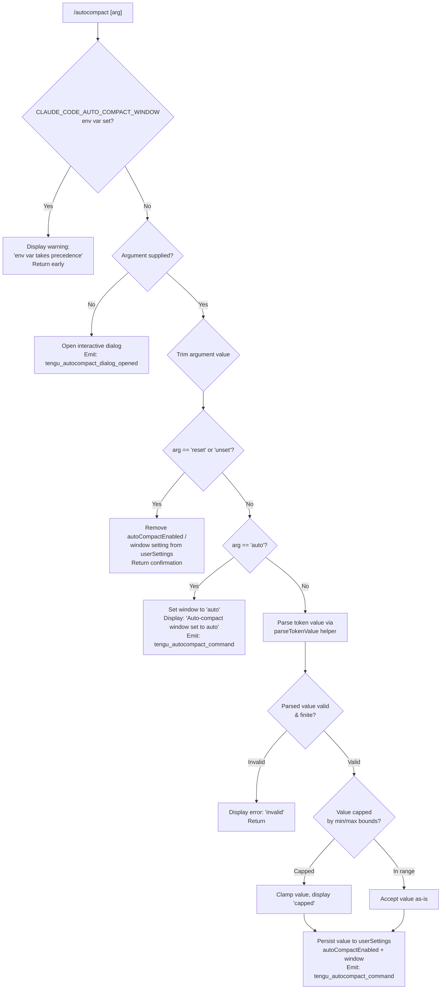

# `/autocompact`

> Analysis basis: CC v2.1.144 bundle.js (AST extraction + Claude interpretation)
> Minimum version: v2.1.144

---

## Overview

`/autocompact` configures the auto-compact window size, which controls the token threshold at which Claude Code automatically compacts the conversation context. It accepts the special keyword `auto`, an explicit token count, or the keywords `reset`/`unset` to remove the setting, and it persists the chosen value to user-level settings.

---

## Registration

| Field | Value |
|---|---|
| type | `local-jsx` |
| name | `autocompact` |
| description | Configure the auto-compact window size |
| argumentHint | `[auto\|<tokens>]` |
| isHidden | `false` |
| module_id | `L4q` |
| load_inline | `true` |
| loc_byte | `10162236` |
| loc_byte_end | `10162485` |
| loc_line | `5741` |
| arbor_handler.name | `$D7` |
| arbor_handler.fqn | `claude-2.1.144::$D7` |
| arbor_handler.kind | `AsyncFunction` |
| arbor_handler.resolution_path | `module_id` |
| arbor_handler.n_hits | `1` |

Analysis basis: CC v2.1.144 bundle.js:+10162236

---

## Input Branching

The command has 5+ distinct branches depending on environment-variable lock, argument value, and the `reset`/`unset` / `auto` / numeric token cases, plus a no-argument dialog path. A flowchart is used.



Analysis basis: CC v2.1.144 bundle.js:+10156698, +10156732, +10156863, +10157337, +10161956

---

## Behavioral Spec

### Top-level Handler (`$D7`)

The Arbor-resolved async handler is `$D7`. It checks for an argument, conditionally launches a dialog JSX component, or delegates to the core processing function.

```
async function autocompactHandler(args, context):
    if args is empty or not provided:
        emit telemetry("tengu_autocompact_dialog_opened")
        return createElement("dialog", autocompactDialogComponent)
    else:
        return processAutocompactCommand(args, context)
```

Analysis basis: CC v2.1.144 bundle.js:+10161921, +10161937, +10161954, +10162009, +10161956

---

### Environment Variable Lock Check (`kW6`)

Before any argument processing, the handler checks whether the environment variable `CLAUDE_CODE_AUTO_COMPACT_WINDOW` is set. When present, it takes precedence over all other configuration, and the command returns an informational message without modifying any settings.

```
function processAutocompactCommand(rawArg, context):
    if env["CLAUDE_CODE_AUTO_COMPACT_WINDOW"] is set:
        display "CLAUDE_CODE_AUTO_COMPACT_WINDOW is set and takes precedence. Unset it to change this setting."
        return

    trimmedArg = rawArg.trim()

    if trimmedArg == "reset" or trimmedArg == "unset":
        removeWindowSetting(context)
        return

    parsedToken = parseTokenValue(trimmedArg)
    // continues to validation branch below
```

Literal evidence: `"CLAUDE_CODE_AUTO_COMPACT_WINDOW"` (bundle.js:+9378843), `"CLAUDE_CODE_AUTO_COMPACT_WINDOW is set and takes precedence. Unset it to change this setting."` (bundle.js:+10156732), `"reset"` (bundle.js:+10156863), `"unset"` (bundle.js:+10156876).

Analysis basis: CC v2.1.144 bundle.js:+10156834, +10156906

---

### Token Value Parser (`kS_`)

The token value parsing function handles both the special string `"auto"` and numeric token values. For numeric input, it accepts values expressed with suffixes (e.g., `k` for thousands), validates finiteness, and rounds to the nearest integer.

```
function parseTokenValue(input):
    trimmed = input.trim()

    if trimmed ends with a suffix (e.g., 'k'):
        numericPart = parseFloat(trimmed without suffix)
        value = numericPart * 1000        // scale factor: 1000 (bundle.js:+9378374)
    else:
        value = parseInt(trimmed, 10)     // radix: 10

    if not Number.isFinite(value):
        return { status: "invalid" }

    rounded = Math.round(value)           // bundle.js:+9378483
    if rounded < 100:                     // minimum: 100 (bundle.js:+9378410)
        return { status: "capped", value: 100 }

    return { status: "valid", value: rounded }
```

Constants:
- Numeric multiplier for `k`-suffix: **1000** (bundle.js:+9378374)
- Minimum token floor after rounding: **100** (bundle.js:+9378410)
- Special keyword: `"auto"` (bundle.js:+9378269)

Analysis basis: CC v2.1.144 bundle.js:+9378239, +9378298, +9378316, +9378390, +9378436, +9378483

---

### Effective Window Resolver (`Or`)

After parsing the token value, a resolver function determines the effective window size by consulting multiple configuration sources in priority order, then applies `Math.max` and `Math.min` clamping.

```
function resolveEffectiveWindow(parsedValue, context):
    envValue = env["CLAUDE_CODE_AUTO_COMPACT_WINDOW"]   // highest priority
    if envValue is set:
        return { source: "env", value: parseEnvValue(envValue) }

    settingsValue = readFromSettings("autoCompactEnabled")
    if settingsValue is set:
        return { source: "settings", value: settingsValue }

    // Apply bounds
    clamped = Math.max(lowerBound, Math.min(upperBound, parsedValue))
    return { source: "computed", value: clamped }
```

Priority ladder (literal evidence): `"env"` (bundle.js:+9379035) > `"settings"` (bundle.js:+9379105).

Analysis basis: CC v2.1.144 bundle.js:+9378767, +9378775, +9378780, +9378840, +9378961, +9379001

---

### Settings Persistence (`g_`)

When a valid token value or `"auto"` is confirmed, the command persists the new value to user-level settings via the settings writer. The `"auto"` path emits a display-confirmation string; numeric paths emit the telemetry event.

```
function persistWindowSetting(value, context):
    settingsLayer = loadSettings(["userSettings", "projectSettings", "localSettings",
                                  "policySettings", "flagSettings"])
    // Source priority: policySettings > flagSettings > userSettings (bundle.js:+1207092)

    if value == "auto":
        writeToUserSettings("autoCompactEnabled", "auto")
        display "Auto-compact window set to auto"
    else:
        writeToUserSettings("autoCompactEnabled", value)

    clearSettingsCache()   // invalidates jI6 and LV8 caches (bundle.js:+26086, +26098)
    emit telemetry("tengu_autocompact_command")
    notifyEventBus(BCH)    // broadcast settings change
```

Literal evidence: `"Auto-compact window set to auto"` (bundle.js:+10157551), `"userSettings"` (bundle.js:+1198150), `"policySettings"` (bundle.js:+1207092), `"flagSettings"` (bundle.js:+1207114).

Analysis basis: CC v2.1.144 bundle.js:+10157074, +10157335, +10157391, +10157551, +1207497, +1207836

---

### Settings File I/O (`wC6`)

The settings writer resolves the user settings file path, creates intermediate directories if needed, and performs an atomic write operation.

```
function writeSettingsFile(key, value):
    configDir = path.join(homedir(), ".config")    // bundle.js:+1063901
    settingsPath = resolveSettingsPath(configDir)  // .claude/settings.json (bundle.js:+1198404, +1198414)

    mkdir(dirname(settingsPath), { recursive: true })
    existing = readFile(settingsPath) or {}
    existing[key] = value
    writeFile(settingsPath, JSON.stringify(existing))
```

Literal evidence: `".claude"` (bundle.js:+1198404), `"settings.json"` (bundle.js:+1198414), `".config"` (bundle.js:+1063901).

Analysis basis: CC v2.1.144 bundle.js:+1063950, +1064002, +1064081, +1064102, +1064144, +1064267

---

### Flag-Settings Application (`kW6` → telemetry path)

When the command finalizes a new value, it emits a `"apply_flag_settings"` signal before writing, indicating that flag-level settings are reconciled with the incoming change.

```
function applyFlagSettings(newValue):
    emit internal event "apply_flag_settings"    // bundle.js:+10157274
    // reconcile flagSettings layer before user write
    writeSettingsFile("autoCompactEnabled", newValue)
```

Literal evidence: `"apply_flag_settings"` (bundle.js:+10157274), `"set"` (bundle.js:+10157391).

Analysis basis: CC v2.1.144 bundle.js:+10157274, +10157391

---

### Model-Aware Context Detection (`W9` / `tw`)

The call graph shows that the window resolver consults a list of known Claude model identifiers when determining context defaults. The following model families are recognised:

- `claude-opus-4-7` through `claude-opus-4-0` (bundle.js:+2160925–2161185)
- `claude-sonnet-4-6` through `claude-sonnet-4-0` (bundle.js:+2161217–2161373)
- `claude-haiku-4-5` (bundle.js:+2161407)
- `claude-3-7-sonnet`, `claude-3-5-sonnet`, `claude-3-5-haiku` (bundle.js:+2161466–2161588)
- `claude-3-opus`, `claude-3-sonnet`, `claude-3-haiku` (bundle.js:+2161647–2161757)
- Cross-region inference profiles with prefix `"application-inference-profile"` (bundle.js:+2161893)

The model name is normalised via `.toLowerCase()` and `.includes()` checks. An `"application-inference-profile"` prefix triggers special routing.

```
function normaliseModelName(modelId):
    lower = modelId.toLowerCase()
    if lower.includes("application-inference-profile"):
        return resolveInferenceProfileModel(lower)
    for each knownModel in KNOWN_MODELS:
        if lower.includes(knownModel):
            return knownModel
    return lower
```

Analysis basis: CC v2.1.144 bundle.js:+2160898, +2160914, +2161805, +2161882, +2161893

---

### Token Limit Validation (`S0`)

The validator enforces a hard upper ceiling of **1,000,000** tokens and a lower floor of **0** before acceptance, with a radix-10 parse.

```
function validateTokenLimit(rawValue):
    parsed = parseInt(rawValue, 10)    // radix 10 (bundle.js:+2899513)
    if isNaN(parsed):
        return { status: "invalid" }
    if parsed < 0:                     // floor: 0 (bundle.js:+2899585)
        return { status: "invalid" }
    if parsed > 1000000:               // ceiling: 1,000,000 (bundle.js:+2899612)
        return { status: "capped", value: 1000000 }
    return { status: "valid", value: parsed }
```

Constants:
- Maximum token value: **1,000,000** (bundle.js:+2899612)
- Minimum token value: **0** (bundle.js:+2899585)
- parseInt radix: **10** (bundle.js:+2899565)

Analysis basis: CC v2.1.144 bundle.js:+2899430, +2899513, +2899573, +2899599, +2899643, +2899663

---

## State & Side Effects

| Item | Detail |
|---|---|
| Telemetry | `tengu_autocompact_command` (bundle.js:+10157337) — fired after successful set/auto |
| Telemetry | `tengu_autocompact_dialog_opened` (bundle.js:+10161956) — fired when no argument supplied and dialog is launched |
| Telemetry | `tengu_amber_redwood2` (bundle.js:+9378655) — fired inside window-resolver path |
| Settings write | `autoCompactEnabled` key in `~/.claude/settings.json` (userSettings layer) |
| Settings cache | `jI6` and `LV8` caches cleared after write (bundle.js:+26086, +26098) |
| Event bus | `BCH.emit` broadcast after settings change (bundle.js:+1208008) |
| Flag settings | `apply_flag_settings` internal event reconciled before write (bundle.js:+10157274) |
| Environment lock | `CLAUDE_CODE_AUTO_COMPACT_WINDOW` env var blocks any write when present (bundle.js:+9378843) |
| Dialog (JSX) | `tM.createElement("dialog", ...)` rendered when no argument given (bundle.js:+10162009, +10161998) |
| Sound | <!-- TODO: not found in depth-2 traversal; needs --depth 4 --> |

---

## Version History

| Version | Change |
|---|---|
| v2.1.144 | Initial analysis |

---

## Common Mistakes

1. **Setting value while `CLAUDE_CODE_AUTO_COMPACT_WINDOW` is exported** — The command will display a warning and exit without writing anything. Unset the environment variable first.
2. **Using a token count below 100** — Values that round to less than 100 are silently clamped to 100 (bundle.js:+9378410). Pass a larger value or use `auto` instead.
3. **Expecting project-level persistence** — The command always writes to the `userSettings` layer (`~/.claude/settings.json`). Project-scoped overrides are not written by this command.
4. **Passing a value above 1,000,000** — Values exceeding the hard ceiling are capped at 1,000,000 (bundle.js:+2899612); no error is shown but the stored value will differ from the input.
5. **Omitting the argument to set a value** — Calling `/autocompact` with no argument opens an interactive dialog rather than reading the current value. Use `/autocompact auto` or a token count to set non-interactively.

---

## Appendix — Identifier Mapping

> For bundle debugging only. Identifiers change across versions.

| Identifier | Role |
|---|---|
| `$D7` | Top-level async command handler (Arbor-resolved) |
| `kW6` | Core argument-processing function; environment lock check, reset/unset, delegation |
| `Or` | Effective window resolver; consults env, settings, applies Math.max/min bounds |
| `W9` | Model-name normalisation helper; toLowerCase + includes checks |
| `SB6` | Settings object builder; uses Object.entries |
| `tw` | String transformation helper; toLowerCase, includes, replace |
| `H` | Random/timer utility; Math.random + setTimeout |
| `Kv8` | Helper called during model-name resolution |
| `ZX` | String replace helper in model normalisation path |
| `S0` | Token limit validator; parseInt, isNaN, 0–1,000,000 bounds |
| `xH` | String coercion utility |
| `HT` | Settings helper calling `yAH` |
| `_l` | Provider/model inclusion check helper |
| `kAH` | First-party / anthropicAws / mantle provider resolver |
| `Yn6` | Numeric token parser with parseInt + Number.isFinite |
| `KX` | Additional resolver called by `Or` |
| `fe` | Status classifier returning `"valid"` / `"invalid"` / `"capped"` |
| `v` | Locale/formatting utility; en-US compact number format |
| `YG` | Settings writer helper calling `xH` and `w7` |
| `w7` | Settings-source resolver; legacyGlobalConfig / default layers |
| `DY8` | Settings persistence orchestrator calling `YG`, `Z_`, `P6`, `kS_` |
| `Z_` | Sub-helper in persistence orchestrator |
| `P6` | Settings deduplication / cache check using `T$H`, `K56`, `vF` |
| `kS_` | Token value parser; handles `auto`, suffix multipliers, parseFloat/parseInt, Math.round |
| `g_` | Settings load/write orchestrator; loads all layers, clears caches, emits events |
| `XO` | Settings layer loader combining `o5H` and `kB` |
| `o5H` | Settings layer assembler; joins userSettings, projectSettings, localSettings |
| `kB` | Individual settings-layer loader |
| `m6` | Path resolution utility |
| `up8` | Settings-from-disk loader combining KJA, o5H, NB, _JA |
| `KJA` | Settings key enumerator using Object.keys |
| `NB` | Settings normaliser using `ge_`, `iv`, `Cp8`, `Qe_` |
| `_JA` | SDK inline settings handler |
| `$X` | File-content reader delegating to `Rc` |
| `Rc` | File reader; readFileSync, slice, replaceAll |
| `O8` | Atomic write helper calling `A8` |
| `A8` | Low-level write utility |
| `mm8` | Cache timestamp recorder; `EC6.set` + `Date.now` |
| `UPH` | Settings-update helper calling `Kb6` and `kB` |
| `Kb6` | Path resolver for settings files; pV.resolve, pV.dirname |
| `aA6` | Atomic file writer; randomBytes temp file, fchmodSync, fsyncSync, renameSync |
| `q` | Filesystem namespace (unlinkSync, lstatSync, statSync, renameSync) |
| `O` | File-stat object; isSymbolicLink |
| `f` | File-descriptor wrapper; close, toString |
| `CH` | JSON serialiser; JSON.stringify |
| `lz` | Cache invalidator; clears `jI6` and `LV8` |
| `wC6` | Settings-file I/O handler; mkdir, readFile, appendFile, writeFile |
| `C6` | Settings-path builder using `kR6` and `q_` |
| `Em8` | Settings-format helper calling `QL` |
| `vm8` | Git-check helper using `z_` |
| `uhK` | Config-directory resolver; DC6.join + nYA.homedir |
| `vR` | Settings path builder; pV.join + `.claude` |
| `q_` | Core config reader calling `WV` |
| `WV` | Config value accessor |
| `Du` | Settings-load lifecycle manager; AR, j9, mp8, kB, XI6 |
| `AR` | Settings-load start helper |
| `j9` | Memory-usage recorder; `$_A`, `J_A`, process.memoryUsage |
| `mp8` | Settings-load main loop; Date.now, KJA, NB, _JA, o5H |
| `XI6` | Settings-load end helper |
| `kH` | Error logger; b_, xH, Aq, bkK, HCH, Sc.logError |
| `b_` | Error constructor wrapper |
| `Aq` | Error categoriser calling `D3A` (essential-traffic) |
| `bkK` | Error queue manager; ER6 shift/push |
| `B_` | Settings-write helper calling `Du` |
| `d` | JSX element type / component reference |
| `AL` | Number formatter calling `aq` |
| `aq` | Locale number formatter; en-US compact (`RfK`) |
| `RfK` | Intl.NumberFormat configuration object |