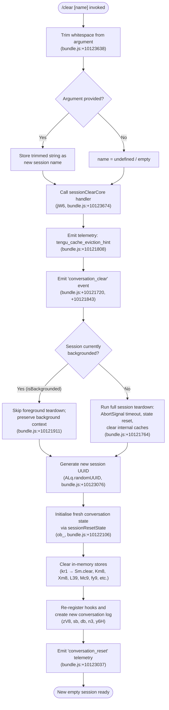

# `/clear`

> Analysis basis: CC v2.1.144 bundle.js (AST extraction + Claude interpretation)
> Minimum version: v2.1.144

---

## Overview

`/clear` starts a new Claude Code session with an empty context window, discarding the current in-memory conversation while leaving the previous session's data intact on disk so it can be resumed later with `/resume`. It is also registered under the aliases `/reset` and `/new`. The command accepts an optional `[name]` argument to label the new session.

---

## Registration

| Field | Value |
|---|---|
| type | `local` |
| name | `clear` |
| description | `Start a new session with empty context; previous session stays on disk (resumable with /resume)` |
| aliases | `reset`, `new` |
| argumentHint | `[name]` |
| supportsNonInteractive | `true` |
| thinClientDispatch | `post-text` |
| module_id | `LLq` |
| load_inline | `true` |
| loc_byte | `10123812` |
| loc_byte_end | `10124103` |
| loc_line | `5611` |
| arbor_handler.name | `vY7` |
| arbor_handler.fqn | `claude-2.1.144::vY7` |
| arbor_handler.kind | `AsyncFunction` |
| arbor_handler.resolution_path | `module_id` |
| arbor_handler.n_hits | `0` |

Analysis basis: CC v2.1.144 bundle.js:+10123812

---

## Input Branching

The handler resolves three meaningful input paths based on the optional `[name]` argument and the backgrounded-session state, plus internal session setup steps, warranting a flowchart.



---

## Behavioral Spec

### 1. Entry point — `clearCommandHandler` (`vY7`)

```
async function clearCommandHandler(input, context):
    rawArg = input.args           // e.g. "/clear my-project"
    trimmedName = rawArg.trim()   // bundle.js:+10123638

    if trimmedName is non-empty:
        sessionName = trimmedName
    else:
        sessionName = null

    await sessionClearCore(sessionName, context)
    return                        // handler returns void; side-effects drive the reset
```

Analysis basis: CC v2.1.144 bundle.js:+10123638, +10123674

---

### 2. Core session-clear orchestrator — `sessionClearCore` (`jW6`)

```
async function sessionClearCore(name, context):
    // Step 1 — notify cache layer
    emitTelemetry("tengu_cache_eviction_hint")       // bundle.js:+10121808

    // Step 2 — emit domain event
    emitEvent("conversation_clear")                  // bundle.js:+10121720, +10121843
    // ("clear" literal at +10121720; "conversation_clear" at +10121843)

    // Step 3 — determine background state
    isBackgrounded = context.appState["isBackgrounded"]  // bundle.js:+10121911

    if not isBackgrounded:
        // Step 4a — request AbortSignal with timeout
        signal = AbortSignal.timeout(...)             // bundle.js:+10121764
        // Step 4b — flush pending writes
        flushPendingWrites(signal)                    // wH6, bundle.js:+10121795
        // Step 4c — wait for in-flight tool calls to settle
        waitForTools(context)                         // d, bundle.js:+10121806
    else:
        // background path: skip teardown to preserve bg context

    // Step 5 — iterate and shut down active MCP clients
    for each mcpClient in Object.values(mcpClients):  // bundle.js:+10121974
        shutdownMcpClient(mcpClient)                  // M, bundle.js:+10121988

    // Step 6 — register new signal controller
    registerAbortController()                         // j, bundle.js:+10122003
    gj(context)                                       // gj, bundle.js:+10122020
    addToControllerSet()                              // w.add, bundle.js:+10122026

    // Step 7 — push entry to session journal
    pushJournalEntry()                                // J.push, bundle.js:+10122043
    Jw(context)                                       // bundle.js:+10122061

    // Step 8 — full in-process state reset
    resetAllState(context)                            // ob_, bundle.js:+10122106

    // Step 9 — resolve working directory for new session
    resolveWorkingDirectory(context)                  // XD, bundle.js:+10122115

    // Step 10 — build formatted context string
    buildContextString()                              // q_, bundle.js:+10122118

    // Step 11 — clear tool-call registry
    clearToolRegistry()                               // _.clear(), bundle.js:+10122124

    // Step 12 — enumerate environment keys
    envKeys = Object.keys(environment)                // bundle.js:+10122149

    // Step 13 — iterate settings entries
    Object.entries(settings)                          // bundle.js:+10122353

    // Step 14 — clear pending async abort controllers
    clearTimeout(...)                                 // bundle.js:+10122514

    // Step 15 — write session history record
    writeHistoryRecord()                              // kH, bundle.js:+10122609

    // Step 16 — flush conversation output buffer
    flushOutputBuffer()                               // Wz, bundle.js:+10122615

    // Step 17 — notify event emitter (EQH hook)
    notifyEventHook()                                 // EQH, bundle.js:+10122653

    // Step 18 — publish to key-listener queue
    publishKeyListener()                              // KLq, bundle.js:+10122967

    // Step 19 — build new turn message
    buildNewTurnMessage()                             // n3, bundle.js:+10122979

    // Step 20 — compose formatted header/display lines
    buildDisplayLines(I6, vh, o5)                     // bundle.js:+10122982–10123005

    // Step 21 — update conversation-worktree symlinks
    updateWorktreeLinks()                             // XW6, bundle.js:+10123020

    // Step 22 — generate new session UUID
    newSessionId = ALq.randomUUID()                   // bundle.js:+10123076

    // Step 23 — emit session-reset telemetry
    emitSessionReset()                                // zV8, bundle.js:+10123094
    // "conversation_reset" literal at bundle.js:+10123037

    // Step 24 — write event queue entry
    writeEventQueueEntry()                            // eQ, bundle.js:+10123207

    // Step 25 — persist session log
    persistSessionLog()                               // sb, bundle.js:+10123220

    // Step 26 — set up conversation-log watcher
    setupLogWatcher()                                 // GvH, bundle.js:+10123327

    // Step 27 — write display token entry
    writeDisplayToken()                               // $T, bundle.js:+10123336

    // Step 28 — register hook listeners
    registerHookListeners(If, sf)                     // bundle.js:+10123339–10123361

    // Step 29 — persist conversation boundary record
    persistBoundaryRecord()                           // db, bundle.js:+10123371

    // Step 30 — sync isolation state
    syncIsolationState()                              // y6H, bundle.js:+10123391

    // Step 31 — load plugin hooks
    loadPluginHooks()                                 // Np, bundle.js:+10123418

    return  // new session is live
```

Analysis basis: CC v2.1.144 bundle.js:+10121764–10123418

---

### 3. Full in-process state reset — `resetAllState` (`ob_`)

This sub-function is called at step 8 above and clears every in-memory cache and registry.

```
function resetAllState(context):
    clearSessionScopedStores()     // cb_, D6H  (bundle.js:+10120698, +10120706)
    resetConversationLog()         // kr1 → Sm.clear  (bundle.js:+10120715)
    flushPendingHookQueue()        // RH6  (bundle.js:+10120724)
    resetSessionFlags()            // $r  (bundle.js:+10120734)
    clearKeyValueCache()           // $rH → Kz8.clear  (bundle.js:+10120747)
    emitSessionStartEvent()        // J36  (bundle.js:+10120753)
    clearAgentStateCache()         // Mc9 → AvH.clear, mv_.clear  (bundle.js:+10120920)
    clearFileChangeWatcher()       // fy9 → ylH.clear, HJ6.clear  (bundle.js:+10120929)
    clearToolCallCache()           // Xm8 → TCH.clear  (bundle.js:+10120938)
    clearWindowState()             // WF1  (bundle.js:+10120944)
    clearOrderedStateList()        // L39 → O18.clear  (bundle.js:+10120953)
    clearReadabilityIndex()        // rI8  (bundle.js:+10120959)
    clearWorktreeCache()           // Km8 → WCH.clear  (bundle.js:+10120966)
    clearTimerState()              // Et9  (bundle.js:+10120972)
    clearSearchCaches()            // $h9 → Ci.clear, KDH.clear  (bundle.js:+10120978)
    await Promise.resolve()        // yield microtask queue  (bundle.js:+10120984)
    resetVolatileState()           // WV_  (bundle.js:+10121014)
    resetPromptQueue()             // q  (bundle.js:+10121057)
    resetOutputState()             // yO8  (bundle.js:+10121092)
    resetTokenAccumulator()        // z2  (bundle.js:+10121183)
    resetAuxiliaryQueue()          // AQH  (bundle.js:+10121268)
```

Analysis basis: CC v2.1.144 bundle.js:+10120698–10121268

---

### 4. Token-budget parser — `tokenBudgetParser` (`PW6`)

Called from `sessionClearCore` (via `jW6 → PW6`) to recalculate context limits for the new session.

```
function tokenBudgetParser(rawValue):
    parsed = parseInt(rawValue, 10)      // bundle.js:+12261419, radix 10 at +12261430
    if not Number.isFinite(parsed):      // bundle.js:+12261441
        parsed = readGlobalDefault()     // MY  (bundle.js:+12261484)
    clamped = Math.max(                  // bundle.js:+12261637
                  minTokens,
                  Math.min(maxTokens, parsed * 1000)  // ×1000 at +12261606
              )                          // bundle.js:+12261650
    return clamped
```

Analysis basis: CC v2.1.144 bundle.js:+12261419, +12261430, +12261441, +12261484, +12261606, +12261637, +12261650

---

### 5. Session-end event builder — `sessionEndEventBuilder` (`XNH`)

Emits a `"SessionEnd"` lifecycle event before the old session is discarded.

```
function sessionEndEventBuilder(context):
    event = { type: "SessionEnd" }           // literal at bundle.js:+12252932
    buildConversationSummary()               // Y4  (bundle.js:+12252905)
    buildSessionRecord()                     // R2  (bundle.js:+12252963)
    emitEvent(event, I6)                     // bundle.js:+12253160
    applyMcpUpdate()                         // AX6  (bundle.js:+12253165)
```

Analysis basis: CC v2.1.144 bundle.js:+12252905, +12252932, +12252963, +12253160, +12253165

---

### 6. Background session detection

```
function isSessionBackgrounded(appState):
    return appState["isBackgrounded"] === true   // bundle.js:+10121911
```

When `true`, the orchestrator skips the AbortSignal timeout, `wH6` flush, and tool-wait so that a foregrounded session taking over does not disrupt in-flight background work.

Analysis basis: CC v2.1.144 bundle.js:+10121911

---

## State & Side Effects

| Item | Detail |
|---|---|
| Telemetry — `tengu_cache_eviction_hint` | Fired at the start of session teardown (bundle.js:+10121808) |
| Telemetry — `tengu_run_hook` | Fired when hook infrastructure executes during session reset (bundle.js:+12300050) |
| Telemetry — `tengu_feature_ok` / `tengu_feature_bad` | Fired on hook success/failure paths traversed by the reset (bundle.js:+955520, +955578) |
| Telemetry — `tengu_hook_plugin_metrics` | Plugin-hook metric events emitted on `loadPluginHooks` (bundle.js:+12278746) |
| Telemetry — `tengu_session_renamed` | Fired if the optional `[name]` argument renames the new session (bundle.js:+12167457) |
| Telemetry — `tengu_repl_hook_finished` | Emitted when each REPL-mode hook completes after the clear (bundle.js:+12284154) |
| Telemetry — `tengu_shell_set_cwd` | Fired when the working directory is resolved for the new session (bundle.js:+7825004) |
| Telemetry — `tengu_hook_plugin_injected` | Fired when plugin hooks are injected into the new session (bundle.js:+12298396) |
| Domain event — `conversation_clear` | Internal event bus notification that the session is being cleared (bundle.js:+10121843) |
| Domain event — `conversation_reset` | Emitted after state reset to signal a fully new context (bundle.js:+10123037) |
| Domain event — `SessionEnd` | Lifecycle event marking the end of the old session (bundle.js:+12252932) |
| appState changes | `isBackgrounded` consulted (bundle.js:+10121911); all in-memory caches (`Sm`, `Kz8`, `AvH`, `mv_`, `ylH`, `HJ6`, `TCH`, `O18`, `WCH`, `Ci`, `KDH`, `DAq`, `TY6`, `uX_`) cleared |
| Hook registration | Hook listeners re-registered (`If`, `sf`) and plugin hooks reloaded (`Np`) for the new session |
| Disk | Previous session data retained on disk; new session log and worktree symlinks written |
| AbortSignal | New AbortController registered (`j`/`w.add`); pending timeouts cleared (`clearTimeout`, bundle.js:+10122514) |
| Session UUID | Fresh UUID generated via `ALq.randomUUID()` (bundle.js:+10123076) |
| MCP clients | All active MCP client connections iterated and shut down before reset (bundle.js:+10121974) |
| Sound | <!-- TODO: not found in depth-2 traversal; needs --depth 4 --> |

---

## Version History

| Version | Change |
|---|---|
| v2.1.144 | Initial analysis |

---

## Common Mistakes

1. **Expecting conversation history to be deleted**: `/clear` only discards the in-memory context window. All prior session data remains on disk and is accessible via `/resume`.
2. **Using `/clear` to switch projects when hooks are running**: Because hook listeners are re-registered synchronously after state reset, any long-running async hook from the previous session may still emit events briefly into the new session's hook queue.
3. **Passing a multi-word name without quotes**: The argument hint is `[name]`; the entire trimmed argument string after `/clear` is used as the session name, so spaces are preserved but the user should be aware the full tail string is consumed.
4. **Expecting MCP tools to remain connected**: All MCP client connections are shut down as part of the clear sequence and re-established only after the new session initialises.
5. **Confusing `/clear` with `/reset` or `/new`**: All three aliases invoke identical behavior; there is no functional difference between them.

---

## Appendix — Identifier Mapping

> For bundle debugging only. Identifiers change across versions.

| Identifier | Role |
|---|---|
| `vY7` | `clearCommandHandler` — async entry point for `/clear`; trims arg, delegates to `jW6` |
| `H` | Generic utility / string helper used across multiple call sites |
| `jW6` | `sessionClearCore` — main orchestrator that tears down old session and initialises new one |
| `PW6` | `tokenBudgetParser` — parses and clamps token-budget integer from config |
| `MY` | `readGlobalTokenDefault` — returns global default token limit |
| `V8` | `policySettingsReader` — reads `policySettings` from config store |
| `px` | `contextWindowHelper` — context-window utility |
| `WV` | `stateWriterUtil` — low-level state write primitive |
| `ru` | `contextResetHelper` — resets context-related state |
| `G9_` | `contextResetCore` — core context-reset function |
| `XNH` | `sessionEndEventBuilder` — constructs and emits `SessionEnd` lifecycle event |
| `Y4` | `conversationSummaryBuilder` — assembles conversation summary for session-end record |
| `I6` | `inlineFormatterUtil` — inline text formatter |
| `Ey` | `effortLevelFormatter` — formats effort-level field |
| `_2` | `modelSupportCheck` — checks model capability flags (claude-3-*, claude-opus-4-*, etc.) |
| `dE` | `effortBudgetCalculator` — maps `"high"` effort to token budget |
| `FZ` | `contextStringBuilder` — assembles formatted context string |
| `C6` | `keyValueFormatter` — formats key-value pairs for display |
| `R2` | `sessionRecordBuilder` — builds full session record object |
| `xH` | `toStringCoercer` — coerces values via `String()` |
| `iu` | `internalUuidHelper` — UUID/identity helper |
| `v` | `verboseLogger` — debug/verbose logger |
| `T4H` | `sessionStateSnapshotBuilder` — snapshot of session state fields |
| `td_` | `hookTypeRouter` — routes hook events by type (`PreToolUse`, `PostToolUse`, etc.) |
| `O` | `filterableCollection` — filterable collection utility |
| `xhq` | `hookContextExtractor` — extracts hook execution context |
| `sd_` | `thirdPartyHookFilter` — filters third-party hook entries |
| `mhq` | `hookMetadataHelper` — hook metadata accessor |
| `d` | `asyncStateAccessor` — async application state accessor |
| `CH` | `jsonStringifyHelper` — wraps `JSON.stringify` |
| `kH` | `historyRecordWriter` — writes history record to disk |
| `bH` | `backgroundStateAccessor` — reads backgrounded-session flag |
| `YPH` | `sessionYieldHelper` — handles session yield/resume bookkeeping |
| `PZ` | `abortControllerManager` — manages `clearTimeout`/`setTimeout` for abort controllers |
| `j` | `callbackController` — holds session callback reference |
| `$8H` | `displayTokenWriter` — writes display tokens to session log |
| `HV` | `hookValidator` — validates hook configuration |
| `TW8` | `worktreeHookHelper` — `WorktreeCreate` hook setup |
| `rd_` | `mcpToolDispatcher` — dispatches MCP tool calls |
| `IW8` | `hookOutputParser` — parses hook stdout JSON (falls back to plain text) |
| `O6H` | `hookEntryTransformer` — transforms hook entries via `Object.entries`/`Object.fromEntries` |
| `id_` | `httpHookExecutor` — executes HTTP-type hooks |
| `bhq` | `httpBodyParser` — parses HTTP hook response body |
| `eLH` | `hookErrorLogger` — logs hook execution errors |
| `vW8` | `shellHookExecutor` — spawns shell/bash hook processes |
| `RH` | `sessionDomainReader` — reads session domain state |
| `AX6` | `mcpUpdateApplier` — applies MCP server update to session |
| `wH6` | `pendingWriteFlusher` — flushes pending async writes before reset |
| `M` | `mcpClientManager` — manages MCP client lifecycle (connect/disconnect) |
| `dvH` | `mcpServerOrchestrator` — orchestrates MCP server startup and transport |
| `he` | `mcpTransportBuilder` — builds MCP transport configuration |
| `FI` | `mcpFilterInitialiser` — initialises MCP server filter |
| `K` | `columnPadder` — pads column strings for display |
| `H_` | `stringNormaliser` — normalises strings |
| `P26` | `mcpServerStatusFilter` — filters MCP servers by status |
| `S77` | `mcpTimestampRecorder` — records MCP connection timestamp |
| `h18` | `mcpCapabilityChecker` — checks MCP server capabilities |
| `S18` | `mcpHealthChecker` — checks MCP server health |
| `H8` | `mcpDebugLogger` — logs MCP debug messages |
| `Ah_` | `mcpOAuthFlowHandler` — handles OAuth authentication flow for MCP |
| `qh_` | `mcpOAuthCallbackHandler` — handles OAuth callback for MCP |
| `H8q` | `mcpConnectionRetryer` — retries MCP connections with back-off |
| `Hh_` | `mcpConnectionHealthMonitor` — monitors MCP connection health |
| `xJ_` | `mcpTransportTypeChecker` — checks MCP transport type support |
| `J` | `processKillSet` — set of processes to be killed |
| `y` | `sessionWriteQueue` — queue of write operations for session log |
| `$7` | `mcpErrorLogger` — logs MCP error events |
| `GH` | `stringCoercer` — coerces value to string |
| `a6q` | `mcpServerZoneMapper` — maps MCP servers to connection zones |
| `W26` | `mcpRetryCountParser` — parses retry count via `parseInt` |
| `th_` | `mcpThrottleParser` — parses throttle interval via `parseInt` |
| `k6K` | `mcpUpdateDispatcher` — dispatches MCP server updates |
| `YD8` | `mcpUpdateSerializer` — serialises MCP update payload |
| `A` | `lowercaseFormatter` — converts string to lowercase |
| `Pv` | `mcpCleanupScheduler` — schedules MCP cleanup |
| `L` | `sessionFileTracker` — tracks open session files |
| `q` | `tempFileCleaner` — removes temporary files on cleanup |
| `f` | `connectionLifecycleManager` — manages open/close of connections |
| `$` | `mcpSessionNotifier` — emits MCP session notification events |
| `NVq` | `mcpNotifyBuilder` — builds MCP notification payload |
| `vq5` | `mcpServerSyncLoop` — synchronises remote MCP server state |
| `_` | `mcpClientAccessor` — accessor for `getClients()` |
| `C18` | `mcpClientCapabilityFilter` — checks `gP4`/`QP4` capability sets |
| `r8` | `retryTimerManager` — manages retry `setTimeout`/`clearTimeout` |
| `trH` | `mcpServerTracer` — traces MCP server state via `CH` |
| `gj` | `sessionGarbageCollector` — collects stale session resources |
| `w` | `daemonWorkerManager` — manages background daemon workers |
| `C` | `daemonProcessController` — controls daemon process lifecycle |
| `yAK` | `daemonPathResolver` — resolves daemon executable path |
| `iL5` | `daemonSocketBinder` — binds daemon IPC socket |
| `z` | `daemonIpcWriter` — writes IPC messages to daemon |
| `fT6` | `memoryPressureChecker` — checks system free memory (macOS, 1024 MB threshold) |
| `P6` | `tokenBudgetTracker` — tracks token-budget watermarks |
| `x` | `daemonIdleTimer` — manages daemon idle-exit timer |
| `h` | `daemonHeartbeatMonitor` — monitors daemon heartbeat |
| `u` | `daemonUnrefHandle` — holds unreferenced timer handle |
| `Ea_` | `daemonSpawnClaimer` — claims or spawns a spare daemon process |
| `yc_` | `sessionDirectoryCreator` — creates session directory and writes metadata |
| `EL5` | `daemonClaimTimeoutHandler` — handles claim timeout with retry |
| `TL5` | `daemonClaimFrameBuilder` — builds claim frame for daemon IPC |
| `A8` | `asyncAbortHelper` — abort/async utility |
| `dp` | `ipcFrameEncoder` — encodes IPC frames (Buffer, UInt32BE, UInt8) |
| `ka_` | `sessionWorkerRegistrar` — registers new session worker with daemon |
| `PK` | `sessionPathBuilder` — builds session file paths via `BX.join` |
| `B9` | `sessionFileReader` — reads and caches session file with stat |
| `wJ` | `sessionActiveStateWriter` — sets session state to `"active"` |
| `v5` | `sessionManifestWriter` — writes session manifest JSON |
| `roH` | `sessionResumeLatencyRecorder` — records resume latency |
| `RLH` | `sessionLogPathBuilder` — builds session log file path |
| `dk` | `sessionLogLineParser` — splits session log lines |
| `rp` | `sessionLogReader` — reads session log file |
| `cW6` | `sessionDirectoryEnsurer` — ensures session directory exists via mkdir |
| `Y` | `daemonConfigReloader` — handles daemon config reload and MCP server updates |
| `D` | `daemonMemoryWatcher` — watches memory usage and triggers spare-process disposal |
| `Ta_` | `daemonSpareProcessSpawner` — spawns spare background processes via `Bun.spawn` |
| `Jw` | `sessionJournalFlusher` — flushes session journal entry |
| `ob_` | `resetAllState` — orchestrates full in-process state reset |
| `cb_` | `sessionScopedStoreClearer` — clears session-scoped stores |
| `D6H` | `conversationLogSegmentClearer` — clears conversation log segments |
| `pqH` | `logSegmentA` — first conversation log segment |
| `zz8` | `logSegmentB` — second conversation log segment |
| `ha9` | `logSegmentC` — third conversation log segment |
| `pz8` | `logSegmentD` — fourth conversation log segment |
| `kr1` | `conversationStoreResetter` — calls `Sm.clear()` and invokes `KEH` |
| `KEH` | `conversationFileWriter` — writes conversation boundary file to disk |
| `RH6` | `pendingHookQueueFlusher` — flushes pending hook queue |
| `$r` | `sessionFlagResetter` — resets all session-level flags |
| `F9H` | `mainBranchFlagResetter` — resets main-branch-related flags |
| `MY8` | `subagentExitCleaner` — clears subagent exit state |
| `J36` | `sessionStartEventEmitter` — emits `"session_start"` event |
| `Nn` | `compactStateResetter` — resets compact-related state |
| `q6H` | `tokenCountResetter` — resets token-count accumulators |
| `YY8` | `displayCacheResetter` — clears `DAq` display cache |
| `aJ9` | `fileWatcherResetter` — clears `TY6` and `uX_` file-watcher caches |
| `jy9` | `inputHistoryResetter` — resets input history |
| `sYH` | `shellHistoryResetter` — resets shell command history |
| `qX` | `outputTokensResetter` — resets `outputTokens` accumulator |
| `ES_` | `autonomousLoopResetter` — resets autonomous-loop delivered flag via `DK7` |
| `$rH` | `keyValueCacheResetter` — clears `Kz8` key-value cache |
| `Mc9` | `agentStateCacheResetter` — clears `AvH` and `mv_` agent-state caches |
| `fy9` | `fileChangeWatcherResetter` — clears `ylH` and `HJ6` file-change watchers |
| `Xm8` | `toolCallCacheResetter` — clears `TCH` tool-call cache |
| `WF1` | `windowStateResetter` — resets window state |
| `L39` | `orderedStateListResetter` — clears `O18` ordered state list |
| `rI8` | `readabilityIndexChecker` — checks `H.has` readability index |
| `Km8` | `worktreeCacheResetter` — clears `WCH` worktree cache |
| `Et9` | `timerStateResetter` — resets timer state |
| `$h9` | `searchCacheResetter` — clears `Ci` and `KDH` search caches |
| `XD` | `workingDirectoryResolver` — resolves working directory (path.isAbsolute, path.resolve) |
| `m6` | `filePathNormaliser` — normalises file paths |
| `O8` | `asyncErrorWrapper` — wraps errors with `A8` |
| `fu8` | `cwdNormaliser` — normalises cwd via `NR6.getStore` and `H.normalize` |
| `l8H` | `pathNormaliserUtil` — low-level path normaliser |
| `q_` | `contextStringFormatter` — formats context string segments |
| `MTH` | `settingsEnumerator` — enumerates settings keys |
| `gI` | `hookEnvironmentBuilder` — builds hook environment object |
| `Wz` | `outputBufferFlusher` — flushes `$W8` output buffer |
| `zW8` | `asyncQueueTracker` — tracks async queue membership via `QSq` |
| `EQH` | `eventHookNotifier` — triggers `Xq9` event hook |
| `KLq` | `keyListenerPublisher` — publishes to `I7H` key-listener queue |
| `n3` | `newTurnMessageBuilder` — builds first turn message for new session |
| `DL` | `conversationLineWriter` — writes a line to the conversation log |
| `h1` | `hookRegistrar` — registers hooks via `OHA.register` |
| `vh` | `verboseHeaderFormatter` — formats verbose header line |
| `o5` | `contextBlockFormatter` — formats context block lines |
| `FU` | `contextPrefixWriter` — writes context prefix via `WV` |
| `XW6` | `worktreeSymlinkUpdater` — updates conversation worktree symlinks |
| `zV8` | `sessionResetEventEmitter` — emits `conversation_reset` event and UUID |
| `eQ` | `eventQueueEntryWriter` — writes event queue entry |
| `sb` | `sessionLogPersister` — persists session log file |
| `G4H` | `sessionLogFileWriter` — appends to session log file via `appendFileSync`/`mkdirSync` |
| `GvH` | `conversationLogWatcherSetup` — creates and registers conversation-log file watcher |
| `Fd_` | `logDirectoryCreator` — creates log directory via `dr.mkdir` |
| `BlH` | `logFilePathBuilder` — builds log file path |
| `u$` | `logSymlinkPathBuilder` — builds symlink path for log |
| `F38` | `logFileHandleOpener` — opens log file handle via `dr.open` |
| `$T` | `displayTokenEntryWriter` — writes display token entry |
| `If` | `hookListenerA` — first hook listener registered after reset |
| `sf` | `hookListenerB` — second hook listener registered after reset |
| `db` | `conversationBoundaryRecordWriter` — persists conversation boundary record |
| `y6H` | `isolationStateSync` — syncs isolation-latch state after reset |
| `VSq` | `asyncSessionLogWriter` — async log file writer via `BL.appendFile`/`mkdir` |
| `Np` | `pluginHookLoader` — loads and validates plugin hooks from settings |
| `SK` | `pluginSchemaValidator` — validates plugin schema |
| `F0H` | `policyEntriesEnumerator` — enumerates policy entries from `V8` |
| `PCH` | `pluginMetricsRecorder` — records plugin load timing |
| `T8` | `pluginLogFileWriter` — appends plugin log via `L.appendFileSync` |
| `$X6` | `nonInteractiveSessionRunner` — runs session in non-interactive mode |
| `V2` | `replSessionRunner` — runs full REPL session loop |
| `$1` | `subagentSessionRunner` — runs subagent session via `Xa9.randomUUID` |