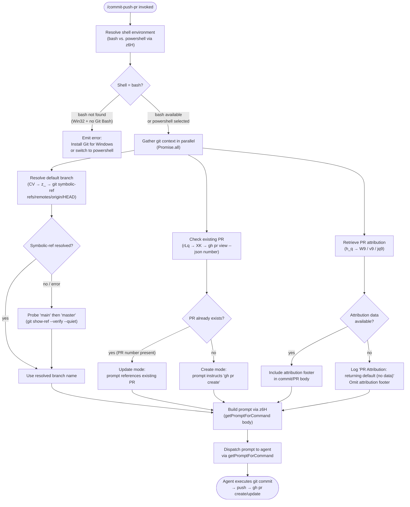

# `/commit-push-pr`

> Analysis basis: CC v2.1.144 bundle.js (AST extraction + Claude interpretation)
> Minimum version: v2.1.144

---

## Overview

`/commit-push-pr` is a prompt-type slash command that instructs the agent to stage and commit all pending changes, push the branch to the remote origin, and open (or update) a pull request via the `gh` CLI. The handler queries the current git context — including default branch, existing PR status, and conversation attribution metadata — before building and dispatching a natural-language prompt to the agent. Shell environment detection (bash vs. PowerShell) is performed at invocation time to ensure the correct toolchain is available.

---

## Registration

| Field | Value |
|---|---|
| type | `prompt` |
| name | `commit-push-pr` |
| description | `Commit, push, and open a PR` |
| loc_byte | `10151138` |
| loc_byte_end | `10151750` |
| loc_line | `5734` |
| handler_method | `getPromptForCommand` |
| handler_method_start | `10151342` |
| handler_method_end | `10151749` |
| prompt_body.length | `203` |
| prompt_body.trace | `call→z6H(...) (1 literals)` |
| arbor_handler.name | `getPromptForCommand` |
| arbor_handler.fqn | `claude-2.1.144::getPromptForCommand` |
| arbor_handler.kind | `Method` |
| arbor_handler.resolution_path | `direct` |
| arbor_handler.n_hits | `3` |

Analysis basis: CC v2.1.144 bundle.js:+10151138

---

## Input Branching

The command has more than three distinct execution branches based on shell environment detection, existing PR state, and git default-branch resolution. A Mermaid flowchart is used.



---

## Behavioral Spec

### 1. Shell Environment Detection

The handler calls `z6H` (shell-context resolver) as the first step. `z6H` inspects the current platform and shell configuration, then verifies whether `bash` is available.

Analysis basis: CC v2.1.144 bundle.js:+10151539

```
function resolveShellContext(appState):
    shell = appState.shellPreference  // "bash" or "powershell"
    if shell == "bash":
        bashPath = locateBashExecutable()   // checks PATH for git bash on win32
        if bashPath is null and platform == "win32":
            raise UserFacingError(
                "Skill requires bash (shell: bash in frontmatter) but Git Bash was not found. " +
                "Install Git for Windows (https://git-scm.com/downloads/win), " +
                "or change the skill's frontmatter to `shell: powershell`."
            )
    return { shell, executablePath }
```

The literal error message fragment `"Install Git for Windows"` is observable in the prompt_body extracted at bundle.js:+10151539.

---

### 2. Parallel Git Context Gathering

The handler uses `Promise.all` to fetch three independent git context values concurrently before building the prompt.

Analysis basis: CC v2.1.144 bundle.js:+10151388

```
async function gatherGitContext(cwd):
    [defaultBranch, prInfo, attribution] = await Promise.all([
        resolveDefaultBranch(cwd),    // CV path
        resolveExistingPR(cwd),       // rLq path
        resolvePRAttribution(cwd)     // h_q path
    ])
    return { defaultBranch, prInfo, attribution }
```

---

### 3. Default Branch Resolution

`CV` → `z_` → `git symbolic-ref --short refs/remotes/origin/HEAD`. If that command fails, a fallback probes for `main` and then `master` using `git show-ref --verify --quiet`.

Analysis basis: CC v2.1.144 bundle.js:+10151401 (CV entry), +1060126 (symbolic-ref literal), +1060264 (main literal), +1060271 (master literal)

```
async function resolveDefaultBranch(cwd):
    result = await runGit(cwd, ["symbolic-ref", "--short", "refs/remotes/origin/HEAD"])
    if result.exitCode == 0:
        branch = result.stdout.trim()
        // strip "origin/" prefix if present
        return branch.replace(/^origin\//, "")

    // fallback: probe known default names
    for candidate in ["main", "master"]:
        probe = await runGit(cwd, ["show-ref", "--verify", "--quiet",
                                   "refs/heads/" + candidate])
        if probe.exitCode == 0:
            return candidate

    // final fallback stored in F_H cache under key "defaultBranch"
    return getCachedDefaultBranch() ?? "main"
```

The string constant `"defaultBranch"` used as cache key appears at bundle.js:+1049370. Git flag constants `"--short"` (+1060141), `"--verify"` (+1060344), `"--quiet"` (+1060355), `"show-ref"` (+1060333), and `"symbolic-ref"` (+1060126) are all confirmed literals.

---

### 4. Existing PR Detection

`rLq` → `oLq` runs a `gh` CLI command to detect whether a PR already exists for the current branch. Platform-specific command variants are used.

Analysis basis: CC v2.1.144 bundle.js:+10151429 (rLq entry), +10148210 (XK/gh command), +10148215 (bash variant), +10148262 (PowerShell variant)

```
async function resolveExistingPR(shell):
    if shell == "bash":
        cmd = "gh pr view --json number 2>/dev/null || true"
    else:  // powershell
        cmd = "gh pr view --json number 2>$null; if (-not $?) { \"\" }"

    raw = await runShellCommand(cmd)
    parsed = tryParseJSON(raw.stdout)
    if parsed?.number:
        return { exists: true, number: parsed.number }
    return { exists: false }
```

The exact bash command string `"gh pr view --json number 2>/dev/null || true"` appears at bundle.js:+10148215; the PowerShell variant at +10148262.

---

### 5. PR Attribution Resolution

`h_q` orchestrates PR attribution metadata. It collects git remote context (`"remote"` literal at +9699246), model information, and conversation metadata, then merges them to produce an attribution footer for the commit/PR body.

Analysis basis: CC v2.1.144 bundle.js:+10151406 (h_q entry), +9699965 (W9 branch), +9699968 (v9 branch), +9699980 (jq9 branch)

```
async function resolvePRAttribution(context):
    remoteInfo   = await getGitRemoteInfo(context)     // W9 path
    modelInfo    = resolveModelDisplayName(context)    // v9 path
    modelIncludesOpus = checkModelName(context)        // jq9 path

    if remoteInfo is null and modelInfo is null:
        log("PR Attribution: returning default (no data)")  // literal at +9700019
        return DEFAULT_ATTRIBUTION

    footer = buildAttributionText(remoteInfo, modelInfo)
    return footer
```

The string `"PR Attribution: returning default (no data)"` is confirmed at bundle.js:+9700019.

The attribution footer text includes the phrase `", ending with the attribution text shown in the example below"` (literal at +10149398), meaning the prompt instructs the agent to append a standardised footer.

---

### 6. Prompt Assembly and Dispatch

`getPromptForCommand` (Arbor-resolved, `direct` path, 3 hits) assembles the final prompt string by calling `z6H` with the gathered context and dispatches it to the agent.

Analysis basis: CC v2.1.144 bundle.js:+10151342 (handler_method_start), +10151539 (z6H call)

```
function getPromptForCommand(context):
    shellCtx   = resolveShellContext(context.appState)
    gitCtx     = await gatherGitContext(context.cwd)

    promptText = buildCommitPushPRPrompt({
        shell:         shellCtx.shell,
        defaultBranch: gitCtx.defaultBranch,
        existingPR:    gitCtx.prInfo,
        attribution:   gitCtx.attribution,
        // prompt instructs agent to include attribution footer
        // ", ending with the attribution text shown in the example below"
    })
    // Retrieve and include appState (allowed_tools, avoid_prompts, effort, model)
    appState = _.getAppState()   // call at +10151571
    return promptText
```

The `_.getAppState()` call at bundle.js:+10151571 indicates the handler reads live app state (including `allowed_tools`, `avoid_prompts`, `effort`, `model` — literals at +10049778, +10049833, +10049935, +10049948) immediately before prompt dispatch.

The assembled prompt body is 203 characters long (registration.prompt_body.length) and is built via a single `z6H(...)` call with 1 literal substitution.

---

### 7. Agent Execution Path

After prompt dispatch the agent is expected to run the following sequence using the Bash tool:

```
procedure agentExecuteCommitPushPR(shell, defaultBranch, existingPR, attribution):
    // Stage all changes
    runTool("Bash", "git add -A")

    // Commit with generated message and attribution footer
    runTool("Bash", "git commit -m <generated_message>")

    // Push current branch
    runTool("Bash", "git push origin HEAD")

    if existingPR.exists:
        // PR already open — nothing more required or update description
        runTool("Bash", "gh pr view <number>")
    else:
        // Create new PR targeting defaultBranch
        runTool("Bash", "gh pr create --base " + defaultBranch + " --title <title> --body <body_with_attribution>")
```

---

## State & Side Effects

| Item | Detail |
|---|---|
| Telemetry | `tengu_bg_spare_enable` (bundle.js:+14541551); `tengu_bg_low_mem_mb` (+11995369); `tengu_bg_spare_spawn` (+14541911); `tengu_daemon_config_reload` (+14556317); `tengu_daemon_control` (+14577473); `tengu_cobalt_ridge` (+3198526); `tengu_auto_mode_fallback_to_ask` (+9780754); `tengu_auto_mode_decision` (+9781462); `tengu_bash_allowlist_strip_all` (+9782706); `tengu_iron_gate_closed` (+9785210); `tengu_auto_mode_denial_limit_exceeded` (+9774968); `tengu_tool_empty_result` (+4868546); `tengu_tool_result_persisted` (+4868786) |
| Shell detection | Checks `process.platform` for `"win32"` (+1037081) and Git Bash availability; raises user-facing error if bash is required but absent |
| `_.getAppState()` read | Reads live app state at invocation (+10151571); fields `allowed_tools`, `avoid_prompts`, `effort`, `model` are consumed |
| `F_H.get("defaultBranch")` cache | Reads the cached default-branch value (+1049362 / +1049370) as a last-resort fallback |
| Git remote side effects | No writes to git state occur inside the handler; all git mutations happen in the agent's Bash tool calls after prompt dispatch |
| PR creation side effect | `gh pr create` or `gh pr view` is executed by the agent, not the handler |
| Sound | <!-- TODO: not found in depth-2 traversal; needs --depth 4 --> |
| Hook registration | `h1` → `OHA.register` (+57049) — JSONL transcript logger registered as a side-effect of the Bash tool execution pipeline, not specific to this command |
| appState changes | `zoH` → `H.setAppState` (+9774534) may update tool permission context during agent execution; not handler-level |

---

## Version History

| Version | Change |
|---|---|
| v2.1.144 | Initial analysis |

---

## Common Mistakes

1. **Git Bash not installed on Windows** — The command will fail immediately with a user-facing error if the shell preference is `bash` and Git Bash cannot be located. Install [Git for Windows](https://git-scm.com/downloads/win) or set `shell: powershell` in the skill frontmatter.
2. **`gh` CLI not authenticated** — The `gh pr view` / `gh pr create` commands executed by the agent require an active `gh auth login` session. The handler does not validate `gh` authentication before dispatching the prompt.
3. **No commits to push** — If the working tree is clean (no staged or unstaged changes), `git add -A && git commit` will fail. The agent may loop or emit an unhelpful error; manually verify there are changes before invoking the command.
4. **Detached HEAD state** — `git symbolic-ref --short refs/remotes/origin/HEAD` will succeed, but pushing from a detached HEAD requires an explicit branch name. The handler's default-branch resolution will still work, but `git push origin HEAD` may fail or push to an unintended ref.
5. **Missing `gh` CLI** — The command silently produces an empty PR number when `gh` is absent (the `|| true` / `if (-not $?)` guards suppress the error). The agent will then attempt `gh pr create`, which will also fail. Ensure the `gh` CLI is installed and in `PATH`.
6. **Large PR body truncation** — The attribution footer is appended unconditionally when attribution data is available. Very long generated PR bodies may hit GitHub's body size limits; this is not guarded at the handler level.

---

## Appendix — Identifier Mapping

> For bundle debugging only. Identifiers change across versions.

| Identifier | Role |
|---|---|
| `__handler_commit-push-pr` | Synthetic BFS entry-point for the command handler (not a real bundle symbol) |
| `CV` | Git context aggregator — coordinates default-branch and shell-run resolution |
| `$m8` | Default-branch cache reader — calls `F_H.get("defaultBranch")` |
| `z_` | Git command executor — runs `git symbolic-ref` and fallback `show-ref` probes |
| `vPH` | Child-process spawner / shell runner (core Bash execution engine) |
| `TYA` | Windows executable path resolver (appends `.exe`, wraps with `cmd /q`) |
| `iu8` | Process stdin writer |
| `ru8` | Process stdout/stderr chunk handler |
| `au8` | Process output accumulator |
| `yzA` | Numeric argument validator (`Number.isFinite` guard) |
| `tA6` | Shell command builder / argument serialiser |
| `nu8` | `Reflect.apply` wrapper for spawned process calls |
| `KYA` | Process event listener registrar (`exit`, `error` events) |
| `kzA` | Timeout / `Promise.race` wrapper for shell commands |
| `SzA` | Process kill helper (`H.kill` on timeout) |
| `vzA` | Process stdout data handler (bound) |
| `NzA` | Process SIGTERM sender (bound) |
| `AYA` | Output stream aggregator (`Promise.all` over stdout/stderr) |
| `A16` | Output buffer normaliser |
| `HYA` | Pipe connector for child process streams |
| `_YA` | Stream set manager (`szA.default` / `A.add`) |
| `bzA` | Stream multiplexer binder |
| `D` | Daemon / background-process manager |
| `P6` | Module registry / dependency resolver |
| `fT6` | Low-memory background-process controller |
| `Ta_` | Background PTY host spawner (`Bun.spawn`, `--bg-pty-host`) |
| `kH` | Error logger / push to `HCH` error queue |
| `$hK` | String coercion helper |
| `h_q` | PR attribution orchestrator |
| `kSH` | Remote-info fetcher (git remote context) |
| `U$6` | Git remote URL parser |
| `$D` | Environment/locale resolver |
| `t_` | Module initialiser / `__esModule` setter |
| `z3_` | URL-to-environment mapper (local / staging / production) |
| `vA4` | Staging environment URL constant holder |
| `B_` | Settings loader entry-point |
| `Du` | Settings-from-disk loader (`loadSettingsFromDisk`) |
| `AR` | Policy-settings reader |
| `j9` | Memory-usage sampler (`process.memoryUsage`) |
| `mp8` | Settings load event emitter (`settings_load_started/completed`) |
| `kB` | Settings merger / flag-settings combiner |
| `XI6` | Settings load completion notifier |
| `H` | Random-delay / setTimeout utility (also reused as generic local var) |
| `v` | Bash command formatter / log level router |
| `vfK` | Log-level dispatcher |
| `YHA` | Log sink router (`N4K` / `k4K`) |
| `CH` | JSON stringifier wrapper |
| `x4` | Sensitive-data redactor (`[REDACTED]` replacement) |
| `d8A` | Redaction map builder |
| `YhH` | Debug output writer |
| `h8A` | Raw stream writer (`H.write`) |
| `yfK` | JSONL transcript file writer |
| `pSH` | Batched write scheduler (setTimeout/setImmediate flush) |
| `z_H` | Transcript line formatter |
| `kN8` | File error classifier (`EISDIR` guard) |
| `s8A` | Transcript file path builder |
| `a8A` | Transcript file rotation handler |
| `kfK` | Transcript append-and-rotate writer |
| `h1` | JSONL transcript logger registrar (`OHA.register`) |
| `Ef7` | MCP server key enumerator |
| `Zw_` | MCP server session manager |
| `hzH` | MCP client factory (`C6`, `QL`, `q_`) |
| `I6` | WebSocket/transport initialiser (`WV`) |
| `Y` | MCP server lifecycle controller (start/stop/updateConfig) |
| `z` | Daemon stop/start controller |
| `zq9` | File-type / extension classifier for MCP context |
| `F34` | MCP diff context builder (`git diff --cached --name-status`) |
| `Dq9` | MCP diff stat parser (`git diff --stat`, `file changed` / `files changed`) |
| `If7` | Conversation history trimmer / context preparer |
| `o5` | Working-directory resolver |
| `FU` | Path join helper |
| `q_` | Platform path normaliser |
| `UR6` | File reader with BOM detection |
| `GyK` | BOM boundary scanner |
| `VyK` | UTF-8 line parser |
| `IyK` | Multi-byte line parser |
| `vyK` | Buffer copy helper |
| `NyK` | Buffer allocator helper |
| `kyK` | Encoding detector |
| `CPH` | JSONL file parser |
| `chK` | JSONL header parser |
| `lhK` | JSONL record reader |
| `ihK` | JSONL JSON-object extractor |
| `nhK` | JSONL string-line extractor |
| `K` | Column formatter (`L.map` / `f.padEnd`) |
| `Tf7` | Message filter (removes sidechain / meta / compact-summary messages) |
| `Gf7` | User-message text extractor |
| `Vf7` | Tool-use block classifier |
| `bR_` | Team-member file checker (`I_q.isTeamMemFile`) |
| `W9` | Git remote info resolver |
| `SB6` | Remote entry processor (`Object.entries`) |
| `tw` | Remote URL normaliser (lowercase, replace) |
| `Kv8` | Remote URL post-processor |
| `ZX` | URL sanitiser (`H.replace`) |
| `v9` | Model display-name resolver |
| `Ua` | Model-name aggregator |
| `GV` | Primary model name extractor |
| `i8H` | Model alias expander |
| `oB` | Model-name parser (handles `anthropic.` prefix, Bedrock ARNs) |
| `zq` | Model-name normaliser (trim, toLower, alias map) |
| `HT` | Model-name alias table (`yAH`) |
| `vAH` | `IAH` inclusion checker |
| `aV` | Sonnet-class model detector |
| `oxH` | Haiku-class model detector |
| `oV` | Opus-class model detector |
| `neA` | Opus sub-type detector |
| `dM` | Provider-type resolver (`firstParty` / `anthropicAws` / `gateway`) |
| `Ag6` | `Y3L` model-list membership checker |
| `axH` | Model display-name formatter |
| `Mj` | Full model-info builder (calls `zq`, `BP`) |
| `BP` | Model metadata composer |
| `jq9` | Model-name opus-membership tester (`H.includes("opus-4")`) |
| `rLq` | Existing-PR resolver (top-level) |
| `avH` | PR context assembler (model + remote + shell info) |
| `YMH` | Commit suffix / 1M-context label appender |
| `Br8` | Commit message formatter |
| `oLq` | PR number extractor (`H.replace`) |
| `XK` | Shell command runner used for `gh pr view` |
| `z6H` | Prompt body builder / shell-context resolver — primary prompt constructor |
| `su` | Shell-command context builder (`c6`, `xH`, `Cq`, `p_H`, `P6`) |
| `xH` | String coercer (thin `String()` wrapper) |
| `Cq` | Quoted-string builder (`String()`) |
| `Y88` | Prompt text replacer |
| `E2` | Agent execution entry-point (calls `QnH`) |
| `QnH` | Core agent loop / tool-permission dispatcher |
| `pM7` | Tool-permission evaluator (sandbox, allowlist, auto-mode) |
| `y_` | App-state reader (`H.getAppState`, `Xb_`) |
| `zoH` | App-state writer (`H.setAppState`) |
| `iQ` | Safety-check recursive resolver |
| `SD8` | Permission-denial counter |
| `IAq` | Auto-mode permission gate |
| `x9` | `mcp__` prefix / `Object.hasOwn` checker |
| `kD8` | Permission-context enricher |
| `Ux` | Acceptance-edits state handler |
| `Hj_` | Allowlist strip-all handler |
| `wy9` | Pending-tool-use set adder |
| `xz6` | Auto-mode classifier (sends sub-request, interprets `allow`/`deny`/`ask`) |
| `tYH` | Pending-tool-use set deleter |
| `Hg6` | Tool-hook notifier (`zMH`) |
| `zH6` | Input-token counter |
| `qX` | Output-token counter |
| `YH6` | Cache-read-token counter |
| `DH6` | Cache-creation-token counter |
| `RE` | Module-registry refresher |
| `hAq` | Auto-mode fallback handler (transcript-too-long path) |
| `wAq` | Auto-mode unavailable handler (fail-open / fail-closed) |
| `mM7` | Agent sub-loop / tool execution runner |
| `SAq` | Tool-permission context setter |
| `uM7` | Tool-permission context lifecycle manager |
| `kAq` | Headless-mode permission guard |
| `Fj` | Stop-sequence / end-turn handler |
| `z1q` | Agent completion resolver |
| `M` | Agent result map accessor |
| `LgH` | Tool-result mapper (`mapToolResultToToolResultBlockParam`) |
| `_a1` | Tool-result normaliser |
| `Cq4` | Tool-result text validator |
| `Ka1` | Array tool-result checker |
| `La1` | Tool-result reducer |
| `mOH` | Tool-result content-block serialiser |
| `UOH` | Tool-result overflow handler |
| `pOH` | Tool-result text extractor |
| `eo1` | Token-count limiter (`Math.min`, `Number.isFinite`) |
| `wt9` | Prompt text joiner (trim + join) |
| `Yq7` | Final prompt assembler (calls `wt9`, `GH`) |
| `GH` | String-coercion utility (`String()`) |

---

Note: index built via Arbor fallback; some signals (telemetry, literals) may be missing — see arbor-fallback.js.