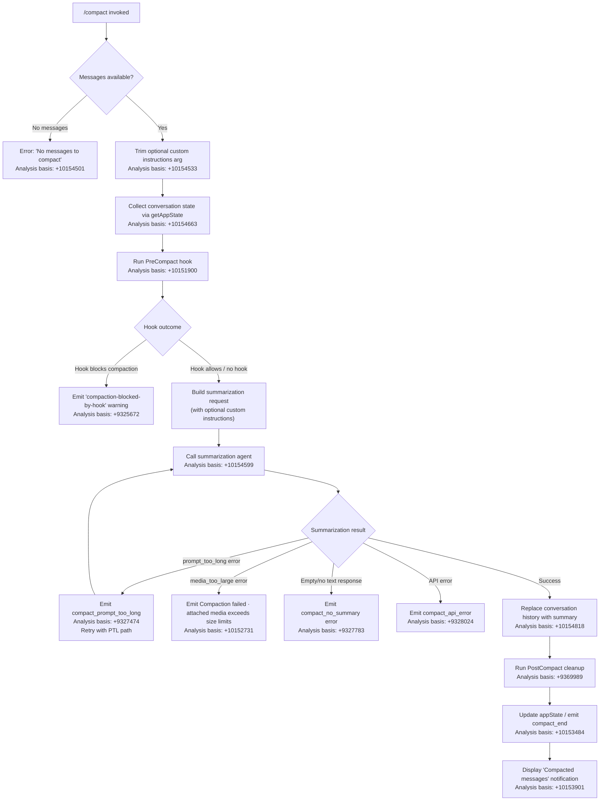

# `/compact`

> Analysis basis: CC v2.1.144 bundle.js (AST extraction + Claude interpretation)
> Minimum version: v2.1.144

---

## Overview

`/compact` frees up context window space by summarizing the current conversation into a condensed representation. It optionally accepts custom summarization instructions as an argument, then replaces the full conversation history with a compact summary, allowing the session to continue without hitting context limits.

---

## Registration

| Field | Value |
|---|---|
| type | `local` |
| name | `compact` |
| description | `Free up context by summarizing the conversation so far` |
| argumentHint | `<optional custom summarization instructions>` |
| supportsNonInteractive | `true` |
| thinClientDispatch | `post-text` |
| module_id | `H4q` |
| load_inline | `true` |
| loc_byte | `10155483` |
| loc_byte_end | `10155796` |
| loc_line | `5740` |
| arbor_handler.name | `_D7` |
| arbor_handler.fqn | `claude-2.1.144::_D7` |
| arbor_handler.kind | `AsyncFunction` |
| arbor_handler.resolution_path | `module_id` |
| arbor_handler.n_hits | `0` |

Analysis basis: CC v2.1.144 bundle.js:+10155483

---

## Input Branching

The command has 4+ distinct branches depending on message availability, custom instructions presence, pre-compact hook outcome, and summarization result.



---

## Behavioral Spec

### Main Handler — `compactCommandHandler` (bundle ident: `_D7`)

```
async function compactCommandHandler(context, args):
    customInstructions = args.trim()            // bundle.js:+10154533
    
    if conversationMessages is empty:
        throw Error("No messages to compact")  // bundle.js:+10154501
    
    // Collect current conversation context
    appState = getAppState(context)            // bundle.js:+10154663
    systemPrompt = buildSystemPrompt(appState)
    
    // Pre-compact hook phase
    hookResult = runPreCompactHook(context)    // bundle.js:+10151900
    if hookResult.blocksCompaction:
        emitWarning("compaction-blocked-by-hook") // bundle.js:+9325672
        return
    
    // Build summarization payload
    summarizationMessages = buildMessageSet(appState)  // bundle.js:+10154599
    
    // Run summarization via AD7
    result = await runSummarizationAgent(
        summarizationMessages,
        customInstructions,
        context
    )
    
    // Handle result
    handleCompactionResult(result, context)
    
    // Post-compact state cleanup
    runPostCompactCleanup(context)             // bundle.js:+10154818
    
    // Update UI
    updateTranscriptAndState(context)          // bundle.js:+10154890
    emitNotification("Compacted " + N + " messages") // bundle.js:+10153901
```

Analysis basis: CC v2.1.144 bundle.js:+10154470

---

### Summarization Orchestrator — `summarizationOrchestrator` (bundle ident: `AD7`)

```
async function summarizationOrchestrator(messages, customInstructions, context):
    startTime = performance.now()              // bundle.js:+10151983
    
    // Emit progress events
    emitProgress("compact_progress")           // bundle.js:+10151846
    emitProgress("hooks_start")                // bundle.js:+10151877
    emitProgress("pre_compact")                // bundle.js:+10151900
    emitProgress("sdk_status", "compacting")  // bundle.js:+10151942
    
    // Gather full context in parallel
    [conversationContext, hookContext] = await Promise.all([
        buildConversationContext(messages),    // bundle.js:+10152005
        runHookPhase(context)                  // bundle.js:+10152032
    ])
    
    // Determine trigger mode
    triggerMode = "manual"                     // bundle.js:+10152057
    
    // Send compact_start event
    emitProgress("compact_start")             // bundle.js:+10152404
    
    // Notification and stream-mode setup
    emitProgress("notification")               // bundle.js:+10152165
    emitProgress("stream_mode", "requesting") // bundle.js:+10152260
    emitProgress("response_length", "reset")  // bundle.js:+10152338
    
    // Run reactive compact core
    try:
        summary = await reactiveCompact(conversationContext, customInstructions) // bundle.js:+10152435
    catch error:
        if error is "prompt_too_long":
            emitError("Compaction failed · conversation could not be reduced below the context limit") // bundle.js:+10152608
        else if error is "media_too_large":
            emitError("Compaction failed · attached media exceeds size limits") // bundle.js:+10152731
        else:
            emitError("unknown error")         // bundle.js:+10152856
        return failure
    
    // Store compact metadata
    storeCompactMetadata(summary)              // bundle.js:+10152940
    
    emitProgress("compact_end")               // bundle.js:+10153484
    return summary
```

Analysis basis: CC v2.1.144 bundle.js:+10151983

---

### Reactive Compact Core — `reactiveCompactCore` (bundle ident: `gnH`)

```
async function reactiveCompactCore(conversationContext, customInstructions):
    startTime = performance.now()              // bundle.js:+9326355
    
    // Validate message count — need at least 2 groups
    groups = segmentConversationIntoGroups(conversationContext)
    if groups.length < 2:
        log("Reactive compact: fewer than 2 groups, nothing to compact") // bundle.js:+9345290
        emitTelemetry("tengu_compact", {result: "too_few_groups"})
        return {status: "too_few_groups"}
    
    // Build summarization system prompt
    systemPrompt = "You are a helpful AI assistant tasked with summarizing conversations." // bundle.js:+9338711
    
    // Strip tool calls — only text summaries allowed
    // ("Tool use is not allowed during compaction") // bundle.js:+9336695
    
    // Check for cache-prefix optimization
    cachePrefix = checkCompactCachePrefix(groups) // tengu_compact_cache_prefix: +9327042
    
    // Run summarization call (via iq7 / API request)
    summaryResponse = await callSummarizationModel(
        groups, systemPrompt, customInstructions, cachePrefix
    )
    
    if summaryResponse has no assistant message:
        log("no assistant message in summarization response") // bundle.js:+9344106
        return failure("no_summary")
    
    summaryText = extractText(summaryResponse)
    if summaryText is empty:
        log("Reactive compact: empty summary text") // bundle.js:+9344539
        return failure("summarization produced empty response")
    
    // Apply summary to conversation state
    replaceConversationWithSummary(summaryText) // bundle.js:+9329379
    
    emitTelemetry("tengu_compact")             // bundle.js:+9329418
    return {status: "success", summary: summaryText}
```

Analysis basis: CC v2.1.144 bundle.js:+9326355

---

### Auto-Compact Check — `autoCompactChecker` (bundle ident: `DY8`)

```
function autoCompactChecker(appState):
    // Check if auto-compact is enabled
    autoCompactEnabled = appState.settings["autoCompactEnabled"] // bundle.js:+9380327
    
    if not autoCompactEnabled:
        return {shouldCompact: false}
    
    // Read threshold — accepts numeric percentage (0-100) or "auto"
    threshold = parseThreshold(appState.settings)  // bundle.js:+9378269
    // "auto" string triggers automatic threshold detection
    // Numeric: value in range [0,100], internally normalized (* 1000 / 100)
    // bundle.js:+9378374, +9378410
    
    currentUsagePct = computeContextUsagePct(appState)
    
    if currentUsagePct >= threshold:
        return {shouldCompact: true, trigger: "auto"}
    
    return {shouldCompact: false}
```

Analysis basis: CC v2.1.144 bundle.js:+9378587

---

### Conversation Group Segmenter — `conversationGroupSegmenter` (bundle ident: `E3`)

```
function conversationGroupSegmenter(messages):
    // Identify compact_boundary markers
    // Literal: "compact_boundary" at bundle.js:+9875328
    // Literal: "system" role at bundle.js:+9875306
    
    groups = []
    currentGroup = []
    
    for message in messages:
        if message.role == "system" and message.type == "compact_boundary":
            // bundle.js:+9875306, +9875328
            if currentGroup not empty:
                groups.push(currentGroup)
            currentGroup = []
        else:
            currentGroup.push(message)
    
    if currentGroup not empty:
        groups.push(currentGroup)
    
    return groups
    // Returns slice from index 1 onward: bundle.js:+9875481
```

Analysis basis: CC v2.1.144 bundle.js:+10154470

---

### Post-Compact Cleanup — `postCompactCleanup` (bundle ident: `$r`)

```
async function postCompactCleanup(context):
    // Phase label: "post_compact_cleanup" at bundle.js:+9369989
    
    // Reset autonomous loop counters
    resetAutonomousLoopDelivered()             // bundle.js:+9370100
    
    // Clear various caches
    clearYY8Cache()    // YY8: DAq.clear    bundle.js:+9370062
    clearAJ9Cache()    // aJ9: TY6/uX_ clear bundle.js:+9370068
    
    // Reset background/subagent state
    resetJy9State()                            // bundle.js:+9370074
    resetSYHState()                            // bundle.js:+9370080
    
    // Emit cleanup tracking
    emitTracking("post_compact")               // bundle.js:+9375760
    
    // Restore any deferred state
    qX.clearAll()                              // bundle.js:+9370150
```

Analysis basis: CC v2.1.144 bundle.js:+9369973

---

### PreCompact Hook Runner — `preCompactHookRunner` (bundle ident: `FQ` → `Y4`, `R2`)

```
async function preCompactHookRunner(hookContext):
    // Hook event type: "PreCompact" at bundle.js:+12248479
    
    hooks = loadHooksOfType("PreCompact")
    if hooks is empty:
        return {blocked: false}
    
    results = await Promise.all(hooks.map(hook => runHook(hook, hookContext)))
    
    for result in results:
        if result.decision == "block":
            return {blocked: true, reason: result.reason}
    
    return {blocked: false}
```

Analysis basis: CC v2.1.144 bundle.js:+12248452

---

### Context State Builder — `buildConversationContext` (bundle ident: `eLq`)

```
async function buildConversationContext(context):
    // Retrieve app state
    appState = getAppState(context)            // bundle.js:+10153957
    
    // Collect system prompt
    systemPromptParts = await buildSystemPrompt(appState) // bundle.js:+10154081
    
    // Collect allowed tools
    allowedTools = appState.allowedTools       // bundle.js:+10049778
    avoidPrompts = appState.avoidPrompts       // bundle.js:+10049833
    
    // Await all context components
    [msgContext, wz, wj] = await Promise.all([
        buildMessageContext(appState),          // bundle.js:+10154267
        buildWzContext(appState),
        buildWjContext(appState)
    ])
    
    return {
        systemPromptParts,
        allowedTools,
        msgContext,
        wz, wj
    }
```

Analysis basis: CC v2.1.144 bundle.js:+10153957

---

### Message Normalizer for Compaction — `messageNormalizerForCompaction` (bundle ident: `lS_`)

Handles multiple message content types before they are handed to the summarization model:

```
function normalizeMessageForCompaction(message):
    switch message.type:
        case "teammate_mailbox":    // bundle.js:+9859746
            return normalizeMailboxMessage(message)
        case "team_context":        // bundle.js:+9859850
            return normalizeTeamContext(message)
        case "image":               // bundle.js:+9860784
            return "[image]"        // strip binary content
        case "file":                // bundle.js:+9860741
            return normalizeFileMessage(message)
        case "notebook":            // bundle.js:+9861160
            return normalizeNotebook(message)
        case "pdf":                 // bundle.js:+9861234
            return normalizePdf(message)
        case "mcp_resource":        // bundle.js:+9865303
            // Includes "Full contents of resource:" prefix // bundle.js:+9865619
            // And: "Do NOT read this resource again..." hint // bundle.js:+9865693
            return normalizeMcpResource(message)
        case "diagnostics":         // bundle.js:+9864070
            return ub.formatDiagnosticsBlock(message)
        default:
            return message
```

Analysis basis: CC v2.1.144 bundle.js:+9859728

---

### Notification and UI Update — `compactNotificationAndUIUpdate` (bundle ident: `tLq`)

```
function compactNotificationAndUIUpdate(context, summaryStats):
    // Register keyboard shortcut for transcript
    // Action: "app:toggleTranscript"       bundle.js:+10153762
    // Scope: "Global"                      bundle.js:+10153785
    // Key: "ctrl+o"                        bundle.js:+10153794
    
    registerKeybindingAction("app:toggleTranscript", "Global", "ctrl+o")
    
    // Emit dimmed notification line
    // Text: "Compacted " + messageCount    bundle.js:+10153901
    outputDim("Compacted " + messageCount + " messages")
    
    // Show result in transcript
    updateTranscript(summaryStats)
```

Analysis basis: CC v2.1.144 bundle.js:+10153220

---

## State & Side Effects

| Item | Detail |
|---|---|
| Telemetry: `tengu_compact` | Emitted on successful compaction (bundle.js:+9329418) |
| Telemetry: `tengu_compact_failed` | Emitted when compaction fails (bundle.js:+9339939) |
| Telemetry: `tengu_compact_ptl_retry` | Emitted on prompt-too-long retry (bundle.js:+9327514) |
| Telemetry: `tengu_compact_cache_prefix` | Emitted when cache-prefix optimization is applied (bundle.js:+9327042) |
| Telemetry: `tengu_compact_cache_sharing_success` | Cache sharing succeeded (bundle.js:+9337504) |
| Telemetry: `tengu_compact_cache_sharing_fallback` | Cache sharing fell back (bundle.js:+9338089) |
| Telemetry: `tengu_reactive_compact_attempt` | Reactive compact attempted (bundle.js:+9346013) |
| Telemetry: `tengu_reactive_compact_failed` | Reactive compact failed (bundle.js:+9374238) |
| Telemetry: `tengu_reactive_compact_succeeded` | Reactive compact succeeded (bundle.js:+9376356) |
| Telemetry: `tengu_precomputed_compact_discarded` | Precomputed compact result discarded (bundle.js:+9353547) |
| appState changes | Conversation history replaced with summary; compact metadata stored under `"compactMetadata"` key (bundle.js:+10152940) |
| Hook registration | `PreCompact` hook fires before summarization (bundle.js:+12248479); `PostCompact` hook fires after (bundle.js:+12279903) |
| Keyboard shortcut | `ctrl+o` → `app:toggleTranscript` registered in `Global` scope (bundle.js:+10153794) |
| Caches cleared | Autonomous loop counters, background-task caches (`DAq`, `TY6`, `uX_`) reset during post-compact cleanup (bundle.js:+9370062) |
| Compact boundary marker | `"compact_boundary"` message inserted into conversation (bundle.js:+9875328) |
| Sound | <!-- TODO: not found in depth-2 traversal; needs --depth 4 --> |

---

## Error Messages

| Condition | Message |
|---|---|
| No messages to compact | `"No messages to compact"` (bundle.js:+10154501) |
| Context cannot be reduced | `"Compaction failed · conversation could not be reduced below the context limit"` (bundle.js:+10152608) |
| Attached media too large | `"Compaction failed · attached media exceeds size limits"` (bundle.js:+10152731) |
| Summarization empty response | `"Failed to generate conversation summary - response did not contain valid text content"` (bundle.js:+9327882) |
| Compaction canceled | `"Compaction canceled."` (bundle.js:+10155098) |
| Compaction blocked by hook | `"compaction blocked by PreCompact hook"` (bundle.js:+9325706) |
| Reactive compact: too few groups | `"Reactive compact: fewer than 2 groups, nothing to compact"` (bundle.js:+9345290) |
| Reactive compact: no assistant messages | `"Reactive compact: no assistant messages in summarize set, bailing"` (bundle.js:+9345852) |

---

## Version History

| Version | Change |
|---|---|
| v2.1.144 | Initial analysis |

---

## Common Mistakes

1. **Running `/compact` with no conversation history** — the command immediately errors with "No messages to compact" if the message list is empty. Start a conversation before invoking it.
2. **Assuming all content survives compaction** — images and binary attachments are stripped (replaced with `[image]`) during normalization before summarization. Sensitive visual context will not appear in the summary.
3. **Ignoring custom instructions argument** — the argument hint (`<optional custom summarization instructions>`) is silently trimmed; passing extra flags or slash-prefixed text will be treated as plain summarization instructions rather than sub-commands.
4. **Blocking with a PreCompact hook unexpectedly** — if a `PreCompact` hook returns a block decision, compaction silently aborts with a warning rather than an error; users may not realize the context was not reduced.
5. **Expecting `/compact` to work identically in non-interactive mode** — `supportsNonInteractive: true`, but the `thinClientDispatch` is `post-text`, so output formatting may differ from interactive REPL sessions.
6. **Expecting instant completion** — compaction issues a full LLM summarization request; in large conversations or under API rate limiting this can take tens of seconds.

---

## Appendix — Identifier Mapping

> For bundle debugging only. Identifiers change across versions.

| Identifier | Role |
|---|---|
| `_D7` | Main `/compact` command handler (AsyncFunction) |
| `AD7` | Summarization orchestrator; emits progress events, calls reactive compact core |
| `gnH` | Reactive compact core; validates groups, calls summarization model, replaces history |
| `E3` | Conversation group segmenter; splits on `compact_boundary` markers |
| `x$7` | Message slice helper used by group segmenter |
| `qP` | Low-level message processing primitive |
| `LLH` | Context/state assembly function called by main handler |
| `gP6` | Context gathering sub-function |
| `Z_` | App state accessor utility |
| `P6` | Conversation state builder |
| `Cs` | Inner state composition helper |
| `Vr6` | State dedup/tracking helper |
| `y6` | Timestamp/state-event helper |
| `S0` | Token count / model sizing helper |
| `xH` | String conversion utility |
| `HT` | Model-name resolution helper |
| `yAH` | Model identifier normalizer |
| `_l` | Model configuration lookup |
| `W9` | Provider routing helper |
| `ay` | Provider auth helper |
| `oD` | API endpoint resolver |
| `kAH` | Max-token determination helper |
| `Yn6` | Token budget calculator |
| `KX` | Context key extractor |
| `DY8` | Auto-compact threshold checker |
| `YG` | Auto-compact settings reader |
| `w7` | Legacy/global config reader |
| `kS_` | Threshold string parser (handles "auto" and numeric percentages) |
| `oK7` | Summarization message builder |
| `UFH` | Message format converter |
| `lS_` | Per-message normalizer for compaction (handles all content types) |
| `FQ` | PreCompact hook runner dispatcher |
| `Y4` | Hook type router |
| `I6` | Hook execution primitive |
| `Ey` | Hook execution variant |
| `_2` | Hook config loader |
| `dE` | Hook detail extractor |
| `FZ` | Hook join/aggregate helper |
| `C6` | Hook result formatter |
| `R2` | Hook execution engine (main loop) |
| `iu` | Hook policy settings reader |
| `v` | Hook verbosity/debug logger |
| `T4H` | Hook state transition helper |
| `td_` | Hook file-path resolver |
| `sd_` | Hook filter (third-party) |
| `rd_` | Hook result decoder |
| `IW8` | Hook output JSON parser |
| `O6H` | Hook output entry transformer |
| `id_` | HTTP hook executor |
| `bhq` | Hook output post-processor |
| `vW8` | Shell/spawn hook executor |
| `eLq` | Conversation context state builder |
| `fG` | Full system-prompt assembler |
| `zc_` | System prompt string builder |
| `fz8` | MCP/tool context builder |
| `B_` | Subagent context builder |
| `vB7` | Code-style system prompt injector |
| `NB7` | General guidance injector |
| `Jc_` | Context-management mode handler |
| `AF7` | Context focus injector |
| `OP6` | Output style system prompt builder |
| `kB7` | Output mode wrapper |
| `BB7` | Memory/context accumulator |
| `y56` | Memory file loader (CLAUDE.md etc.) |
| `nB7` | Environment info static injector |
| `lB7` | Environment info dynamic injector |
| `tB7` | Brief mode checker |
| `_F7` | Focus/plan mode prompt builder |
| `QB7` | System prompt final composer |
| `Zi9` | MCP resource context integrator |
| `bB7` | Compaction-reminder injector |
| `xB7` | Tool context injector |
| `uB7` | Context-management injector (uB7 variant) |
| `mB7` | Scratchpad context injector |
| `FB7` | System prompt footer builder |
| `bI1` | Auto-memory builder |
| `O$H` | Output style mode helper |
| `y_` | App state allowed-tools extractor |
| `Xb_` | Tool filter builder |
| `Bb` | Agent system-prompt retriever |
| `sz8` | Verbosity/debug flag reader |
| `fS_` | Streaming mode flag reader |
| `vS_` | Full reactive-compact invocation wrapper |
| `yj` | Off-switch / circuit-breaker checker |
| `xOH` | Off-switch flag set accessor |
| `W36` | Off-switch circuit state writer |
| `qY8` | Summarization API call with group-slicing logic |
| `vrH` | Message accumulator push helper |
| `st9` | Group sizing math helper |
| `iq7` | Single summarization model request |
| `rq7` | Retry group-size calculator |
| `g0` | Effort/model config builder |
| `Zw` | App state reader (conversation history) |
| `zw` | App state writer |
| `K8` | State persistence helper |
| `Ge9` | Reactive compact full pipeline (wraps gnH + cleanup) |
| `F9H` | Model token-budget builder |
| `D36` | Cache-key map builder |
| `Ng` | Model name normalizer |
| `a$6` | Model registry lookup |
| `VSH` | Vendor/provider selector |
| `yrH` | Dialog display helper |
| `mP6` | UUID generator (randomUUID wrapper) |
| `L6H` | Telemetry batch emitter |
| `jK7` | Post-compact telemetry runner |
| `jwH` | Prompt construction for summarization |
| `LS_` | Cache-prefix computation helper |
| `yKH` | Cache key hash helper |
| `lz8` | Message round-counter |
| `cz8` | Message stats counter (human/assistant) |
| `$r` | Post-compact cleanup orchestrator |
| `MY8` | Precomputed compact cache handler |
| `LY8` | Precomputed compact loader |
| `_e9` | Compact timing recorder |
| `J36` | IT-state reset helper |
| `Nn` | State nonce generator |
| `q6H` | Interrupt-token resetter |
| `YY8` | DAq cache clearer |
| `aJ9` | TY6/uX_ cache clearer |
| `jy9` | Background-state resetter (jy9) |
| `sYH` | Background-state resetter (sYH) |
| `qX` | Output-token counter resetter |
| `ES_` | Post-compact extra state cleanup |
| `LEH` | App state writer (setState wrapper) |
| `tLq` | Compact notification and UI updater |
| `MdH` | Model display-name helper |
| `jW4` | Model display builder |
| `Pj` | Keybinding registration helper |
| `ks6` | Keybinding config reader |
| `ys6` | Keybinding action builder |
| `FOH` | OTEL metric emitter |
| `$L` | Metric attribute builder |
| `OgH` | OTEL gauge/counter emitter |
| `Ae` | State-update apply helper |
| `yr1` | setState call wrapper |
| `at9` | Summarization agent loop (full API call + streaming) |
| `xo9` | Interrupt-check helper |
| `pO8` | Interrupt token getter |
| `bo9` | Interrupt token poller |
| `wZ` | Main agent event loop (stream processor) |
| `Zv_` | Conversation state manager inside loop |
| `rm` | Random-bytes ID generator |
| `rHH` | Dialog/logger helper |
| `pb` | Agent completion handler |
| `C26` | Tombstone check helper |
| `sAq` | Tombstone updater |
| `D` | Background session dispatcher |
| `wz7` | Loop state finalizer |
| `MS_` | Max-turns stopper |
| `qLH` | Output-token limit calculator |
| `$$H` | Token-budget model mapper |
| `fe` | Max-token env-var parser |
| `ST` | Last-message finder |
| `Ih` | Array content checker |
| `qc` | Progress notifier |
| `uP6` | Tool-call validator / dispatcher |
| `H_` | Tool result formatter |
| `TZH` | Tool name case-normalizer |
| `ZvH` | Tool permission checker |
| `US_` | Tool availability checker |
| `gK7` | Tool search mode decider |
| `KS_` | Message content type mapper |
| `Qq7` | Content-type filter |
| `dq7` | Detailed content walker |
| `xP6` | Content type identifier |
| `qS_` | Recursive content scanner |
| `lt9` | Unicode/surrogate normalizer |
| `diH` | Main REPL request handler |
| `hRq` | Full API request + response handler |
| `zG` | Message normalization pipeline |
| `q$7` | Message group builder |
| `jC_` | Content injection helper |
| `O$7` | gB1 wrapper |
| `$$7` | Content-type label set |
| `z$7` | Thinking-block detector |
| `N` | Away-summary generator |
| `CD8` | Some-check for content |
| `G$7` | UUID factory for messages |
| `mW` | Message wrapper |
| `Wv_` | Message post-processor |
| `bD8` | Content block builder |
| `Kh` | Tool schema permission filter |
| `GC_` | Content sanitizer |
| `K$7` | Media-block stripper |
| `L$7` | List-content checker |
| `vL` | Content value accessor |
| `D$7` | Content dedup filter |
| `T1q` | Message array accumulator |
| `T$7` | Text content joiner |
| `Y$7` | Block merge helper |
| `XX6` | Orphaned-thinking filter |
| `m$7` | Content slice helper |
| `jX6` | Cache/dedup message filter |
| `p$7` | Slice-only message helper |
| `w$7` | Trailing-block inserter |
| `G1q` | Message group indexer |
| `E1q` | Block push helper |
| `M$7` | Contiguous-block merger |
| `it9` | Message context truncator |
| `hBH` | Token counting helper |
| `DTH` | Content array some-checker |
| `Q5_` | Token count extractor |
| `Pm` | Message-role prefix checker |
| `tz8` | File-reference normalizer for compaction |
| `cq7` | File-path resolver for compaction |
| `or6` | Path prefix checker |
| `q1` | Path canonicalizer |
| `nq7` | File reference builder |
| `uT` | File path join helper |
| `p0H` | CLAUDE.md memory file loader |
| `rk_` | File attachment reader |
| `KrH` | File read permission checker |
| `lR6` | Error type identifier |
| `ypH` | MIME-type normalizer |
| `XA7` | File at-mention processor |
| `bI` | File content wrapper |
| `IPH` | File size checker |
| `M7` | String index helper |
| `$1` | Session UUID generator |
| `k5` | Math.round wrapper |
| `AY8` | Local-agent message builder |
| `u$` | Task reference builder |
| `BlH` | Task path builder |
| `ez8` | Plan-file reference builder |
| `mT` | Plan message builder |
| `O8` | A8 wrapper (response type) |
| `_Y8` | Context-item builder |
| `HY8` | MCP resource message builder |
| `iI8` | Map-set helper |
| `lq7` | MCP resource slice helper |
| `nDH` | Tool-use dispatcher |
| `ak_` | Permission-set manager |
| `frH` | Tool schema builder |
| `ww_` | Tool schema formatter |
| `Cq` | String coercer |
| `jqH` | Tool filter helper |
| `piH` | Tool permission injector |
| `XLH` | Tool listing flattener |
| `UO6` | Built-in tool filter |
| `LA8` | Tool name case matcher |
| `Dw_` | Tool permission descriptor builder |
| `v34` | Permission label builder |
| `Oq` | MCP tool schema builder |
| `Zn8` | MCP schema property builder |
| `En8` | MCP enum builder |
| `KJ` | JSON schema type converter |
| `MrH` | MCP tool registry updater |
| `ro9` | MCP tool list manager |
| `Np` | Plugin hook loader |
| `SK` | String coercion utility |
| `MY` | Policy settings reader |
| `V8` | Sub-builder for policy |
| `F0H` | Plugin hook filter |
| `PCH` | Plugin metric recorder |
| `T8` | Log file appender |
| `$X6` | Plugin agent session launcher |
| `V2` | Full agent request dispatcher |
| `o5` | Content block builder |
| `FU` | WV wrapper |
| `WV` | Content value builder |
| `q_` | WV variant |
| `hX` | Formatted content block with role |
| `PF` | Format prefix helper |
| `T56` | Thinking block type |
| `bP6` | Post-process prompt helper |
| `pq7` | Prompt text normalizer |
| `yn` | Circuit-breaker state writer |
| `ot9` | Loop state logger |
| `GH` | String coercion utility (GH variant) |
| `QS` | Queue-shift push helper |
| `j_4` | Persistent cache get/set |
| `RS_` | String helper for reset display |