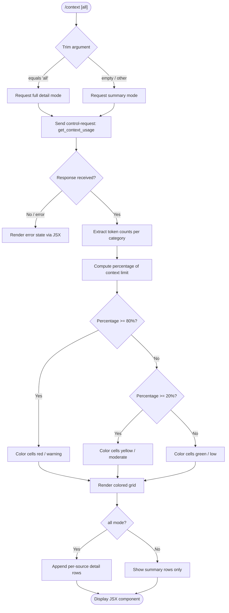

# `/context`

> Analysis basis: CC v2.1.144 bundle.js (AST extraction + Claude interpretation)
> Minimum version: v2.1.144

---

## Overview

`/context` visualizes the current conversation's context window usage as a colored grid rendered in the terminal. It dispatches a `get_context_usage` control request to the running agent session, then renders a JSX component showing how many tokens are occupied by each category (system prompt, tools, messages, memory files, etc.) relative to the model's context limit. The optional `[all]` argument expands the display to include additional detail rows.

---

## Registration

| Field | Value |
|---|---|
| type | `local-jsx` |
| name | `context` |
| description | `Visualize current context usage as a colored grid` |
| argumentHint | `[all]` |
| thinClientDispatch | `control-request` |
| module_id | `y5q` |
| load_inline | `true` |
| loc_byte | `10552864` |
| loc_byte_end | `10553090` |
| loc_line | `5792` |
| arbor_handler.name | `ej7` |
| arbor_handler.fqn | `claude-2.1.144::ej7` |
| arbor_handler.kind | `AsyncFunction` |
| arbor_handler.resolution_path | `module_id` |
| arbor_handler.n_hits | `0` |

Analysis basis: CC v2.1.144 bundle.js:+10552864

---

## Input Branching

Five or more distinct display branches exist (argument check, `all` mode vs. default mode, per-category grid coloring, compact vs. expanded rows, percentage thresholds), so a Mermaid flowchart is used.



Analysis basis: CC v2.1.144 bundle.js:+10551498, +10551529, +10551564, +10551734, +10551965

---

## Behavioral Spec

### Handler entry point — `contextCommandHandler` (`ej7`)

```
async function contextCommandHandler(args, appState):
    trimmedArg = args.trim()                        // +10551504
    showAll    = (trimmedArg == "all")              // literal "all" at +10551529

    // Send control-request to the active session
    result = await sendControlRequest(             // +10551564
        eventName = "get_context_usage",           // literal at +10551594
        payload   = { all: showAll }
    )

    // Listen for the "data" event on the response stream
    stream = subscribeToControlResponse(result)    // +10551624

    // Build and return JSX tree
    jsxTree = createElement(pW6, ...)              // +10551628
    return jsxTree
```

Analysis basis: CC v2.1.144 bundle.js:+10551498

---

### Context-usage data collector — `contextUsageBuilder` (`mW6`)

```
function contextUsageBuilder(rawData, showAll):
    // Retrieve current token-count baseline
    baseline = getTokenBaseline()                  // AL / aq / RfK at +10549561

    // Build category list
    categories = rawData.filter(...)               // +10549602
    found      = rawData.find(...)                 // +10549920

    // Sections recognised (literals in bundle):
    //   "Free space"            +10549637
    //   "Autocompact buffer"    +10549660
    //   "Project"               +10550606  (key: "projectSettings")
    //   "User"                  +10550643  (key: "userSettings")
    //   "Local"                 +10550678  (key: "localSettings")
    //   "Flag"                  +10550713
    //   "Policy"                +10550749
    //   "Plugin"                +10550779  (key: "plugin")
    //   "Built-in"              +10550811  (key: "built-in")
    //   "System prompt"         +9391104
    //   "System tools"          +9391183
    //   "MCP tools"             +9391247
    //   "MCP tools (deferred)"  +9391323
    //   "Memory files"          +9391565
    //   "Messages"              +9392127

    // Compute percentage formatter (locale "en-US", style "compact")
    pct = formatPercentage(tokenCount / contextLimit)
    // threshold: < 20 → label "< 20"  (+206826)
    // rounding step: 10                (+206859)

    // Colour logic based on fill fraction
    if fillFraction >= 0.80:       // constant 80 at +10551965
        colour = warning / red
    elif fillFraction >= 0.20:     // constant 20 at +206817
        colour = moderate / yellow
    else:
        colour = low / green

    return { categories, colours, percentages }
```

Analysis basis: CC v2.1.144 bundle.js:+10549561, +10549602, +10549920, +10549637, +10550606

---

### Percentage formatter — `percentFormatter` (`po`)

```
function percentFormatter(fraction):
    // Uses Intl.NumberFormat("en-US", { style: "compact" })
    // Appends ".0" suffix when needed            (+206788)
    // Rounds to nearest 10                       (+206817, +206859)
    // Label for values below threshold: "< 20"  (+206826)
    return formattedString
```

Analysis basis: CC v2.1.144 bundle.js:+206774, +206817, +206826, +206846

---

### Compact-boundary marker — `compactBoundaryRenderer` (`tj7` / `E3`)

```
function compactBoundaryRenderer(messages):
    // Looks up the "compact_boundary" marker in message history
    // literal "compact_boundary" at +9875328
    boundary = findMarker(messages, "compact_boundary")  // x$7/qP at +9875458
    if boundary exists:
        slice = messages.slice(boundary.index, ...)      // +9875481
    return slice
```

Analysis basis: CC v2.1.144 bundle.js:+10551460, +9875328

---

### Context-window computation — `contextWindowCalculator` (`XY8`)

This is the core computation kernel. At depth 2 it calls into a very large set of helpers; key responsibilities:

```
async function contextWindowCalculator(session, opts):
    // 1. Assemble system prompt tokens
    systemPrompt = buildSystemPrompt(session)         // fG at +9390252
    systemTokens = countTokens(systemPrompt)          // urH/mvH at +9383164

    // 2. Collect tool definitions
    tools        = gatherTools(session)               // various helpers

    // 3. Walk message history
    messages     = buildMessagePayload(session)       // ZK7 at +9390830

    // 4. Apply context-window limits
    //    Known context sizes in tokens:
    //      64 000   (+2900256)
    //      128 000  (+2900264)
    //      32 000   (+2900305)
    //      1 000 000 (+1000000 tokens for 1M-context models)
    limit = resolveContextLimit(session.model)

    // 5. Calculate per-category byte/token counts
    usageMap = {
        systemPrompt:   ...,
        systemTools:    ...,
        mcpTools:       ...,
        memoryFiles:    ...,
        messages:       ...,
        freeSpace:      limit - sum(all categories),
        autocompact:    ...,
    }

    // 6. Threshold-based grid colouring (see contextUsageBuilder)
    return { usageMap, limit, pct }
```

Analysis basis: CC v2.1.144 bundle.js:+9390146, +9390252, +9390830, +2900256, +2900264

---

### Control-request dispatch — `sendControlRequest` (via `K.sendControlRequest`)

```
async function sendControlRequest(eventName, payload):
    // Sends a "control-request" message to the active bridge session
    // thinClientDispatch type is "control-request" (registration field)
    // The event name is padded with spaces (literal "  " at +14565402)
    rawResponse = await K.sendControlRequest(eventName, payload)
    return rawResponse
```

Analysis basis: CC v2.1.144 bundle.js:+10551564, +14565368

---

### JSX rendering — `controlResponseRenderer` (`pcH`)

```
function controlResponseRenderer(stream):
    stream.on("data", handler)                  // +7426060
    text = stream.toString()                    // +7426097
    element = createElement(JHH, ...)           // JHH.createElement at +7426127
    return element
```

Analysis basis: CC v2.1.144 bundle.js:+10551624, +7426060

---

## State & Side Effects

| Item | Detail |
|---|---|
| Telemetry | `tengu_amber_creek` (+3336982), `tengu_pewter_brook` (+3336890), `tengu_marlin_porch` (+3697211), `tengu_amber_redwood2` (+9378655), `tengu_cobalt_raccoon` (+9370989), `tengu_sparrow_ledger` (+12353757), `tengu_slate_harrier` (+12363334), `tengu_orchid_mantis_v2` (+12349324), `tengu_memdir_loaded` (+3257074), `tengu_moth_copse` (+3261986), `tengu_chair_sermon` (+9836342) |
| Control request | Issues a `get_context_usage` control-request to the active session bridge |
| appState changes | None observed at depth-2 traversal; read-only inspection command |
| Hook registration | `h1 → OHA.register` (+57049) — timeout/scheduling hook registered during settings load path |
| Sound | None |
| File I/O | None directly; settings-load helpers may read `~/.claude/settings.json` as a side effect of computing context limits |

---

## Version History

| Version | Change |
|---|---|
| v2.1.144 | Initial analysis |

---

## Common Mistakes

1. **Omitting the `[all]` argument when investigating source distribution** — without `all`, per-source detail rows (Plugin, Flag, Policy, Local, User, Project) are collapsed into a summary; pass `/context all` to see the full breakdown.
2. **Confusing token percentage with token count** — the grid shows percentage of context window consumed, not raw token counts; the formatter rounds to the nearest 10 and displays "< 20" for very small values.
3. **Expecting the command to modify state** — `/context` is purely read-only; it does not trigger compaction, change the model, or alter any settings.
4. **Running in non-interactive / thin-client mode without a live bridge session** — the command requires a connected `thinClientDispatch: control-request` bridge; in headless pipelines the control request will fail silently.
5. **Misreading the 80% threshold as absolute** — the red/warning colour triggers at 80 % of the *current model's* context window, which varies by model (32 k, 64 k, 128 k, or 1 M tokens).

---

## Appendix — Identifier Mapping

> For bundle debugging only. Identifiers change across versions.

| Identifier | Role |
|---|---|
| `ej7` | Main handler for `/context` command (AsyncFunction) |
| `aA` | Session/app-state assembler called from handler |
| `dRH` | Settings/platform capability check |
| `vq_` | Terminal colour-support resolver |
| `Cq` | String formatting helper (colour codes) |
| `xH` | Generic string-to-token conversion helper |
| `Ql` | Fullscreen/terminal mode check |
| `QxL` | iTerm/tmux detection helper |
| `gxL` | Terminal type prefix checker (`H.startsWith`) |
| `v` | Logger / verbose output helper |
| `vfK` | Verbose logging sub-helper |
| `YHA` | Key-value log emitter |
| `CH` | JSON serialisation wrapper (`JSON.stringify`) |
| `x4` | File path manipulation utility |
| `d8A` | Map-over-files helper |
| `YhH` | Write-to-handle helper |
| `h8A` | Low-level stream write helper |
| `yfK` | Log-file writer / rotation manager |
| `pSH` | Async queue / batch flush helper |
| `z_H` | Log-line formatter |
| `kN8` | Log directory resolver |
| `s8A` | Log file path joiner |
| `a8A` | Log file rotate/rename helper |
| `kfK` | Log file appender (mkdir + appendFile) |
| `h1` | Hook registration entry point |
| `Iq_` | Boolean platform guard (Windows check) |
| `B_` | Settings loader caller |
| `Du` | Settings load orchestrator |
| `AR` | Settings post-processor |
| `j9` | Memory usage sampler (`process.memoryUsage`) |
| `mp8` | Full settings load routine |
| `kB` | Settings sub-loader (policy/flag/project/user/local) |
| `XI6` | Settings finaliser |
| `dxL` | Context-window display bootstrapper |
| `P6` | Token-count state manager / cache |
| `Cs` | Token string classifier |
| `Vr6` | Token cache deduplicator |
| `y6` | Token batch counter / timestamp updater |
| `P$` | System-prompt builder entry |
| `fXH` | Prompt component assembler |
| `K` | Control-request transport object |
| `L` | Stream lifecycle manager |
| `f` | Stream close / cleanup |
| `pcH` | Control-response renderer (subscribes `data` event) |
| `$m` | JSX element factory wrapper |
| `W4_` | React `createElement` shim |
| `A9H` | Grid row component renderer |
| `hUH` | Grid cell colour selector |
| `mW6` | Context-usage data collector / category builder |
| `AL` | Token-count baseline fetcher |
| `aq` | Baseline formatter |
| `RfK` | Raw token baseline reader |
| `yCH` | Category label normaliser |
| `po` | Percentage formatter (en-US compact) |
| `GH` | String coercion helper |
| `tj7` | Compact-boundary wrapper |
| `E3` | Compact-boundary core logic |
| `x$7` | Message-marker finder |
| `qP` | Marker index resolver |
| `Ae` | App-state setter (calls `s$6.setState`) |
| `yr1` | React state dispatcher |
| `XY8` | Context-window computation kernel |
| `_T` | Message payload builder (main entry) |
| `Ua` | Message normaliser |
| `GV` | Message type guard |
| `i8H` | Image attachment handler |
| `oB` | Message content walker |
| `oV` | Output message formatter |
| `dM` | JA-based content assembler |
| `wM` | Structured message builder |
| `aV` | Alternate message formatter |
| `YG` | Auto-compact window resolver |
| `w7` | Legacy global config reader |
| `Ou` | Config set deduplicator |
| `V8` | Settings fetch + kB call |
| `Or` | Context-window parameter resolver |
| `W9` | Model name normaliser / display-name mapper |
| `SB6` | First-party provider checker |
| `tw` | Model identifier lower-case matcher |
| `ZX` | Model name substitution helper |
| `S0` | Context-window limit resolver |
| `HT` | Context-limit lookup (by model) |
| `_l` | Model-specific context-window table lookup |
| `kAH` | Context-window sub-lookup |
| `Yn6` | Numeric context-window extractor |
| `KX` | Context-window cap resolver |
| `fe` | Context-window validity checker (valid/invalid/capped) |
| `DY8` | Auto-compact window calculator |
| `kS_` | Token size string parser (parseFloat/parseInt) |
| `fG` | System-prompt assembly orchestrator |
| `zc_` | xH-based prompt string builder |
| `C6` | Async store / context getter (`NR6.getStore`) |
| `kR6` | Store accessor |
| `q_` | WV-based config resolver |
| `fz8` | Object.values prompt combiner |
| `QT` | Prompt component tag |
| `vB7` | Model-info block builder |
| `NB7` | GM-based model annotator |
| `Jc_` | Prompt section assembler |
| `AF7` | Jc_ wrapper for additive sections |
| `OP6` | Output-style section injector |
| `kB7` | OP6 wrapper |
| `BB7` | Tool-definition block builder |
| `cU` | Tool schema validator |
| `$Y` | xH tool string builder |
| `pB7` | VT-based tool pre-processor |
| `mO6` | Tool metadata extractor |
| `VT` | Tool output formatter |
| `B4` | Tool block finaliser |
| `UB7` | Tool block post-processor |
| `nLH` | Tool diagnostic logger |
| `Bp` | Tool list flat-mapper |
| `y56` | Memory/CLAUDE.md file loader |
| `dK` | Memory directory walker |
| `B1H` | Memory directory creator |
| `ul` | File type inspector (isFile/isDirectory) |
| `RH` | Generic directory reader |
| `LY` | P6-based memory token counter |
| `II1` | Memory path joiner |
| `i0H` | Memory content reader |
| `VI1` | Memory section builder (c0H) |
| `ZI1` | Memory section accumulator |
| `B9_` | Memory push/read helper |
| `SB7` | Model-override prompt section |
| `nB7` | Environment-info builder (simple) |
| `FP` | Foundry/model display name builder |
| `Yc_` | Environment subsection builder |
| `lB7` | Full environment-info block builder |
| `wc_` | OS info reader (version/release/type) |
| `sf` | Shell/env info helper |
| `Dc_` | Shell type detector (zsh/bash/PowerShell) |
| `hB7` | Language section builder |
| `RB7` | Output-style section builder |
| `rB7` | Background-session section builder |
| `DE_` | Worktree section builder |
| `oB7` | Scratchpad section builder |
| `M8H` | Scratchpad token counter |
| `rJH` | Scratchpad path joiner |
| `aB7` | FRC (fast-refresh context) section builder |
| `tB7` | Brief-mode section builder |
| `_F7` | Focus section builder |
| `QB7` | Reproduce-verify section builder |
| `Zi9` | GrowthBook feature flag reader |
| `gB7` | Custom-agent listing builder |
| `CB7` | MCP-instructions section builder |
| `bB7` | Context-efficiency section builder |
| `yB7` | Context-efficiency detail |
| `xB7` | Tool-verification section builder |
| `uB7` | Jc_ tool-use section builder |
| `mB7` | Memory-update section builder |
| `hX` | PF/Cq/xH memory slot formatter |
| `FB7` | Bp-based memory flat-mapper |
| `bI1` | Memory index (CI1 + B9_) |
| `CI1` | Memory file combiner |
| `O$H` | System-reminder builder |
| `yE` | D__/xH system note builder |
| `i5` | Inline system-note injector |
| `JA` | xH-based system wrapper |
| `Bb` | Agent-memory / system-prompt reader |
| `fK` | fK agent-memory token reader |
| `TJ` | TJ system-prompt pre-processor |
| `ZK7` | Message history processor / entry lister |
| `EK7` | Per-entry token estimator (match/split/trim) |
| `WY8` | Per-entry full-context builder |
| `iB7` | Per-entry environment injector |
| `xI1` | Per-entry memory assembler |
| `ihq` | Per-entry header extractor |
| `urH` | Per-message token counter (top-level) |
| `mvH` | Per-message token counter (detail) |
| `kH` | Token-count API caller (`count_tokens`) |
| `Ne9` | Token-count response parser |
| `VK7` | MCP tool token counter |
| `j36` | P6 MCP filter |
| `IK7` | Built-in tool token counter |
| `M` | MCP server manager |
| `dvH` | MCP server state aggregator |
| `k6K` | MCP server update applier |
| `$` | NVq-based MCP helper |
| `vq5` | MCP client enumerator |
| `XwH` | Parallel tool token counter |
| `GY8` | Per-tool token counter |
| `z` | Daemon stop / bH / BN / Xx helper set |
| `bH` | d-based background stop helper |
| `BN` | IF/ZF/R0H/x1_ shutdown assembler |
| `Xx` | Promise.race shutdown executor |
| `G` | P26/bE8 gate helper |
| `X` | Buffer concat / IPC message handler |
| `j` | w-based message router |
| `w` | Worker session manager |
| `B5` | Stream end / CH flusher |
| `hL5` | PTY/IPC message dispatcher (core daemon loop) |
| `kK7` | Per-conversation token accumulator |
| `k5` | Math.round token rounding helper |
| `O` | k8-based session container |
| `D` | Session lifecycle / fT6 / Ta_ manager |
| `fT6` | c6/P6 free-mem helper |
| `Ta_` | Spare-session spawner (Bun.spawn) |
| `yK7` | Per-entry token mapper |
| `vK7` | ED_/C6/ve9 tool-token helper |
| `ED_` | DZ/DqH/cU token tool entry |
| `DqH` | Tool schema filter/some/_Sq |
| `ve9` | LK-based token cache lookup |
| `LK` | Token memoisation cache (SV1/hV1/K) |
| `CK7` | Per-session context assembly orchestrator |
| `SK7` | CH/k5 token summariser |
| `hK7` | k5/CH/A.get detailed token helper |
| `RK7` | CH/k5 rolling-total helper |
| `zG` | Full conversation builder (main message-loop) |
| `q$7` | Message segment pusher |
| `jC_` | jC_ segment classifier |
| `O$7` | gB1-based content block builder |
| `$$7` | Multi-type content dispatcher |
| `z$7` | Array/some/has content type checker |
| `N` | Away-summary / session-cache manager |
| `CD8` | _.some deferred-tools checker |
| `G$7` | UUID generator wrapper |
| `J8` | j/UZ.randomUUID/J message ID factory |
| `mW` | Message writer helper |
| `Wv_` | Message finaliser |
| `bD8` | xD8/Z1q/J$7 block builder |
| `Kh` | US_/v/JA/i5 conversation context injector |
| `GC_` | Array/some/map/zr content guard |
| `K$7` | Array/some/zr/has/WE/map content mapper |
| `T` | Keyboard / UI event handler |
| `L$7` | H.some/Array.isArray content list helper |
| `vL` | Token-value lookup |
| `D$7` | A.filter/q.some/T1q deferred-tool block |
| `Y` | Session config updater (stop/start/updateConfig) |
| `T1q` | q.push/K.push token tail builder |
| `lS_` | Full conversation assembler (lS_) |
| `T$7` | _.push/_1q/_.join/A.trim token block |
| `W` | z.add/clearTimeout/setTimeout/AOH/AFH event batcher |
| `Y$7` | xD8/Z1q/j$7 message block finaliser |
| `XX6` | Array/K.some/_.add/L.every/_.has orphan-thinking filter |
| `m$7` | H.at/A.at/xP6/d/A.slice message accessor |
| `jX6` | Array/L1q/f.some/A.add/H.filter deferred block handler |
| `p$7` | Array/d/H.slice content trimmer |
| `w$7` | _.at/H.slice/_.push/J8/mW message window writer |
| `G1q` | H.map/Array/A.some/K.push/L.push/findLastIndex conversation builder |
| `E1q` | A.at/bD8/A.push block accumulator |
| `M$7` | Array/$.every/$.filter/O.join/K.slice/H.slice message flattener |
| `NK7` | ZD_/C6/ve9/XwH/sV/K.map/B4/RP6/DZ/kH/b_ tool-context builder |
| `ZD_` | DqH/DZ/cU tool-schema validator |
| `sV` | zq/W9/z3L.has normalised-name validator |
| `zq` | H.trim/_.toLowerCase/HT/A.replace model-name normaliser |
| `RP6` | k5/Qy_ rounded percentage helper |
| `Qy_` | Qy_ cell colour selector |
| `b_` | Error/String error formatter |
| `$6H` | Math.min/qLH/YG/Or context-window cap calculator |
| `qLH` | $$H/fe context-limit wrapper |
| `$$H` | W9/pD1/Math.min per-model limit resolver |
| `_H` | T.current/Q.setTimeout/v/r recording/session array |
| `Q` | BW6/qfq file-based session reader |
| `BW6` | eb.readFile/rwH/O8/f9 session file reader |
| `qfq` | eb.unlink/rwH/O8 session file deleter |
| `r` | w/c worker/connection wrapper |
| `c` | Wl_-based connection helper |
| `f88` | xOH/G36.has feature-flag guard |
| `xOH` | G36.has feature-check helper |
| `LLH` | gP6/S0/KX/W9/DY8 display-limit resolver |
| `gP6` | Z_/P6 grid percentage builder |
| `f6` | OH.start/s.getLastSequenceNum session launch helper |
| `OH` | Session start controller |
| `s` | HH.some/r6.indexOf session sequence manager |
| `HH` | v/o/e session hook set |
| `r6` | qH/hH/_H.push sequence log |
| `yl_` | L/UY9/q28/v/Y.close bridge repl session manager |
| `UY9` | UY9 bridge state tracker |
| `q28` | s8.post/Number/Error/CH bridge POST helper |
| `cG6` | H.replace log-line sanitiser |
| `oH` | s.setOnConnect/clearTimeout/v/T8/x/d/W6/K6/s.setOnData/sEq/w/NH/tEq session connection handler |
| `T8` | YhK/m6/CH/L.appendFileSync/L.mkdirSync log writer |
| `x` | h/clearTimeout/setTimeout/z.write/Math.round/d/u.unref heartbeat timer |
| `W6` | B6.filter/Y8.slice/v/M/Y8.at/NH/s.writeBatch session write batcher |
| `K6` | s1.startsWith/s1.slice/Fq.indexOf/_q.push/a1.push SA plugin-prefix parser |
| `sEq` | GP8/b6/Jh7/v/jh7/wh7/_.has/A.has/A.add/d/RH/GH bridge event parser |
| `NH` | s.reportState/s.reportMetadata state reporter |
| `tEq` | v/A.write/Y/GH/D/w/J/V bridge message writer |
| `A6` | uJH/nsH/UT/KeH.cwd/XH.filter session environment builder |
| `H6` | A6-based session scheduler |
| `jH` | H session-list container |
| `TH` | P6-based session token helper |
| `vH` | d/LB1/Ix_/V8/C3H/g_/t6/Y/vx_/_2/K session-state record |
| `LB1` | LB1 session-label builder |
| `Ix_` | vx_/Mj/OTH/at6 effort-level resolver |
| `vx_` | Mj/zq effort-normaliser |
| `Mj` | zq/BP model-effort mapper |
| `OTH` | Z9H prompt-effort injector |
| `at6` | W9-based effort-name resolver |
| `C3H` | C3H session colour holder |
| `g_` | XO/m6/pPH.dirname/up8/kB/$X/O8/f9/Error/v/hc/Array.isArray/mm8/UPH/aA6/CH/lz/wC6/vR/q_/Du/kH/BCH.emit agent launcher / settings initialiser |
| `XO` | o5H/kB token-store accessor |
| `up8` | KJA/o5H/NB/_JA/hc token-usage tracker |
| `$X` | Rc file-lock helper |
| `O8` | A8-based error classifier |
| `mm8` | EC6.set/Date.now token-count cache writer |
| `UPH` | Kb6/kB settings-unlock helper |
| `aA6` | m6/q.readlinkSync/q5.isAbsolute atomic file writer |
| `lz` | jI6.clear/LV8.clear cache invalidator |
| `wC6` | C6/Em8/H.endsWith/vm8/uhK/DC6.dirname/R5H config file reader/writer |
| `vR` | pV.join settings path resolver |
| `t6` | K9_/C0/H/PpH/WV1/WpH/v/V$H/w56/d/q9_ config object manager |
| `K9_` | Config rotation / lock / read / write core |
| `PpH` | PpH config key enumerator |
| `WV1` | Object.entries config walker |
| `WpH` | Date.now config timestamp helper |
| `V$H` | Error/m6/q.readFileSync/b6/TR/String/A8/GV1/v/kH config file reader |
| `w56` | w56 config backup helper |
| `q9_` | fY.dirname/m6/qN/CH/aA6 config path resolver |
| `_2` | xH/Ps/W9/A.includes/ay/oD effort/model validator |
| `ay` | JA-based effort label builder |
| `oD` | kB6/R5L/JA/NB6 model-tier dispatcher |
| `L6` | Promise.all/Promise.resolve/PCH/u98/kH/Object.keys/he/__K/performance.now/K6/xH/q4H/v/GH session launch orchestrator |
| `PCH` | Date.now/T8/A session log initialiser |
| `u98` | u98 session UUID holder |
| `he` | HQ/EqH/gzH/Se/hz6/Object.assign settings assembler |
| `EqH` | XW/HQ/Object.entries/lQH/Dj/hM/DY/v/Promise.all/P39/Object.assign/cQH/FI/rP4/T.split/z.push/V.slice tool-permission assembler |
| `Se` | Object.entries/lQH/A.push settings section mapper |
| `hz6` | S18/Object.entries/FI/h18/fO9/QzH/q.has/q.set/q.get/v/L.push tool-permission cache |
| `__K` | Um/v/Xz8/LwH/NT/m6/JA9/jA9/Object.keys/lb/PCH/KE8/WA9/e8K/nW8/kH/d headless plugin installer |
| `Um` | xH-based plugin ID formatter |
| `Xz8` | BOH/b5/iA7/Object.entries/A.has/rA7/v/A.add/wO/Lr plugin zip cache handler |
| `LwH` | Jz8.clear plugin cache clearer |
| `NT` | v/PI6/lz/le_ plugin state resetter |
| `JA9` | vO6/Error/$k.join zip-cache read helper |
| `jA9` | vO6/Error/$k.join zip-cache write helper |
| `lb` | DEH/B_/Object.entries/IA/uO_ marketplace entry builder |
| `KE8` | lb/Object.keys/b5/v/GH/_o_/q_/orq/L.push/zu/gL/f.push/f.map/fwH/M.push/$.push/O.push/ia9/kH plugin install executor |
| `WA9` | WA9 installed-plugin registry |
| `e8K` | gg/Object.entries/zK5/v/$K5/OK5 plugin diff calculator |
| `nW8` | wOq/cT/YaH/gg/Object.keys/$Z/sg7/$.some/pLH/v/GH/JOq/q.push plugin reconciler |
| `q4H` | Math.round MCP reconcile timer |
| `ZH` | v/L6.abort session abort-controller map |

---

Note: index built via Arbor fallback; some signals (telemetry, literals) may be missing — see arbor-fallback.js.