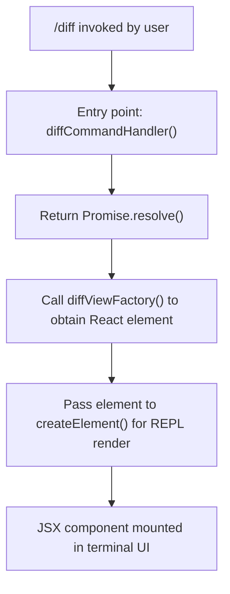

# `/diff`

> Analysis basis: CC v2.1.143 bundle.js (AST extraction + Claude interpretation)
> Minimum version: v2.1.143

---

## Overview

The `/diff` slash command surfaces two categories of diff information within the Claude Code session: uncommitted working-tree changes (i.e., what `git diff` and `git diff --cached` would show) and per-turn diffs that reflect what the AI modified during the current conversation turn. It resolves synchronously via a pre-resolved Promise and renders its output as a JSX component directly in the CLI REPL, rather than printing raw text to stdout.

---

## Registration

| Field | Value |
|---|---|
| type | `local-jsx` |
| name | `diff` |
| description | `View uncommitted changes and per-turn diffs` |
| module\_id | `h7q` |
| loc\_line | `5779` |

Analysis basis: CC v2.1.143 bundle.js:+10546701

---

## Input Branching

The command's call graph is shallow (depth ≤ 2) and contains no conditional branching on user-supplied arguments. The entry-point function resolves immediately and delegates all rendering to a single JSX factory call. Because no argument-conditional literals were found in the depth-2 traversal, no multi-path flowchart applies; the execution path is linear.



Analysis basis: CC v2.1.143 bundle.js:+10546541 (Promise.resolve), +10546571 (diffViewFactory call), +10546590 (createElement call)

---

## Behavioral Spec

### Command Handler Dispatch

The handler for `/diff` follows the `local-jsx` contract: it must return a Promise that resolves to a React element. The implementation satisfies this by wrapping the element construction in an already-resolved Promise, so no async I/O is awaited before the component appears in the REPL.

```
function diffCommandHandler(args, context):
    element = diffViewFactory(context)
    reactNode = createElement(element)
    return Promise.resolve(reactNode)
```

Analysis basis: CC v2.1.143 bundle.js:+10546541, +10546571, +10546590

### JSX Rendering via `local-jsx` Type

Commands registered with `type = "local-jsx"` bypass the plain-text output pipeline. Instead of writing to the terminal buffer directly, the resolved value is treated as a React tree and mounted by the REPL's component host. This allows the diff view to use terminal UI primitives (colors, scrollable regions, keybindings) that are unavailable to plain-text commands.

```
function localJsxDispatcher(command, args, context):
    if command.type == "local-jsx":
        promise = command.handler(args, context)
        node = await promise
        mountReactNode(node)          // hands off to REPL renderer
    else:
        // other dispatch paths (not relevant here)
        ...
```

Analysis basis: CC v2.1.143 bundle.js:+10546590 (createElement invocation confirms JSX path)

### Diff View Construction

<!-- TODO: not found in depth-2 traversal; needs --depth 4 -->

The internal structure of `diffViewFactory` (identifier `S7q`) was reached at call-graph depth 1 but its body was not traversed within the depth-2 limit. Consequently, the exact logic for fetching git diff output, segmenting per-turn changes, and formatting hunks cannot be verified from the current extraction. The following is inferred from the command description and the `local-jsx` rendering contract only:

```
function diffViewFactory(context):
    // Likely behavior (inferred from description — NOT bundle-verified):
    uncommittedDiff = fetchUncommittedChanges()   // git diff + git diff --cached
    perTurnDiff     = fetchPerTurnChanges(context.turnId)
    return buildDiffComponent(uncommittedDiff, perTurnDiff)
```

<!-- TODO: not found in depth-2 traversal; needs --depth 4 -->

---

## State & Side Effects

| Item | Detail |
|---|---|
| Telemetry | None detected — `telemetry` array is empty in the extraction |
| Hook registration | None detected within depth-2 traversal |
| appState changes | <!-- TODO: not found in depth-2 traversal; needs --depth 4 --> |
| Sound | None detected within depth-2 traversal |
| Promise resolution | Synchronous — `Promise.resolve()` is called with an already-constructed value; no async wait |
| Output method | JSX component mounted in REPL (`local-jsx` type); no stdout plain-text emission |

---

## Version History

| Version | Change |
|---|---|
| v2.1.143 | Initial analysis — `local-jsx` registration confirmed; telemetry-free implementation confirmed |

---

## Common Mistakes

1. **Expecting plain-text output in a pipe.** Because `/diff` uses `local-jsx` rendering, its output is a React component tree and will not be emitted as raw text to stdout. Piping the CLI's output to `grep` or other text tools will not capture the diff content produced by this command.
2. **Assuming arguments filter the diff.** No argument-parsing literals were found in the depth-2 traversal. Passing branch names, paths, or `--staged` flags to `/diff` may have no effect; filtering should be performed outside the command if needed.
3. **Expecting telemetry-correlated analytics.** Unlike some other CC commands, `/diff` emits no `tengu_*` telemetry events as of v2.1.143. Dashboards or log pipelines that rely on telemetry events to detect `/diff` invocations will receive no signal from this command.
4. **Confusing per-turn diffs with full git history.** The command description explicitly scopes output to *uncommitted* changes and *per-turn* diffs. Committed history is not surfaced; use standard `git log -p` outside Claude Code for that purpose.

---

## Appendix — Identifier Mapping

> For bundle debugging only. Identifiers change across versions.

| Identifier | Role |
|---|---|
| `mJ7` | Diff command entry-point handler function (implements the `local-jsx` contract: constructs JSX element and returns `Promise.resolve(element)`) |
| `S7q` | Diff view factory function (called by `mJ7`; constructs the React element representing the diff UI; internal body not traversed at depth ≤ 2) |
| `Lx_` | React (or React-compatible) namespace object whose `.createElement` method is used to instantiate the diff component |
| `h7q` | Module identifier for the `diff` command's registration module |