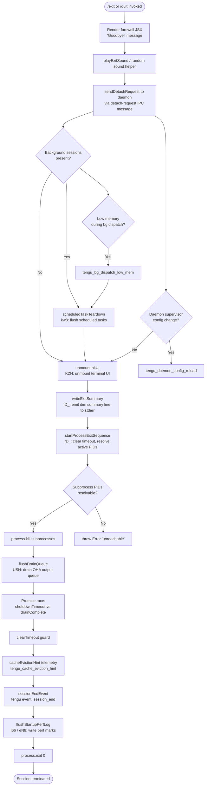

# `/exit`

> Analysis basis: CC v2.1.144 bundle.js (AST extraction + Claude interpretation)
> Minimum version: v2.1.144

---

## Overview

The `/exit` command (also aliased as `/quit`) immediately terminates the Claude Code CLI session. It executes an async handler that renders a farewell JSX element, performs graceful teardown of background sessions and daemon state, flushes telemetry, and finally calls `process.exit`. The command is classified as `immediate`, meaning it fires without entering the normal agent prompt loop.

---

## Registration

| Field | Value |
|---|---|
| type | `local-jsx` |
| name | `exit` |
| description | `null` |
| aliases | `["quit"]` |
| immediate | `true` |
| load_inline | `true` |
| module_id | `cEq` |
| loc_byte | `11666327` |
| loc_byte_end | `11666488` |
| loc_line | `7236` |
| arbor_handler.name | `zh7` |
| arbor_handler.fqn | `claude-2.1.144::zh7` |
| arbor_handler.kind | `AsyncFunction` |
| arbor_handler.resolution_path | `module_id` |
| arbor_handler.n_hits | `1` |

Analysis basis: CC v2.1.144 bundle.js:+11666327

---

## Input Branching

The exit flow has more than three distinct execution branches (graceful teardown path, detach-request path, process kill escalation path, daemon config reload path, and final `process.exit` / `process.kill` path), so a Mermaid flowchart is used.



---

## Behavioral Spec

### 1. Handler Entry (`zh7`)

The main async handler is resolved via `module_id` → `cEq` → exported symbol `zh7`.

```
async function exitCommandHandler(context):
    farewell = renderFarewellComponent()          // BF_.createElement + Oh7/aX
    playExitSound()                               // H: Math.random + setTimeout
    sendDetachRequest(context)                    // vLH
    flushScheduledTasks(context)                  // kw8
    renderFarewellUI(farewell)                    // BF_.createElement at +11665653
    await beginShutdownSequence(context)          // u1
    emit telemetry "prompt_input_exit"            // literal at +11665764
```

Analysis basis: CC v2.1.144 bundle.js:+11665576

---

### 2. Farewell Rendering (`Oh7` / `aX`)

```
function renderFarewellComponent():
    // Constructs a JSX node containing the string "Goodbye!"
    // Literal "Goodbye!" found at +11665540
    return createElement(FarewellWidget, { message: "Goodbye!" })
```

Analysis basis: CC v2.1.144 bundle.js:+11665531, +11665540

---

### 3. Exit Sound Helper (`H`)

```
function playExitSound():
    // Selects a random sound index (Math.random)
    // Uses a fixed pool of size 2 (literals: 2 at +12668349, 1 at +12668365)
    // Fires via setTimeout — non-blocking
    index = Math.floor(Math.random() * 2)
    setTimeout(() => playSoundAtIndex(index), delay)
```

Analysis basis: CC v2.1.144 bundle.js:+12668351, +12668388

---

### 4. Detach-Request IPC (`vLH`)

```
function sendDetachRequest(context):
    // Writes a "detach-request" message (literal at +10141597) to the daemon IPC channel
    // Uses jr (Jr.write) to write the serialized payload
    // CH serializes via JSON.stringify
    // h6H performs post-write bookkeeping
    payload = buildDetachPayload(context)         // $g6 + bLq
    writeToIPC(payload)                           // jr → Jr.write
    postWriteHook()                               // h6H
```

The `bLq` sub-call performs IPC state update (literals `0` at +10136146, `"task"` at +10136190) via `SwH` and `k8`.

Analysis basis: CC v2.1.144 bundle.js:+10141563, +10141582, +10141588, +10141597, +10141643

---

### 5. Scheduled Task Flush (`kw8`)

```
function flushScheduledTasks(context):
    // Registers a "scheduled task" entry (literal at +10135109) via ME → WV
    // Pushes to task queue H.push
    // Delegates to dY7 for per-task scheduling logic
    //   dY7 uses: sE (time-string parser), CI (cron-expression parser),
    //             BFH (date/time arithmetic), Math.max, Date.now, Q9 (duration formatter)
    // Uses Mq for text truncation (H.indexOf, H.substring, M8 string-width, t1)
    registerTask("scheduled task", taskSpec)
    taskList.push(taskSpec)
    scheduledEntries = parseCronExpressions(taskSpec)   // dY7 → sE, CI, BFH
    truncatedLabel = truncateLabel(label)                // Mq → M8, t1
```

Key literal: `"scheduled task"` at +10135109; time-string parser constants: `5` (+4715339), `10` (+4715493), `30` (+14542089), `"Every minute"` (+4715423), `"Every hour"` (+4715640).

Analysis basis: CC v2.1.144 bundle.js:+11665623, +10135090, +10135095, +10135136

---

### 6. Terminal UI Unmount (`KZH`)

```
function unmountInkUI():
    // Writes a terminal reset escape sequence via IzH.writeSync
    // Reads the active Ink instance from Z4.get
    // Calls H.unmount() on the Ink root
    // Runs DS (display state cleanup)
    // Calls _s6 for terminal-mode restoration:
    //   - Ht.writeSync: flush final bytes
    //   - PGH: save/restore cursor (ESC-7 / ESC-8 at +3670757/+3670768)
    //           checks for Ghostty >= 1.2.0 and iTerm2 >= 3.6.6 compatibility
    //   - wGH: additional terminal state cleanup
    //   - m0: replace tmux/screen escape sequences (literals "tmux" +3328598, "screen" +3328671)
    // xH: convert value to String
    writeTerminalReset()
    inkInstance = getInkInstance()
    inkInstance.unmount()
    restoreTerminalMode()        // _s6
```

Analysis basis: CC v2.1.144 bundle.js:+5247335, +5247361, +5247412, +5247446, +5247494, +5247501

---

### 7. Exit Summary Writer (`iD_`)

```
function writeExitSummary(context):
    // Reads TV (token/cost counter), qR (request count)
    // Resolves I6 → WV (config accessor)
    // Calls Lz6 for file-path resolution (FU, i$, q_, Nw.join, m6, q.statSync)
    // Calls n3 → I6, DL for additional metadata
    // Replaces escape characters in output (_.replaceAll, literals "\\\\" +5247723, "\\\"" +5247746)
    // Uses b99 for formatting
    // Writes dim-styled summary line to stderr (IzH.writeSync, z6.dim)
    summary = buildSummary(tokens=TV, requests=qR, config=I6)
    sanitized = summary.replaceAll("\\", "\\\\").replaceAll('"', '\\"')
    stderr.writeSync(dim(sanitized))
```

Analysis basis: CC v2.1.144 bundle.js:+5247635, +5247642, +5247657, +5247666, +5247686, +5247705, +5247804, +5247820

---

### 8. Process Exit Sequencer (`rD_`)

```
function startProcessExitSequence():
    clearTimeout(activeGuardTimer)
    inkInstance = Z4.get()
    // Resolves all known subprocess PIDs
    // Sends SIGTERM / SIGKILL as appropriate
    // Falls back to process.kill if individual kills unavailable
    // Throws Error("unreachable") (literal at +5248085) if PID map is invalid
    for pid in resolvedPIDs:
        try:
            process.kill(pid, signal)
        catch:
            pass
    process.exit(0)             // +5248012
```

Analysis basis: CC v2.1.144 bundle.js:+5247931, +5247964, +5248012, +5248037, +5248079, +5248085

---

### 9. Shutdown Sequence Orchestrator (`u1`)

```
async function beginShutdownSequence(context):
    unmountInkUI()                            // KZH
    writeExitSummary(context)                 // iD_
    startProcessExitSequence()                // rD_

    timeout_ms = Math.max(5000, 3500)         // literals +5249577, +5249584
    timer = setTimeout(forceExit, timeout_ms)
    vzH.unref(timer)                          // prevent timer from blocking Node event loop

    await flushDrainQueue()                   // USH → OHA.drain

    result = await Promise.race([
        shutdownCompletion(),                 // Y: supervisor + heartbeat stop
        AbortSignal.timeout(timeout_ms)       // +5249839
    ])

    clearTimeout(timer)
    await cacheEvictionHint()                 // q → ZA8
    await flushStartupPerfLog()               // l66 → eN8
    emitSessionEnd()                          // EA8, literal "session_end" +5249948
    IzH.writeSync(finalNewline)               // +5250017
```

Timeout constants: 5000 ms upper bound (+5249577), 3500 ms lower bound (+5249584).

Analysis basis: CC v2.1.144 bundle.js:+5249480, +5249510, +5249531, +5249548, +5249554, +5249560, +5249568, +5249577, +5249584, +5249593, +5249673, +5249697, +5249751, +5249774, +5249822, +5249839, +5249875, +5249888, +5249900, +5249911, +5249991, +5250017

---

### 10. Supervisor / Heartbeat Stop (`Y`)

```
async function stopSupervisorAndHeartbeat(context):
    await flushSessionLog(dJH)               // writes session log via q.write
    supervisor = f.get("supervisor")         // literal +14555524
    supervisor.stop()                        // +14555792
    heartbeatTimer = vAK()                   // literal "heartbeat" +14554746
    heartbeatTimer.stop(); heartbeatTimer.updateConfig(); heartbeatTimer.start()
    // Cleans up active spinners via f.delete, Z.stop
    await _Nq(summaryData)                   // stats renderer: Object.keys, Math.max, wO
    f.set(key, value)
    V.start()
    await d()
```

Analysis basis: CC v2.1.144 bundle.js:+14555499, +14555516, +14555718, +14555772, +14555792, +14555801, +14555912, +14555921, +14555939, +14556041, +14556086, +14556097, +14556315

---

### 11. Startup Performance Log Flush (`l66` / `eN8`)

```
function flushStartupPerfLog():
    // Checks if startup profiling is enabled (literal "Startup profiling not enabled" +209758)
    // Resolves perf_hooks module via cx → require (literal "perf_hooks" +209077)
    // Collects performance marks (literal "mark" +210633, "startup-perf" +210527)
    // Formats 80-char wide report (literal 80 at +209911, "STARTUP PROFILING REPORT" +209923)
    // Writes via M_H (f_H.openSync, writeFileSync, fsyncSync, closeSync)
    // Emits tengu_startup_perf telemetry
    // Max entry size: 1048576 bytes (+211110)
    if not profilingEnabled: return
    marks = perf_hooks.getEntriesByType("mark")
    report = formatReport(marks, width=80)
    atomicWrite(reportPath, report)           // M_H
    emit("tengu_startup_perf", report)
```

Analysis basis: CC v2.1.144 bundle.js:+210252, +210267, +210344, +209758, +209923, +211110

---

### 12. Session-End Telemetry (`EA8`)

```
function emitSessionEndTelemetry(context):
    // Reads TV (scroll/token summary), C99 (cost accumulator), d (session data)
    // Calls R99 for final metrics roll-up (Date.now, Math.max, Math.round, Object.assign, S99)
    // Calls aA for display-mode classification:
    //   - dRH: checks TNK for "local-agent" feature flag (+3336254)
    //   - vq_: Cq + xH conversions
    //   - Ql → QxL: renders fullscreen/default mode label (literals "fullscreen" +3336799, "default" +3336825)
    //   - Iq_: c6 + Boolean coercion
    //   - B_ → Du: additional event metadata
    //   - dxL → P6, aA → P6: config persistence
    //   - emits tengu_amber_creek (+3336982) and tengu_pewter_brook (+3336890)
    // Emits event "session_end" (literal +5249948)
    metrics = rollUpMetrics(TV, C99, d)      // R99
    displayMode = classifyDisplayMode()      // aA
    emit("session_end", metrics, displayMode)
```

Analysis basis: CC v2.1.144 bundle.js:+5248866, +5248872, +5248878, +5248907, +5248924, +5249948

---

### 13. Background Session Dispatch Helpers (`w`, `D`, `bH`, `kH`)

These are called transitively through the detach-request and spare-pool paths, not directly by the exit handler, but they appear in the depth-2 call graph:

```
// w: background session worker
//   - Reads session map via A.get / A.values
//   - Sends SIGKILL after 30 s / 15 s grace periods (literals +14542089, +14542100)
//   - Reports tengu_bg_dispatch_sigkill_escalate when escalating
//   - Checks freemem via nE8.freemem, reports tengu_bg_dispatch_low_mem
//   - Manages spare pool: tengu_bg_spare_enable, tengu_bg_spare_claim, tengu_bg_spare_claim_fail, tengu_bg_spare_spawn
//   - Uses DU.spawn for new background processes
//   - Tracks version string "2.1.144" (+14543176) and issue URL (+14543203)

// D: daemon state cleaner
//   - Calls P6 (config persistence), $.dispose, fT6, nE8.freemem
//   - Handles "windows" platform path (+14541714)
//   - Uses 2000 ms grace timeout (+14541844)
//   - Recursively calls D for nested cleanup
//   - Emits tengu_bg_spare_spawn via kH
```

Analysis basis: CC v2.1.144 bundle.js:+14542134, +14542444, +14542713, +14543176, +14541548, +14541714, +14541844

---

## State & Side Effects

| Item | Detail |
|---|---|
| Telemetry — `tengu_bg_dispatch_sigkill_escalate` | Fired when a background session worker escalates to SIGKILL (loc +14542134) |
| Telemetry — `tengu_bg_dispatch_low_mem` | Fired when free memory is critically low during background dispatch (loc +14542713) |
| Telemetry — `tengu_bg_spare_enable` | Fired when the spare background-process pool is activated (loc +14543352) |
| Telemetry — `tengu_bg_spare_claim` | Fired when a spare process is successfully claimed (loc +14543473) |
| Telemetry — `tengu_bg_spare_claim_fail` | Fired when spare-pool claim fails (loc +14543736) |
| Telemetry — `tengu_bg_spare_spawn` | Fired when a new spare process is spawned (loc +14541911) |
| Telemetry — `tengu_daemon_config_reload` | Fired when daemon config is reloaded during supervisor teardown (loc +14556317) |
| Telemetry — `tengu_startup_perf` | Fired with startup profiling report if profiling was enabled (loc +211456) |
| Telemetry — `tengu_scroll_summary` | Fired with scroll/token summary during session-end EA8 handler (loc +5248880) |
| Telemetry — `tengu_amber_creek` | Fired during session-end display-mode classification in `aA` (loc +3336982) |
| Telemetry — `tengu_pewter_brook` | Fired during session-end config persistence in `aA` (loc +3336890) |
| Telemetry — `tengu_cache_eviction_hint` | Fired during shutdown cleanup prior to `process.exit` (loc +5249913) |
| Telemetry — `session_end` | Primary session-end event, literal at +5249948 |
| Telemetry — `prompt_input_exit` | Fired in zh7 immediately after exit is triggered, literal at +11665764 |
| Ink UI unmount | `H.unmount()` called via `KZH`; terminal reset escape written to stdout |
| Terminal mode restoration | `_s6` restores cursor, handles tmux/screen/Ghostty/iTerm2 escape sequences |
| Subprocess teardown | `rD_` kills all tracked subprocesses via `process.kill`; falls back to `process.exit` |
| IPC detach | `vLH` sends `"detach-request"` message to daemon via `jr` / `Jr.write` |
| Timer management | `vzH.unref()` prevents shutdown timer from blocking event-loop exit; `clearTimeout` called before `process.exit` |
| Startup perf log | `l66` / `eN8` / `M_H` atomically flush performance marks to disk if profiling was enabled |
| Sound | `H` (sound helper): random sound played via `setTimeout` — non-blocking, does not delay exit |
| `process.exit` | Called inside `rD_` at +5248012; code `0` (graceful) |

---

## Version History

| Version | Change |
|---|---|
| v2.1.144 | Initial analysis |

---

## Common Mistakes

1. **Using `/exit` mid-task expecting resumption** — because `immediate: true` fires the handler before the agent loop, any in-flight tool calls or partial responses are discarded without confirmation. Use `/clear` if you want to reset without fully quitting.
2. **Expecting instant termination** — the handler is async and runs a graceful drain sequence with a `Math.max(5000, 3500)` ms timeout (effectively 5000 ms) before `process.exit`. If background sessions are active, teardown may take noticeably longer.
3. **Assuming `/quit` behaves differently** — `/quit` is a registered alias for `/exit` and executes the exact same handler (`zh7`). There is no behavioral difference.
4. **Expecting console output after the command** — the Ink UI is unmounted and terminal state is restored during teardown. Any output written after unmount goes through raw `IzH.writeSync` / `Ht.writeSync` on stderr, not through the normal Ink render path.
5. **Relying on startup performance data being present** — the startup profiling log is only flushed if profiling was enabled at startup; the handler silently no-ops with the message `"Startup profiling not enabled"` (+209758) if the feature was off.

---

## Appendix — Identifier Mapping

> For bundle debugging only. Identifiers change across versions.

| Identifier | Role |
|---|---|
| `zh7` | Main exit command handler (AsyncFunction; arbor_handler) |
| `G9` | Process-mode resolver (reads "bg", "daemon", "daemon-worker" literals) |
| `JMH` | Mode-string classifier called by G9 |
| `H` | Exit sound player (Math.random + setTimeout) |
| `vLH` | Detach-request IPC sender |
| `$g6` | Detach payload builder |
| `bLq` | IPC state updater (task type, status 0) |
| `SwH` | IPC state sub-helper called by bLq |
| `k8` | IPC state sub-helper called by bLq |
| `jr` | IPC channel writer (Jr.write) |
| `CH` | JSON serializer wrapper (JSON.stringify) |
| `h6H` | Post-IPC-write bookkeeping hook |
| `sf` | Unknown utility called in zh7 post-detach (<!-- TODO: not found in depth-2 traversal; needs --depth 4 -->) |
| `kw8` | Scheduled task flusher |
| `ME` | Task registration helper (calls WV config accessor) |
| `WV` | Configuration value accessor |
| `dY7` | Per-task scheduler (time-parse + cron arithmetic) |
| `sE` | Cron/time-string parser (parseInt, K.match, L.match, date methods) |
| `K` | Cron field padder (L.map, f.padEnd) |
| `w` | Background session worker process manager |
| `L` | Async task lifecycle tracker (q.add/delete, f.finally) |
| `J` | Active-session killer (A.values, y.kill) |
| `D` | Daemon state cleaner (recursive, platform-aware) |
| `$` | NVq-backed disposable resource handle |
| `j` | Date-arithmetic helper (UTC day/date/hours operations) |
| `CI` | Cron-expression tokenizer (H.trim, dA4, A.push) |
| `dA4` | Cron field parser (H.split, L.match, parseInt, K.add, Array.from) |
| `A` | Lowercase-normalizing string collection |
| `BFH` | Date/time interval calculator (setSeconds/Minutes/Hours/Date/Month) |
| `O` | Date object wrapper (k8-backed) |
| `f` | Closeable resource pair (A.close, q.close, L) |
| `q` | Temp-file manager (t_K.unlinkSync) |
| `Q9` | Duration formatter (Math.floor + Math.round) |
| `Mq` | Label truncator (H.indexOf, H.substring, M8, t1) |
| `M8` | String visual-width measurer (Bun.stringWidth) |
| `t1` | String-width wrapper with grapheme support (M8, oO) |
| `oO` | Grapheme iterator helper |
| `Oh7` | Farewell JSX component renderer (calls aX) |
| `u1` | Shutdown sequence orchestrator (async, main teardown coordinator) |
| `KZH` | Ink UI unmounter and terminal reset writer |
| `DS` | Display-state cleanup after unmount |
| `_s6` | Terminal mode restorer (cursor save/restore, tmux/screen escapes) |
| `PGH` | Terminal compatibility checker (Ghostty, iTerm2 version gates) |
| `wGH` | Terminal state sub-cleanup |
| `m0` | tmux/screen escape-sequence replacer (H.replaceAll) |
| `xH` | Value-to-String coercer |
| `iD_` | Exit summary writer (tokens, cost, dim stderr output) |
| `TV` | Token/scroll counter state |
| `qR` | Request counter state |
| `I6` | Config value getter (calls WV) |
| `Lz6` | File-path resolver for summary output (FU, i$, q_, Nw.join, m6, q.statSync) |
| `FU` | Config-path helper (calls WV) |
| `q_` | Secondary config-path helper (calls WV) |
| `m6` | File existence checker |
| `n3` | Metadata resolver (I6, DL) |
| `DL` | Metadata sub-resolver (h1) |
| `b99` | Summary format helper |
| `rD_` | Process exit sequencer (clearTimeout, process.kill, process.exit) |
| `USH` | Output drain-queue flusher (OHA.drain) |
| `Y` | Supervisor and heartbeat stop coordinator |
| `dJH` | Session log flusher (n9, A8, LQ_, GH, f9, KQ_, Object.keys, K.has) |
| `n9` | AsyncLocalStorage store reader (viL.getStore) |
| `A8` | Session metadata accessor |
| `LQ_` | Log-queue drainer (calls KQ_) |
| `GH` | String coercer for log fields (String) |
| `_Nq` | Stats summary renderer (Object.keys, Math.max, wO) |
| `T` | Input-event interceptor (u.preventDefault, LW, Y, H) |
| `LW` | User-settings state accessor (g_) called from T |
| `Z` | Spinner/display controller (stop, updateConfig, start) |
| `vAK` | Heartbeat timer factory (xs) |
| `xs` | Heartbeat implementation |
| `V` | Secondary timer/animation controller |
| `d` | Generic async finalizer called in multiple places |
| `l66` | Startup performance log flush entry point (eN8, w_A) |
| `eN8` | Performance marks collector and telemetry emitter (tengu_startup_perf) |
| `cx` | Dynamic `require()` wrapper |
| `w_A` | Perf report path resolver and atomic writer (X_A, M_H, O_A, v) |
| `X_A` | Path join helper for startup-perf output (YN6.join, n8, I6) |
| `M_H` | Atomic file writer (openSync, writeFileSync, fsyncSync, closeSync) |
| `O_A` | Perf entry formatter (cx, A.push, _.entries, ON6, _.at, Mc, A.join) |
| `v` | Telemetry event dispatcher (B66, vfK, CH, toUpperCase, sv, YhH, yfK) |
| `EA8` | Session-end telemetry emitter (TV, C99, d, R99, aA) |
| `C99` | Cost accumulator state |
| `R99` | Final metrics roll-up (Date.now, Math.max, Math.round, Object.assign, S99) |
| `S99` | Metrics sub-aggregator |
| `aA` | Display-mode classifier and config persister (dRH, vq_, xH, Ql, Iq_, B_, dxL, P6; emits tengu_amber_creek, tengu_pewter_brook) |
| `dRH` | Feature-flag checker (TNK.has, "local-agent") |
| `vq_` | Mode string converter (Cq, xH) |
| `Ql` | Display-mode label renderer (QxL) |
| `Iq_` | Boolean coercion helper (c6, Boolean) |
| `B_` | Event metadata builder (Du) |
| `dxL` | Config persistence helper (P6) |
| `P6` | Configuration write/persist (f56, M56, Cs, T$H.has, Vr6, K56.add, vF.has/get, y6) |
| `wH6` | Post-exit-sequence hook (<!-- TODO: not found in depth-2 traversal; needs --depth 4 -->) |
| `ZA8` | Cache eviction hint coordinator (Promise.all, Promise.resolve, zI, RF, H, _, Promise.race, r8) |
| `r8` | Timeout-with-abort helper (K, Error, q, setTimeout, O, clearTimeout, L.unref) |

---

Note: index built via Arbor fallback; some signals (telemetry, literals) may be missing — see arbor-fallback.js.