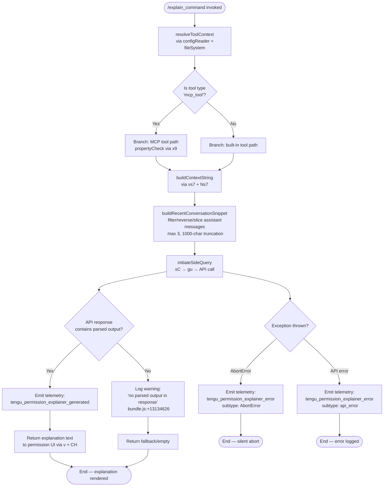

# `/explain_command`

> Analysis basis: CC v2.1.144 bundle.js (AST extraction + Claude interpretation)
> Minimum version: v2.1.144

---

## Overview

`/explain_command` is an internal tool-type command that generates a human-readable explanation for a pending tool-use permission request. It invokes the AI backend (via a dedicated "side query") to produce a natural-language rationale describing what a specific tool call does and why it requires the permission it is asking for. The output is surfaced to the user in the permission-prompt UI so they can make an informed allow/deny decision.

---

## Registration

| Field | Value |
|---|---|
| type | `tool` |
| name | `explain_command` |
| description | `null` |
| loc_byte | `13133796` |
| loc_byte_end | `13133832` |
| loc_line | `9546` |
| arbor_handler.name | `UQq` |
| arbor_handler.fqn | `claude-2.1.144::UQq` |
| arbor_handler.kind | `AsyncFunction` |
| arbor_handler.resolution_path | `direct` |
| arbor_handler.n_hits | `1` |

Analysis basis: CC v2.1.144 bundle.js:+13133796

---

## Input Branching

The handler (`UQq`) exhibits four or more distinct execution paths depending on tool type, API response content, abort signal, and API error class. A Mermaid flowchart is used.



Analysis basis: CC v2.1.144 bundle.js:+13133491 (handler entry), +13134329 (mcp_tool branch), +13134381 (side query label), +13134626 (no-output warning), +13134949 (AbortError literal), +13135020 (api_error literal)

---

## Behavioral Spec

### 1. Handler Entry — `mainHandler` (`UQq`)

```
async function mainHandler(toolInput, appContext):
    startTime = Date.now()                          // bundle.js:+13133515

    // 1. Read current config and file-system context
    configAndFsContext = await resolveConfigAndFs(appContext)   // Ri_ → y6

    // 2. Determine tool provenance
    isMcpTool = checkIfMcpTool(toolInput)           // x9, bundle.js:+13134329
        // x9 checks Object.hasOwn and H.startsWith for 'mcp_tool' marker

    // 3. Build context string for the side query
    contextString = buildContextString(toolInput, isMcpTool)   // vs7 + CH

    // 4. Assemble recent conversation snippet
    snippet = buildConversationSnippet(appContext.messages)     // Ns7

    // 5. Fire side query to Claude API
    try:
        response = await fireSideQuery(contextString, snippet, appContext)  // v9 → sC

        // 6. Extract explanation from response
        if response has parsed explanation text:
            emit telemetry("tengu_permission_explainer_generated")  // +13134279
            return formatExplanation(response)      // v + CH, bundle.js:+13133894
        else:
            log("Permission explainer: no parsed output in response")  // +13134626
            return fallbackExplanation()

    catch AbortError:
        emit telemetry("tengu_permission_explainer_error", {type: "AbortError"})  // +13134949
        return null

    catch apiError:
        emit telemetry("tengu_permission_explainer_error", {type: "api_error"})   // +13135020
        return null
```

Analysis basis: CC v2.1.144 bundle.js:+13133491

---

### 2. Config + File-System Resolution — `resolveConfigAndFs` (`Ri_` → `y6` → `V$H`)

```
async function resolveConfigAndFs(appContext):
    // y6 orchestrates file-system helpers
    configData = readConfigFile()                    // V$H → q.readFileSync (utf-8), +3166887
    if configData access attempted before allowed:
        throw Error("Config accessed before allowed.")  // +3166831

    parsedConfig = parseJson(configData)             // b6 → JSON.parse
    normalizedConfig = normalizeConfigFields(parsedConfig)  // TR → H.startsWith / H.slice

    // Backup management
    backupDir = resolveBackupDir(configDir)          // GV1 → fY.basename / L9_ / readdirStringSync
    //   backupDir label: "backups" (+3166399)

    // File-stat for existence check
    stat = q.statSync(configPath)                    // +3167428

    // Ensure backup directory exists (EEXIST tolerated)
    q.mkdirSync(backupDir)                           // +3167647

    // Enumerate directory for backup rotation
    entries = q.readdirStringSync(backupDir)         // +3167705
    filteredEntries = entries.filter(e => e.startsWith(...))  // +3167740

    // Copy current config to timestamped backup
    backupPath = fY.join(backupDir, Date.now() + suffix)    // +3167859 / +3167958
    q.copyFileSync(configPath, backupPath)           // +3167976

    return { config: normalizedConfig, backupPath }
```

Errors: `"ENOENT"` (+3167061) and `"EEXIST"` (+3167682) are handled gracefully.
Config status literals observed: `"unknown"`, `"local"`, `"migrated"`, `"native"`, `"installed"`, `"disabled"`, `"enabled"`, `"no_permissions"`, `"global"`, `"not_configured"` (bundle.js:+3162528–+3162755).

Analysis basis: CC v2.1.144 bundle.js:+13133367 (Ri_ call site), +3163715 (y6 body), +3166825 (V$H body)

---

### 3. Context String Construction — `buildContextString` (`vs7`)

```
function buildContextString(toolInput, isMcpTool):
    // Serialize tool input object to stable string
    serialized = JSON.stringify(toolInput)         // CH → JSON.stringify, +181400
    //   CH used at +13134087
    label = String(toolInput.name ?? "")           // +13133027
    return formatContextBlock(label, serialized, isMcpTool)
```

The MCP-tool branch (`x9`) inspects `Object.hasOwn` and a `"mcp_tool"` string prefix (literal at +3118074) to distinguish MCP tools from built-in tools.

Analysis basis: CC v2.1.144 bundle.js:+13133536

---

### 4. Conversation Snippet Assembly — `buildConversationSnippet` (`Ns7`)

```
function buildConversationSnippet(messages):
    // Keep only assistant messages
    assistantMessages = messages.filter(m => m.role === "assistant")
    //   literal "assistant" at +13133090

    // Reverse chronological order for recency
    recent = assistantMessages.reverse()           // A.reverse, +13133135

    // Take up to 3 most-recent messages (literal 3 at +13133110)
    topN = recent.slice(0, 3)

    // Truncate each to 1000 characters (literal 1000 at +13133055)
    truncated = topN.map(m => {
        text = extractTextContent(m)               // kind "text" literal +13133193
        return text.slice(0, 1000)
    })

    // Prepend "..." separator between entries (literal "..." at +13133291)
    result = truncated
    result.unshift("...")                          // q.unshift, +13133299
    return result.join("\n")                       // q.join, +13133332
```

Maximum snippet length: 3 messages × 1000 characters each (bundle.js:+13133110, +13133055).

Analysis basis: CC v2.1.144 bundle.js:+13133554

---

### 5. Side Query Execution — `fireSideQuery` (`v9` → `sC` → `gu`)

```
async function fireSideQuery(contextString, snippet, appContext):
    // Build the side-query request object (v9 → Ua → oB)
    queryPayload = buildQueryPayload(contextString, snippet)
    //   oB resolves model alias, subscription tier (aB/DMH/sxH),
    //   and normalises model ID via zq (trim/toLowerCase + alias map)

    // Model aliases observed:
    //   "opusplan", "sonnet", "haiku", "opus", "best" (+2163852–+2164008)
    //   "claude-opus-4-*", "claude-sonnet-4-*", "claude-haiku-4-*",
    //   "claude-3-7-sonnet", "claude-3-5-sonnet", etc.

    // Dispatch via API client (sC)
    //   sC resolves auth (gu → E__ OAuth refresh path)
    //   sets headers: User-Agent, X-Claude-Code-Session-Id,
    //                 x-client-app, x-claude-code-agent-id, etc.
    //   side_query label applied (+12420011)
    response = await sC(queryPayload, appContext.signal)

    return response
```

The side query is labelled `"side_query"` (literal at +12420011) to distinguish it from the main conversation stream. Auth flow (`gu` / `E__`) includes OAuth token refresh with distributed-lock retry logic.

Analysis basis: CC v2.1.144 bundle.js:+13133701

---

### 6. MCP Tool Property Check — `mcpToolPropertyCheck` (`x9`)

```
function mcpToolPropertyCheck(toolInput):
    // Verify the tool descriptor carries expected own properties
    hasExpected = Object.hasOwn(toolInput, expectedKey)   // +3117994
    hasMcpPrefix = toolInput.name.startsWith(...)         // +3118046
    return hasExpected && hasMcpPrefix
```

The string `"mcp_tool"` (literal at +3118074) is the discriminant used to select the MCP-specific explanation path.

Analysis basis: CC v2.1.144 bundle.js:+13134329

---

## State & Side Effects

| Item | Detail |
|---|---|
| Telemetry: `tengu_permission_explainer_generated` | Fired on successful explanation generation (bundle.js:+13134279) |
| Telemetry: `tengu_permission_explainer_error` | Fired on `AbortError` (+13134949) or `api_error` (+13135020) with subtype field |
| Telemetry: `tengu_api_success` | Fired by API layer (`sC`) on successful HTTP response (+12421435) |
| Telemetry: `tengu_config_parse_error` | Fired by config reader (`V$H`) on JSON parse failure (+3167468) |
| Telemetry: `tengu_config_auth_loss_prevented` | Fired when backup write detects auth fields would be lost (+3162224) |
| Telemetry: `tengu_oauth_token_refresh_*` | Full family of OAuth lock/retry/release events fired by `E__` during auth setup |
| Config backup | `resolveConfigAndFs` (`V$H`) writes a timestamped backup copy via `q.copyFileSync` before any config mutation (bundle.js:+3167976) |
| File-system side effects | `q.mkdirSync` for backup directory (EEXIST tolerated, +3167647); `q.readdirStringSync` for rotation enumeration (+3167705) |
| Hook registration | `h1` registers a hook via `OHA.register` (bundle.js:+57049) during the file-watcher setup path (`fCL`) |
| File watcher | `fCL` calls `xr6.watchFile` (+3163227) and `xr6.unwatchFile` (+3163554) around config reads |
| appState changes | None directly from this command; explanation text is returned as a value for the permission UI to render |
| Sound | None observed |

---

## Version History

| Version | Change |
|---|---|
| v2.1.144 | Initial analysis |

---

## Common Mistakes

1. **Treating this as a user-facing slash command**: `/explain_command` has type `tool` and is invoked programmatically by the permission-prompt subsystem, not typed manually by the user. It will not appear in the `/help` listing as a normal slash command.
2. **Expecting a description field**: `registration.description` is `null`. The command is self-describing through its name and the literals `"permission_explainer"` / `"permission_explainer_generate"` embedded in its telemetry.
3. **Assuming it always returns text**: If the API response contains no parsed output, the command logs a warning and returns a fallback rather than throwing. Callers must handle a null/empty explanation gracefully.
4. **Ignoring the 3-message / 1000-character snippet limit**: The conversation context passed to the side query is deliberately truncated. Very long assistant turns are silently clipped, which may reduce explanation quality for complex tool calls late in a long session.
5. **Conflating MCP and built-in tool paths**: The `x9` check gates a separate explanation branch for `mcp__`-prefixed tool names. Passing a built-in tool descriptor into the MCP path (or vice versa) will produce incorrect context strings.

---

## Appendix — Identifier Mapping

> For bundle debugging only. Identifiers change across versions.

| Identifier | Role |
|---|---|
| `UQq` | Main async handler for `explain_command` (arbor: direct, fqn `claude-2.1.144::UQq`) |
| `Ri_` | Config-and-context resolver entry point (called first from `UQq`) |
| `y6` | File-system orchestrator (reads config, manages backups) |
| `m6` | Logging/debug helper used throughout file-system layer |
| `t1_` | Config state accessor |
| `V$H` | Config file reader + backup writer (readFileSync, mkdirSync, copyFileSync) |
| `b6` | JSON-parse wrapper |
| `TR` | Config field normaliser (startsWith / slice) |
| `A8` | Config field setter helper |
| `GV1` | Backup-directory resolver (basename, readdirStringSync, statSync) |
| `L9_` | Path join helper for backup directory |
| `v` | Response formatter / output serialiser |
| `kH` | Error-logging helper (logError via Sc) |
| `d` | General-purpose utility (used in multiple sub-graphs) |
| `w` | Background-session process manager (daemon side-effect path) |
| `fCL` | File-watcher setup/teardown around config reads |
| `Rl` | Config reload trigger |
| `h1` | Hook-registration helper (OHA.register) |
| `vs7` | Context-string builder for explanation prompt |
| `CH` | JSON.stringify wrapper |
| `Ns7` | Conversation snippet assembler (filter/reverse/slice/join) |
| `H` | Generic variable (context-dependent — random/setTimeout in one callsite) |
| `A` | Generic array variable (toLowerCase in one callsite) |
| `f` | Generic variable (A.close / q.close lifecycle) |
| `L` | Generic variable (q.add / f.finally lifecycle) |
| `v9` | Side-query payload builder entry |
| `Ua` | Query payload composer (GV, i8H, qA, oB) |
| `GV` | Provider/model selector helper |
| `i8H` | Request metadata builder |
| `oB` | Model-alias resolution and query object assembly |
| `M` | Provider-map lookup helper |
| `K` | Padding/formatting helper |
| `SB6` | Subscription-tier property extractor (Object.entries) |
| `rxH` | Model include-list checker |
| `leA` | Model index/alias locator |
| `$3L` | Model string includes-checker |
| `vAH` | Model IAH include-list checker |
| `zq` | Model-ID normaliser (trim/toLowerCase/alias replace) |
| `O3L` | Model selector with startsWith discrimination |
| `Mj` | Side-query dispatch wrapper |
| `BP` | Query builder (assembles e_, aB, DMH, sxH, oV, EX, dM, JA, wM, aV) |
| `e_` | Request constructor (KJ, xR, CA) |
| `aB` | Max-plan tier handler (Oq) |
| `DMH` | Team-plan tier handler (Oq, Ws) |
| `sxH` | Enterprise-plan tier handler (Oq, fw1) |
| `oV` | Request option resolver (dM, wM) |
| `EX` | Extended request builder (yAH, SAH, JA, e_, Oq) |
| `dM` | JA-delegating detail builder |
| `JA` | Core request-object constructor (xH) |
| `wM` | Message wrapper builder (vSH, b5L, ncA, yB6, JA) |
| `aV` | Alternative request builder (dM, wM) |
| `sC` | API client dispatcher (gu, X, FF7, etc.) |
| `gu` | Main API request executor (auth, headers, streaming) |
| `sD` | Async-local-storage store getter |
| `fvL` | Request URL/path parser |
| `G9` | Background-context reader (JMH) |
| `Il` | Session-store reader (In6) |
| `In6` | Xw1 store getter |
| `I6` | WV initialiser |
| `xH` | String coercion helper |
| `JM` | Streaming/HTTP request manager (E__) |
| `E__` | OAuth token refresh orchestrator (lock/retry/release) |
| `YO` | Auth-change detector |
| `KvL` | Request context builder (cJ, RmH) |
| `cJ` | Context-object constructor |
| `RmH` | Request timing/metadata recorder (OI, _w1, Date.now) |
| `Z_` | Session-ID resolver |
| `Im6` | Proxy-auth helper resolver |
| `z2H` | String xH-based normaliser |
| `uRA` | Alt-z2H normaliser |
| `FsK` | parseInt/Number.isNaN timeout parser |
| `CR` | Credential resolver |
| `zX` | URL replacement helper (vPH) |
| `OvL` | Request lifecycle manager (streaming, retry, debounce) |
| `i5` | Context injector |
| `zvL` | Header sanitiser (authorization, anthropic-beta, x-anthropic-) |
| `$vL` | Response header extractor (Cq, xH, P6) |
| `f__` | Math.max / Number coercion helper |
| `MvL` | Streaming debounce/watchdog timer |
| `oD` | Response-object builder (kB6, R5L, JA, NB6) |
| `kB6` | Response-message constructor (JA, xH) |
| `R5L` | Response prefix checker (H.startsWith) |
| `NB6` | Response normaliser (toLowerCase, Object.values) |
| `Kz` | Credential/key resolver (xH, CR, nc, zb6, mRA) |
| `nc` | URL parsing / proxy credential extractor |
| `zb6` | Proxy helper loader (gy, ju) |
| `mRA` | Proxy-auth metadata resolver |
| `LvL` | Tool-result formatter ($n6, EV, gSH, MXH, f1) |
| `$n6` | Tool content block builder (VX, v9, W9, EV) |
| `EV` | Content block encoder |
| `gSH` | Tool-output sanitiser |
| `MXH` | Tool-name prefix matcher (y4K.find, H.startsWith, eI6) |
| `f1` | OAuth URL validator (K$A, INK, MR6.includes) |
| `WMH` | Gateway JWT refresh manager (qOL, BI6) |
| `II8` | Gateway token expiry checker |
| `qOL` | Gateway refresh HTTP poster (HuH.post, L61, K61, Date.now) |
| `BI6` | Background refresh scheduler |
| `VI8` | Timestamp recorder (Date.now) |
| `M76` | Header key normaliser (Object.entries, q.toLowerCase) |
| `M$H` | SDK error/warn logger (console.error) |
| `S` | Away-summary generator (uF, N, V, xnq) |
| `uF` | Away-summary helper |
| `N` | Away-summary inner logic (v, Date.now, g$8, j65, bH) |
| `V` | Rate-limit checker |
| `xnq` | Away-summary post-processor |
| `Z` | Conversation state reader |
| `W` | Skills/tool-list debounce emitter (z, clearTimeout, setTimeout, AOH, AFH) |
| `z` | Daemon RH/bH/BN/Xx router |
| `AOH` | Config-change broadcaster (Y4, R2, K.map) |
| `AFH` | Active-tool presence checker (H.some) |
| `pz8` | Skills metadata helper |
| `D6H` | Tool display helper (pqH, zz8, ha9) |
| `$rH` | Kz8 set clear helper |
| `aw` | Agent runner (n$) |
| `n$` | Agent execution core (SK, OI, D76, cJ, SSH, xH, y6, sy) |
| `$I` | Agent initialiser (uB6, SK, J1H, tc, OI, xH) |
| `uB6` | TAH-based tool registry loader |
| `SK` | Tool-context constructor (xH) |
| `J1H` | Agent-job header builder (xH, cRH) |
| `tc` | OAuth token-file-descriptor reader (Q5L, KlA) |
| `OI` | Orchestrator initialiser (SK, V8, qA) |
| `MuH` | WIF/federated-identity credential resolver (yg6, RH, bH, MOL) |
| `yg6` | WIF token-exchange HTTP client (d9, OOL, TAH, fetch) |
| `RH` | Feature-ok telemetry emitter (d) |
| `bH` | Feature-bad telemetry emitter (d) |
| `MOL` | WIF error classifier (_.includes) |
| `G` | Token store (P26, bE8) |
| `P26` | Token getter |
| `bE8` | Token storage backend |
| `X` | HTTP/socket connection handler (Buffer.concat, B5, hL5) |
| `j` | Socket reference (w) |
| `B5` | HTTP response terminator (H.end, CH) |
| `hL5` | Full daemon IPC protocol handler (large: ping/nudge/yield/lease/shutdown/dispatch/reply/kill/resize/attach) |
| `RL5` | IPC write helper |
| `$` | IPC write stream |
| `Mz` | Background-service error wrapper (E$H) |
| `Ia_` | IPC message ID generator |
| `qAK` | Lease/timeout tracker (Date.now, Math.min, r8, B5) |
| `r8` | Timer/abort controller (K, Error, setTimeout, clearTimeout) |
| `P` | Supervisor repaint/reconnect manager (bE8, bk, vp, Promise.all, kH) |
| `cG` | Canonical path joiner (MCH.join, hV, JO) |
| `u3` | Path realpath/normalize helper |
| `I5H` | File line-reader (AOA.createInterface, _.createReadStream) |
| `yL5` | Layout dimension calculator (P6, Math.max) |
| `p` | Deferred write helper (clearTimeout, $.write) |
| `u` | IPC connection unref helper |
| `h6H` | Heartbeat helper |
| `PK` | Socket path builder (BX.join, B0) |
| `SL5` | Session lifecycle manager (B9, PK, cG, u3, I5H, feH.rm, H.kill) |
| `t` | Focus/voice recording timeout (W.current, Q.setTimeout) |
| `x` | Supervisor write throttler (h, clearTimeout, setTimeout, z.write, Math.round) |
| `e` | Focus silence timeout (G.current, Q.setTimeout) |
| `g` | MCP tool filter (eH.filter, YH.has) |
| `F` | Tool list combiner (g, $) |
| `l` | Active-lease filter (o.filter) |
| `r` | IPC pipe (w, c) |
| `c` | IPC connection constructor (Wl_) |
| `UZ6` | Snapshot IPC frame builder (H.destroy, H.write, CH) |
| `GH` | String wrapper helper |
| `f0H` | Auth/model context builder (W9, oD, ay, _.includes) |
| `W9` | Tool-type + subscription resolver (SB6, tw, Kv8, ZX) |
| `tw` | Model-string normaliser for tool path (toLowerCase, includes, replace) |
| `Kv8` | Model-capability flag reader |
| `ZX` | Model-string replacer (H.replace) |
| `ay` | Auth-object builder (JA) |
| `FF7` | Conversation message finder (H.find, A.find) |
| `Xc_` | Request hash generator (HRq.createHash, sha256/hex) |
| `Fr6` | Cache-control formatter (Cq, JA, In6) |
| `Cq` | String coercion wrapper |
| `Br6` | Alternate cache-control formatter (JA) |
| `yZH` | System-prompt builder (xH, JA, e_, Hv8, P6, _v8, _.some) |
| `Hv8` | System-prompt metadata reader |
| `P6` | Prompt-cache manager (f56, M56, Cs, Vr6) |
| `f56` | Cache-slot allocator |
| `M56` | Cache-slot metadata reader |
| `Cs` | Cache-control object constructor (xH, IF) |
| `Vr6` | Cache-slot registry (m1_.has/add, T$H.get) |
| `_v8` | File-extension suffix checker |
| `yE` | Tool-description formatter (D__, xH) |
| `D__` | Description builder (JA) |
| `RRq` | Request retry wrapper |
| `jn6` | Message-content assembler (Ps, W9, A.includes) |
| `UP` | Usage-metrics mapper (H.map) |
| `u3H` | Tool-input serialiser (f9, Array.isArray, v, CH, cu, f5, I6) |
| `cu` | Session context builder (y6, TV1.randomBytes, t6) |
| `t6` | Config snapshot builder (K9_, C0, H, PpH, WV1, WpH, V$H) |
| `f5` | Full tool call constructor (KJ, y6) |
| `KJ` | Tool-call request builder (SK, $I, Lz, qA, cJ, n$, J1H) |
| `Z7H` | Header extension helper |
| `JEH` | Built-in agent dispatcher (eq4, kH) |
| `eq4` | Agent-type router (wEH, G88.has) |
| `wEH` | Built-in agent executor |
| `Sg` | Custom agent dispatcher (tq4, kH) |
| `tq4` | Agent-prefix parser (H.startsWith, H.slice, W88, J3_, B9H) |
| `W88` | Agent-name validator (J3_) |
| `J3_` | Agent-name index/slice extractor |
| `B9H` | Agent-name prefix matcher (H.startsWith) |
| `JH6` | Response post-processor |
| `x9` | MCP-tool property checker (Object.hasOwn, H.startsWith) |
| `K8` | Error detail extractor (d) |