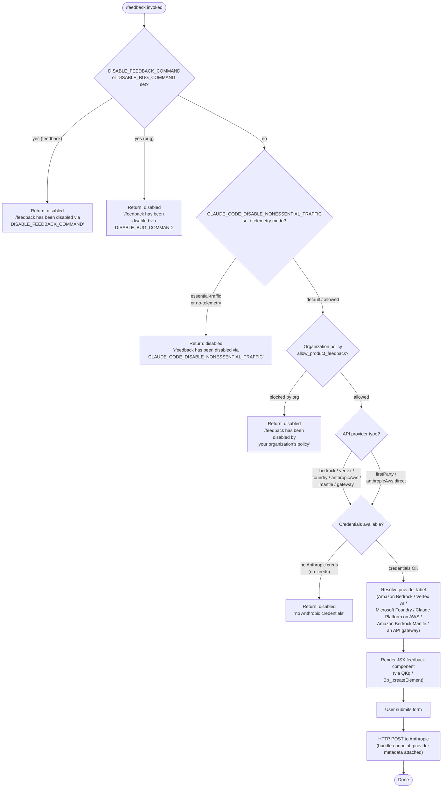

# `/feedback`

> Analysis basis: CC v2.1.144 bundle.js (AST extraction + Claude interpretation)
> Minimum version: v2.1.144

---

## Overview

The `/feedback` command (also invocable as `/share` or `/bug`) allows users to submit product feedback, report bugs, or share their current conversation with Anthropic. Before presenting the feedback UI, the command performs a multi-stage eligibility check that gates submission based on environment variables, organization policy, telemetry mode, and API provider type. If all checks pass, it renders an interactive JSX component and submits the report via an HTTP POST request.

---

## Registration

| Field | Value |
|---|---|
| type | `local-jsx` |
| name | `feedback` |
| description | `Submit feedback, report a bug, or share your conversation` |
| argumentHint | `[report]` |
| aliases | `share`, `bug` |
| module_id | `dKq` |
| load_inline | `true` |
| loc_byte | `10107926` |
| loc_byte_end | `10108149` |
| loc_line | `5609` |
| arbor_handler.name | `fY7` |
| arbor_handler.fqn | `claude-2.1.144::fY7` |
| arbor_handler.kind | `AsyncFunction` |
| arbor_handler.resolution_path | `module_id` |
| arbor_handler.n_hits | `0` |

Analysis basis: CC v2.1.144 bundle.js:+10107926

---

## Input Branching

The command passes through six distinct eligibility gates before rendering the feedback UI. Each gate may terminate execution early with a `"disabled"` status message. This mandates a Mermaid flowchart.



Analysis basis: CC v2.1.144 bundle.js:+10087745, +10087816, +10087970, +10088088, +10088252, +10088859

---

## Behavioral Spec

### Handler Entry Point

The Arbor-resolved handler `fY7` (AsyncFunction, module `dKq`) is the true entry point for the command. It calls the JSX component factory `QKq` which orchestrates the full eligibility check and UI render.

Analysis basis: CC v2.1.144 bundle.js:+10107757

### Gate 1 — Per-Command Environment Variable Disable

```
function checkCommandDisableEnvVars(commandName):
    if env("DISABLE_FEEDBACK_COMMAND") is set:
        return disabledResult(
            "/feedback has been disabled via the DISABLE_FEEDBACK_COMMAND environment variable"
        )
    if env("DISABLE_BUG_COMMAND") is set:
        return disabledResult(
            "/feedback has been disabled via the DISABLE_BUG_COMMAND environment variable"
        )
    return null   // not disabled
```

Analysis basis: CC v2.1.144 bundle.js:+10087798, +10087816, +10087970

### Gate 2 — Non-Essential Traffic / Telemetry Mode

```
function checkNonEssentialTrafficMode(config):
    mode = resolveTrafficMode(config)   // returns "essential-traffic", "no-telemetry", or "default"
    if mode in ["essential-traffic", "no-telemetry"]:
        return disabledResult(
            "/feedback has been disabled via the CLAUDE_CODE_DISABLE_NONESSENTIAL_TRAFFIC environment variable"
        )
    return null
```

The traffic-mode resolver (internal function `trafficModeResolver`) reads the `CLAUDE_CODE_DISABLE_NONESSENTIAL_TRAFFIC` environment variable and maps it to the string constants `"essential-traffic"` (value `"yes"` or `"on"`) or `"no-telemetry"`, falling back to `"default"` when the variable is absent or unrecognized.

Analysis basis: CC v2.1.144 bundle.js:+10088088, +959532, +959591, +959665, +26422, +26428

### Gate 3 — Organization Policy Check

```
function checkOrgPolicy(orgSettings):
    if orgSettings.allow_product_feedback is false:
        return disabledResult(
            "/feedback has been disabled by your organization's policy"
        )
    return null
```

The organization settings loader (`organizationPolicyLoader`, reached via `pq` → `Kn1` → `N$_`) evaluates the `allow_product_feedback` key. Enterprise and team plan accounts may have this policy enforced server-side.

Analysis basis: CC v2.1.144 bundle.js:+10088252, +4643121, +4639846, +4639881

### Gate 4 — Credential Availability Check

```
function checkCredentials(authState):
    credentials = resolveCredentials(authState)
    if credentials is null or empty:
        return disabledResult("no Anthropic credentials", code="no_creds")
    return credentials
```

The credential resolver (`credentialResolver`, reached via `sR` → `e_` → `KJ`) inspects:
- `ANTHROPIC_API_KEY` environment variable
- `CLAUDE_CODE_OAUTH_TOKEN` environment variable
- `apiKeyHelper` configuration value

If none of the above yields a valid credential, the `"no_creds"` code is set and the command returns a disabled state rather than surfacing a hard error.

Analysis basis: CC v2.1.144 bundle.js:+10088859, +10088876, +2914253, +2914347, +2914674

### Provider Label Resolution

```
function resolveProviderLabel(provider):
    match provider:
        case "bedrock"       => return "Amazon Bedrock"
        case "vertex"        => return "Vertex AI"
        case "foundry"       => return "Microsoft Foundry"
        case "anthropicAws"  => return "Claude Platform on AWS"
        case "mantle"        => return "Amazon Bedrock (Mantle)"
        case "gateway"       => return "an API gateway"
        default              => return provider
```

The resolved label is attached to the submission payload under the `"provider"` key alongside the `"bundle"` metadata field.

Analysis basis: CC v2.1.144 bundle.js:+10088352, +10088367, +10088384, +10088459, +10088530, +10088614, +10088697, +10088728, +10088782

### JSX Component and Submission

```
async function feedbackJsxComponent(props):
    sessionId = generateSessionId()     // uses Math.random, Date.now
    jitter    = applyJitter()           // random offset via setTimeout, max 30000 ms
    element   = createElement(feedbackForm, {
        sessionId,
        providerLabel,
        ...props
    })
    render(element)

    on userSubmit(formData):
        await httpPost(anthropicEndpoint, {
            bundle:   bundleMetadata,
            provider: providerLabel,
            ...formData
        })
```

- Session ID generation uses `Math.random` (via helper `randomIdGenerator`) and `Date.now` (via `timestampGenerator`).
- A jitter timeout of up to **30 000 ms** is applied before certain async operations (bundle.js:+10107315, +30000).
- The submission is an HTTP **POST** request (bundle.js:+10088916).
- The JSX tree is built via `Bb_.createElement` (React or compatible renderer).

Analysis basis: CC v2.1.144 bundle.js:+10107539, +10107296, +10107315, +10088916, +12668351, +12668388

---

## State & Side Effects

| Item | Detail |
|---|---|
| Telemetry | `tengu_slate_kestrel` fired during organization policy / account-tier resolution (bundle.js:+4639760) |
| HTTP side effect | HTTP POST to Anthropic endpoint when user submits the form; carries `bundle` and `provider` fields |
| JSX render | Mounts an interactive feedback form component in the CLI UI via `Bb_.createElement` |
| Jitter / timer | `setTimeout` with up to 30 000 ms delay used during async flow |
| Credential read | Reads `ANTHROPIC_API_KEY`, `CLAUDE_CODE_OAUTH_TOKEN`, and `apiKeyHelper` from environment / config |
| Env-var reads | `DISABLE_FEEDBACK_COMMAND`, `DISABLE_BUG_COMMAND`, `CLAUDE_CODE_DISABLE_NONESSENTIAL_TRAFFIC` |
| Org-policy read | Reads `allow_product_feedback` from organization settings; requires network access if settings are remote |
| appState changes | <!-- TODO: not found in depth-2 traversal; needs --depth 4 --> |
| Sound | <!-- TODO: not found in depth-2 traversal; needs --depth 4 --> |

---

## Version History

| Version | Change |
|---|---|
| v2.1.144 | Initial analysis |

---

## Common Mistakes

1. **Invoking `/feedback` behind a third-party provider without Anthropic credentials** — the command will exit silently with `"no Anthropic credentials"` because the submission endpoint is Anthropic-owned. Ensure `ANTHROPIC_API_KEY` or `CLAUDE_CODE_OAUTH_TOKEN` is set even when using Bedrock, Vertex AI, or other providers.
2. **Setting `CLAUDE_CODE_DISABLE_NONESSENTIAL_TRAFFIC=yes` and expecting feedback to work** — this env var disables the command entirely; use `default` (i.e., unset the variable) to re-enable it.
3. **Forgetting the `/bug` and `/share` aliases** — all three names route to the identical handler; scripts that hard-code `/feedback` are equivalent to those using `/bug` or `/share`.
4. **Organization-policy block misidentified as a bug** — when the command reports it has been disabled by organizational policy, the `allow_product_feedback` flag must be changed server-side by an administrator; no local workaround exists.
5. **Expecting instant submission** — a randomized jitter of up to 30 seconds may be applied before network operations complete; do not kill the process prematurely.

---

## Appendix — Identifier Mapping

> For bundle debugging only. Identifiers change across versions.

| Identifier | Role |
|---|---|
| `fY7` | Arbor-resolved async handler entry point for `/feedback` (module `dKq`) |
| `QKq` | JSX component factory; orchestrates eligibility checks and UI render |
| `xb_` | Eligibility check pipeline (env-var gates, traffic mode, org policy, credentials) |
| `xH` | String utility / coercion helper |
| `Aq` | Traffic-mode resolver (reads `CLAUDE_CODE_DISABLE_NONESSENTIAL_TRAFFIC`) |
| `D3A` | Sub-helper used inside traffic-mode resolver |
| `pq` | Organization policy loader entry point |
| `Kn1` | Organization settings fetcher |
| `N$_` | Policy record decoder / normalizer |
| `Tm` | Account-tier and plan resolver (enterprise / team logic) |
| `JA` | Provider-type classifier |
| `i5` | Helper called during plan resolution |
| `n$` | Credential resolver core (reads API key, OAuth token, apiKeyHelper) |
| `P6` | Credential caching / Set-based deduplication layer |
| `k0H` | String-coercion wrapper used in org-policy path |
| `sR` | Auth-header builder / credential orchestrator |
| `Gs` | OAuth / first-party auth sub-flow |
| `Lz` | Provider-type sub-classifier used in auth flow |
| `e_` | Credential selector (API key vs OAuth token branch) |
| `KJ` | API-key resolver (env var + config lookup) |
| `xR` | Array / inclusion check utility |
| `aw` | Fallback credential path (wraps `n$`) |
| `H` | Random session-ID generator (uses `Math.random`, `setTimeout`) |
| `gKq` | Timestamp generator (uses `Date.now`); produces submission nonce |

---

Note: index built via Arbor fallback; some signals (telemetry, literals) may be missing — see arbor-fallback.js.