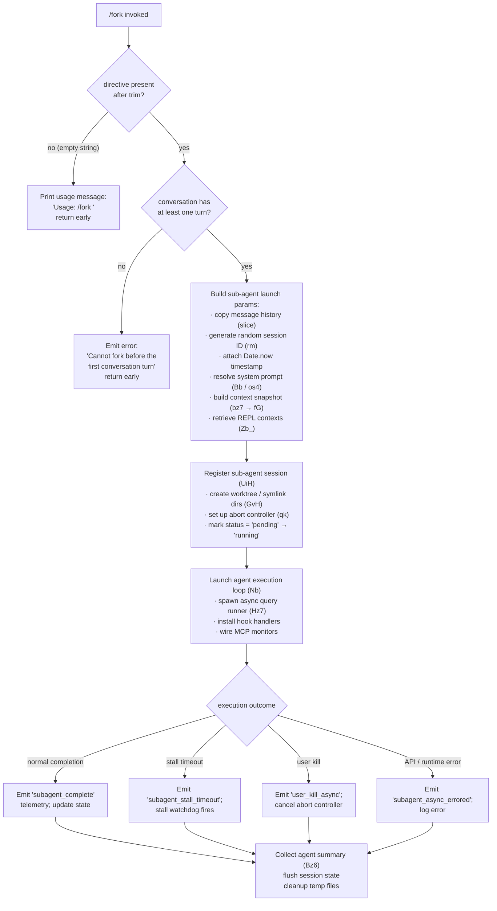

# `/fork`

> Analysis basis: CC v2.1.144 bundle.js (AST extraction + Claude interpretation)
> Minimum version: v2.1.144

---

## Overview

`/fork` spawns a background agent that inherits the full current conversation context and then executes an additional directive supplied by the user. It copies the live message history, system prompt, tool configuration, and REPL context into a new sub-agent session, then launches that session asynchronously so the foreground conversation can continue uninterrupted. The fork must be issued after at least one conversation turn has occurred; invoking it against an empty conversation is rejected immediately.

---

## Registration

| Field | Value |
|---|---|
| type | `local-jsx` |
| name | `fork` |
| description | Spawn a background agent that inherits the full conversation |
| argumentHint | `<directive>` |
| module_id | `Wyq` |
| load_inline | `true` |
| loc_byte | `12051216` |
| loc_byte_end | `12051412` |
| loc_line | `7993` |
| arbor_handler.name | `om7` |
| arbor_handler.fqn | `claude-2.1.144::om7` |
| arbor_handler.kind | `AsyncFunction` |
| arbor_handler.resolution_path | `module_id` |
| arbor_handler.n_hits | `0` |

Analysis basis: CC v2.1.144 bundle.js:+12051216

---

## Input Branching

The command has three distinct top-level input paths (empty directive, no prior turn, valid directive), followed by several branching sub-paths inside the sub-agent launch sequence.



Analysis basis: CC v2.1.144 bundle.js:+12050821 (handler entry), +12050954 (no-turn guard), +12050845 (usage literal)

---

## Behavioral Spec

### 1 — Handler Entry and Directive Validation (`handlerEntry` / `om7`)

```
async function handlerEntry(input, appContext):
    directive = input.trim()
    if directive is empty:
        print "Usage: /fork <directive>"
        return

    randomDelay = Math.random() * 2 + 1   // jitter: 1–3 (H)
    await setTimeout(randomDelay)          // small scheduling yield

    await launchSubAgentFork(directive, appContext)
```

The usage string `"Usage: /fork \<directive\>"` is a hard-coded literal.
Analysis basis: CC v2.1.144 bundle.js:+12050821, +12050843, +12050845

### 2 — Context Snapshot Construction (`buildContextSnapshot` / `Zb_` → `bz7`)

```
async function buildContextSnapshot(appContext):
    appState      = appContext.getAppState()
    messages      = Array.from(conversationMessages)   // full history
    systemPrompt  = buildSystemPromptForSubAgent()     // bz7 → Bb / os4
    replContexts  = appContext.getReplContexts()

    // Collect context items (fG) — assembles ~25 sub-components:
    //   model override, env info static/simple, language, output style,
    //   bg-session marker, scratchpad, context management, brief flag,
    //   reproduce_verify_workflow, system prompt sections, memory, etc.
    contextParts  = buildFullPromptContext(appState)   // fG

    // Trim message list to last 50 (slice with literals 50, 49)
    slicedMessages = messages.slice(-50)

    sessionId     = generateRandomHex(8)               // rm → dO9.randomBytes
    timestamp     = Date.now()

    return { directive, slicedMessages, systemPrompt,
             replContexts, contextParts, sessionId, timestamp }
```

Analysis basis: CC v2.1.144 bundle.js:+10072570, +10072697, +10072792, +10072842, +10072845, +10072899

### 3 — Pre-launch Guard: Require at Least One Turn

```
function requireAtLeastOneTurn(messages):
    if messages has no assistant turn:
        throw "Cannot fork before the first conversation turn"
```

This check is a literal string constant in the bundle.
Analysis basis: CC v2.1.144 bundle.js:+12050954

### 4 — Sub-Agent Session Registration (`registerSubAgentSession` / `UiH`)

```
async function registerSubAgentSession(snapshot):
    // Filesystem setup (GvH)
    await ensureSubagentDir()          // dr.mkdir
    sessionPath = buildSessionPath()   // Ud_.join + BlH
    await dr.symlink(sessionPath, ...)
    // On EEXIST: skip silently

    // Status tracking
    register session with status = "pending"
    subagentRegistry.add(sessionId)    // QSq.add

    // Abort controller
    controller = new AbortController()
    controller.signal.addEventListener("abort", ...)
    // On abort: set status = "running" → cancelled

    // Mark running
    session.status = "running"
    session.kind   = "local_agent"
    session.type   = "general-purpose"

    // Register with activity tracker
    appContext.register(session)       // K.register

    return sessionHandle
```

Analysis basis: CC v2.1.144 bundle.js:+9646027, +9646052, +9646069, +9646074, +9646119, +9646193, +12222665

### 5 — Sub-Agent Execution Loop (`runSubAgentSession` / `Nb` → `Hz7`)

```
async function runSubAgentSession(sessionHandle, snapshot):
    // Emit launch telemetry label
    log("subagent_launch")
    if directive is empty: log("subagent_fork_prompt_missing")

    // Determine context source: "fork" or "resume"
    contextMode = snapshot.hasResume ? "resume" : "fork"

    // Build initial messages for agent (Tv_, Bb, os4)
    initialMessages = prepareInitialMessages(snapshot)

    // Context-thread type: "subagent" / "spawn"
    threadType = "subagent"   // or "spawn"

    // Inject fork-context reference tag "fork-context-ref"
    attachForkContextRef(initialMessages)

    // Run the main agent query loop (Hz7 / pb → Hz7)
    //   · calls model (D.callModel)
    //   · handles tool batches
    //   · compacts if needed
    //   · reports progress events
    result = await agentQueryLoop(initialMessages, sessionHandle)

    // Post-execution: collect summary (Bz6)
    //   · gather agent_summary
    //   · write to transcript file (fX6 → BL.writeFile)
    //   · flush session state (U6.flushSessionState)

    if result.completed:
        emit "subagent_complete"
        updateSessionStatus("completed")
    else if result.stalledTimeout:
        emit "subagent_stall_timeout"
    else if result.userKilled:
        emit "user_kill_async"
        updateSessionStatus("killed")
    else:
        emit "subagent_async_errored"
        log error
```

Analysis basis: CC v2.1.144 bundle.js:+10072590, +10072608, +10072657, +10072776, +10073318, +10073383, +8651605, +8654195

### 6 — System Prompt Construction for the Forked Agent (`buildSubAgentSystemPrompt` / `bz7` → `Bb`)

```
async function buildSubAgentSystemPrompt(appState):
    baseSystemPrompt = appContext.getSystemPrompt()    // Bb.getSystemPrompt
    // Tag: "main-thread" identifies origin
    memoryLoaded = loadAgentMemory(appState)           // telemetry: tengu_agent_memory_loaded
    mergedPrompt = combinePromptSections(baseSystemPrompt, memoryLoaded)

    // Context builder (fG) assembles sections for:
    //   ant_model_override, env_info_static, env_info_simple, language,
    //   output_style, bg-session, scratchpad, frc, context_management,
    //   brief, focus, reproduce_verify_workflow, growthbook flags, etc.

    return mergedPrompt
```

The `"bg-session"` literal signals to the forked agent that it is running in a background session.
Analysis basis: CC v2.1.144 bundle.js:+8754509, +8754607, +10074142, +12354554

### 7 — Transcript and Metadata Persistence (`persistForkTranscript` / `fX6`)

```
async function persistForkTranscript(sessionId, messages, metadata):
    metaPath    = buildPath(sessionId + ".meta.json")
    transcriptPath = buildPath(sessionId + ".jsonl")

    await BL.mkdir(Nw.dirname(metaPath), { recursive: true })
    await BL.writeFile(metaPath, JSON.stringify(metadata))
    await BL.writeFile(transcriptPath, serializedMessages)

    // DL: context reference tagged "fork-context-ref"
    attachContextRef(sessionId)
```

Analysis basis: CC v2.1.144 bundle.js:+12138966, +12138979, +12139024, +12139078, +12139088, +12154892

---

## State & Side Effects

| Item | Detail |
|---|---|
| Telemetry — launch | `tengu_slim_subagent_claudemd` (bundle.js:+8650494) |
| Telemetry — agent memory | `tengu_agent_memory_loaded` (bundle.js:+8754607) |
| Telemetry — fork stall | `tengu_async_agent_stall_timeout` (bundle.js:+6535764) |
| Telemetry — forked turns exceeded | `tengu_forked_agent_default_turns_exceeded` (bundle.js:+10048548) |
| Telemetry — completion | `tengu_agent_tool_completed` (bundle.js:+6531863) |
| Telemetry — termination | `tengu_agent_tool_terminated` (bundle.js:+6537692) |
| Telemetry — agent summary skip | `tengu_agent_summary_skipped` (bundle.js:+8659943) |
| Telemetry — auto-mode decision | `tengu_auto_mode_decision` (bundle.js:+6533506) |
| Telemetry — cache eviction | `tengu_cache_eviction_hint` (bundle.js:+6532406) |
| Telemetry — hook events | `tengu_run_hook`, `tengu_repl_hook_finished`, `tengu_hook_plugin_injected` |
| Telemetry — MCP | `tengu_mcp_elicitation_shown`, `tengu_mcp_elicitation_response`, `tengu_mcp_tools_refreshed_mid_turn` |
| Filesystem | Creates `.meta.json` and `.jsonl` transcript files under the sub-agent session directory; creates symlinks via `dr.symlink`; cleans up with `t_K.unlinkSync` on teardown |
| Abort controller | Registers a new `AbortController`; wires `abort` listener; signal propagated to query loop and tool executors |
| Sub-agent registry | Session added to `QSq` (active set) on start; deleted on completion/abort |
| appState changes | Session status transitions: `pending` → `running` → `completed` / `killed` / `cancelled`; `H.setAppState` called after state mutations |
| Hook registration | `SessionHook` events wired (`SubagentStart`, `SubagentStop`, `TaskCompleted`) via `V2` / hook runner |
| MCP monitors | `mcpMonitors` entry added to sub-agent app-state; updated via `vq5` / `k6K` |
| Sound / notification | Task notification emitted (`"task-notification"`) on completion; `IQ.startCLIActivity` / `IQ.endCLIActivity` brackets the run |

---

## Version History

| Version | Change |
|---|---|
| v2.1.144 | Initial analysis |

---

## Common Mistakes

1. **Invoking `/fork` before the first assistant reply.** The command hard-blocks with `"Cannot fork before the first conversation turn"` if no assistant message exists yet. Send at least one message and receive a reply before forking.
2. **Omitting the directive.** Calling `/fork` with no argument (or only whitespace) prints the usage string and does nothing. A non-empty `<directive>` is required.
3. **Expecting synchronous output.** The forked agent runs asynchronously in the background. Results are written to a `.jsonl` transcript file and surfaced via task notifications, not in the current chat stream.
4. **Assuming the fork inherits live tool-permission changes.** Permission state is snapshot-copied at fork time. Subsequent `/allowed-tools` changes in the parent session do not propagate to a running fork.
5. **Killing the parent session expecting the fork to survive cleanly.** If the parent process exits abnormally the fork's abort controller may fire, leaving the transcript in a partial state.

---

## Appendix — Identifier Mapping

> For bundle debugging only. Identifiers change across versions.

| Identifier | Role |
|---|---|
| `om7` | Async handler for `/fork` command (Arbor-resolved entry point) |
| `Zb_` | Sub-agent fork context builder — assembles snapshot, session ID, timestamps |
| `bz7` | Builds message history + system prompt for forked agent |
| `y_` | Reads allowed-tools / avoid-prompts / effort / model from app-state |
| `Xb_` | Resolves sub-agent config key `Y1` |
| `fG` | Full prompt context assembler — wires ~25 section builders |
| `Bb` | Loads agent memory and fetches system prompt for sub-agent |
| `GO8` | Message-type classifier (assistant, user, tool_use, tool_result) |
| `yH7` / `SH7` / `kH7` / `hH7` | Per-role message filter helpers inside `GO8` |
| `MKq` | Trims context strings for sub-agent |
| `rm` | Generates random hex bytes (session ID generation via `dO9.randomBytes`) |
| `UiH` | Sub-agent session registration; creates filesystem layout, abort controller, status tracking |
| `GvH` | Filesystem setup: mkdir, symlink, open for sub-agent working directory |
| `zW8` | Adds/removes session from active-session set (`QSq`) |
| `Fd_` | `dr.mkdir` wrapper for sub-agent directory creation |
| `u$` | Builds session file path via `Ud_.join` |
| `kH` | Error logger with `Sc.logError` and push to `HCH` |
| `F38` | Aggregate setup: calls `zW8`, `Fd_`, `u$`, `dr.open` |
| `$T` | Resolves sub-agent type / SDK endpoint identifiers |
| `qk` | Abort controller factory with `setMaxListeners` |
| `Z_4` / `V_4` | Weak-ref deref helpers for abort signal listeners |
| `NW` | Records session start timestamp and path |
| `czH` | Builds full model/context resolution chain including model-name normalizer |
| `_T` | Model alias resolver (`Ua`, `oV`, `aV`) |
| `zq` | Model name normalizer: trim, toLower, resolve aliases (sonnet, opus, haiku, best…) |
| `yO9` / `kO9` | Model family / capability checkers |
| `oD` | Provider-type detector (bedrock, vertex, gateway, mantle, foundry) |
| `VB6` / `h5L` | ARN prefix and path-substring helpers |
| `M` | MCP server state manager calling `dvH`, `k6K`, `vq5` |
| `dvH` | MCP server connection handler (stdio/sse/http/ws-ide) |
| `k6K` | Applies MCP update and calls cleanup/reconnect |
| `vq5` | Iterates MCP clients, refreshes tool lists, calls `dvH` / `k6K` |
| `AdH` | Core sub-agent execution supervisor (stall watchdog, progress, state updates) |
| `Bz6` | Collects and formats agent summary output |
| `wZ` | Incremental message-progress tracker for running sub-agent |
| `J8` | UUID generator (`UZ.randomUUID`) |
| `Ud9` | Updates sub-agent state (`A.update`, `Io`, `A98`) |
| `Nb` | Main sub-agent session runner: hooks, MCP monitors, query dispatch, cleanup |
| `Hz7` | Core agent query-loop implementation (compaction, tool execution, model calls) |
| `pb` | Wrapper that runs `Hz7` then `MY8` (post-run cleanup) |
| `MY8` | Post-run session exit handler (`ib.get/delete`, `OS_.delete`) |
| `V2` | Per-turn hook runner and tool executor |
| `UKH` | Sub-agent conversation initialiser (ties `Y4`, `$T`, `V2`, `Th`) |
| `MX6` | Sub-agent start event emitter (`SubagentStart`, `XW8.randomUUID`) |
| `Y4` | Builds initial sub-agent message list |
| `Th` | Turn orchestrator for a single agent turn |
| `fX6` | Writes `.meta.json` / `.jsonl` transcript files |
| `wSq` | Builds meta file path (`$T`) |
| `DL` / `Vv_` / `rHH` | Context-reference helpers; `DL` = `h1` base builder |
| `xvH` | Filters and annotates context reference messages |
| `Ev_` | MCP tool-set diff and permission tracker for sub-agent |
| `ZKH` / `DqH` | Tool-set change set helpers |
| `TD_` | Tool-list diffing and ranking algorithm |
| `$ZH` | Backoff / retry delay calculator |
| `sV` | Tool-search and context-resolution helper |
| `Li` | Tool-permission list builder for sub-agent invocation |
| `Oj_` | Filters allowed tools against deny-sets (`kOH`, `C3_`, `c68`, `ni1`) |
| `hX` | Constructs tool-call permission record |
| `jO` | Formats tool permission strings |
| `is4` | Loads and prepares MCP plugin configuration for sub-agent |
| `aC` | Merges enterprise/project/local MCP configs |
| `nDH` | Evaluates tool-search availability (`Kh`, `TZH`, `ZvH`, `ak_`) |
| `Zv_` | Saves updated app-state back after sub-agent completes |
| `IO9` / `IZH` | Shell-task state persistence helpers |
| `Fz9` | Checks tool filter state |
| `r$6` / `xQH` | Final cleanup / state-reset helpers at end of `Zb_` |
| `SqH` | Aborts in-flight speculation and updates sub-agent state |
| `Uz6` / `$98` / `RqH` / `gz6` | State-update helpers called at key lifecycle events |
| `RZH` / `LK` | Token-budget resolver and cache-aware lookup |
| `K98` | Tool-execution classifier entry point |
| `xz6` | Auto-mode classifier implementation |
| `M98` | Post-classification action dispatcher |
| `azH` / `cvH` | Context-compression decision helpers |
| `O98` | Finds last non-text message index |
| `_dH` / `WK` | Filter helpers for watchdog message queue |
| `gJ_` | Growthbook flag accessor in context builder |
| `BkH` / `_E6` | MCP channel message handlers (render layer) |
| `r$6` | Teardown: clears session registry entry |